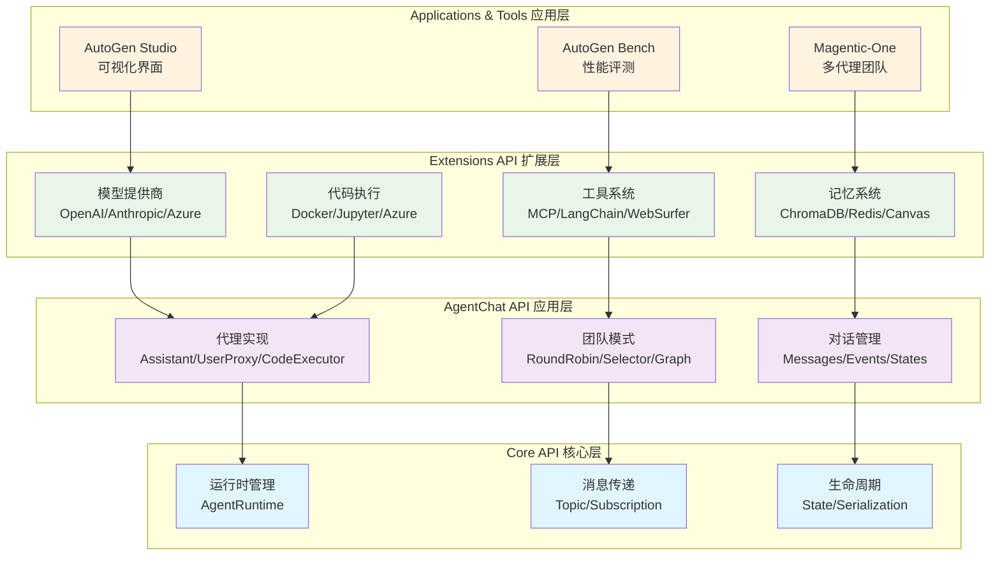
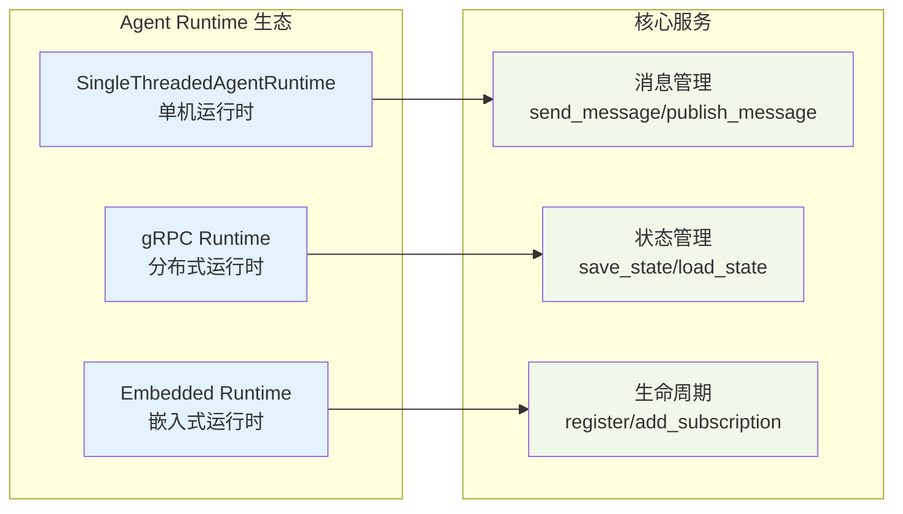
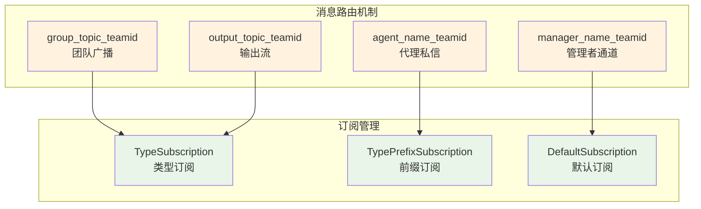
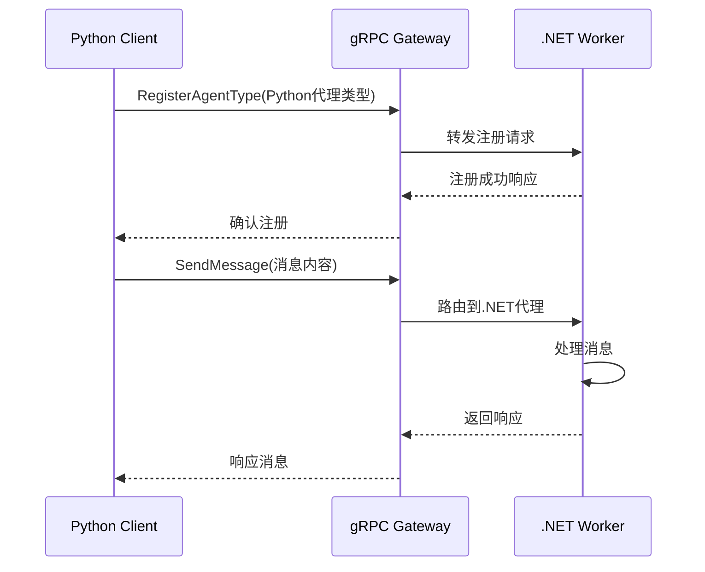

# L1 - AutoGen 系统全景分析

## 核心使命与价值主张

**AutoGen** 是Microsoft开源的多代理AI应用框架，其核心使命是解决**大规模多代理协作**的工程化挑战。它通过**分层设计架构**和**企业级特性**，为开发者提供从简单原型到生产级分布式AI应用的完整解决方案。

### 🌟 核心价值主张

1. **多代理协作平台** - 支持代理间自主协作或与人类协作的智能体系统
2. **分层抽象设计** - 渐进式复杂性管理，支持不同抽象层级的开发需求  
3. **企业级可靠性** - 完整的状态管理、故障恢复、监控遥测等生产特性
4. **开放生态整合** - 统一接口整合现有AI工具生态，避免厂商锁定

## 系统架构全景

AutoGen采用清晰的**三层架构设计**，每层承担明确的职责并构建在下层之上：

### 架构设计理念分析

这种分层设计体现了AutoGen的**渐进式复杂性管理**理念：

1. **Core API** - 提供最基础的代理运行时和消息传递抽象
2. **AgentChat API** - 封装常见的对话模式和团队协作机制  
3. **Extensions API** - 提供丰富的生态系统集成和专业化能力

开发者可以根据需求选择合适的抽象层级，既能进行底层定制，也能快速构建应用。

## 核心技术特色

### 1. 企业级运行时设计

**代码位置**: `autogen/python/packages/autogen-core/src/autogen_core/_agent_runtime.py`

**设计亮点**：
- **Protocol接口设计** - 支持多种运行时实现（单机/分布式/嵌入式）
- **完整状态管理** - 支持代理状态的持久化和恢复
- **生命周期控制** - 代理注册、订阅管理、资源清理

### 2. Topic-based 消息路由系统

**代码位置**: `autogen/python/packages/autogen-core/src/autogen_core/_subscription.py`

**技术优势**：
- **松耦合设计** - 代理间通过topic通信，无需直接依赖
- **灵活路由** - 支持点对点、广播、前缀匹配等多种路由模式
- **分布式友好** - 天然支持跨进程/跨主机的代理协作

### 3. 跨语言代理协议

**代码位置**: `autogen/protos/agent_worker.proto`

AutoGen通过protobuf定义了标准的Agent Worker Protocol，实现Python和.NET的互操作：

## 项目生态系统

### 开发者工具链

| 工具 | 用途 | 特色功能 |
|------|------|----------|
| **AutoGen Studio** | 可视化界面 | 无代码多代理工作流搭建 |
| **AutoGen Bench** | 性能评测 | 代理性能基准测试 |
| **Magentic-One** | 示例应用 | 状态级多代理团队实现 |

### 技术生态整合

**模型提供商支持** (`autogen-ext/models/`):
- OpenAI (GPT系列)
- Anthropic (Claude系列)  
- Azure OpenAI
- Ollama (本地模型)
- LlamaCP (开源模型)

**工具生态集成** (`autogen-ext/tools/`):
- MCP (Model Context Protocol) - 统一工具协议
- LangChain - 现有工具生态复用
- Semantic Kernel - Microsoft AI工具链
- Azure AI Search - 企业搜索能力

## 技术边界与适用场景

### ✅ 适用场景

1. **企业级多代理应用** - 需要可靠性、可观测性、状态管理
2. **复杂AI工作流** - 多个专业化代理协作完成复杂任务  
3. **跨平台AI集成** - Python/C#混合技术栈的AI应用
4. **长期运行任务** - 需要暂停/恢复、状态持久化的AI系统

### ⚠️ 技术限制

1. **学习曲线** - 三层架构和配置复杂性需要时间掌握
2. **性能开销** - 完整的运行时管理带来额外性能成本
3. **资源消耗** - 状态管理和消息路由需要更多内存和CPU

## 竞争优势分析

与其他多代理框架相比，AutoGen的独特优势：

| 特性 | AutoGen | CrewAI | LangGraph |
|------|---------|---------|-----------|
| **企业级特性** | ✅ 完整 | ❌ 有限 | ⚡ 部分 |
| **跨语言支持** | ✅ Python/.NET | ❌ Python only | ❌ Python only |
| **分层抽象** | ✅ 三层清晰 | ⚡ 两层 | ⚡ 单层 |
| **生态整合** | ✅ 广泛 | ⚡ 中等 | ✅ 良好 |
| **状态管理** | ✅ 完整 | ❌ 简单 | ✅ 图状态 |

---

**核心洞察**: AutoGen不仅是多代理框架，更是多代理应用的"操作系统"。其三层架构设计和企业级特性为构建生产级AI应用提供了坚实基础。