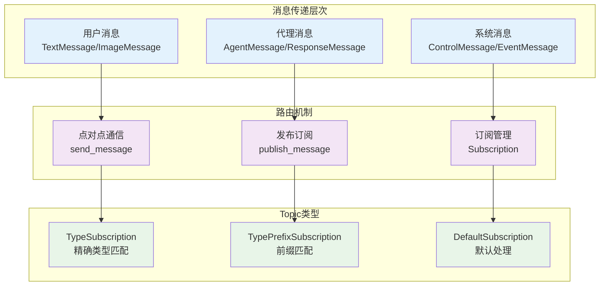
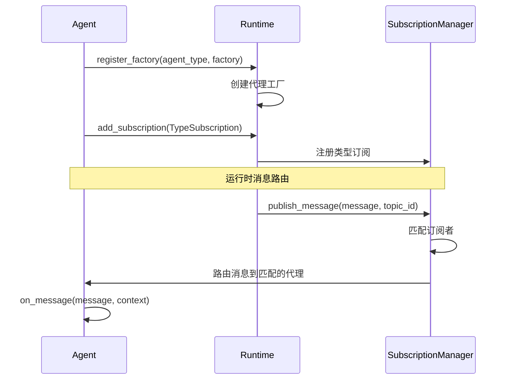
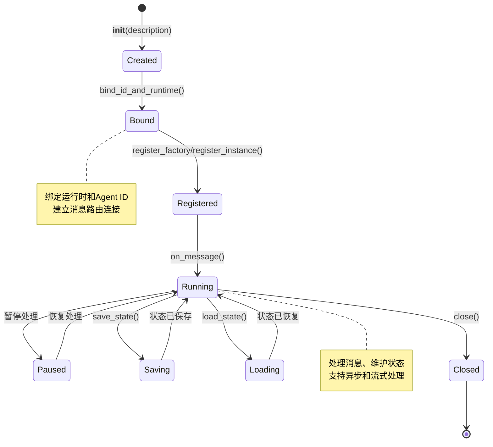
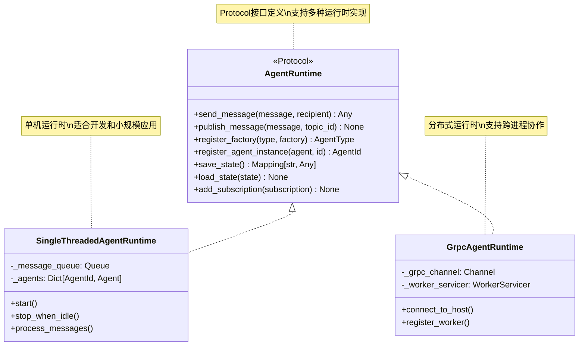
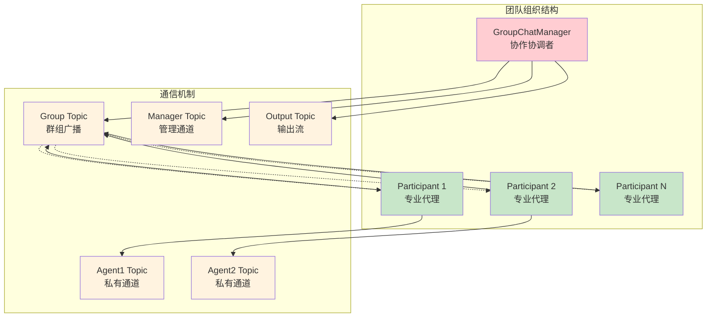
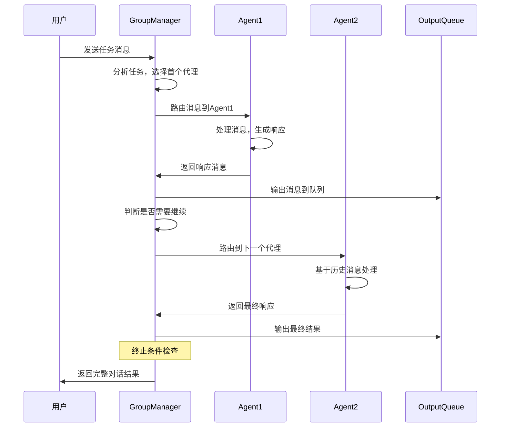
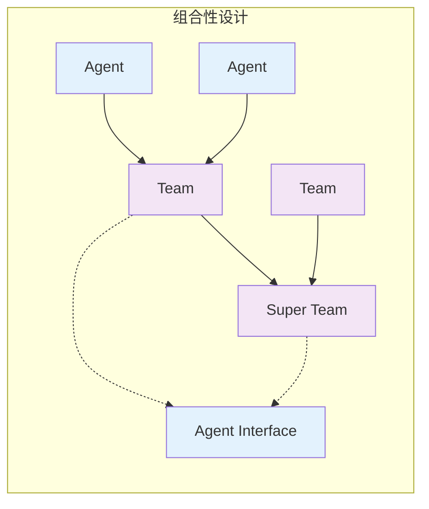

# L2 - AutoGen 核心架构深入分析

## 消息传递系统架构

AutoGen的核心创新在于其基于**Topic-Subscription**的消息传递架构，这种设计实现了代理间的松耦合协作和分布式可扩展性。

### 消息路由机制

**代码位置**: `autogen/python/packages/autogen-core/src/autogen_core/_agent_runtime.py:21-47`



### 核心设计原理

**1. Topic命名策略** (`autogen-agentchat/teams/_group_chat/_base_group_chat.py:117-126`)

```python
# 团队级别的topic设计
self._group_topic_type = f"group_topic_{self._team_id}"           # 广播通道
self._group_chat_manager_topic_type = f"{manager_name}_{team_id}"  # 管理者通道
self._participant_topic_types = [                                 # 参与者通道
    f"{participant.name}_{team_id}" for participant in participants
]
self._output_topic_type = f"output_topic_{self._team_id}"         # 输出流通道
```

这种命名策略实现了：
- **唯一性保证** - 通过team_id确保不同团队的topic不冲突
- **层次化管理** - 区分广播、私信、管理、输出等不同用途
- **动态路由** - 支持运行时的订阅和取消订阅

**2. 订阅管理机制**



## 代理生命周期管理

### BaseAgent 生命周期

**代码位置**: `autogen-core/src/autogen_core/_base_agent.py:84-253`



### 关键生命周期方法分析

**1. 状态管理设计** (`_base_agent.py:152-158`)

```python
async def save_state(self) -> Mapping[str, Any]:
    """代理状态持久化 - 支持故障恢复"""
    warnings.warn("save_state not implemented", stacklevel=2)
    return {}

async def load_state(self, state: Mapping[str, Any]) -> None:
    """代理状态恢复 - 从持久化存储恢复"""
    warnings.warn("load_state not implemented", stacklevel=2)
    pass
```

**设计思路**：
- **可选实现** - 基类提供默认实现，子类按需重写
- **通用接口** - 使用通用的Dict类型，支持JSON序列化
- **故障恢复** - 支持代理在故障后恢复到之前状态

**2. 消息处理抽象** (`_base_agent.py:116-121`)

```python
@final
async def on_message(self, message: Any, ctx: MessageContext) -> Any:
    return await self.on_message_impl(message, ctx)

@abstractmethod  
async def on_message_impl(self, message: Any, ctx: MessageContext) -> Any: ...
```

**设计亮点**：
- **模板方法模式** - on_message作为不可重写的入口点
- **扩展点设计** - on_message_impl作为子类的实现点
- **上下文传递** - MessageContext携带路由和元数据信息

## 运行时架构设计

### AgentRuntime Protocol设计

**代码位置**: `autogen-core/src/autogen_core/_agent_runtime.py:19-294`



### 运行时选择策略

**1. SingleThreadedAgentRuntime** - 单机场景
- **适用**: 开发、测试、小规模应用
- **特点**: 简单易用、快速启动、内存高效
- **限制**: 无法跨进程、单点故障

**2. GrpcAgentRuntime** - 分布式场景  
- **适用**: 生产环境、高可用、大规模应用
- **特点**: 跨语言、跨进程、容错性强
- **成本**: 网络开销、配置复杂

## 团队协作模式

### BaseGroupChat 协作架构

**代码位置**: `autogen-agentchat/teams/_group_chat/_base_group_chat.py:65-150`



### 协作模式类型

**1. RoundRobinGroupChat** - 轮询协作
```python
# 代理按固定顺序依次发言
participants = [agent1, agent2, agent3]
# 轮询顺序: agent1 → agent2 → agent3 → agent1 → ...
```

**2. SelectorGroupChat** - 智能选择
```python
# 管理者根据上下文智能选择下一个发言者
# 基于代理能力、当前任务状态等因素决策
```

**3. GraphGroupChat** - 图形化协作
```python
# 基于有向图定义代理间的协作关系
# 支持条件跳转、并行分支等复杂流程
```

### 消息流控制机制

**代码位置**: `_base_group_chat.py:350-577`



## 扩展性设计分析

### 组合性原则

AutoGen的强大之处在于其**组合性设计**：

1. **代理组合** - 单个代理可以组合成团队
2. **团队嵌套** - 团队可以作为代理参与更大团队  
3. **工具集成** - 多种工具协议的统一接口
4. **模型抽象** - 不同LLM提供商的统一调用



### 接口标准化

**统一抽象接口**:
- `ChatAgent` - 所有对话代理的基础接口
- `Team` - 所有团队协作的基础接口  
- `ModelClient` - 所有模型调用的统一接口
- `Tool` - 所有工具集成的标准接口

这种标准化设计使得AutoGen生态中的各组件可以自由组合和替换，体现了其作为"多代理操作系统"的设计理念。

---

**关键洞察**: AutoGen的核心架构通过Topic-based消息路由实现了松耦合的分布式代理协作，其Protocol-based的运行时设计和组合性原则为构建复杂多代理应用提供了坚实的技术基础。