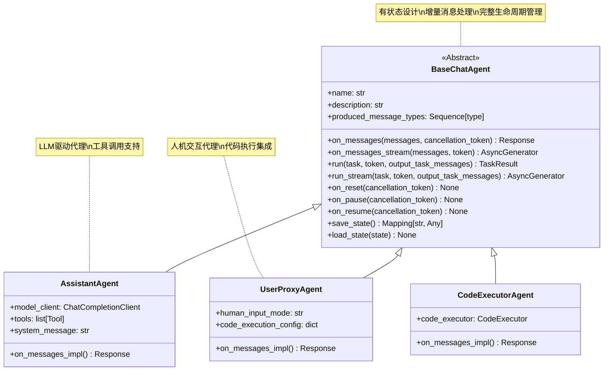
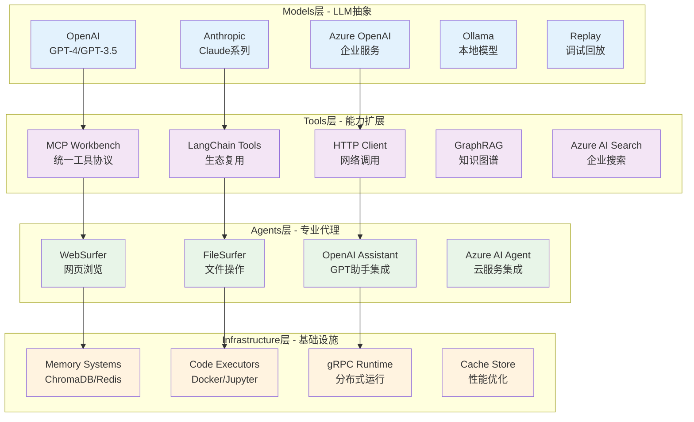
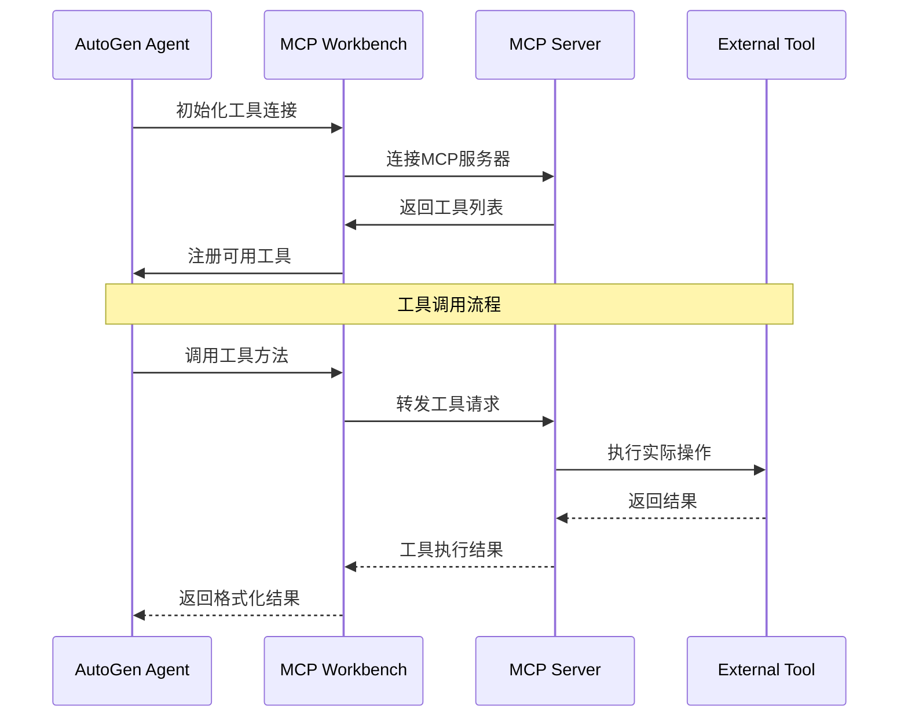
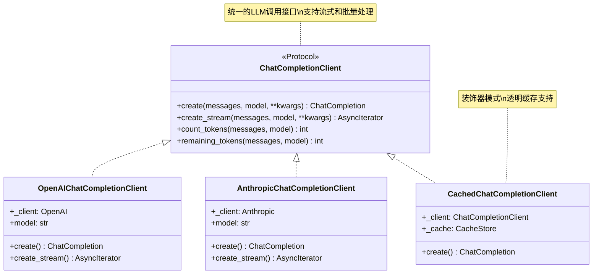
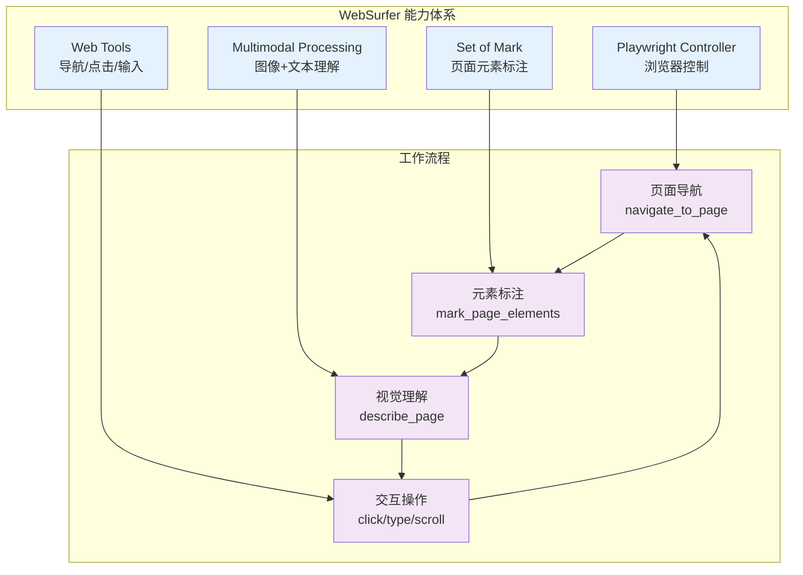
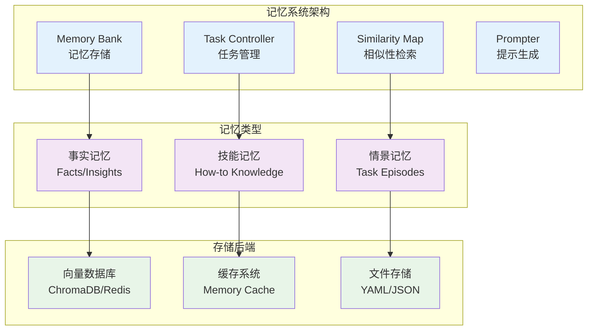
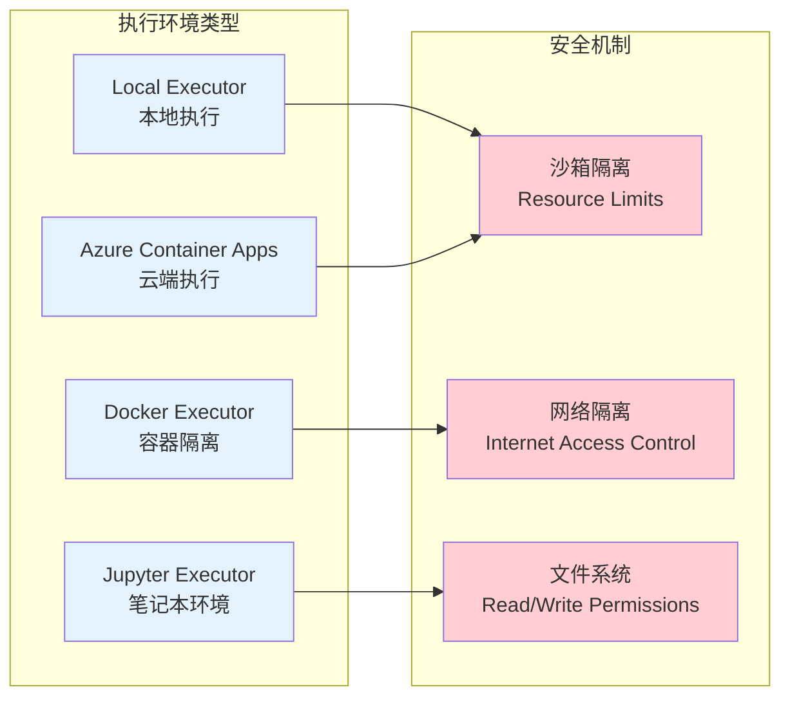

# L3 - AutoGen 关键实现细节分析

## AgentChat层深度剖析

AutoGen的AgentChat层是连接底层Core API和用户应用的关键桥梁，其设计体现了从技术抽象到业务抽象的重要转变。

### BaseChatAgent 设计哲学

**代码位置**: `autogen-agentchat/src/autogen_agentchat/agents/_base_chat_agent.py:16-244`



### 核心设计原则分析

**1. 有状态 vs 无状态的设计选择**

```python
# BaseChatAgent的状态管理设计
def __init__(self, name: str, description: str) -> None:
    self._name = name  # 代理标识状态
    self._description = description  # 代理能力描述状态
    # 注意：状态在实例级别维护，支持长期对话记忆
```

**设计理念**：
- **持续交互模型** - 代理被设计为持续运行的智能实体，而非一次性函数
- **上下文保持** - 支持跨多轮对话的状态和记忆维护
- **个性化能力** - 每个代理实例都可以有独特的状态和行为模式

**2. 增量消息处理机制**

```python
async def on_messages(self, messages: Sequence[BaseChatMessage], 
                     cancellation_token: CancellationToken) -> Response:
    """
    处理新消息（而非完整历史）
    代理内部维护对话状态
    """
```

**核心优势**：
- **内存效率** - 避免重复传递历史消息
- **状态一致性** - 代理自主维护内部状态
- **扩展性支持** - 支持长期对话而不受消息历史长度限制

### 双模式执行设计

**代码位置**: `_base_chat_agent.py:110-211`

```mermaid
graph TB
    subgraph "执行模式设计"
        SM[同步模式<br/>run() + on_messages()]
        STM[流式模式<br/>run_stream() + on_messages_stream()]
    end
    
    subgraph "任务输入格式"
        T1[字符串任务<br/>"Count from 1 to 10"]
        T2[单消息任务<br/>TextMessage/ImageMessage]
        T3[消息序列<br/>List[BaseChatMessage]]
    end
    
    subgraph "输出格式"
        TR[TaskResult<br/>完整结果]
        ST[Stream<br/>实时流]
    end
    
    T1 --> SM
    T2 --> SM
    T3 --> SM
    
    T1 --> STM
    T2 --> STM  
    T3 --> STM
    
    SM --> TR
    STM --> ST
    
    classDef mode fill:#e3f2fd
    classDef input fill:#f3e5f5
    classDef output fill:#e8f5e8
    
    class SM,STM mode
    class T1,T2,T3 input  
    class TR,ST output
```

**实现细节分析**：

```python
async def run_stream(self, *, task=None, cancellation_token=None, 
                    output_task_messages=True) -> AsyncGenerator:
    """流式执行的关键设计"""
    # 1. 任务消息预处理和输出
    if isinstance(task, str):
        text_msg = TextMessage(content=task, source="user") 
        if output_task_messages:
            yield text_msg  # 立即输出任务消息
    
    # 2. 流式处理消息
    async for message in self.on_messages_stream(input_messages, cancellation_token):
        if isinstance(message, Response):
            yield message.chat_message
            yield TaskResult(messages=output_messages)  # 最终结果
        else:
            yield message  # 中间消息流
```

**设计亮点**：
- **任务消息控制** - `output_task_messages`参数控制是否输出初始任务
- **增量流输出** - 支持实时查看代理处理进度
- **统一结果格式** - 流的最后元素始终是TaskResult

## Extension系统生态分析

### 分层扩展架构

**目录结构**: `autogen-ext/src/autogen_ext/`



### MCP工具协议深度分析

**代码位置**: `autogen-ext/src/autogen_ext/tools/mcp/_workbench.py`

MCP (Model Context Protocol) 是AutoGen的重要创新，提供了统一的工具集成协议：



**MCP工具类型支持**:

1. **Stdio Server** - 进程间通信
```python
server_params = StdioServerParams(
    command="npx", 
    args=["@playwright/mcp@latest", "--headless"]
)
```

2. **HTTP Server** - 网络服务集成
```python  
server_params = HttpServerParams(
    url="http://localhost:3000/mcp",
    headers={"Authorization": "Bearer token"}
)
```

3. **SSE Server** - 服务器发送事件
```python
server_params = SseServerParams(
    url="http://localhost:3000/events"
)
```

### 模型抽象层设计

**代码位置**: `autogen-ext/src/autogen_ext/models/`



**关键设计特性**：

1. **协议接口统一** - 所有模型客户端实现相同接口
2. **流式处理支持** - create_stream方法支持实时响应
3. **Token管理** - 内置token计数和限制功能
4. **装饰器扩展** - 缓存、重试、监控等横切关注点

### 专业代理生态

**WebSurfer Agent 实现分析**

**代码位置**: `autogen-ext/src/autogen_ext/agents/web_surfer/_multimodal_web_surfer.py`



**技术创新点**：

1. **Set of Mark技术** - 为页面元素添加可点击标记，使LLM能够精确操作
2. **多模态处理** - 结合页面截图和HTML结构进行理解
3. **状态管理** - 维护浏览会话状态，支持复杂的多步骤任务

## 内存系统架构

### Task-Centric Memory 实验性特性

**代码位置**: `autogen-ext/src/autogen_ext/experimental/task_centric_memory/`



**核心特性**：

1. **任务导向记忆** - 基于任务上下文组织和检索记忆
2. **多模态存储** - 支持结构化和非结构化记忆存储
3. **智能检索** - 基于语义相似性的记忆激活机制

## 代码执行环境

### 多环境支持架构



**执行环境选择策略**：

- **开发阶段** - Local Executor，快速迭代
- **测试阶段** - Docker Executor，环境一致性
- **交互分析** - Jupyter Executor，结果可视化
- **生产部署** - Azure Executor，高可用性和扩展性

---

**核心洞察**: AutoGen的Extension系统通过分层设计和标准化接口，实现了丰富生态的无缝集成。其MCP协议、模型抽象层和专业代理的设计，体现了"平台化思维"和"生态整合"的理念，为构建复杂AI应用提供了强大的能力支撑。