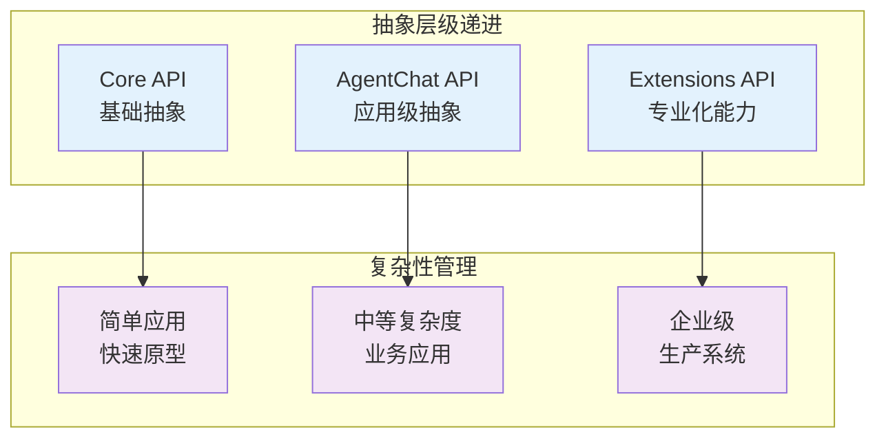
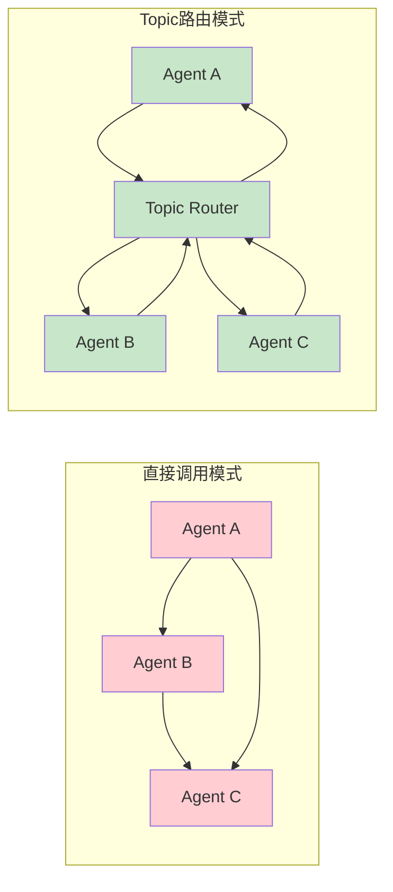
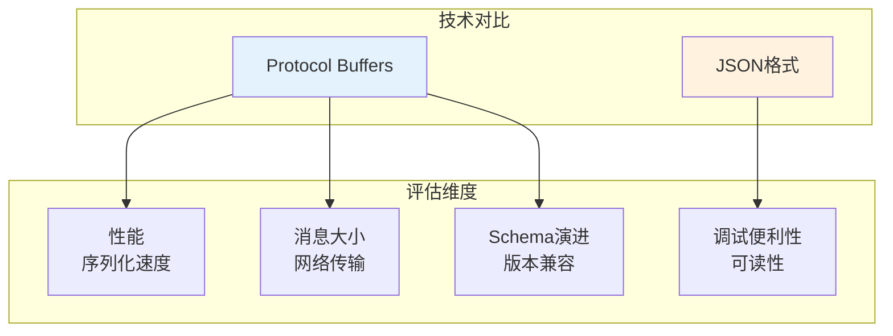
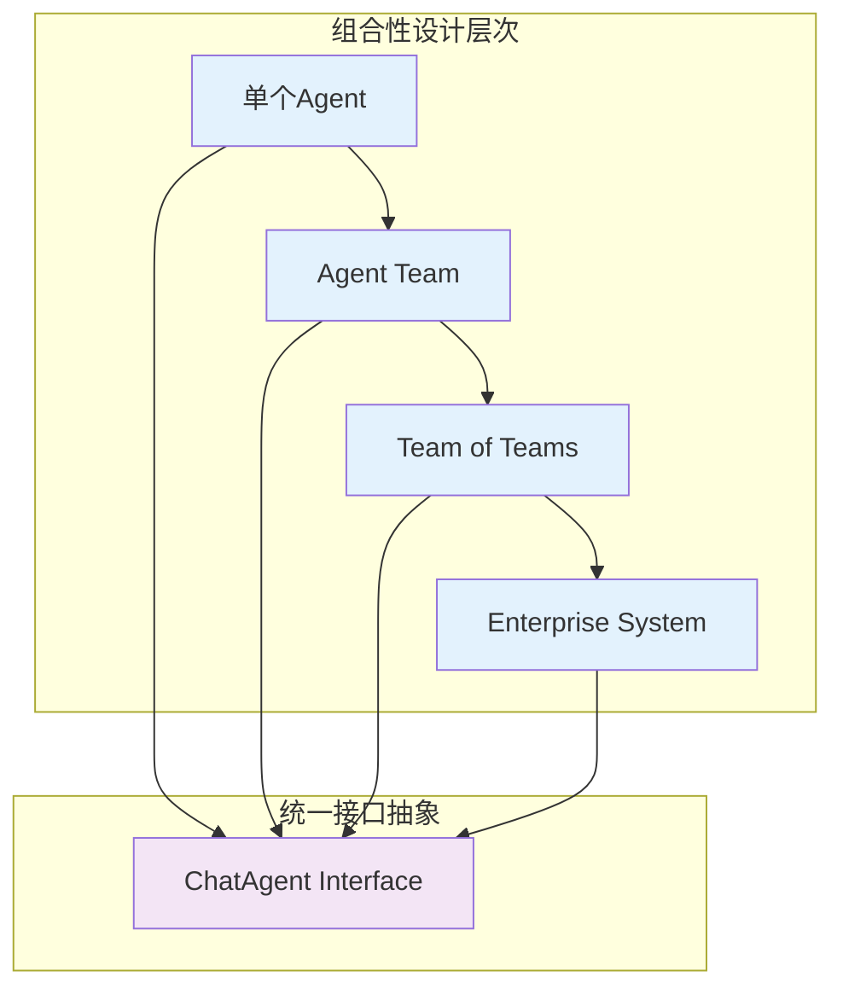
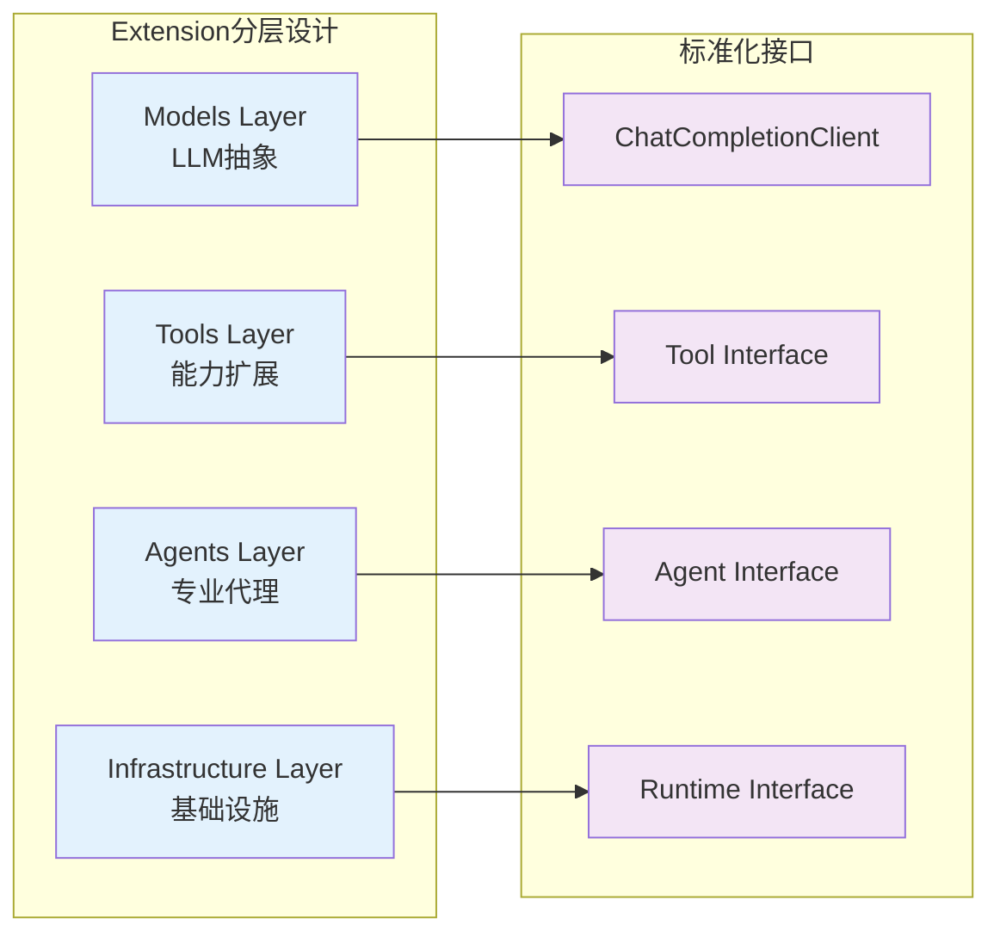
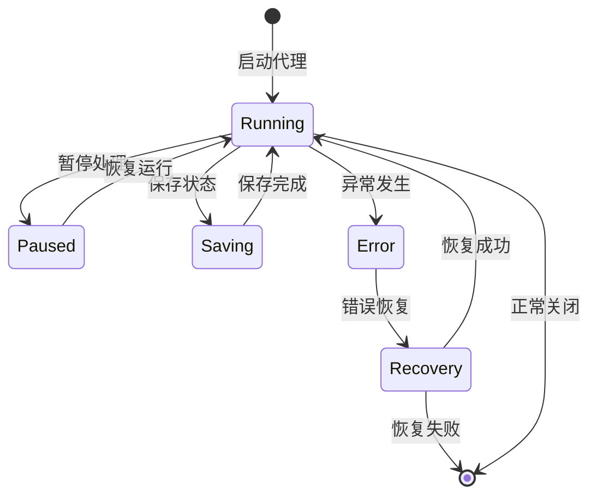

# L4 - AutoGen 设计哲学与架构决策分析

## 核心设计哲学

AutoGen的架构设计体现了深刻的**系统性思维**和**工程哲学**。其设计理念不仅解决了多代理协作的技术挑战，更展现了对复杂AI系统工程化的深度思考。

### 🎯 分层抽象的设计理念

AutoGen采用**渐进式复杂性管理**的核心原则，通过三层架构实现不同抽象层级的开发需求。



**设计理念深层解读**：

1. **核心层专注本质** - Core API只解决最基本的代理运行和消息传递问题
2. **应用层封装模式** - AgentChat API封装常见的对话和协作模式
3. **扩展层丰富生态** - Extensions API提供与外部系统的无缝集成

这种设计避免了"大而全"框架的复杂性陷阱，让开发者可以按需选择抽象层级。

## 架构决策记录 (ADR)

### ADR-001: Protocol接口 vs 抽象基类

**决策**: 使用Python Protocol接口定义AgentRuntime，而非传统的抽象基类

**代码位置**: `autogen-core/src/autogen_core/_agent_runtime.py:21-47`

```python
class AgentRuntime(Protocol):
    """AgentRuntime Protocol - 结构化子类型而非继承"""
    async def send_message(self, message: Any, recipient: AgentId, ...) -> Any: ...
    async def publish_message(self, message: Any, topic_id: TopicId) -> None: ...
    async def save_state(self) -> Mapping[str, Any]: ...
```

**决策理由分析**:

**优势**:
- **灵活性** - 现有类无需修改继承结构即可成为AgentRuntime
- **测试友好** - 易于创建Mock实现进行单元测试
- **组合优于继承** - 避免深层继承层次的复杂性
- **类型安全** - 编译期检查接口一致性

**权衡考虑**:
- 牺牲了传统OOP的代码复用
- 增加了接口实现者的责任
- 需要开发者理解Protocol语义

**影响评估**: 这个设计选择体现了AutoGen对**可扩展性**和**测试性**的重视，符合现代Python开发的最佳实践。

### ADR-002: Topic-based 消息路由 vs 直接调用

**决策**: 采用基于Topic的发布-订阅模式，而非直接的方法调用

**代码位置**: `autogen-agentchat/teams/_group_chat/_base_group_chat.py:117-126`



**决策分析**:

| 维度 | 直接调用 | Topic路由 | AutoGen选择 |
|------|----------|-----------|-------------|
| **耦合度** | 高 - 需要知道目标代理 | 低 - 只需知道Topic | ✅ Topic路由 |
| **可扩展性** | 差 - N:N复杂性 | 好 - 中心化路由 | ✅ Topic路由 |
| **分布式友好** | 难 - 需要代理发现 | 易 - 自然支持 | ✅ Topic路由 |
| **调试复杂度** | 低 - 调用链清晰 | 中 - 需要路由追踪 | ❌ 权衡接受 |
| **性能** | 高 - 直接调用 | 中 - 多一跳 | ❌ 权衡接受 |

**设计洞察**: 这个决策体现了AutoGen对**分布式协作**和**系统扩展性**的优先考虑，愿意接受一定的性能和复杂性成本来获得架构的灵活性。

### ADR-003: 有状态代理 vs 无状态函数

**决策**: 选择有状态的代理设计，而非无状态的函数式设计

**代码位置**: `autogen-agentchat/agents/_base_chat_agent.py:62-66`

```python
def __init__(self, name: str, description: str) -> None:
    self._name = name  # 代理身份状态
    self._description = description  # 代理能力状态
    # 支持长期记忆和个性化状态维护
```

**设计权衡分析**:

**有状态设计的优势**:
1. **持续性对话** - 支持长期运行的智能体交互
2. **个性化记忆** - 每个代理都有独特的状态和记忆
3. **上下文保持** - 避免重复传递大量历史信息
4. **现实建模** - 更符合现实世界中智能体的行为模式

**潜在挑战**:
1. **状态一致性** - 需要处理状态同步和冲突
2. **内存管理** - 长期运行可能导致内存泄露
3. **可测试性** - 状态依赖增加测试复杂度
4. **并发安全** - 需要考虑多线程访问状态

**应对策略分析**:
- 通过`save_state()`/`load_state()`方法实现状态持久化
- 使用`CancellationToken`机制实现优雅关闭
- 提供状态重置和清理机制

## 技术选型权衡分析

### Protocol Buffers vs JSON for 跨语言通信

**选择**: Protocol Buffers作为跨语言消息格式

**代码位置**: `autogen/protos/agent_worker.proto`



**权衡决策表**:

| 维度 | Protocol Buffers | JSON | AutoGen选择 | 理由 |
|------|------------------|------|-------------|------|
| **性能** | ✅ 高效二进制 | ❌ 文本解析开销 | ProtoBuf | 企业级性能要求 |
| **消息大小** | ✅ 紧凑格式 | ❌ 冗余文本 | ProtoBuf | 分布式网络效率 |
| **Schema演进** | ✅ 向前/向后兼容 | ❌ 结构变更困难 | ProtoBuf | 长期维护考虑 |
| **跨语言支持** | ✅ 官方多语言 | ✅ 通用支持 | ProtoBuf | 类型安全优势 |
| **调试体验** | ❌ 二进制不可读 | ✅ 人类可读 | 权衡接受 | 工具补偿 |
| **生态成熟度** | ✅ Google标准 | ✅ 普遍支持 | ProtoBuf | 企业级选择 |

### 异步 vs 同步设计模式

**选择**: 全异步设计（async/await）

**代码位置**: `autogen-core/src/autogen_core/_base_agent.py:116-121`

```python
@abstractmethod  
async def on_message_impl(self, message: Any, ctx: MessageContext) -> Any: ...

async def save_state(self) -> Mapping[str, Any]: ...
async def load_state(self, state: Mapping[str, Any]) -> None: ...
```

**设计理念分析**:

**异步设计的战略价值**:
1. **I/O密集优化** - AI应用大量网络调用（LLM API、工具调用）
2. **并发处理能力** - 支持多个代理同时处理不同任务
3. **资源效率** - 避免线程阻塞，提高系统吞吐量
4. **未来兼容性** - 为流式处理和实时交互奠定基础

**实现一致性**:
- **一致性原则** - 整个框架统一使用async/await，避免同步/异步混合
- **用户友好** - 提供同步包装器降低使用门槛
- **性能优化** - 利用Python asyncio的并发优势

## 扩展性设计模式

### 组合性架构设计

AutoGen的扩展性设计遵循**组合优于继承**的原则：



**组合性设计的深层价值**:

1. **递归组合** - 团队可以包含代理，也可以包含其他团队
2. **接口统一** - 所有级别的组件都实现相同的ChatAgent接口
3. **无限扩展** - 支持任意复杂度的组织结构
4. **局部替换** - 可以替换组合中的任意组件而不影响其他部分

### Plugin化的Extension架构

**代码位置**: `autogen-ext/src/autogen_ext/`



**Plugin架构的创新点**:

1. **标准化接口** - 每层都有清晰的接口协议
2. **独立演进** - 各层可以独立开发和更新
3. **生态开放** - 第三方可以贡献任意层的扩展
4. **向下兼容** - 接口版本化保证兼容性

## 性能与可靠性权衡

### 内存管理策略

AutoGen在内存管理上体现了**企业级可靠性**的设计理念：

```python
# 状态管理的内存优化策略
async def save_state(self) -> Mapping[str, Any]:
    """将内存状态持久化到存储系统"""
    return self._serialize_state()

async def load_state(self, state: Mapping[str, Any]) -> None:
    """从存储系统恢复状态，释放内存压力"""
    self._deserialize_state(state)
```

**内存管理的设计权衡**:

| 策略 | 优势 | 劣势 | AutoGen选择 |
|------|------|------|-------------|
| **全内存模式** | 性能最高 | 内存泄漏风险 | ❌ |
| **全持久化模式** | 内存安全 | 性能开销大 | ❌ |
| **混合管理模式** | 平衡性能和安全 | 复杂性增加 | ✅ |

### 容错与恢复设计



**容错设计的多层保障**:
1. **代理级别** - save_state/load_state支持代理状态恢复
2. **消息级别** - Topic路由提供消息重试和冗余
3. **系统级别** - Runtime提供整体系统状态管理
4. **分布式级别** - gRPC Runtime支持跨节点故障转移

---

**核心洞察**: AutoGen的设计哲学体现了**工程化成熟度**和**系统性思维**。其每个关键架构决策都经过深思熟虑的权衡，优先考虑长期可维护性、企业级可靠性和生态系统的开放性。这种设计理念为构建生产级多代理AI应用提供了坚实的理论基础和实践指导。