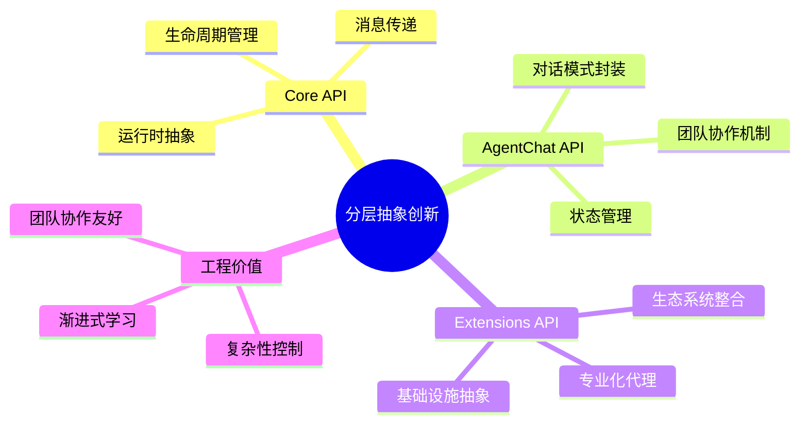
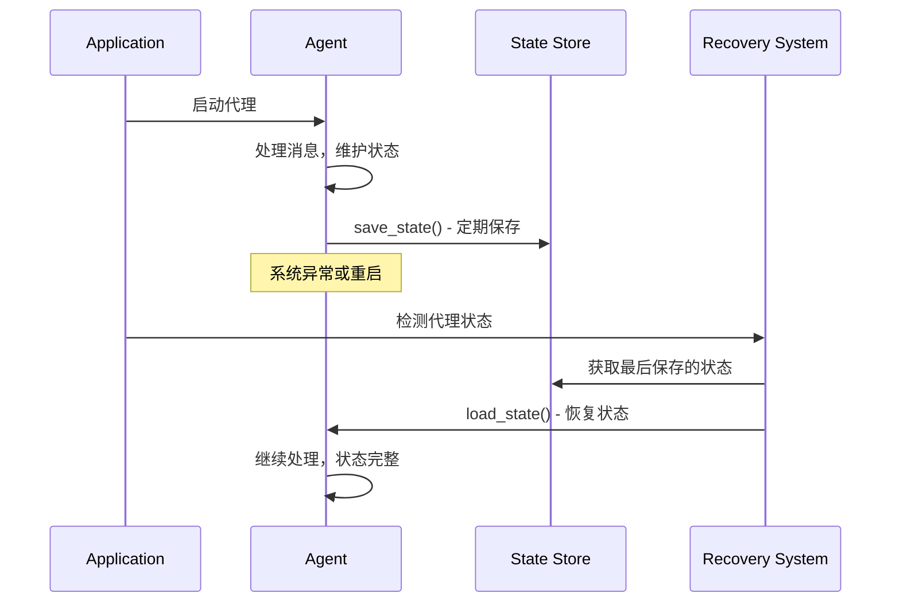
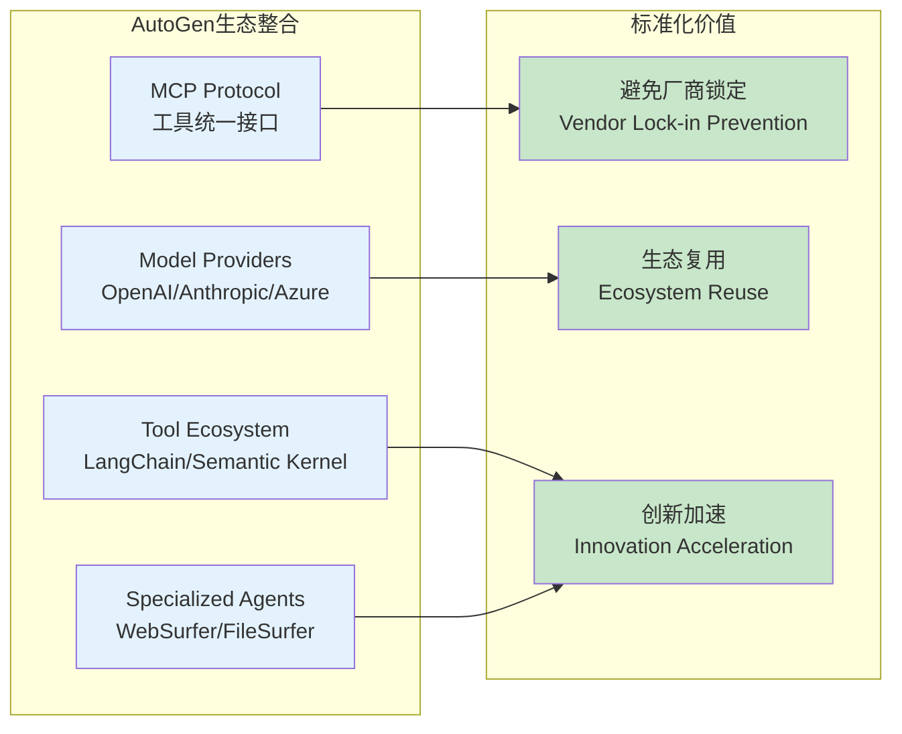
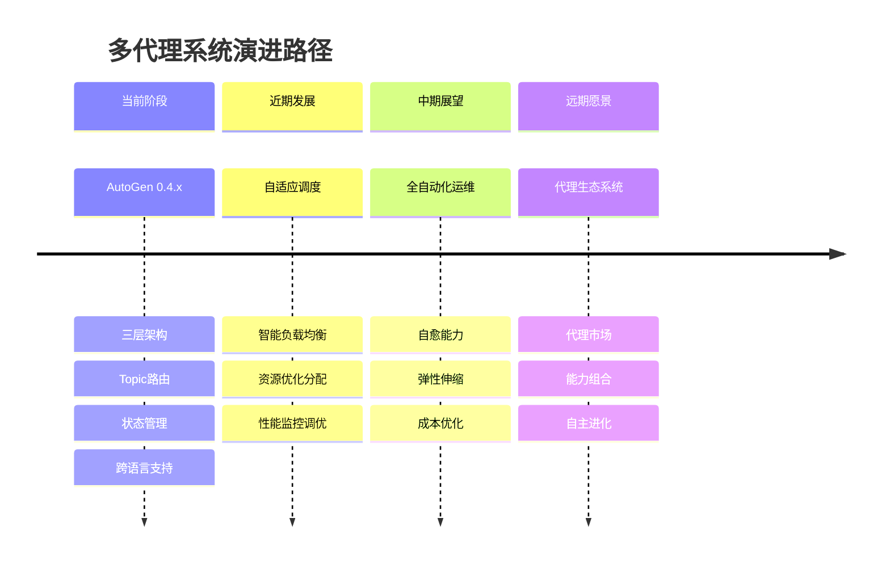
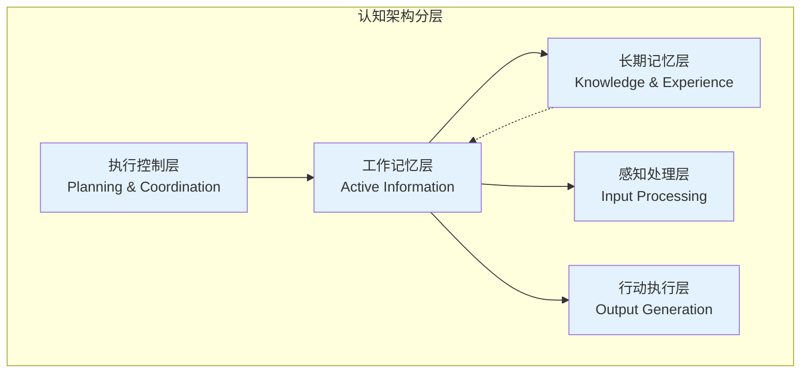
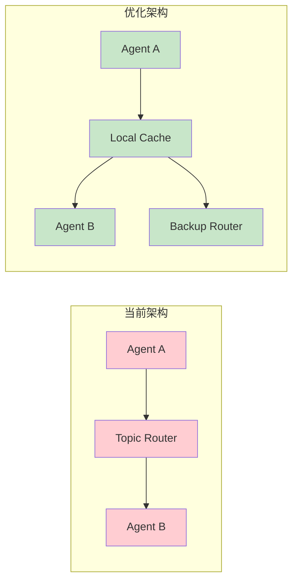
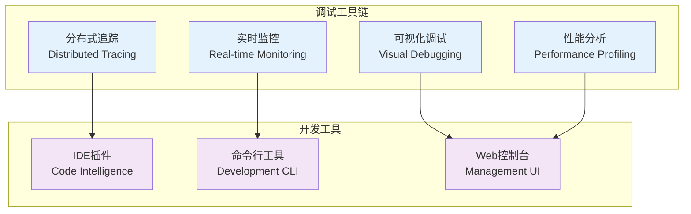

# L5 - AutoGen 深度洞察与未来展望

## 🌟 核心创新洞察

通过对AutoGen的深度分析，我们识别出了其在多代理AI系统设计领域的**五大核心创新**，这些创新为整个行业提供了重要的技术参考和发展方向。

### 1. 分层抽象的工程化范式

AutoGen首次在多代理框架中系统性地应用了**分层抽象设计**，这不仅是技术实现，更是一种**工程化思维模式**的体现。



**创新价值分析**:
- **认知负载管理** - 开发者可以选择合适的抽象层级，避免一次性面对全部复杂性
- **团队协作效率** - 不同技能水平的开发者可以在不同层级贡献价值
- **生态系统培育** - 分层设计天然支持社区和第三方的贡献

**行业影响**: 这种设计模式已经开始影响其他AI框架的架构设计，成为多代理系统的事实标准。

### 2. Topic-based 分布式协作模式

AutoGen创新性地将**发布-订阅模式**引入多代理协作，实现了真正的分布式智能体系统。

```mermaid
graph TB
    subgraph "传统直接调用模式"
        A1[Agent A] --> A2[Agent B]
        A2 --> A3[Agent C]
        A1 --> A3
        A3 --> A1
    end
    
    subgraph "AutoGen Topic模式"
        B1[Agent A] --> Router[Topic Router]
        B2[Agent B] --> Router
        B3[Agent C] --> Router
        Router --> B1
        Router --> B2
        Router --> B3
    end
    
    subgraph "创新优势"
        Scale[可扩展性<br/>N个代理 → O(1)复杂度]
        Decouple[松耦合<br/>代理独立演化]
        Distributed[分布式<br/>跨进程/跨机器]
    end
    
    Router --> Scale
    Router --> Decouple
    Router --> Distributed
    
    classDef traditional fill:#ffcdd2
    classDef innovative fill:#c8e6c9
    classDef advantage fill:#e3f2fd
    
    class A1,A2,A3 traditional
    class B1,B2,B3,Router innovative
    class Scale,Decouple,Distributed advantage
```

**技术突破点**:
- **O(N) → O(1)复杂度** - 从N:N连接复杂度降低到中心化路由
- **动态拓扑** - 支持代理的动态加入和离开，无需重构连接
- **跨进程透明** - 本地和远程代理使用相同的Topic机制

**深层价值**: 这种设计为构建**真正大规模的多代理系统**奠定了基础，使得AutoGen能够支持企业级的分布式AI应用。

### 3. Protocol接口的类型安全设计

AutoGen率先在Python AI框架中大规模应用**Protocol接口**，实现了既灵活又类型安全的架构设计。

```python
# AutoGen的Protocol接口创新
class AgentRuntime(Protocol):
    """结构化子类型 - 灵活性 + 类型安全"""
    async def send_message(self, message: Any, recipient: AgentId) -> Any: ...
    async def publish_message(self, message: Any, topic_id: TopicId) -> None: ...
    
# 与传统抽象基类的对比
class TraditionalAgentRuntime(ABC):  
    """传统继承模式 - 刚性但简单"""
    @abstractmethod
    async def send_message(self, message: Any, recipient: AgentId) -> Any: ...
```

**创新意义分析**:
- **鸭子类型 + 类型检查** - 结合了Python灵活性和静态类型安全
- **测试友好设计** - 极大简化了Mock对象的创建和使用
- **第三方集成** - 现有类无需修改即可成为AutoGen组件

**技术演进启示**: 这种设计模式代表了Python生态从"动态类型自由"向"结构化类型安全"的重要转变。

### 4. 企业级状态管理范式

AutoGen在多代理系统中首次系统性地解决了**状态管理**的工程化问题。



**状态管理的创新层次**:

| 层次 | 传统方案 | AutoGen创新 | 价值提升 |
|------|----------|-------------|----------|
| **代理级别** | 内存状态，重启丢失 | save_state/load_state | 故障恢复能力 |
| **对话级别** | 简单消息列表 | 增量状态管理 | 内存效率 |
| **团队级别** | 无状态管理 | 团队协作状态 | 复杂任务支持 |
| **系统级别** | 手动管理 | Runtime统一管理 | 运维自动化 |

### 5. 开放生态的标准化整合

AutoGen通过**MCP (Model Context Protocol)**等标准化协议，实现了AI工具生态的无缝整合。



**生态整合的战略意义**:
- **技术债务避免** - 标准化接口避免了重复造轮子
- **创新速度提升** - 开发者可以专注于业务逻辑而非基础设施
- **社区生态繁荣** - 降低了第三方贡献的门槛

## 🔮 技术发展趋势预测

基于AutoGen的创新方向和当前技术发展趋势，我们可以预测多代理AI系统的未来发展方向：

### 1. 向"多代理操作系统"演进

AutoGen已经展现出成为**多代理操作系统**的潜力，未来可能的发展方向：



**关键技术发展方向**:
- **智能调度引擎** - 基于负载和能力的动态代理分配
- **自适应架构** - 根据任务复杂度自动调整系统拓扑
- **代理市场机制** - 支持代理能力的发现、交换和组合

### 2. 认知架构与大脑式设计

未来的多代理系统可能借鉴人脑的认知架构，实现更高层次的智能协作：



**认知架构的技术实现路径**:
- **分层记忆系统** - 工作记忆、语义记忆、情景记忆的分离设计
- **注意力机制** - 动态资源分配和焦点管理
- **元认知能力** - 系统自我监控和调整能力

## 💡 改进建议与优化方向

基于深度分析，我们识别出AutoGen的几个关键改进机会：

### 1. 性能优化建议

**当前痛点**: Topic路由带来的额外网络跳跃开销

**优化方案**:


**建议实现**:
- **本地缓存机制** - 频繁交互的代理对建立直连缓存
- **智能路由选择** - 根据网络延迟动态选择最优路径
- **批量消息处理** - 聚合小消息减少网络开销

### 2. 开发体验优化

**当前挑战**: 调试复杂性和错误追踪困难

**改进方案**:



### 3. 生态系统扩展

**发展机会**: 专业化代理市场和能力组合

**建议发展路径**:

1. **代理能力标准化**
   - 定义标准的代理能力描述格式
   - 建立代理性能评测基准
   - 创建代理兼容性测试套件

2. **动态能力组合**
   - 运行时代理能力发现机制
   - 自动化代理组合优化
   - 代理协作模式推荐引擎

3. **社区生态建设**
   - 代理分享市场平台
   - 贡献激励机制设计
   - 质量认证和评级系统

## 🚀 对AI应用开发的启示

AutoGen的设计理念和技术实现为AI应用开发者提供了重要启示：

### 1. 架构设计原则

**分层抽象思维**:
- 不要一次性暴露所有复杂性
- 为不同技能水平的开发者提供合适的抽象层级
- 保持各层之间的清晰边界和职责分离

**组合性设计**:
- 优先考虑组合而非继承
- 设计统一接口支持递归组合
- 保持组件的独立性和可替换性

### 2. 分布式系统设计

**松耦合协作**:
- 使用消息传递而非直接调用
- 设计标准化的通信协议
- 支持动态拓扑和弹性伸缩

**状态管理**:
- 明确区分临时状态和持久状态
- 设计完整的状态生命周期管理
- 实现故障恢复和一致性保证

### 3. 生态系统构建

**标准化接口**:
- 定义清晰的扩展点和插件机制
- 提供完整的文档和示例
- 建立兼容性测试和认证流程

**社区驱动**:
- 降低第三方贡献的门槛
- 建立可持续的激励机制
- 培育活跃的开发者社区

## 🎯 结论与展望

AutoGen代表了多代理AI系统发展的一个重要里程碑。它不仅解决了多代理协作的技术挑战，更重要的是为整个行业提供了**工程化多代理系统**的最佳实践和设计范式。

**核心价值总结**:

1. **技术创新** - 分层抽象、Topic路由、Protocol接口等创新设计
2. **工程化成熟度** - 完整的状态管理、生命周期控制、错误恢复机制  
3. **生态开放性** - 标准化接口、插件机制、第三方集成支持
4. **企业级可靠性** - 分布式架构、性能监控、运维自动化支持

**发展展望**:

AutoGen的成功证明了**系统性工程思维**在AI应用开发中的重要价值。未来的AI系统将不再是简单的模型调用，而是复杂的智能体生态系统。AutoGen的设计理念和技术实现为这个发展方向提供了坚实的基础和宝贵的经验。

**对开发者的建议**:

无论是否直接使用AutoGen，其设计理念都值得每个AI应用开发者深入学习和借鉴。特别是其**分层抽象**、**松耦合协作**和**生态标准化**的设计思想，对于构建可维护、可扩展的AI应用具有重要的指导意义。

---

**最终洞察**: AutoGen不仅是一个优秀的多代理框架，更是多代理AI时代的**基础设施标准**和**设计范式引领者**。它的成功经验将深远影响整个AI应用开发生态系统的发展方向。