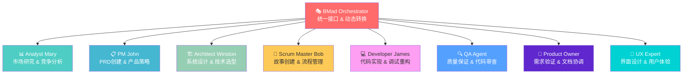
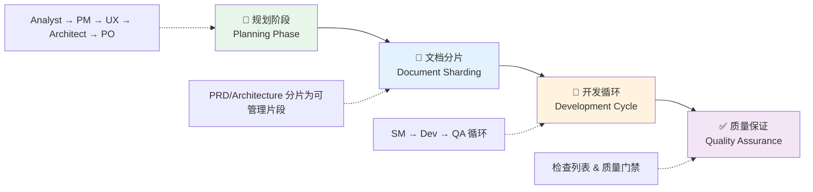

# BMAD-METHOD 架构概览与核心概念

## 概述

BMAD-METHOD (Breakthrough Method of Agile AI-Driven Development) 是一个创新的AI代理框架，专注于解决AI辅助开发中的两个核心问题：**规划不一致** 和 **上下文丢失**。

## 🎯 核心创新

### 1. Agentic Planning（代理化规划）
通过专业代理（Analyst、PM、Architect）协作创建详细、一致的PRD和架构文档，通过高级提示工程和人机协作细化，产生远超通用AI任务生成的综合规范。

### 2. Context-Engineered Development（上下文工程化开发）
Scrum Master代理将详细计划转换为超详细开发故事，包含开发代理所需的一切：完整上下文、实现细节和架构指导直接嵌入故事文件。

## 🏗️ 系统架构

### 核心代理系统



### 工作流程架构



## 🔧 核心组件深度解析

### 动态角色转换机制
- **单一接口访问**：BMad Orchestrator提供统一入口
- **按需加载**：仅在需要时加载专业代理能力
- **无缝切换**：通过`*agent`命令实现角色动态转换
- **上下文保持**：转换过程中维持工作状态

### 命令系统设计
```yaml
命令前缀: "*"
核心命令:
  - *help: 显示帮助信息
  - *agent [name]: 转换为专业代理
  - *workflow [name]: 启动工作流程
  - *task [name]: 执行特定任务
  - *status: 显示当前状态
```

### 上下文工程化
- **完整信息传递**：故事文件包含所有必要上下文
- **架构指导嵌入**：技术决策直接集成到开发任务
- **依赖关系明确**：清晰定义模块间依赖
- **验收标准详细**：具体可测试的完成标准

## 📋 标准化工作流程

### Planning Workflow (规划工作流程)
1. **Analyst**: 项目简报 + 市场研究（可选）
2. **PM**: 根据简报创建PRD（功能需求、非功能需求、史诗、故事）
3. **UX Expert**: UI/UX规范 + AI生成提示（可选）
4. **Architect**: 全栈架构设计（技术栈、部署、API设计）
5. **PO**: 主检查列表验证所有文档一致性

### Development Cycle (开发循环)
1. **Document Sharding**: 大文档分片为可管理片段
2. **SM**: 从分片文档创建详细开发故事
3. **Dev**: 实现故事，更新文件列表，标记为待审查
4. **QA**: 代码审查，小问题直接修复，大问题留检查列表

## 🎨 设计哲学

### 用户体验优先
- **降低认知负荷**：统一接口访问所有功能
- **渐进式复杂性**：从简单开始，按需扩展
- **反馈驱动**：实时状态更新和进度跟踪

### 质量内建
- **检查列表机制**：每个阶段都有质量门禁
- **模板化输出**：确保文档格式和内容一致性
- **版本控制友好**：所有输出都是可版本管理的文本文件

### 可扩展性设计
- **插件化架构**：通过Expansion Packs扩展到任何领域
- **配置驱动**：YAML文件定义代理、工作流程、模板
- **标准化接口**：统一的任务、模板、检查列表接口

## 💡 核心价值主张

### 解决的核心问题
1. **规划不一致**：通过专业代理协作确保规划质量
2. **上下文丢失**：通过上下文工程化保持信息完整性
3. **工具复杂性**：通过统一接口简化多代理交互
4. **质量控制**：通过标准化流程确保输出质量

### 带来的核心价值
1. **开发效率提升**：结构化流程减少返工和沟通成本
2. **质量保证**：内建检查机制确保每个阶段输出质量
3. **团队协作**：清晰的角色分工和交接机制
4. **可复用性**：模板化和标准化输出可在项目间复用

## 🔄 学习路径建议

### 初级阶段：理解概念
1. 掌握两大核心创新：Agentic Planning + Context Engineering
2. 理解代理角色分工和协作机制  
3. 熟悉命令系统和基本交互方式

### 中级阶段：实践应用
1. 使用Greenfield工作流程完成一个完整项目
2. 理解文档分片和上下文传递机制
3. 掌握质量门禁和检查列表使用

### 高级阶段：定制扩展
1. 创建自定义代理和工作流程
2. 开发针对特定领域的Expansion Packs
3. 优化团队配置和流程定制

## 📚 下一步学习建议

1. **深入代理系统**：详细了解每个代理的职责、命令和最佳实践
2. **工作流程实战**：通过实际项目理解规划到开发的完整流程
3. **模板系统**：学习如何使用和定制各种文档模板
4. **扩展开发**：探索如何为特定领域创建专业化扩展包

---

*BMAD-METHOD 代表了AI辅助软件开发的一个重要进展，通过系统化的方法论和工具链，让AI真正成为开发团队的得力助手。*