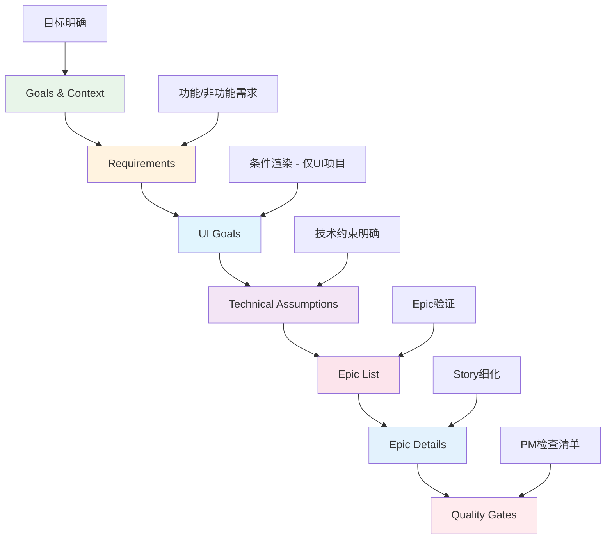
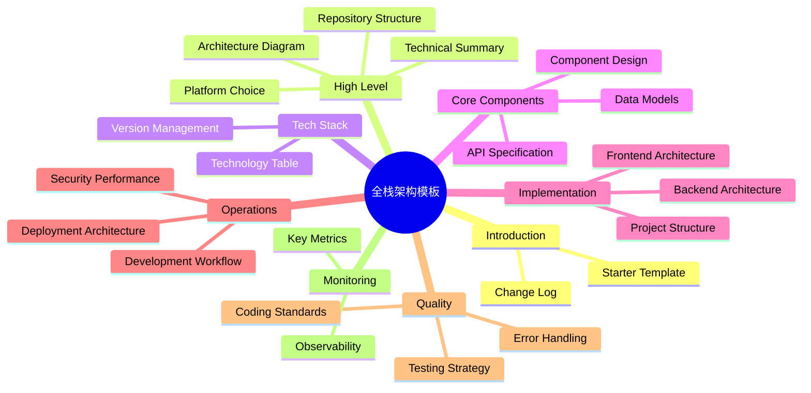
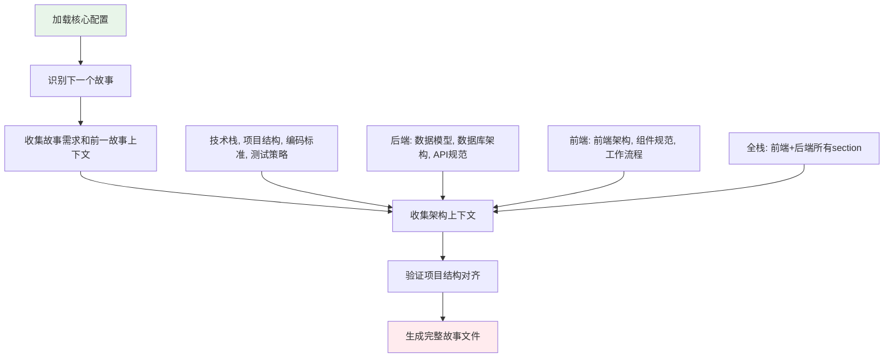
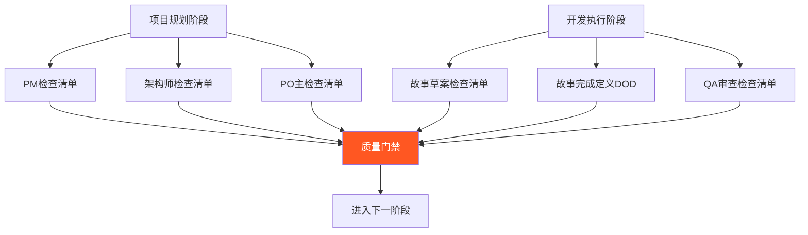

# BMAD-METHOD 模板系统与质量保证

## 概述

BMAD-METHOD的模板系统不仅仅是文档模板的集合，而是一套完整的**工程化文档管理与质量保证体系**。它通过系统化的设计解决了AI辅助开发中的三个核心痛点：**规划不一致**、**上下文丢失**、**质量控制**。

**核心价值主张**：
- **标准化输出**：确保所有文档格式和内容的一致性
- **上下文工程化**：系统性传递技术上下文到实现阶段
- **质量内建**：每个阶段都有自动化和手动质量门禁
- **智能适配**：根据项目类型和特性自动调整验证标准

---

## 🏗️ 核心模板深度解析

### PRD模板：产品需求的系统化建模

**文件**: `bmad-core/templates/prd-tmpl.yaml` (202行)

#### 设计哲学：渐进式复杂性管理



#### 核心创新机制

**1. 强制用户交互模式**
```yaml
workflow:
  mode: interactive
  elicitation: advanced-elicitation
```
- `elicit: true` 标记的section必须用户参与
- 防止AI独断专行，确保需求准确性
- 每个关键决策点都需要用户确认

**2. 条件渲染系统**
```yaml
sections:
  - id: ui-goals
    title: User Interface Design Goals
    condition: PRD has UX/UI requirements  # 智能判断
```

**3. 重复性模板支持**
```yaml
- id: epic-details
  repeatable: true  # 支持任意数量Epic
  template: "{{epic_goal}}"
```

**关键洞察**：PRD模板体现了**认知负荷管理**原则，通过分段处理复杂信息，每个阶段只关注特定问题域。

### 架构模板：全栈技术蓝图的标准化

**文件**: `bmad-core/templates/fullstack-architecture-tmpl.yaml` (805行)

#### 系统架构：16个主要维度



#### 关键设计创新

**1. 决策追踪机制**
```yaml
columns: [Category, Technology, Version, Purpose, Rationale]
```
- 每个技术选择都必须有明确理由
- 建立可追溯的决策链路
- 支持后续技术演进决策

**2. 多架构模式支持**
```yaml
sections:
  - id: serverless-architecture
    condition: Serverless architecture chosen
  - id: traditional-server  
    condition: Traditional server architecture chosen
```

**3. 代码生成就绪**
```yaml
- id: controller-template
  title: Controller Template
  type: code
  language: typescript
  template: "{{controller_template}}"
```

**关键洞察**：架构模板实现了**技术决策的系统化管理**，不仅记录"是什么"，更重要的是记录"为什么"。

### 故事模板：上下文传递的工程化实现

**文件**: `bmad-core/templates/story-tmpl.yaml` (137行)

#### 权限控制系统

```yaml
agent_config:
  editable_sections: 
    - Status
    - Story
    - Acceptance Criteria
    - Tasks / Subtasks
    - Dev Notes
    - Testing
    - Change Log
```

#### 所有权管理
```yaml
sections:
  - id: story
    owner: scrum-master
    editors: [scrum-master]
  - id: dev-agent-record
    owner: dev-agent
    editors: [dev-agent]
  - id: qa-results
    owner: qa-agent
    editors: [qa-agent]
```

**关键洞察**：故事模板通过**权限分离**确保了文档的完整性和责任清晰，每个代理只能编辑其职责范围内的内容。

---

## 🔄 上下文工程化机制

### 文档分片：大规模文档的可管理化

**文件**: `bmad-core/tasks/shard-doc.md` (188行)

#### 双模式设计

**自动化模式** (推荐)
```bash
# 使用 @kayvan/markdown-tree-parser
md-tree explode docs/prd.md docs/prd
md-tree explode docs/architecture.md docs/architecture
```

**手动模式** (后备)
- 智能Markdown解析，处理代码块中的 `##` 符号
- 标题级别自动调整
- 创建索引文件维护文档结构

#### 核心设计原则

1. **保真性**: "确保内容完整性，包括代码块、图表、Markdown格式"
2. **可逆性**: "分片是可逆的，可以从分片重构原文档"
3. **智能解析**: 理解Markdown上下文，区分真实标题和代码示例

### 故事创建：系统化上下文传递

**文件**: `bmad-core/tasks/create-next-story.md` (113行)

#### 6步骤上下文传递流程



#### 关键创新：证据驱动的上下文传递

```yaml
Dev Notes section (CRITICAL):
- 必须包含从架构文档提取的所有技术细节
- 每个技术细节必须包含来源引用: [Source: architecture/{filename}.md#{section}]
- 如果架构文档中没有找到信息，明确声明: "No specific guidance found in architecture docs"
```

**核心洞察**：通过**源引用系统**确保所有技术决策可追溯，防止AI编造不存在的技术细节。

---

## 🛡️ 质量门禁系统

### 多层次质量保证架构



### PO主检查清单：智能适配的综合验证

**文件**: `bmad-core/checklists/po-master-checklist.md` (442行)

#### 智能项目类型检测
```markdown
PROJECT TYPE DETECTION:
1. GREENFIELD项目 (全新项目)
   - 检查: 新项目初始化、无现有代码库引用
2. BROWNFIELD项目 (增强现有系统) 
   - 检查: 现有代码库引用、增强/修改语言
3. UI/UX组件项目
   - 检查: 前端架构、UI/UX规范、设计文件
```

#### 10大类别全覆盖验证

| 类别 | Greenfield重点 | Brownfield重点 |
|------|----------------|----------------|
| 项目设置 | 项目脚手架、初始化 | 现有系统集成、安全整合 |
| 基础设施 | 全新部署pipeline | 与现有基础设施集成 |
| 外部依赖 | 服务选择和设置 | 兼容性验证 |
| UI/UX考虑 | 设计系统建立 | UI一致性维护 |
| 用户/代理职责 | 清晰职责分工 | 现有工作流程保护 |
| 功能排序 | 逻辑依赖管理 | 渐进式功能添加 |
| 风险管理 | 一般项目风险 | **破坏性变更风险** |
| MVP对齐 | 核心目标实现 | 增强复杂性验证 |
| 文档交接 | 新文档创建 | 集成点详细文档 |
| 后MVP考虑 | 成功后扩展 | 可重用集成模式 |

#### 风险预防机制 (Brownfield特有)

```yaml
Breaking Change Risks:
- [ ] 现有功能破坏风险评估
- [ ] 数据库迁移风险识别和缓解  
- [ ] API破坏性变更风险评估
- [ ] 性能降级风险识别
- [ ] 安全漏洞风险评估

Rollback Strategy:
- [ ] 每个故事的回滚程序明确定义
- [ ] 功能标志策略实现
- [ ] 备份和恢复程序更新
```

### 故事完成定义：开发质量的自我验证

**文件**: `bmad-core/checklists/story-dod-checklist.md` (102行)

#### 诚实原则设计
```markdown
IMPORTANT: 这是自我评估。诚实评估实际完成vs应该完成的内容。
现在发现问题比在审查中被发现要好。

目标是质量交付，而不仅仅是勾选框。
```

#### 7大类别验证
1. **需求满足**: 功能需求、验收标准
2. **编码标准**: 操作指南、项目结构、技术栈
3. **测试**: 单元测试、集成测试、测试覆盖率
4. **功能验证**: 手动验证、边界情况处理  
5. **故事管理**: 任务完成、决策文档、变更日志
6. **依赖构建**: 项目构建、新依赖批准、安全检查
7. **文档**: API文档、用户文档、技术文档

---

## ⚙️ 智能适配与自动化

### 配置驱动的灵活性

**文件**: `bmad-core/core-config.yaml`

#### 关键配置维度
```yaml
# 文档管理配置
prdSharded: true/false
prdShardedLocation: docs/prd/
architectureSharded: true/false  
architectureShardedLocation: docs/architecture/

# 开发配置
devStoryLocation: docs/stories/
devLoadAlwaysFiles:
  - docs/architecture/coding-standards.md
  - docs/architecture/tech-stack.md

# 自动化配置  
markdownExploder: true/false  # 是否使用自动化分片
```

### 工具链集成

**自动化分片工具**
```bash
# 全局安装
npm install -g @kayvan/markdown-tree-parser

# 使用
md-tree explode docs/prd.md docs/prd
```

**智能回退机制**
- 自动化工具不可用时，自动切换到手动模式
- 提供清晰的安装指导和配置建议
- 用户可以选择禁用自动化，使用传统方式

---

## 🎯 设计原则提炼

### 1. 渐进式复杂性管理

**原则**: 将复杂问题分解为可管理的步骤，每个阶段只关注特定问题域。

**应用示例**:
- PRD模板从Goals开始，逐步深入到Technical Assumptions
- 架构模板从High-level概述到具体的Coding Standards
- 检查清单从项目设置到后MVP考虑

**迁移价值**: 任何复杂系统设计都可以采用这种分层递进的方法。

### 2. 上下文工程化

**原则**: 系统化地传递和保持上下文信息，防止信息丢失。

**核心机制**:
- **文档分片**: 大文档 → 可管理片段
- **源引用系统**: `[Source: architecture/{filename}.md#{section}]`
- **权限控制**: 每个角色只能编辑其职责范围
- **状态跟踪**: Draft → Approved → InProgress → Review → Done

**迁移价值**: 任何涉及信息传递的系统都需要类似的上下文保持机制。

### 3. 质量内建

**原则**: 在每个阶段内建质量检查，而不是事后补救。

**实现方式**:
- **强制交互**: `elicit: true` 确保关键决策的用户参与
- **多层检查**: PM → Architect → PO → Dev → QA 的递进验证  
- **证据要求**: 所有技术决策必须有明确rationale
- **自我验证**: 开发完成前的DOD检查清单

**迁移价值**: 质量左移的思想适用于任何质量关键的系统。

### 4. 智能适配

**原则**: 根据项目特性自动调整流程和验证标准。

**适配维度**:
- **项目类型**: Greenfield vs Brownfield
- **技术栈**: Frontend vs Backend vs Fullstack  
- **复杂度**: Simple vs Complex项目
- **UI需求**: 有UI vs 纯后端

**迁移价值**: 任何支持多种场景的系统都需要类似的智能适配能力。

### 5. 证据驱动决策

**原则**: 所有重要决策都必须有可验证的证据支撑。

**证据类型**:
- **技术选择**: 每个技术都需要Purpose和Rationale
- **架构决策**: 具体的源文档引用
- **质量验证**: 具体的检查项目和证据
- **变更历史**: 完整的变更日志和决策轨迹

**迁移价值**: 任何需要审计和追溯的系统都应采用证据驱动的方法。

---

## 📚 学习路径建议

### 入门级：理解模板系统基础

**学习目标**: 掌握BMAD模板系统的基本概念和使用方法

**核心内容**:
1. **模板结构理解**: 学习YAML模板的基本结构和语法
2. **交互模式**: 理解`elicit: true`和用户交互的重要性
3. **基础模板使用**: 掌握PRD、架构、故事模板的基本使用

**实践练习**:
- 使用PRD模板创建一个简单项目的需求文档
- 理解不同section的作用和依赖关系
- 体验交互式文档生成流程

**评估标准**: 能够独立使用基础模板创建结构完整的项目文档

### 中级：掌握上下文工程化

**学习目标**: 理解并实践BMAD的上下文传递机制

**核心内容**:
1. **文档分片机制**: 掌握自动化和手动分片方法
2. **故事创建流程**: 理解6步骤上下文传递过程
3. **引用系统**: 学会使用源引用确保信息可追溯
4. **权限控制**: 理解不同角色的编辑权限和职责

**实践练习**:
- 实践文档分片和故事创建的完整流程
- 建立包含完整上下文的开发故事
- 验证上下文传递的完整性和准确性

**评估标准**: 能够建立可靠的上下文传递链路，确保技术信息准确传递

### 高级：质量保证体系设计

**学习目标**: 设计和实施多层次质量保证体系

**核心内容**:
1. **检查清单设计**: 掌握智能适配的检查清单设计原则
2. **质量门禁**: 理解多层次质量验证的实施方法
3. **风险管理**: 学会识别和预防项目风险
4. **自动化集成**: 掌握工具链集成和自动化配置

**实践练习**:
- 设计针对特定项目类型的检查清单
- 建立完整的质量门禁流程
- 集成自动化工具提升效率

**评估标准**: 能够设计适合不同项目类型的质量保证体系

### 专家级：框架扩展与定制

**学习目标**: 扩展BMAD模板系统到新的领域和场景

**核心内容**:
1. **模板设计原则**: 深度理解渐进式复杂性等设计原则
2. **领域适配**: 将BMAD原则应用到特定技术领域
3. **工具链开发**: 开发支持新场景的自动化工具
4. **最佳实践提炼**: 从实践中提炼可复用的模式

**实践练习**:
- 为新的技术领域（如机器学习、物联网）设计模板体系
- 开发自定义的质量检查工具
- 建立适合企业环境的模板标准

**评估标准**: 能够将BMAD的设计思想迁移到新的技术领域和组织环境

---

## 💡 总结与启发

### 核心创新总结

BMAD-METHOD的模板系统通过**四大创新机制**，系统化地解决了AI辅助开发的核心痛点：

1. **渐进式复杂性管理** - 将复杂决策分解为可管理的步骤
2. **上下文工程化** - 建立系统化的信息传递和保持机制  
3. **质量内建** - 在每个阶段内建质量检查而非事后补救
4. **智能适配** - 根据项目特性自动调整流程和标准

### 技术哲学启发

**从工具到方法论的演进**：BMAD模板系统展现了从简单模板工具到完整方法论的演进路径。它不仅提供了标准化的文档格式，更重要的是建立了一套**可重现的质量流程**。

**AI时代的工程管理**：在AI能力快速发展的背景下，BMAD提供了一个思路：通过**系统化的约束和指导**，让AI的能力在正确的轨道上发挥，而不是完全依赖AI的"智能"。

**知识工程的实践**：BMAD模板系统实际上是一个**知识工程项目**，它将软件开发的最佳实践编码为可执行的模板和流程，实现了知识的标准化传递。

### 迁移应用价值

BMAD模板系统的设计原则具有广泛的迁移价值：

- **企业文档管理**: 渐进式复杂性和质量内建原则
- **产品开发流程**: 上下文工程化和智能适配机制
- **质量管理体系**: 多层次验证和证据驱动决策
- **知识管理系统**: 源引用系统和权限控制机制

*BMAD-METHOD模板系统代表了AI时代工程管理的一次重要探索，它展示了如何通过系统化设计让AI成为更可靠、更可预测的开发伙伴。*