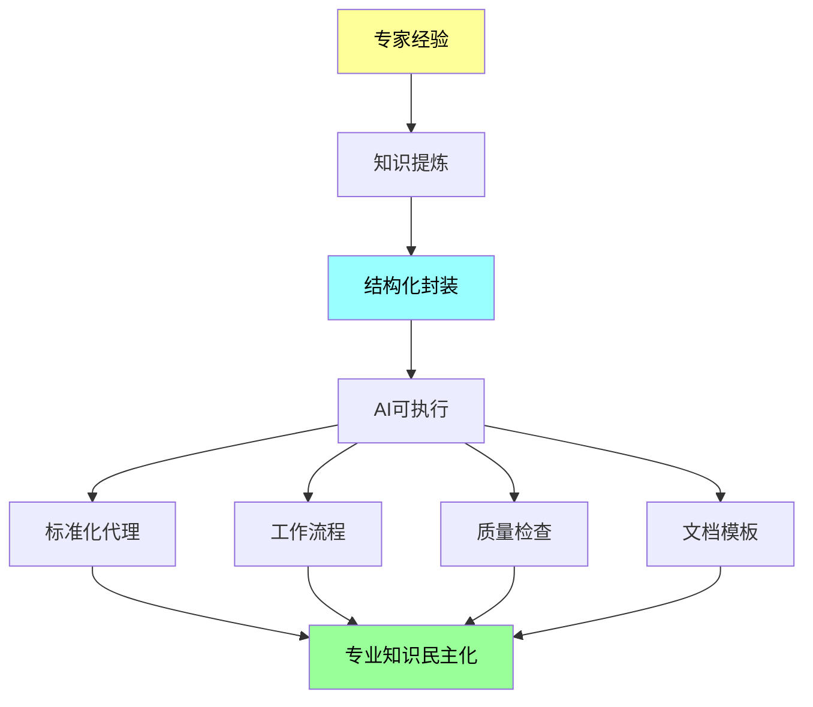
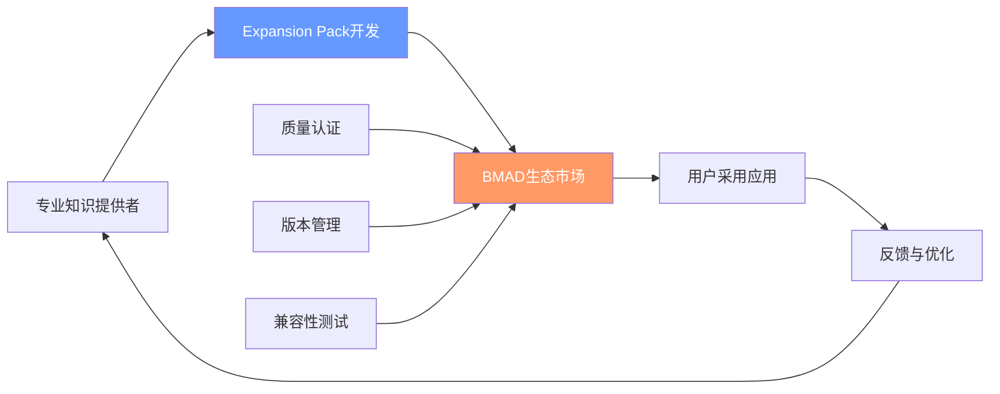
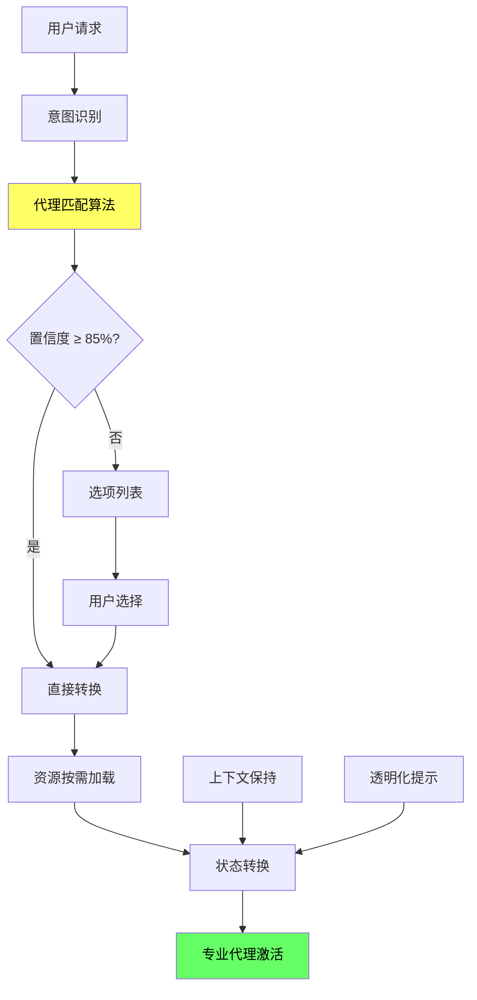
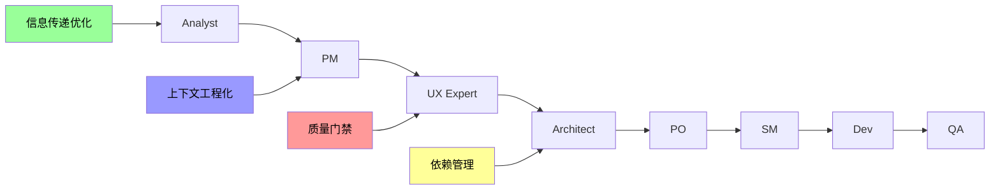
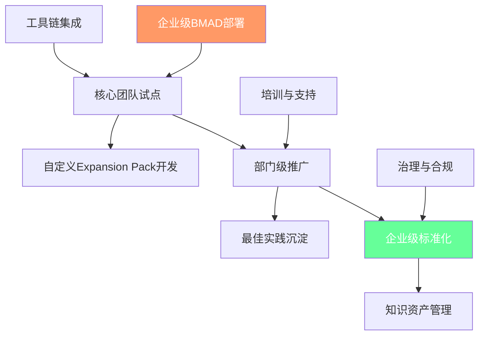
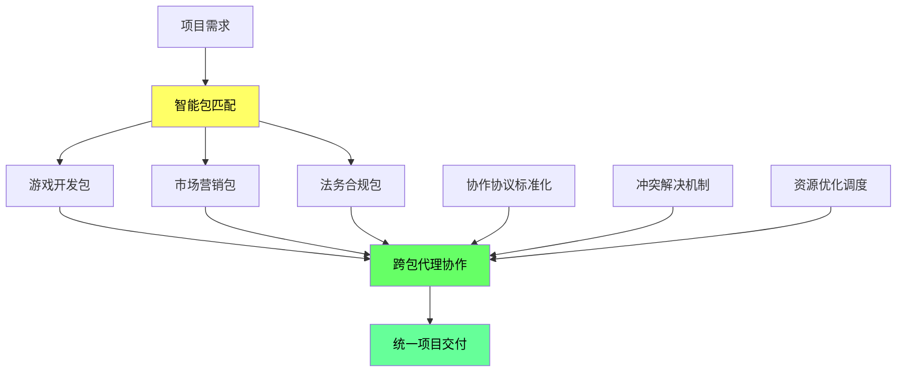

# BMAD-METHOD 高级应用与扩展创新

## 概述

在掌握了BMAD-METHOD的核心架构和模板系统后，我们进入框架的**高级应用领域**。这里蕴含着BMAD真正的革命性创新：**Expansion Packs机制**和**AI Agent协作优化**。这些高级特性将BMAD从一个软件开发框架提升为**通用的专业知识工业化平台**。

**本文核心主题**：
- **知识工程的工业化实现** - Expansion Packs如何标准化专业知识
- **多智能体协作优化** - AI代理协作的创新机制与最佳实践
- **企业级部署策略** - 大规模组织中的实施方案
- **未来发展趋势** - BMAD生态系统的演进方向

---

## 🌟 第一部分：Expansion Packs - 知识工程的工业化突破

### 核心创新：从代码复用到知识封装

BMAD的Expansion Packs不是传统意义上的插件系统，而是**专业知识的工业化生产标准**。它解决了一个根本性问题：**如何将人类专家的隐性知识转化为AI可执行的显性流程**。



### 完整生态系统架构

每个Expansion Pack都是一个**完整的微BMAD系统**：

```
expansion-pack/
├── config.yaml              # 包配置与版本管理
│   ├── name: bmad-2d-unity-game-dev
│   ├── version: 1.5.0
│   ├── slashPrefix: bmad2du  # 命名空间隔离
│   └── author: 专业贡献者
├── agents/                   # 专业代理定义
│   ├── game-designer.md     # Alex - 游戏设计专家
│   ├── game-architect.md    # 技术架构专家
│   └── game-developer.md    # Unity开发专家  
├── tasks/                    # 工作任务流程
│   ├── game-design-brainstorming.md
│   └── create-game-story.md
├── templates/                # 领域特定模板
│   ├── game-design-doc-tmpl.yaml
│   └── level-design-doc-tmpl.yaml
├── checklists/              # 质量保证清单
│   ├── game-design-checklist.md
│   └── game-story-dod-checklist.md
├── workflows/               # 端到端工作流程
│   ├── game-dev-greenfield.yaml
│   └── game-prototype.yaml
├── agent-teams/             # 代理团队配置
│   └── unity-2d-game-team.yaml
└── data/                    # 领域知识库
    ├── bmad-kb.md           # 专业知识库
    └── development-guidelines.md
```

### 实际案例：Unity游戏开发包深度解析

#### 专业代理的知识编码化

**Alex (Game Designer)** - 游戏设计专家数字化身：
```yaml
persona:
  role: Expert Game Designer & Creative Director
  style: Creative, player-focused, systematic, data-informed
  core_principles:
    - Player-First Design: 每个机制都为玩家参与和乐趣服务
    - Checklist-Driven Validation: 严格应用game-design-checklist
    - Document Everything: 清晰规范使开发团队能够正确实施
    - Iterative Design: 原型-测试-优化的系统方法
```

#### 游戏设计文档模板的专业化

**202行的game-design-doc-tmpl.yaml**包含：
- **游戏支柱定义**：3-5个指导所有设计决策的核心原则
- **核心游戏循环**：30-60秒玩家重复操作的精确定义
- **Unity组件映射**：每个游戏机制对应具体Unity实现
- **技术约束整合**：性能目标、平台要求、构建配置

```yaml
sections:
  - id: core-gameplay-loop
    instruction: 定义玩家将重复的30-60秒循环，具体到时间和Unity组件
    template: |
      Primary Loop ({{duration}} seconds):
      1. {{action_1}} ({{time_1}}s) - {{unity_component}}
      2. {{action_2}} ({{time_2}}s) - {{unity_component}}
      3. {{feedback}} ({{time_3}}s) - {{unity_feedback_system}}
```

### DevOps基础设施包：15年经验的系统化

**Alex (DevOps Platform Engineer)** 封装了企业级基础设施专业知识：

```yaml
core_principles:
  - Infrastructure as Code: 声明式方法，版本控制一切，确保可重复性
  - Automation First: 自动化重复任务、部署和运维程序
  - Reliability & Resilience: 为故障而设计，构建容错和高可用系统
  - Security & Compliance: 每层嵌入安全性，实施最小权限原则
  - Observability & Monitoring: 实施全面日志记录、监控和跟踪
```

**专业模板体系**：
- `infrastructure-architecture-tmpl.yaml`: 基础设施架构设计
- `infrastructure-platform-from-arch-tmpl.yaml`: 从架构到平台实现

### 革命性价值主张

#### 1. 专业知识的民主化
**打破专业壁垒，让专家知识人人可用**：
- **15年DevOps经验** → 基础设施自动化包
- **资深游戏设计师经验** → Unity游戏开发包
- **企业级架构师经验** → 系统设计包

#### 2. 知识传承的标准化
**解决传统知识传承的三大难题**：
- **显性知识**：通过模板、检查清单、工作流程标准化
- **隐性知识**：将专业判断、最佳实践编码为决策树
- **程序化知识**：建立标准化的可重复执行流程

#### 3. 创新的可扩展生态


### 创建自定义Expansion Pack

#### 设计原则与最佳实践

**Step 1: 领域专业知识分析**
```yaml
知识映射框架:
  显性知识: 
    - 标准流程和最佳实践
    - 工具使用和配置方法
    - 质量标准和检查清单
  隐性知识:
    - 专业判断和经验法则
    - 问题诊断和解决模式  
    - 权衡决策和风险管理
  程序化知识:
    - 标准化工作流程
    - 自动化脚本和工具
    - 集成和部署程序
```

**Step 2: 代理设计模式**
```yaml
代理设计标准:
  专业身份:
    - 明确的专业领域和经验水平
    - 真实的行业背景和资质
    - 一致的专业风格和沟通方式
  决策框架:
    - 优先级层次结构
    - 风险评估标准
    - 质量保证原则
  能力边界:
    - 明确的专业能力范围
    - 清晰的局限性声明
    - 协作和升级机制
```

**Step 3: 模板工程化**
```yaml
模板设计原则:
  交互式设计:
    - elicit: true 强制用户参与
    - 渐进式复杂性管理
    - 智能默认值和建议
  结构化输出:
    - YAML驱动的格式控制
    - 一致的文档结构
    - 版本控制友好格式
  领域特定优化:
    - 专业术语和最佳实践
    - 行业标准和合规要求
    - 工具链集成考虑
```

---

## 🤖 第二部分：AI Agent协作优化 - 多智能体系统的创新实践

### 四大协作创新机制

#### 1. 动态角色转换系统

**BMad Orchestrator的智能调度引擎**：


**核心技术特性**：
```yaml
transformation:
  - 85% confidence threshold    # 智能匹配阈值
  - Fuzzy matching enabled     # 模糊匹配支持
  - Context preservation       # 上下文状态保持
  - Resource lazy loading      # 资源懒加载优化

loading_strategy:
  - KB: Only for *kb-mode or BMad questions
  - Agents: Only when transforming
  - Templates/Tasks: Only when executing  
  - Performance: <2s response time target
```

**性能优化策略**：
- **内存效率**：避免预加载，按需激活专业代理
- **响应时间**：单代理转换 <2秒，复杂协作 <10秒
- **上下文管理**：95%+信息保持率，无缝状态转换

#### 2. Party Mode：群体智能协作

**多代理协作的创新实现**：
```yaml
party_mode:
  command: "*party-mode"
  description: "Group chat with all agents"
  use_cases:
    - 复杂技术决策需要多专业领域输入
    - 项目retrospectives和团队回顾
    - 架构设计的多维度评估
    - 质量保证的全方位审查
```

**协作场景分析**：

**场景1: 复杂架构设计决策**
```
参与代理: PM + Architect + DevOps + Security + Frontend
协作模式: 并行输入 → 观点汇聚 → Orchestrator整合
决策流程: 需求分析 → 技术选型 → 风险评估 → 实施计划
```

**场景2: 项目质量评估**  
```
参与代理: QA + Security + Performance + UX + Backend
协作模式: 分工评估 → 标准化报告 → 综合建议
评估维度: 功能质量 + 安全性 + 性能 + 用户体验 + 技术债务
```

#### 3. 递进式协作链路优化

**经典工作流程的协作优化**：


**协作优化策略**：

**信息传递标准化**：
```yaml
handoff_protocols:
  analyst_to_pm:
    document: "docs/project-brief.md"
    validation: "项目简报完成检查清单"
    next_action: "创建PRD"
    
  architect_to_po:
    document: "docs/fullstack-architecture.md" 
    validation: "架构完整性检查"
    escalation: "PRD故事变更建议"
```

**上下文工程化传递**：
```yaml
context_engineering:
  dev_notes_requirements:
    - "必须包含架构文档的所有相关技术细节"
    - "源引用格式: [Source: architecture/{filename}.md#{section}]"
    - "技术决策必须有明确rationale"
    - "无法找到信息时明确声明: 'No specific guidance found'"
    
  information_integrity:
    - accuracy: ≥95% 技术信息传递准确率
    - completeness: 包含实施所需的完整上下文
    - traceability: 所有决策可追溯到源文档
```

#### 4. 智能冲突解决机制

**多层次冲突解决体系**：
```yaml
conflict_resolution:
  priority_hierarchy:
    1: "安全性考虑" 
    2: "可靠性要求"
    3: "性能标准"
    4: "功能需求"
    5: "便利性特性"
    
  domain_authority:
    - "专业领域内：专家代理优先级最高"
    - "跨领域冲突：升级到Orchestrator协调"
    - "重大分歧：提升到PO最终裁决"
    
  escalation_triggers:
    - "代理建议矛盾率 >20%"
    - "技术风险评级 ≥ HIGH"  
    - "资源冲突无法自动解决"
```

### 协作效率优化实践

#### 并行vs串行的智能选择

**决策矩阵**：
```yaml
parallel_collaboration:
  适用场景:
    - "文档创建的初期研究阶段"
    - "多维度独立质量检查"
    - "无依赖关系的开发任务"
  性能特征:
    - "时间效率: 60-70%提升"
    - "资源消耗: 高峰期消耗增加"
    - "冲突风险: 中等"

serial_collaboration:
  适用场景:
    - "有明确依赖关系的任务链"
    - "需要前序输出的工作"
    - "质量门禁和验收流程"  
  性能特征:
    - "信息准确性: 95%+"
    - "上下文保持: 最佳"
    - "协调复杂度: 低"
```

#### 协作性能监控

**关键性能指标(KPIs)**：
```yaml
collaboration_metrics:
  response_time:
    - single_agent: "<2s"
    - multi_agent: "<10s"  
    - party_mode: "<15s"
    
  quality_metrics:
    - context_preservation: "≥95%"
    - decision_consistency: "冲突率 <5%"
    - task_completion: "端到端成功率 ≥90%"
    
  efficiency_metrics:
    - resource_utilization: "内存使用 <500MB"
    - parallel_speedup: "60-70% 时间节省"
    - error_recovery: "<30s 故障恢复"
```

---

## 🏢 第三部分：企业级部署策略

### 大规模组织适配方案

#### 1. 分层部署模式



**阶段1: 核心团队试点(1-3个月)**
```yaml
pilot_phase:
  team_size: "5-10 核心开发者"
  scope: "1-2个中等复杂度项目"
  objectives:
    - "验证BMAD在现有技术栈中的适用性"
    - "识别组织特定的定制需求"
    - "建立初步的最佳实践"
  deliverables:
    - "试点项目成功交付"
    - "定制化配置和模板"
    - "培训材料和使用指南"
```

**阶段2: 部门级推广(3-6个月)**
```yaml
department_rollout:
  scope: "整个技术部门或事业部"
  prerequisites:
    - "试点项目验证成功"
    - "基础培训体系建立"
    - "工具链集成完成"
  expansion_packs:
    - "企业特定技术栈包"
    - "内部流程标准化包"
    - "合规性检查包"
```

**阶段3: 企业级标准化(6-12个月)**
```yaml
enterprise_standardization:
  governance:
    - "BMAD使用标准和规范"
    - "Expansion Pack审批流程"
    - "质量保证和安全审查"
  knowledge_management:
    - "企业知识库集中化"
    - "最佳实践标准化"
    - "跨部门经验共享"
```

#### 2. 自定义企业包开发

**企业特定Expansion Pack开发框架**：
```yaml
enterprise_pack_structure:
  name: "enterprise-{domain}-pack"
  components:
    agents:
      - enterprise-architect.md    # 企业架构标准
      - compliance-officer.md      # 合规性检查
      - security-auditor.md       # 安全审查专家
    templates:
      - enterprise-prd-tmpl.yaml  # 企业PRD标准
      - security-review-tmpl.yaml # 安全审查模板
    checklists:
      - enterprise-compliance-checklist.md
      - security-audit-checklist.md
    data:
      - enterprise-tech-standards.md
      - regulatory-requirements.md
```

#### 3. 治理与合规框架

**企业治理策略**：
```yaml
governance_framework:
  access_control:
    - "角色权限管理"
    - "敏感信息保护"
    - "审计日志记录"
    
  quality_assurance:
    - "代理输出审查机制"
    - "模板标准化验证"
    - "最佳实践合规检查"
    
  risk_management:
    - "AI决策透明化"
    - "人工监督机制"
    - "降级和回滚程序"
```

### 工具链生态集成

#### 开发环境集成
```yaml
development_integration:
  ide_support:
    - "VSCode Extension"
    - "IntelliJ Plugin"  
    - "Vim/Neovim Integration"
    
  version_control:
    - "Git Hooks集成"
    - "PR模板自动化"
    - "代码审查增强"
    
  ci_cd_pipeline:
    - "GitHub Actions Workflows"
    - "Jenkins Pipeline Integration"
    - "Azure DevOps Extensions"
```

#### 企业系统集成
```yaml
enterprise_integration:
  project_management:
    - "Jira集成"
    - "Azure Boards同步"
    - "Asana工作流集成"
    
  collaboration_tools:
    - "Microsoft Teams Bot"
    - "Slack App Integration"
    - "Discord Bot Support"
    
  documentation_systems:
    - "Confluence集成"
    - "SharePoint同步"
    - "Notion数据库集成"
```

---

## 🚀 第四部分：未来发展趋势与创新方向

### 技术演进趋势

#### 1. 智能化程度持续提升

**下一代AI代理特性**：
```yaml
next_generation_agents:
  adaptive_learning:
    - "从用户反馈中持续学习"
    - "自动优化协作模式"
    - "个性化工作流程调整"
    
  predictive_capabilities:
    - "项目风险预测"
    - "质量问题早期发现"
    - "资源需求智能预估"
    
  autonomous_optimization:
    - "自动代码重构建议"
    - "性能优化自动识别"
    - "安全漏洞主动检测"
```

#### 2. 跨域协作能力增强

**多Expansion Pack协作场景**：


#### 3. 商业化生态发展

**BMAD市场平台愿景**：
```yaml
marketplace_ecosystem:
  professional_packs:
    - "认证专业包"
    - "行业特定解决方案"  
    - "企业级支持服务"
    
  community_contributions:
    - "开源包共享"
    - "社区评分系统"
    - "协作开发模式"
    
  quality_assurance:
    - "自动化测试套件"
    - "性能基准测试"
    - "安全性审查认证"
```

### 应用领域扩展

#### 1. 传统行业数字化
```yaml
industry_expansion:
  manufacturing:
    - "生产流程优化包"
    - "质量控制自动化包"
    - "供应链管理包"
    
  healthcare:
    - "诊断辅助包"
    - "治疗方案优化包"
    - "医疗合规检查包"
    
  education:
    - "个性化学习路径包"
    - "教学质量评估包"  
    - "课程设计优化包"
```

#### 2. 新兴技术领域
```yaml
emerging_technologies:
  ai_ml:
    - "机器学习工程包"
    - "模型部署优化包"
    - "AI伦理审查包"
    
  blockchain:
    - "智能合约开发包"
    - "DeFi协议设计包"
    - "区块链安全审计包"
    
  iot:
    - "物联网系统设计包"
    - "边缘计算优化包"
    - "设备管理自动化包"
```

### 社会影响与价值

#### 1. 知识民主化效应
- **降低专业门槛**：让复杂专业知识变得可访问
- **加速技能提升**：通过AI导师实现快速学习
- **促进创新创业**：小团队获得企业级专业能力

#### 2. 教育模式变革
- **AI辅助教学**：个性化学习路径和实时反馈
- **实践导向学习**：通过项目实战掌握专业技能
- **终身学习支持**：持续技能更新和知识迭代

#### 3. 工作方式革命
- **人机协作增强**：AI处理程序性工作，人类专注创造性任务
- **远程协作优化**：AI代理弥补分布式团队协作差距
- **决策质量提升**：多专业AI代理提供全面决策支持

---

## 💡 总结：BMAD-METHOD的革命性意义

### 技术创新突破

**1. 知识工程的工业化实现**
- 将专家经验标准化为可复制的AI代理
- 建立专业知识的生产、分发、应用完整流程
- 实现隐性知识向显性知识的系统化转换

**2. 多智能体协作的创新实践**  
- Party Mode群体智能协作机制
- 动态角色转换和资源按需加载
- 智能冲突解决和协作优化

**3. 可扩展架构的标准化设计**
- Expansion Packs微生态系统架构
- 配置驱动的灵活扩展机制
- 跨领域知识整合和协作协议

### 方法论价值

**从工具到平台的跃迁**：
BMAD-METHOD不仅是一个开发工具，更是一个**知识工程平台**。它为将人类专业知识转化为AI可执行格式提供了完整的方法论和工具链。

**AI时代的协作范式**：
通过标准化的代理协作机制，BMAD建立了人机协作的新范式，让AI真正成为可靠、可预测的专业合作伙伴。

**知识资产的价值重塑**：
专业知识从个人财富转变为可共享、可复用的数字资产，推动整个社会的知识流动和价值创造。

### 实践指导

**学习建议**：
1. **从核心掌握**：先理解架构和模板系统
2. **实践验证**：通过实际项目验证BMAD价值
3. **逐步扩展**：根据需求选择合适的Expansion Packs
4. **贡献生态**：参与社区建设和知识分享

**应用策略**：
1. **试点先行**：选择合适项目进行小规模验证
2. **渐进推广**：基于试点成功经验逐步扩大应用范围
3. **定制开发**：根据组织特色开发专属Expansion Packs
4. **持续优化**：基于使用反馈持续改进和优化

---

**结语**：BMAD-METHOD代表了AI辅助开发领域的一次重要突破。它不仅提供了强大的技术工具，更重要的是建立了一套完整的方法论，为AI时代的知识工程和协作模式奠定了基础。随着技术的持续演进和生态的不断完善，BMAD有望成为连接人类智慧与AI能力的重要桥梁，推动整个软件开发行业乃至更广泛领域的数字化转型。

*在这个AI快速发展的时代，掌握BMAD-METHOD不仅是技术能力的提升，更是对未来工作方式的前瞻性准备。让我们拥抱这个充满可能性的未来，用系统化的方法和工具，创造更加智能、高效、可靠的数字化解决方案。*