# BMAD-METHOD Advanced Elicitation 系统深度解析

## 概述

BMAD-METHOD的**Advanced Elicitation**系统代表了人机协作领域的一次重大创新突破。它不仅仅是一个反馈收集机制，而是一个**认知增强引擎**，将专家级的批判性思维过程标准化、工具化，并通过智能化的上下文适应机制，实现了从"内容生成"到"认知协作"的范式转变。

### 🚀 核心创新价值

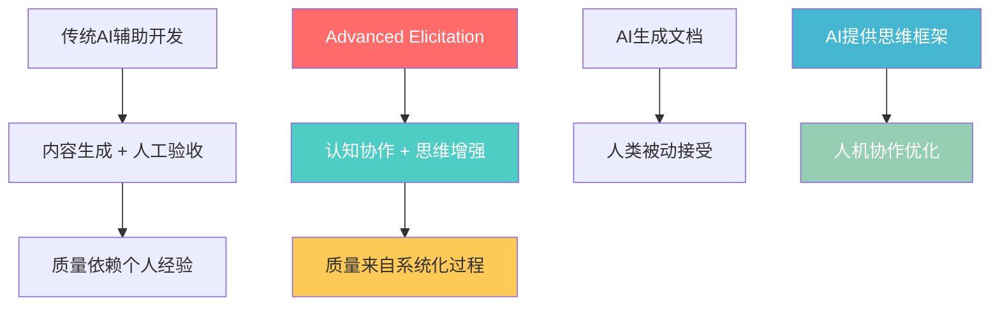

**革命性意义**：
- **认知民主化**：将专家级思维模式转化为结构化工具，让初级工程师也能应用资深专家的认知框架
- **质量系统化**：高质量输出从"靠天赋"变成"可复制"的系统性过程
- **人机共创**：创造了"增强式对话"的新模式，实现真正的思维伙伴关系

---

## 🧠 认知科学基础与设计哲学

### 核心设计原理

Advanced Elicitation的设计基于三大认知科学原理：

#### 1. 元认知激活原理
```yaml
问题: 人们往往满足于第一个"还可以"的解决方案
解决: 通过结构化的反思框架，激活更深层的思考过程
实现: 27种不同的认知模式，覆盖批判性思维的各个维度
```

#### 2. 认知负荷平衡原理
```yaml
问题: 选择悖论 - 太多选项导致决策瘫痪，太少选项缺乏灵活性
解决: 动态选择9个最相关方法，实现认知负荷和选择灵活性的最佳平衡
实现: 智能上下文分析 + 预定义方法池
```

#### 3. 专业认知框架激活原理
```yaml
问题: 不同专业背景的人思维模式和关注点不同
解决: 基于BMAD角色系统，从专业视角执行elicitation方法
实现: Persona-Pattern Hybrid技术
```

### 人机交互哲学

**核心理念**：*AI不是执行工具，而是思维伙伴*

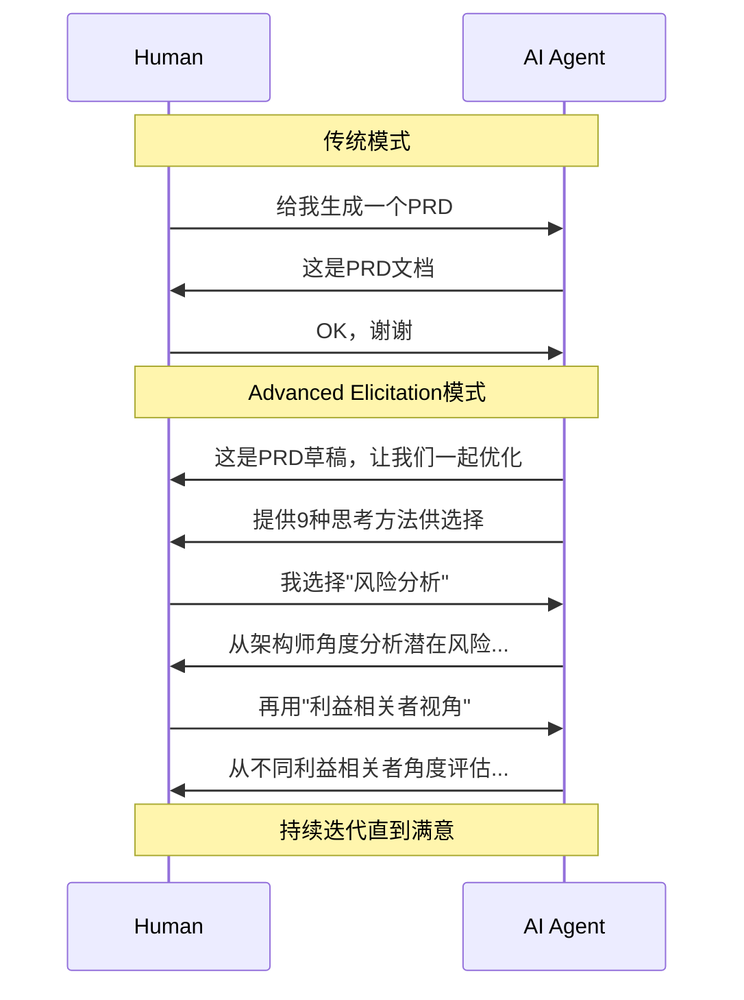

---

## 🔬 27种Elicitation方法深度分类

基于认知科学和系统思维理论，27种方法可以划分为7大认知类别：

### 类别1：反思性思维方法 (Reflective Thinking)

**核心价值**：激活元认知过程，让隐性思维显性化

| 方法 | 认知机制 | 适用场景 | 专业应用 |
|------|----------|----------|----------|
| **Expand or Contract for Audience** | 认知负荷理论 | 文档调优 | 技术文档的受众适配 |
| **Explain Reasoning (CoT)** | 元认知策略 | 复杂决策 | 架构选择的推理过程 |
| **Critique and Refine** | 批判性思维 | 质量提升 | 代码审查和优化 |

```python
# 认知心理学原理：工作记忆容量限制
def expand_or_contract(content, audience_expertise):
    if audience_expertise == "expert":
        return add_technical_details(content)
    elif audience_expertise == "beginner":  
        return simplify_and_add_examples(content)
    return content
```

### 类别2：结构化分析方法 (Structural Analysis)

**核心价值**：系统性思维和逻辑一致性检验

| 方法 | 系统思维应用 | 质量保证机制 |
|------|-------------|-------------|
| **Analyze Logical Flow and Dependencies** | 因果关系映射 | 逻辑一致性验证 |  
| **Assess Alignment with Goals** | 目标-手段分析 | 价值对齐检查 |

### 类别3：风险识别与挑战性思维 (Risk & Challenge Thinking)

**核心价值**：前瞻性思维和对立面思考

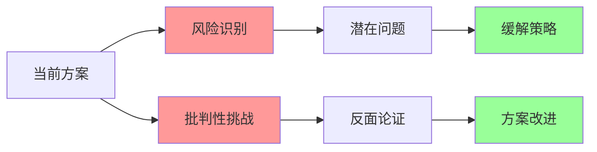

### 类别4：创新探索方法 (Creative Exploration)

**突破性创新**：将最新AI推理技术转化为人机协作工具

#### Tree of Thoughts Deep Dive 的巧妙转化

```yaml
原始技术: AI内部推理增强
转化应用: 人机协作思维工具
核心机制:
  - "Break problem into discrete thoughts" → 帮助人类结构化思考
  - "Explore multiple reasoning paths" → 鼓励发散思维  
  - "Use self-evaluation" → 引导批判性评估
  - "Apply search algorithms" → 提供系统性探索方法
```

#### Hindsight Reflection 的时间维度思维

这种"如果早知道..."的反思机制，激活了**时间维度的批判性思维**：
- 模拟未来回望现在的视角
- 识别当前决策的潜在盲点
- 提取可操作的预防性洞察

### 类别5：多视角协作方法 (Multi-Perspective Collaboration)

**核心创新**：将BMAD的专业角色系统与认知工具结合

#### Agile Team Perspective Shift
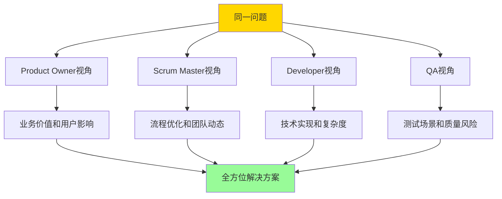

#### Persona-Pattern Hybrid 的创新突破

这可能是最具创新性的方法，实现了**专业认知框架的动态激活**：

```python
class PersonaPatternHybrid:
    def execute(self, content, persona, pattern):
        # 专业认知框架激活
        cognitive_framework = self.load_persona_framework(persona)
        
        # 应用特定elicitation模式
        enhanced_perspective = pattern.apply(
            content, 
            cognitive_lens=cognitive_framework
        )
        
        return enhanced_perspective
    
    def examples(self):
        return {
            "Architect + Risk Analysis": "深度技术风险评估",
            "UX Expert + User Journey": "端到端体验批判", 
            "PM + Stakeholder Analysis": "多角度影响分析"
        }
```

### 类别6：2025年先进技术 (Advanced 2025 Techniques)

#### ReWOO的哲学应用

原始ReWOO是为了减少API调用，这里转化为**思维优化哲学**：

```yaml
核心转化:
  "Separate parametric reasoning from tool-based actions" 
  → "区分纯思考和需要外部信息的部分"
  
  "Create reasoning plan without external dependencies"
  → "先用现有知识深度思考"

实际价值: 教导"先想清楚再行动"的工程思维
```

#### Self-Consistency Validation

多路径推理一致性检验，确保解决方案的稳健性：

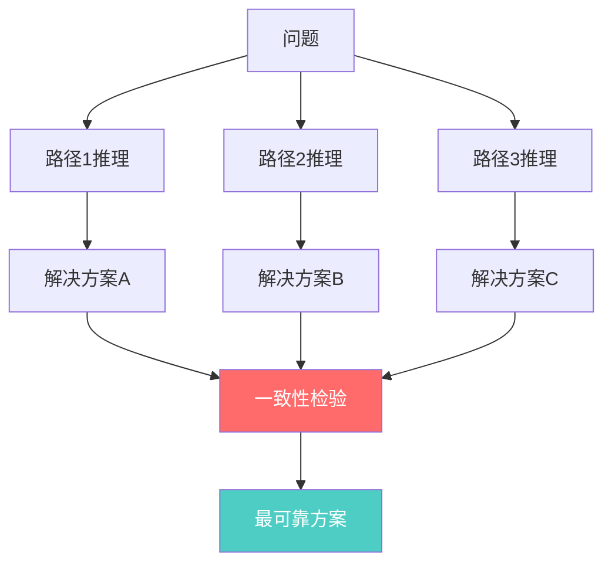

### 类别7：游戏化方法 (Gamification Methods)

**设计洞察**：游戏化的本质不是"让工作更有趣"，而是**激活不同的认知模式**

#### Red Team vs Blue Team - 对立性思维制度化

```yaml
Red Team认知模式:
  - 主动寻找漏洞和弱点
  - 挑战基本假设
  - 探索边界条件和异常情况

Blue Team认知模式:  
  - 防御和完善现有方案
  - 强化系统稳定性
  - 优化正常流程

协作价值: 对抗性设计发现单一视角的认知盲点
```

#### Innovation Tournament - 竞争性创新

比传统头脑风暴更系统的创新方法：
- 多方案并行生成
- 多维度量化评估
- 优势特性组合

#### Escape Room Challenge - 约束性创新

在限制条件下的创意解决方案：
- 资源受限场景的优化
- 最小可行方案识别
- 创新工作环境发现

---

## ⚙️ 智能选择算法与上下文适应机制

### 上下文分析的五维模型

```python
class ContextAnalyzer:
    def analyze_context(self, content):
        context = {
            'content_type': self.identify_content_type(content),      # 技术规范/用户故事/架构文档
            'complexity_level': self.assess_complexity(content),     # 简单/中等/复杂  
            'stakeholder_needs': self.identify_stakeholders(content), # 开发者/用户/管理层
            'risk_level': self.assess_risk_impact(content),          # 低/中/高风险
            'creative_potential': self.assess_innovation_space(content) # 创新机会评估
        }
        return context
```

### 方法选择的智能决策树

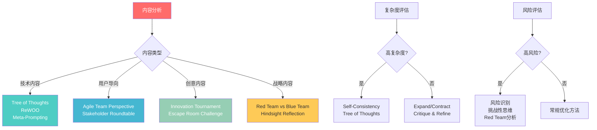

### 动态方法组合策略

**核心原则**：
1. **始终包含3-4个核心方法**（质量基础保证）
2. **根据上下文选择4-5个特定方法**（针对性价值提供）  
3. **始终包含"Proceed"选项**（用户自主权尊重）

```python
class MethodSelector:
    CORE_METHODS = [
        "expand_or_contract_for_audience",
        "critique_and_refine", 
        "identify_potential_risks",
        "assess_alignment_with_goals"
    ]
    
    CONTEXT_SPECIFIC_METHODS = {
        'technical': ['tree_of_thoughts', 'rewoo', 'meta_prompting'],
        'user_facing': ['agile_team_perspective', 'stakeholder_roundtable'],
        'creative': ['innovation_tournament', 'escape_room_challenge'],
        'strategic': ['red_team_vs_blue_team', 'hindsight_reflection']
    }
    
    def select_methods(self, context):
        # 智能选择算法
        selected = self.select_core_methods(3, 4)
        selected.extend(
            self.select_context_specific_methods(context, 4, 5)
        )
        selected.append("proceed_no_further_actions")
        return selected[:9]  # 确保总数为9
```

---

## 🔄 人机交互流程设计

### 极简交互原则的认知科学基础

**认知摩擦最小化**：用户只需输入0-9数字，这符合人类工作记忆的容量限制（7±2原则）。

### 连续对话流的系统设计

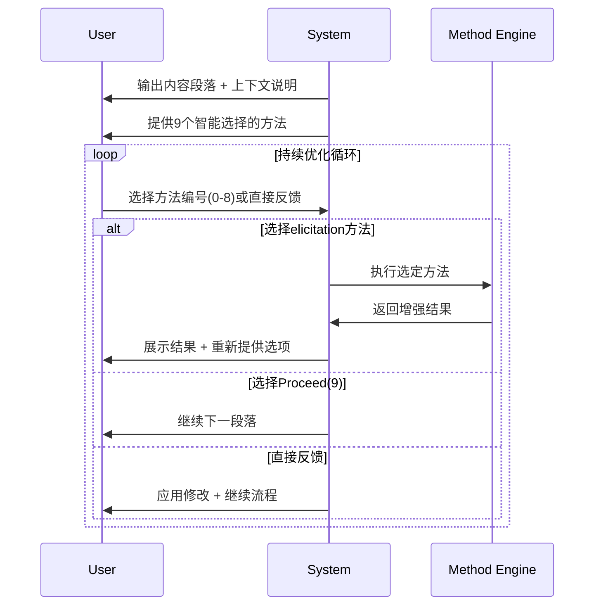

### 双轨反馈机制

**设计智慧**：解决结构化工具的过度约束问题

```yaml
结构化路径: 
  优势: 提供认知框架，保证思考全面性
  限制: 可能约束用户的自由思维

自由路径:
  优势: 保持用户创造力和直觉
  限制: 可能遗漏重要的思考维度

双轨设计:
  - 用户可以自由切换两种模式
  - 结构化方法提供思维启发
  - 直接反馈保持灵活性
```

### 状态保持与认知环境一致性

**心理学原理**：认知环境的一致性降低认知负荷，提高思维效率。

每次elicitation后保持同样的9个选项，避免用户重新学习界面，专注于思维内容本身。

---

## 🏗️ 与BMAD架构的深度集成

### 在系统架构中的定位

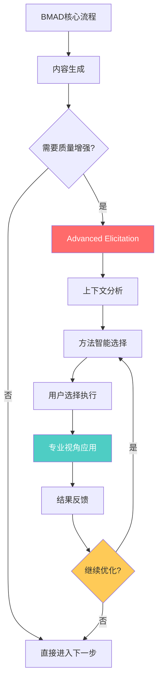

### 质量门控系统

Advanced Elicitation作为**可选的质量增强层**：
- **非阻塞设计**：主流程不依赖它也能正常完成
- **按需激活**：用户可以根据需要选择使用
- **持续改进**：提供结构化的质量提升路径

### 跨代理协作的认知桥梁

```python
class BMadAgent:
    def execute_elicitation(self, method, content):
        # 从专业角色视角执行elicitation
        professional_lens = self.get_professional_perspective()
        enhanced_result = method.execute(
            content, 
            expertise=professional_lens
        )
        return enhanced_result

class ArchitectAgent(BMadAgent):
    def get_professional_perspective(self):
        return {
            'focus_areas': ['scalability', 'maintainability', 'technical_debt'],
            'risk_sensitivity': 'high',
            'time_horizon': 'long_term'
        }

class PMAgent(BMadAgent):  
    def get_professional_perspective(self):
        return {
            'focus_areas': ['business_value', 'user_needs', 'market_fit'],
            'risk_sensitivity': 'medium',  
            'time_horizon': 'short_to_medium_term'
        }
```

### 从文档生成到知识创造的转变

**传统模板系统**：
```
用户需求 → 模板填空 → 标准化文档
```

**Advanced Elicitation增强**：
```
用户需求 → 初始文档 → 结构化思考 → 深度优化 → 知识创造
```

这种转变的核心价值：
- **质量跃升**：从"符合规范"到"经过多维优化"
- **知识积累**：每次elicitation都是学习过程
- **创新激发**：结构化框架释放创造力

---

## 🧪 实际应用场景深度分析

### 场景1：技术架构设计优化

**初始输出**：系统架构文档草稿

**Advanced Elicitation应用路径**：
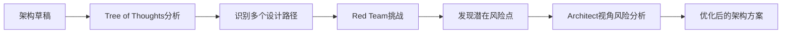

**实际价值**：
- 从单一方案进化为经过多路径验证的稳健架构
- 提前识别扩展性和维护性问题
- 融入多个专业视角的平衡考虑

### 场景2：产品需求文档（PRD）完善

**PM Agent + Stakeholder Roundtable**：

```yaml
初始PRD: 基本功能描述和业务目标
应用Stakeholder Roundtable:
  - Product Owner视角: 用户价值最大化
  - Developer视角: 技术实现复杂度
  - UX Expert视角: 用户体验一致性  
  - QA视角: 测试覆盖率和质量风险
  
最终PRD: 平衡各方关切的综合方案
```

### 场景3：游戏设计文档创新优化

**领域适应性体现**：
- Unity/Phaser特定的技术约束考虑
- 游戏机制的玩家体验影响分析
- 关卡设计的难度曲线优化

```python
# 领域特定的上下文适应
game_context = {
    'player_engagement': 'primary_concern',
    'technical_constraints': 'unity_specific',
    'creative_potential': 'high',
    'iteration_speed': 'critical'
}

selected_methods = method_selector.select_for_game_design(game_context)
# 输出: ['innovation_tournament', 'escape_room_challenge', 
#        'player_journey_analysis', 'technical_feasibility_check']
```

---

## 🔮 未来发展趋势与技术演进

### 技术发展方向

#### 1. AI辅助方法选择的进化

**当前**：基于规则的智能选择
**未来**：机器学习优化的个性化推荐

```python
class AdvancedMethodRecommender:
    def __init__(self):
        self.user_preference_model = UserPreferenceModel()
        self.effectiveness_tracker = EffectivenessTracker()
        
    def recommend_methods(self, context, user_history):
        # 基于用户历史和效果反馈的个性化推荐
        base_recommendations = self.context_analyzer.analyze(context)
        
        # 个性化调整
        personalized = self.user_preference_model.adapt(
            base_recommendations, user_history
        )
        
        # 效果预测
        predicted_effectiveness = self.effectiveness_tracker.predict(
            personalized, context
        )
        
        return self.optimize_selection(personalized, predicted_effectiveness)
```

#### 2. 跨领域方法迁移

**扩展包生态的方法共享**：
- 游戏设计中的创新方法 → 产品设计
- 基础设施的风险分析 → 金融系统设计
- 教育领域的认知方法 → 企业培训

#### 3. 多模态elicitation支持

```yaml
文本elicitation: 当前核心能力
图像elicitation: 架构图、流程图的可视化分析
音频elicitation: 会议记录和讨论的结构化分析  
交互elicitation: 原型和demo的体验式改进
```

### 认知科学前沿的应用

#### 分布式认知理论的实现

**概念**：团队智能不是个体智能的简单相加，而是通过工具和流程的中介实现的分布式认知系统。

**Advanced Elicitation的角色**：
- 认知工具：结构化的思维框架
- 流程中介：标准化的协作模式  
- 集体智能：多视角融合的解决方案

#### 元学习（Learning to Learn）的集成

```python
class MetaLearningElicitation:
    def learn_elicitation_patterns(self, historical_sessions):
        """从历史会话中学习有效的elicitation模式"""
        effective_patterns = self.extract_successful_sequences(
            historical_sessions
        )
        
        self.update_method_combination_strategies(effective_patterns)
        self.personalize_interaction_flows(effective_patterns)
        
    def adapt_to_user_learning_style(self, user_profile):
        """适应用户的学习和思维偏好"""
        if user_profile.cognitive_style == 'analytical':
            return self.prefer_systematic_methods()
        elif user_profile.cognitive_style == 'creative':  
            return self.prefer_divergent_methods()
```

### 企业级应用的扩展

#### 知识管理系统的革命

**传统知识管理**：
```
专家知识 → 文档 → 知识库 → 搜索使用
```

**Advanced Elicitation增强**：
```
专家知识 → 结构化elicitation → 认知工具包 → 主动知识创造
```

#### 团队协作模式的变革

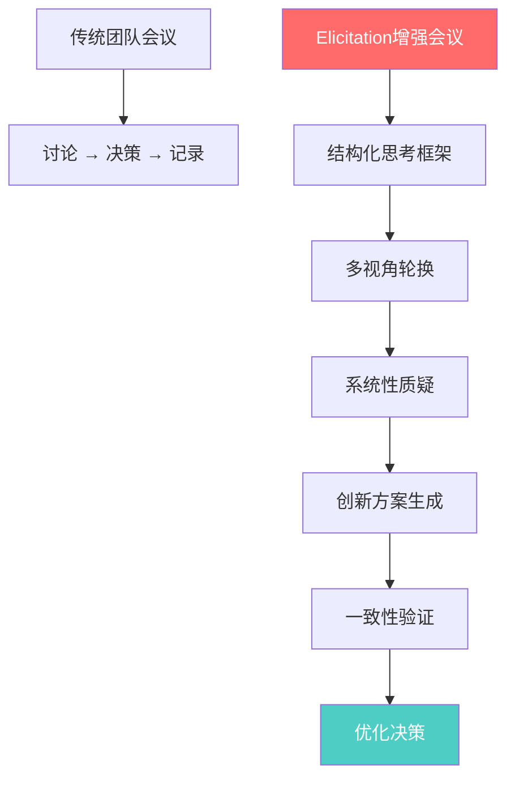

---

## 📊 效果评估与质量度量

### 定量评估指标

```python
class ElicitationEffectivenessMetrics:
    def measure_quality_improvement(self, before_content, after_content):
        return {
            'completeness_score': self.assess_completeness(before_content, after_content),
            'coherence_improvement': self.measure_logical_coherence(before_content, after_content), 
            'risk_coverage': self.evaluate_risk_identification(before_content, after_content),
            'stakeholder_alignment': self.check_multi_perspective_coverage(before_content, after_content),
            'innovation_index': self.measure_creative_enhancement(before_content, after_content)
        }
    
    def measure_user_engagement(self, session_data):
        return {
            'session_length': session_data.duration,
            'method_diversity': len(session_data.used_methods),
            'iteration_depth': session_data.refinement_cycles,
            'satisfaction_score': session_data.user_feedback.satisfaction
        }
```

### 定性评估维度

#### 认知增强效果
- **思维深度**：是否发现了初始方案的盲点？
- **视角多样性**：是否融入了多个专业角度？
- **创新突破**：是否产生了意料之外的洞察？

#### 用户体验质量
- **学习效应**：用户是否掌握了新的思维工具？
- **效率提升**：相比传统方法，时间和质量的权衡如何？
- **满意度**：用户对协作过程和结果的主观评价？

### 长期价值追踪

```yaml
个人成长指标:
  - 批判性思维能力提升
  - 多视角思考习惯养成
  - 结构化分析技能发展

团队协作指标:
  - 讨论质量改善  
  - 决策速度和质量平衡
  - 集体智慧涌现频率

组织知识指标:
  - 知识创造速度
  - 最佳实践沉淀
  - 创新能力增强
```

---

## 💡 设计洞察与最佳实践

### 核心设计智慧

#### 1. 认知摩擦最小化原则

**洞察**：最强大的工具应该是最容易使用的工具。

**实现**：
- 数字选择比文本输入更直观
- 9个选项是认知负荷的最佳平衡点  
- 连续对话流保持思维连贯性

#### 2. 专业认知的激活机制

**洞察**：不同专业背景的人有不同的思维框架，同样的方法在不同专业视角下会产生不同的洞察。

**实现**：
```python
def execute_method_with_professional_lens(method, content, agent_role):
    # 激活专业认知框架
    cognitive_framework = PROFESSIONAL_FRAMEWORKS[agent_role]
    
    # 应用专业过滤器
    filtered_content = cognitive_framework.filter(content)
    
    # 执行方法
    result = method.execute(filtered_content)
    
    # 专业视角解读
    professional_insight = cognitive_framework.interpret(result)
    
    return professional_insight
```

#### 3. 结构化与自由度的平衡

**挑战**：结构化工具有约束思维的风险，完全自由又缺乏引导。

**解决方案**：双轨设计
- 结构化路径：提供思维框架和工具
- 自由路径：保持用户的创造性表达
- 动态切换：用户可以随时在两种模式间转换

### 实施最佳实践

#### 团队层面

```yaml
引入策略:
  - 从愿意尝试的早期采用者开始
  - 选择中等复杂度的项目进行试点
  - 建立反馈收集和改进机制

培训重点:
  - 强调"思维伙伴"而非"工具使用"的理念
  - 通过实际案例展示不同方法的价值
  - 鼓励方法组合和创新应用

成功指标:
  - 用户主动使用频率
  - 输出质量的客观改善  
  - 团队协作效率提升
```

#### 技术层面

```python
class BestPracticeImplementation:
    def optimize_method_selection(self):
        # 基于历史数据优化方法推荐
        pass
        
    def personalize_interaction(self, user_profile):
        # 根据用户偏好调整交互方式
        pass
        
    def enhance_feedback_loop(self):
        # 改进效果反馈和学习机制
        pass
        
    def expand_method_library(self):
        # 持续扩展和优化方法库
        pass
```

---

## 🎯 结论：范式转变的深远影响

### 对软件开发方法论的影响

Advanced Elicitation代表了软件开发方法论的一次深刻变革：

**从瀑布到敏捷**：关注流程优化和迭代改进
**从敏捷到智能协作**：引入AI增强的认知协作

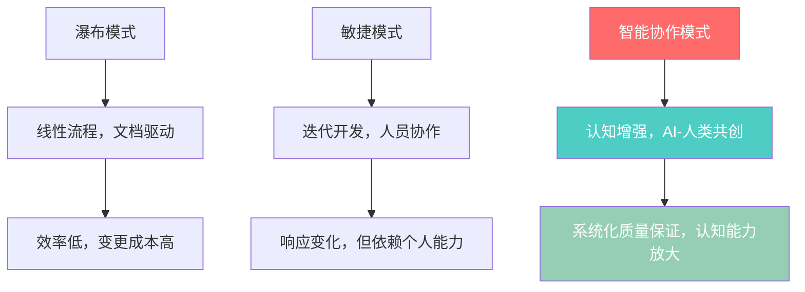

### 对人机协作模式的启示

**传统人机关系**：人类指挥，AI执行
**Advanced Elicitation模式**：AI提供认知工具，人机共同思考

这种变化的深远意义：
- **能力增强而非替代**：AI成为思维放大器
- **创造性协作**：产生1+1>2的协同效应
- **学习型互动**：每次协作都提升双方能力

### 对知识工作的变革潜力

```yaml
知识创造模式变革:
  传统模式: 个人经验 + 直觉判断
  新模式: 结构化认知工具 + 系统性流程
  
质量保证方式变革:
  传统模式: 事后审查 + 专家经验  
  新模式: 过程中持续优化 + 多维度验证
  
学习成长方式变革:
  传统模式: 经验积累 + 试错学习
  新模式: 结构化反思 + 工具化沉淀
```

### 未来展望

Advanced Elicitation可能只是开始。我们正在见证一种新的工作模式的萌芽：

**认知工具化时代**：
- 专家的思维模式被结构化为可复用的工具
- AI不再只是自动化工具，而是认知协作伙伴
- 知识工作从个体技能转向系统化能力

**人机共生的未来**：
- 每个专业领域都有自己的认知工具包
- AI持续学习和优化这些工具
- 人类专注于创造性思维和价值判断

**质量民主化**：
- 高质量不再是少数专家的特权
- 结构化过程保证了可复制的优秀结果
- 创新能力通过系统性方法得到释放

---

## 📚 参考资料与延伸阅读

### 认知科学基础
- Miller, G.A. (1956). "The magical number seven, plus or minus two" - 工作记忆容量理论
- Kahneman, D. (2011). "Thinking, Fast and Slow" - 双系统认知理论
- Sweller, J. (1988). "Cognitive load during problem solving" - 认知负荷理论

### 人机交互设计
- Norman, D. (1988). "The Design of Everyday Things" - 用户体验设计原则
- Clark, A. & Chalmers, D. (1998). "The Extended Mind" - 分布式认知理论

### AI推理技术
- Yao, S. et al. (2023). "Tree of Thoughts: Deliberate Problem Solving with Large Language Models"
- Xu, B. et al. (2023). "ReWOO: Decoupling Reasoning from Observations for Efficient Augmented Language Models"

### 系统思维与设计
- Senge, P. (1990). "The Fifth Discipline" - 系统思维方法
- Alexander, C. (1977). "A Pattern Language" - 模式化设计思想

---

*Advanced Elicitation系统深度解析 - 认知增强与人机协作的未来*

**文档版本**：v1.0  
**创建时间**：2024年  
**更新时间**：持续更新中  

*本文档旨在为BMAD-METHOD的Advanced Elicitation系统提供全面而深入的技术分析，为开发者、研究者和实践者理解和应用这一创新系统提供指导。*