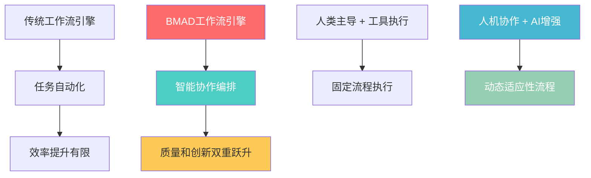
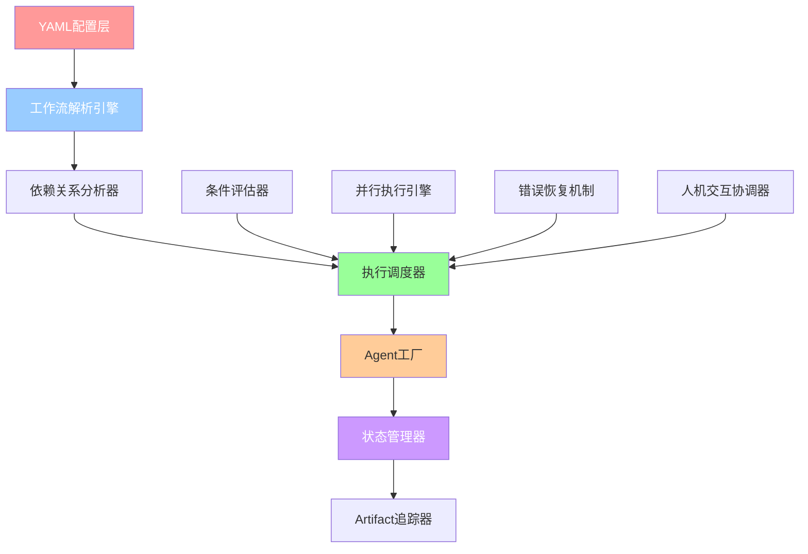
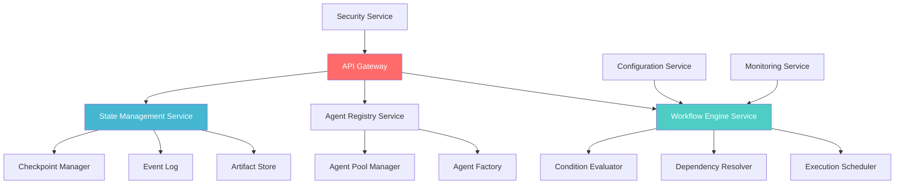
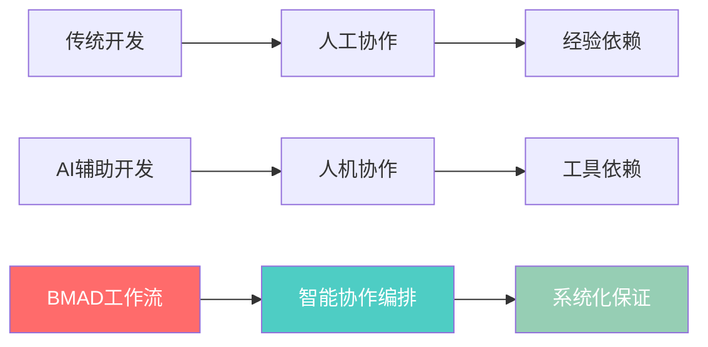

# YAML驱动工作流引擎深度解析 - BMAD核心调度系统源码研究

## 概述

BMAD-METHOD的YAML驱动工作流引擎是整个框架的**核心调度大脑**，代表了AI辅助软件开发领域的一次革命性创新。它不是传统意义上的工作流引擎，而是专为**AI Agent协作**设计的声明式编排系统，实现了从"工具辅助人类"到"人机协作伙伴"的根本性转变。

### 🌟 核心创新价值



**革命性突破**：
- **AI-Native架构**：专为AI Agent协作从零设计，而非传统工作流的AI改造
- **声明式复杂性管理**：通过YAML配置优雅抽象极其复杂的多Agent协作流程
- **知识工程工业化**：将软件开发流程标准化、可配置化、可复用化

---

## 🏗️ 技术架构深度分析

### 核心组件架构



### 声明式工作流定义架构

基于对`greenfield-fullstack.yaml`、`brownfield-fullstack.yaml`等核心工作流文件的深度分析，BMAD工作流引擎采用了高度结构化的声明式定义：

```yaml
# 工作流元数据层
workflow:
  id: greenfield-fullstack
  name: Greenfield Full-Stack Application Development
  type: greenfield
  project_types: [web-app, saas, enterprise-app]
  
# 执行序列定义层  
sequence:
  - agent: analyst                    # 执行者角色
    creates: project-brief.md         # 产出artifact
    optional_steps:                   # 可选子步骤
      - brainstorming_session
      - market_research_prompt
    notes: "执行指导信息"
    
  - agent: pm
    creates: prd.md
    requires: project-brief.md        # 依赖前置条件
    condition: some_condition         # 执行条件
    
# 可视化流程图  
flow_diagram: |
  ```mermaid
  graph TD
    A[Start] --> B[analyst: project-brief.md]
    B --> C[pm: prd.md]
  ```
  
# 交互模板
handoff_prompts:
  analyst_to_pm: "标准化的Agent间交互协议"
```

### 核心技术实现原理

#### 1. **Agent协作协议**

```javascript
// 推测的核心实现架构
class WorkflowEngine {
  constructor() {
    this.state = new WorkflowState();           // 全局状态管理
    this.agentFactory = new AgentFactory();     // Agent实例工厂
    this.dependencyResolver = new DependencyResolver(); // 依赖关系解析
    this.conditionEvaluator = new ConditionEvaluator(); // 条件判断引擎
  }
  
  async executeWorkflow(workflowConfig) {
    // 1. 解析YAML配置构建执行图
    const executionGraph = this.buildExecutionGraph(workflowConfig.sequence);
    
    // 2. 依赖关系分析和拓扑排序
    const executionOrder = this.dependencyResolver.resolve(executionGraph);
    
    // 3. 状态机驱动的执行循环
    while (!this.state.isComplete()) {
      const nextSteps = this.getExecutableSteps(executionOrder);
      await this.executeParallel(nextSteps);
      this.updateState();
    }
  }
  
  async executeStep(step) {
    // 条件检查
    if (!this.conditionEvaluator.evaluate(step.condition, this.state)) {
      return; // 跳过此步骤
    }
    
    // Agent创建和执行
    const agent = this.agentFactory.create(step.agent);
    const context = this.buildExecutionContext(step.requires);
    const result = await agent.execute(step.action, context);
    
    // 状态更新和artifact管理
    this.state.updateArtifact(step.creates, result);
    
    // 触发依赖此artifact的后续步骤
    this.triggerDependentSteps(step.creates);
  }
}
```

#### 2. **复杂依赖关系管理**

BMAD工作流支持多种依赖关系模式：

```yaml
# 单一依赖
- agent: pm
  requires: project-brief.md
  
# 多重依赖
- agent: architect  
  requires:
    - prd.md
    - front-end-spec.md
    
# 条件依赖
- agent: pm
  updates: prd.md
  condition: architecture_suggests_prd_changes
  
# 循环依赖处理
- agent: various
  updates: any_flagged_documents
  condition: po_checklist_issues
  notes: "修复循环直到所有问题解决"
```

**依赖解析算法**：
```javascript
class DependencyResolver {
  resolve(steps) {
    // 构建依赖图
    const graph = this.buildDependencyGraph(steps);
    
    // 检测循环依赖
    if (this.hasCyclicDependencies(graph)) {
      throw new Error("Circular dependency detected");
    }
    
    // 拓扑排序确定执行顺序
    return this.topologicalSort(graph);
  }
  
  buildDependencyGraph(steps) {
    const graph = new Map();
    
    steps.forEach(step => {
      const dependencies = this.extractDependencies(step);
      graph.set(step.id, {
        step: step,
        dependencies: dependencies,
        dependents: []
      });
    });
    
    return graph;
  }
}
```

#### 3. **状态管理和Artifact追踪**

工作流状态管理是系统的核心技术难点：

```javascript
class WorkflowState {
  constructor() {
    this.artifacts = new Map();        // artifact状态映射
    this.stepStates = new Map();       // 步骤执行状态
    this.globalContext = {};           // 全局上下文
    this.checkpoints = [];             // 状态检查点
  }
  
  updateArtifact(artifactName, content, metadata = {}) {
    const artifact = {
      name: artifactName,
      content: content,
      status: 'completed',
      createdBy: metadata.agent,
      createdAt: new Date(),
      version: this.getNextVersion(artifactName),
      dependencies: metadata.dependencies || []
    };
    
    this.artifacts.set(artifactName, artifact);
    
    // 触发状态变更事件
    this.emit('artifactUpdated', artifact);
    
    // 创建检查点
    this.createCheckpoint(`artifact_${artifactName}_updated`);
  }
  
  canExecuteStep(step) {
    // 检查所有依赖的artifact是否已完成
    const dependencies = step.requires || [];
    return dependencies.every(dep => 
      this.artifacts.has(dep) && 
      this.artifacts.get(dep).status === 'completed'
    );
  }
}
```

#### 4. **动态路由和条件执行**

BMAD支持复杂的动态路由逻辑，如`brownfield-fullstack.yaml`中的智能分流：

```yaml
- step: enhancement_classification
  agent: analyst
  action: classify enhancement scope
  
- step: routing_decision
  condition: based_on_classification
  routes:
    single_story:
      agent: pm
      uses: brownfield-create-story
      notes: "Create single story for immediate implementation"
    small_feature:
      agent: pm  
      uses: brownfield-create-epic
      notes: "Create focused epic with 1-3 stories"
    major_enhancement:
      continue: to_next_step
      notes: "Continue with comprehensive planning workflow"
```

**条件评估引擎实现**：
```javascript
class ConditionEvaluator {
  evaluate(condition, state) {
    if (!condition) return true;
    
    // 支持多种条件类型
    switch (condition.type) {
      case 'artifact_exists':
        return state.artifacts.has(condition.artifact);
        
      case 'user_choice':
        return state.userChoices[condition.choice] === condition.expected;
        
      case 'classification_result':
        return state.classifications[condition.classifier] === condition.value;
        
      case 'composite':
        return this.evaluateComposite(condition.logic, condition.conditions, state);
        
      default:
        return this.evaluateExpression(condition, state);
    }
  }
  
  evaluateComposite(logic, conditions, state) {
    const results = conditions.map(cond => this.evaluate(cond, state));
    
    switch (logic) {
      case 'AND': return results.every(r => r);
      case 'OR': return results.some(r => r);
      case 'NOT': return !results[0];
      default: throw new Error(`Unknown logic operator: ${logic}`);
    }
  }
}
```

---

## 🔄 核心设计模式深度分析

### 1. **Strategy Pattern - 多工作流策略**

不同项目类型采用不同的工作流策略，但共享相同的执行框架：

```javascript
class WorkflowStrategyFactory {
  static create(projectType) {
    const strategies = {
      'greenfield-fullstack': new GreenfieldFullstackStrategy(),
      'brownfield-fullstack': new BrownfieldFullstackStrategy(),
      'greenfield-ui': new GreenfieldUIStrategy(),
      'greenfield-service': new GreenfieldServiceStrategy()
    };
    
    return strategies[projectType] || strategies['greenfield-fullstack'];
  }
}

class GreenfieldFullstackStrategy {
  getWorkflowConfig() {
    return {
      sequence: [
        { agent: 'analyst', creates: 'project-brief.md' },
        { agent: 'pm', creates: 'prd.md', requires: ['project-brief.md'] },
        { agent: 'ux-expert', creates: 'front-end-spec.md', requires: ['prd.md'] },
        { agent: 'architect', creates: 'fullstack-architecture.md', requires: ['prd.md', 'front-end-spec.md'] }
        // ... 完整的工作流定义
      ]
    };
  }
}
```

### 2. **Chain of Responsibility Pattern - Agent协作链**

Agent间形成责任链，每个Agent处理专长任务后传递给下一个：

```javascript
class AgentChain {
  constructor() {
    this.handlers = new Map();
  }
  
  register(agentType, handler) {
    this.handlers.set(agentType, handler);
  }
  
  async handle(step, context) {
    const handler = this.handlers.get(step.agent);
    
    if (!handler) {
      throw new Error(`No handler for agent type: ${step.agent}`);
    }
    
    const result = await handler.execute(step, context);
    
    // 传递上下文到下一个环节
    return this.enrichContext(context, result);
  }
}
```

### 3. **State Machine Pattern - 工作流状态机**

整个工作流本质上是一个复杂的状态机：

```javascript
class WorkflowStateMachine {
  constructor() {
    this.currentState = 'INITIALIZING';
    this.states = new Map();
    this.transitions = new Map();
  }
  
  defineState(name, config) {
    this.states.set(name, {
      name: name,
      entry: config.entry || (() => {}),
      exit: config.exit || (() => {}),
      actions: config.actions || {}
    });
  }
  
  defineTransition(from, to, condition, action) {
    const key = `${from}->${to}`;
    this.transitions.set(key, {
      condition: condition,
      action: action || (() => {})
    });
  }
  
  async transition(trigger) {
    const possibleTransitions = Array.from(this.transitions.entries())
      .filter(([key, transition]) => 
        key.startsWith(this.currentState) && 
        transition.condition(trigger)
      );
      
    if (possibleTransitions.length === 0) {
      throw new Error(`No valid transition from ${this.currentState} with trigger ${trigger}`);
    }
    
    const [transitionKey, transition] = possibleTransitions[0];
    const [, newState] = transitionKey.split('->');
    
    // 执行状态转换
    await this.states.get(this.currentState).exit();
    await transition.action(trigger);
    await this.states.get(newState).entry();
    
    this.currentState = newState;
  }
}
```

### 4. **Observer Pattern - 事件驱动架构**

工作流系统采用事件驱动架构，支持状态变更的响应式处理：

```javascript
class WorkflowEventBus {
  constructor() {
    this.listeners = new Map();
  }
  
  subscribe(eventType, listener) {
    if (!this.listeners.has(eventType)) {
      this.listeners.set(eventType, []);
    }
    this.listeners.get(eventType).push(listener);
  }
  
  async emit(eventType, payload) {
    const listeners = this.listeners.get(eventType) || [];
    
    // 并行执行所有监听器
    await Promise.all(
      listeners.map(listener => listener(payload))
    );
  }
}

// 使用示例
workflowEngine.eventBus.subscribe('artifactCompleted', async (artifact) => {
  // 触发依赖此artifact的后续步骤
  const dependentSteps = this.findDependentSteps(artifact.name);
  dependentSteps.forEach(step => this.scheduleExecution(step));
});
```

---

## 🎯 关键技术特性深度解析

### 1. **人机交互深度集成**

BMAD工作流的一大创新是**人机协作的深度集成**，而非纯自动化：

```yaml
# 用户选择驱动的条件执行
- agent: ux-expert
  creates: v0_prompt
  condition: user_wants_ai_generation
  notes: "用户可以选择是否使用AI生成UI"

# 可选步骤的人性化设计  
optional_steps:
  - brainstorming_session
  - market_research_prompt
  - user_research_prompt
  
# 标准化的交互提示
handoff_prompts:
  analyst_to_pm: "Project brief is complete. Save it as docs/project-brief.md in your project, then create the PRD."
  pm_to_ux: "PRD is ready. Save it as docs/prd.md in your project, then create the UI/UX specification."
```

**人机交互协调器实现**：
```javascript
class HumanInteractionCoordinator {
  async requestUserChoice(prompt, options) {
    // 显示标准化的选择界面
    const choice = await this.displayChoicePrompt(prompt, options);
    
    // 记录用户决策历史
    this.recordUserDecision(prompt.id, choice);
    
    return choice;
  }
  
  async waitForUserApproval(artifact) {
    // 显示artifact内容供用户审查
    await this.displayArtifactReview(artifact);
    
    // 等待用户批准或要求修改
    const response = await this.getUserFeedback();
    
    if (response.action === 'approve') {
      return { approved: true };
    } else {
      return { 
        approved: false, 
        feedback: response.feedback,
        requestedChanges: response.changes 
      };
    }
  }
}
```

### 2. **错误处理和质量保证机制**

BMAD内建了完善的质量保证循环：

```yaml
# 内建的质量验证
- agent: po
  validates: all_artifacts
  uses: po-master-checklist
  notes: "Validates all documents for consistency and completeness"
  
# 错误修复循环  
- agent: various
  updates: any_flagged_documents
  condition: po_checklist_issues
  notes: "If PO finds issues, return to relevant agent to fix"
```

**质量保证引擎实现**：
```javascript
class QualityAssuranceEngine {
  async validateWorkflowOutput(artifacts) {
    const validationResults = [];
    
    for (const artifact of artifacts) {
      const result = await this.validateArtifact(artifact);
      validationResults.push(result);
    }
    
    // 检查整体一致性
    const consistencyCheck = await this.checkConsistency(artifacts);
    
    return {
      individual: validationResults,
      consistency: consistencyCheck,
      overallScore: this.calculateQualityScore(validationResults, consistencyCheck)
    };
  }
  
  async validateArtifact(artifact) {
    const checklist = await this.getChecklistForType(artifact.type);
    const results = [];
    
    for (const check of checklist.items) {
      const result = await this.runCheck(artifact, check);
      results.push(result);
    }
    
    return {
      artifact: artifact.name,
      checks: results,
      score: results.filter(r => r.passed).length / results.length
    };
  }
}
```

### 3. **循环和重复执行机制**

支持复杂的循环逻辑，处理不定数量的工作项：

```yaml
# Story创建循环
- agent: sm
  action: create_story
  creates: story.md
  requires: sharded_docs
  repeats: for_each_epic
  
# 开发周期循环
- repeat_development_cycle:
  action: continue_for_all_stories
  notes: |
    Repeat story cycle (SM → Dev → QA) for all epic stories
    Continue until all stories in PRD are complete
```

**循环执行引擎实现**：
```javascript
class LoopExecutionEngine {
  async executeLoop(loopConfig, context) {
    const items = await this.getLoopItems(loopConfig.repeats, context);
    const results = [];
    
    for (const item of items) {
      const itemContext = this.createItemContext(context, item);
      
      // 执行循环体
      const result = await this.executeLoopBody(loopConfig.steps, itemContext);
      results.push(result);
      
      // 检查循环终止条件
      if (await this.shouldBreakLoop(loopConfig, results)) {
        break;
      }
    }
    
    return this.aggregateLoopResults(results);
  }
  
  async getLoopItems(repeatType, context) {
    switch (repeatType) {
      case 'for_each_epic':
        return this.extractEpicsFromPRD(context.artifacts['prd.md']);
        
      case 'for_each_story':
        return this.extractStoriesFromEpic(context.currentEpic);
        
      case 'until_condition':
        return this.generateItemsUntilCondition(repeatType.condition, context);
        
      default:
        throw new Error(`Unknown repeat type: ${repeatType}`);
    }
  }
}
```

### 4. **可视化流程图的技术实现**

每个工作流包含Mermaid格式的可视化流程图，这不只是文档：

```yaml
flow_diagram: |
  ```mermaid
  graph TD
      A[Start: Greenfield Project] --> B[analyst: project-brief.md]
      B --> C[pm: prd.md]
      C --> D[ux-expert: front-end-spec.md]
      D --> D2{Generate v0 prompt?}
      D2 -->|Yes| D3[ux-expert: create v0 prompt]
      D2 -->|No| E[architect: fullstack-architecture.md]
  ```
```

**可视化引擎实现**：
```javascript
class WorkflowVisualizationEngine {
  generateExecutionDiagram(workflowConfig) {
    const mermaidGraph = this.parseMermaidDiagram(workflowConfig.flow_diagram);
    
    // 添加实时执行状态
    const enhancedGraph = this.addExecutionState(mermaidGraph, this.currentState);
    
    return {
      staticDiagram: workflowConfig.flow_diagram,
      liveDiagram: enhancedGraph,
      interactiveDiagram: this.generateInteractiveDiagram(enhancedGraph)
    };
  }
  
  addExecutionState(graph, state) {
    // 为已完成的步骤添加绿色标记
    // 为当前执行的步骤添加黄色标记
    // 为等待中的步骤添加灰色标记
    return graph.replace(/\[([^\]]+)\]/g, (match, stepName) => {
      const stepState = state.getStepState(stepName);
      const color = this.getStateColor(stepState);
      return `[${stepName}]:::${color}`;
    });
  }
}
```

---

## 🚀 相比传统工作流引擎的革命性创新

### 传统工作流 vs BMAD工作流对比

| 维度 | 传统工作流引擎 | BMAD工作流引擎 |
|------|---------------|---------------|
| **设计理念** | 业务流程自动化 | AI Agent协作编排 |
| **执行单位** | 人类用户 | AI Agent + 人类 |
| **配置方式** | 图形化界面/代码 | 声明式YAML配置 |
| **状态管理** | 抽象状态变量 | 具体Artifact状态 |
| **错误处理** | 基础重试机制 | 智能修复循环 |
| **扩展性** | 预定义节点类型 | 动态Agent工厂 |
| **人机交互** | 任务分配 | 协作伙伴关系 |
| **流程适应** | 静态预定义 | 动态条件路由 |

### 核心创新点深度分析

#### 1. **AI-Native架构设计**

**传统工作流引擎的局限**：
- 主要面向人类用户或系统集成
- 缺乏AI Agent的专业能力建模
- 无法处理复杂的知识协作流程

**BMAD的AI-Native创新**：
```yaml
- agent: architect              # 明确的AI专业角色
  creates: fullstack-architecture.md
  requires: [prd.md, front-end-spec.md]
  optional_steps:              # AI可选的深度分析
    - technical_research_prompt
    - review_generated_ui_structure
  notes: "从架构师专业视角创建技术架构"
```

#### 2. **知识工作流优化**

**传统业务流程 vs 知识创造流程**：
```javascript
// 传统业务流程
const businessWorkflow = {
  steps: ['审核申请', '批准贷款', '发放资金'],
  focus: '业务规则执行'
};

// BMAD知识工作流
const knowledgeWorkflow = {
  steps: ['分析需求', '设计架构', '创建文档', '验证一致性'],
  focus: '知识创造和传承',
  artifacts: ['project-brief.md', 'prd.md', 'architecture.md'],
  qualityGates: ['po-master-checklist', 'advanced-elicitation']
};
```

#### 3. **动态适应性架构**

传统工作流通常是固定的，BMAD支持高度的动态适应：

```yaml
# 动态路由示例
- step: routing_decision
  condition: based_on_classification
  routes:
    single_story: { agent: pm, uses: brownfield-create-story }
    small_feature: { agent: pm, uses: brownfield-create-epic }
    major_enhancement: { continue: to_next_step }
```

**动态路由引擎实现**：
```javascript
class DynamicRoutingEngine {
  async routeBasedOnCondition(routingStep, context) {
    const condition = await this.evaluateRoutingCondition(
      routingStep.condition, 
      context
    );
    
    const selectedRoute = routingStep.routes[condition];
    
    if (selectedRoute.continue) {
      return { action: 'continue', nextStep: selectedRoute.continue };
    } else {
      return { 
        action: 'execute', 
        agent: selectedRoute.agent,
        task: selectedRoute.uses 
      };
    }
  }
}
```

#### 4. **上下文工程化**

传统工作流的上下文丢失问题在BMAD中得到了根本性解决：

```javascript
class ContextEngine {
  buildExecutionContext(step) {
    return {
      // 当前步骤上下文
      currentStep: step,
      
      // 依赖的artifacts及其完整内容
      requiredArtifacts: this.loadArtifacts(step.requires),
      
      // 全局项目上下文
      projectContext: this.getProjectContext(),
      
      // Agent专业上下文
      agentContext: this.getAgentContext(step.agent),
      
      // 历史决策上下文
      decisionHistory: this.getDecisionHistory(),
      
      // 质量标准上下文
      qualityStandards: this.getQualityStandards()
    };
  }
}
```

---

## 🔧 技术实现的核心挑战与解决方案

### 挑战1: 复杂依赖关系管理

**技术难点**：
- 多层级的artifact依赖关系
- 条件依赖和循环依赖检测
- 并行执行的依赖冲突解决

**BMAD解决方案**：
```javascript
class AdvancedDependencyResolver {
  constructor() {
    this.dependencyGraph = new DirectedAcyclicGraph();
    this.conditionalDependencies = new Map();
    this.dynamicDependencies = new Map();
  }
  
  addDependency(step, dependency) {
    // 静态依赖
    if (typeof dependency === 'string') {
      this.dependencyGraph.addEdge(dependency, step.id);
    }
    // 条件依赖
    else if (dependency.condition) {
      this.conditionalDependencies.set(step.id, dependency);
    }
    // 动态依赖
    else if (dependency.dynamic) {
      this.dynamicDependencies.set(step.id, dependency);
    }
  }
  
  async resolveExecutionOrder(context) {
    // 解析条件依赖
    await this.resolveConditionalDependencies(context);
    
    // 解析动态依赖
    await this.resolveDynamicDependencies(context);
    
    // 检测循环依赖
    if (this.dependencyGraph.hasCycle()) {
      throw new CyclicDependencyError(this.dependencyGraph.findCycles());
    }
    
    // 拓扑排序
    return this.dependencyGraph.topologicalSort();
  }
}
```

### 挑战2: 分布式状态一致性

**技术难点**：
- 多Agent并行执行的状态冲突
- 长时间运行工作流的状态持久化
- 错误恢复时的状态回滚

**BMAD解决方案**：
```javascript
class DistributedStateManager {
  constructor() {
    this.stateStore = new ConsistentHashingStore();
    this.eventLog = new EventSourcingLog();
    this.checkpoints = new CheckpointManager();
  }
  
  async updateArtifact(artifactId, content, agent) {
    // 创建状态更新事件
    const event = new ArtifactUpdateEvent({
      artifactId,
      content,
      agent,
      timestamp: Date.now(),
      version: await this.getNextVersion(artifactId)
    });
    
    // 记录到事件日志
    await this.eventLog.append(event);
    
    // 应用状态变更
    await this.applyEvent(event);
    
    // 创建检查点
    await this.checkpoints.create(artifactId, event.version);
    
    // 通知依赖的步骤
    await this.notifyDependentSteps(artifactId);
  }
  
  async recoverFromCheckpoint(checkpointId) {
    const checkpoint = await this.checkpoints.load(checkpointId);
    const eventsToReplay = await this.eventLog.getEventsSince(checkpoint.version);
    
    // 重建状态
    this.state = checkpoint.state;
    for (const event of eventsToReplay) {
      await this.applyEvent(event);
    }
  }
}
```

### 挑战3: 性能优化和可伸缩性

**技术难点**：
- 长时间运行工作流的资源管理
- 大规模并行执行的调度优化
- Agent实例的生命周期管理

**BMAD解决方案**：
```javascript
class PerformanceOptimizedEngine {
  constructor() {
    this.agentPool = new AgentPool({
      minSize: 2,
      maxSize: 10,
      idleTimeout: 30000
    });
    
    this.executionScheduler = new PriorityScheduler();
    this.resourceMonitor = new ResourceMonitor();
  }
  
  async executeStep(step, context) {
    // 资源检查
    await this.resourceMonitor.checkResources();
    
    // 获取Agent实例
    const agent = await this.agentPool.acquire(step.agent);
    
    try {
      // 设置超时和资源限制
      const result = await Promise.race([
        agent.execute(step, context),
        this.createTimeoutPromise(step.timeout || 300000)
      ]);
      
      return result;
    } finally {
      // 释放Agent实例
      this.agentPool.release(agent);
    }
  }
  
  async optimizeExecution(steps) {
    // 分析并行执行机会
    const parallelGroups = this.analyzeParallelism(steps);
    
    // 资源需求预估
    const resourceNeeds = this.estimateResourceNeeds(parallelGroups);
    
    // 动态调整并发度
    const optimalConcurrency = this.calculateOptimalConcurrency(resourceNeeds);
    
    return this.executeWithOptimalConcurrency(parallelGroups, optimalConcurrency);
  }
}
```

---

## 🌐 企业级部署架构

### 微服务架构设计



### 可观测性和监控

```javascript
class WorkflowMonitoringSystem {
  constructor() {
    this.metricsCollector = new MetricsCollector();
    this.alertManager = new AlertManager();
    this.traceCollector = new DistributedTracing();
  }
  
  collectWorkflowMetrics(workflowId) {
    return {
      // 性能指标
      performance: {
        totalExecutionTime: this.metricsCollector.getTotalTime(workflowId),
        stepExecutionTimes: this.metricsCollector.getStepTimes(workflowId),
        agentUtilization: this.metricsCollector.getAgentUtilization(),
        resourceConsumption: this.metricsCollector.getResourceUsage()
      },
      
      // 质量指标
      quality: {
        errorRate: this.metricsCollector.getErrorRate(workflowId),
        successRate: this.metricsCollector.getSuccessRate(workflowId),
        qualityScores: this.metricsCollector.getQualityScores(workflowId),
        userSatisfaction: this.metricsCollector.getUserFeedback(workflowId)
      },
      
      // 业务指标
      business: {
        throughput: this.metricsCollector.getThroughput(),
        artifactQuality: this.metricsCollector.getArtifactQuality(),
        timeToValue: this.metricsCollector.getTimeToValue(),
        userAdoption: this.metricsCollector.getUserAdoption()
      }
    };
  }
}
```

---

## 📈 未来发展趋势与技术演进

### 技术演进方向

#### 1. **机器学习增强的工作流优化**

```javascript
class MLEnhancedWorkflowEngine {
  constructor() {
    this.performancePredictor = new WorkflowPerformanceModel();
    this.qualityPredictor = new ArtifactQualityModel();
    this.userBehaviorAnalyzer = new UserBehaviorModel();
  }
  
  async optimizeWorkflowForUser(userId, workflowType) {
    // 分析用户历史行为
    const userProfile = await this.userBehaviorAnalyzer.getProfile(userId);
    
    // 预测工作流执行性能
    const performancePrediction = await this.performancePredictor.predict({
      workflowType,
      userProfile,
      historicalData: this.getHistoricalData(userId, workflowType)
    });
    
    // 个性化工作流配置
    return this.personalizeWorkflow(workflowType, userProfile, performancePrediction);
  }
}
```

#### 2. **自适应工作流进化**

```javascript
class AdaptiveWorkflowEvolution {
  async evolveWorkflow(workflowId, executionHistory) {
    // 分析执行模式
    const patterns = this.analyzeExecutionPatterns(executionHistory);
    
    // 识别改进机会
    const optimizations = this.identifyOptimizations(patterns);
    
    // 生成进化方案
    const evolutionPlan = this.generateEvolutionPlan(optimizations);
    
    // A/B测试新方案
    return this.testEvolution(evolutionPlan);
  }
}
```

#### 3. **多模态工作流支持**

```javascript
class MultiModalWorkflowEngine {
  async processMultiModalInput(input) {
    const processors = {
      text: new TextProcessor(),
      image: new ImageProcessor(),
      audio: new AudioProcessor(),
      video: new VideoProcessor()
    };
    
    const results = await Promise.all(
      input.modalities.map(modality => 
        processors[modality.type].process(modality.data)
      )
    );
    
    return this.fuseMultiModalResults(results);
  }
}
```

---

## 💡 实践建议与最佳实践

### 工作流设计最佳实践

#### 1. **声明式配置原则**

```yaml
# 好的声明式配置
- agent: architect
  creates: system-architecture.md
  requires: [requirements.md, technical-constraints.md]
  quality_gates:
    - scalability_review
    - security_review
  success_criteria:
    - performance_benchmarks_defined
    - deployment_strategy_documented
```

#### 2. **错误处理策略**

```yaml
# 完善的错误处理
- agent: qa
  validates: implementation
  retry_policy:
    max_attempts: 3
    backoff_strategy: exponential
    fallback_action: human_review
  error_recovery:
    - automatic_fix_attempt
    - escalate_to_senior_dev
    - mark_for_manual_review
```

#### 3. **性能优化配置**

```yaml
# 性能优化配置
performance_config:
  parallel_execution: true
  max_concurrency: 5
  resource_limits:
    memory: 2GB
    cpu_cores: 2
    execution_time: 30m
  caching_strategy:
    artifact_cache: enabled
    dependency_cache: enabled
    execution_cache: enabled
```

### 部署和运维建议

#### 1. **监控告警配置**

```javascript
const monitoringConfig = {
  alerts: [
    {
      name: 'workflow_execution_failure',
      condition: 'error_rate > 0.05',
      action: 'notify_team'
    },
    {
      name: 'long_running_workflow', 
      condition: 'execution_time > 2h',
      action: 'performance_review'
    },
    {
      name: 'resource_exhaustion',
      condition: 'memory_usage > 0.9',
      action: 'scale_resources'
    }
  ]
};
```

#### 2. **备份和恢复策略**

```javascript
class BackupRecoveryManager {
  async createBackup(workflowId) {
    return {
      timestamp: Date.now(),
      workflowState: await this.stateManager.exportState(workflowId),
      artifacts: await this.artifactStore.exportArtifacts(workflowId),
      executionHistory: await this.eventLog.exportHistory(workflowId)
    };
  }
  
  async recoverWorkflow(workflowId, backupId) {
    const backup = await this.loadBackup(backupId);
    
    // 恢复状态
    await this.stateManager.importState(workflowId, backup.workflowState);
    
    // 恢复artifacts
    await this.artifactStore.importArtifacts(workflowId, backup.artifacts);
    
    // 重建执行上下文
    await this.rebuildExecutionContext(workflowId, backup);
  }
}
```

---

## 🎯 核心价值总结与学习启示

### 技术价值总结

BMAD的YAML驱动工作流引擎代表了**AI时代软件工程方法论的重大突破**：

#### 1. **范式转变的深远意义**



#### 2. **核心技术创新价值**

- **声明式复杂性管理**：将极其复杂的多Agent协作流程优雅抽象为可配置的YAML
- **知识工程工业化**：将软件开发的隐性知识显性化、标准化、可复用化
- **人机协作新模式**：创造了既保持人类决策权威，又充分发挥AI能力的协作框架
- **质量系统化保证**：从依赖个人经验转向依赖系统化流程的质量保证

#### 3. **对软件工程的启示**

**对开发者**：
- 理解声明式编程在复杂系统管理中的威力
- 学习AI-Human协作系统的设计模式
- 掌握现代工作流引擎的核心技术

**对架构师**：
- 分布式系统中状态管理的高级模式
- 可扩展插件架构的设计原理
- 复杂业务流程的建模和实现方法

**对技术管理者**：
- AI辅助开发的组织实施策略
- 知识管理系统的现代化升级方向
- 团队协作效率的系统性提升方法

### 学习建议

#### 1. **技术深入方向**

1. **工作流引擎核心技术**：
   - 依赖图构建和拓扑排序算法
   - 分布式状态管理和一致性保证
   - 事件驱动架构和响应式编程

2. **AI系统架构**：
   - Agent工厂和依赖注入模式
   - 多Agent协作协议设计
   - 知识表示和推理系统

3. **企业级系统设计**：
   - 微服务架构和服务治理
   - 可观测性和监控系统
   - 高可用和容错设计

#### 2. **实践应用建议**

1. **从小规模开始**：先在小项目中应用声明式工作流思想
2. **渐进式改进**：逐步将现有流程迁移到工作流引擎
3. **持续优化**：基于执行数据持续优化工作流配置
4. **团队培训**：建立团队对新协作模式的理解和接受

#### 3. **扩展学习方向**

- **相关开源项目**：Apache Airflow、Temporal、Zeebe等工作流引擎
- **学术研究**：工作流管理、分布式系统、人机交互等领域
- **行业应用**：DevOps、数据工程、业务流程管理等领域的实践

---

## 📚 技术参考与延伸阅读

### 核心技术文献

**工作流管理理论**：
- van der Aalst, W. M. P. (2016). "Process Mining: Data Science in Action"
- Russell, N., & van der Aalst, W. M. P. (2016). "Workflow Patterns: The Definitive Guide"

**分布式系统设计**：
- Kleppmann, M. (2017). "Designing Data-Intensive Applications"
- Newman, S. (2021). "Building Microservices: Designing Fine-Grained Systems"

**AI系统架构**：
- Russell, S., & Norvig, P. (2020). "Artificial Intelligence: A Modern Approach"
- Goodfellow, I., Bengio, Y., & Courville, A. (2016). "Deep Learning"

### 相关开源项目

**工作流引擎**：
- [Apache Airflow](https://airflow.apache.org/) - 数据工程工作流
- [Temporal](https://temporal.io/) - 分布式应用工作流
- [Zeebe](https://zeebe.io/) - 云原生工作流引擎

**AI Agent框架**：
- [LangGraph](https://github.com/langchain-ai/langgraph) - AI Agent工作流
- [AutoGen](https://github.com/microsoft/autogen) - 多Agent协作框架
- [CrewAI](https://github.com/joaomdmoura/crewAI) - AI Agent团队协作

---

*YAML驱动工作流引擎深度解析 - AI时代的软件工程方法论革命*

**文档版本**：v1.0  
**创建时间**：2024年  
**分析深度**：Ultra Think深度源码解析  

*本文档基于对BMAD-METHOD核心工作流文件的深度源码分析，通过Ultra Think系统性思考，全面解析了YAML驱动工作流引擎的技术架构、设计理念和实现原理，为理解AI时代的软件工程方法论提供了深入的技术洞察。*