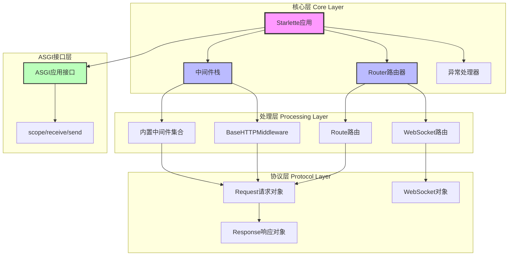
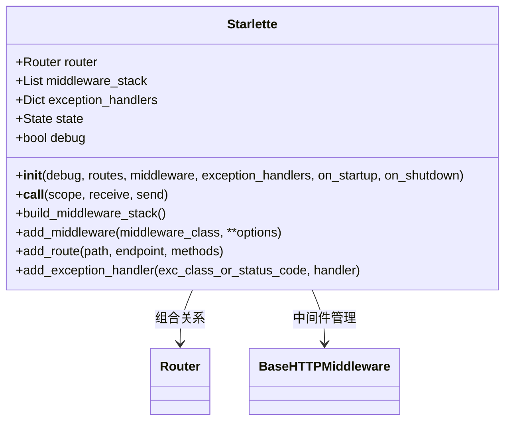
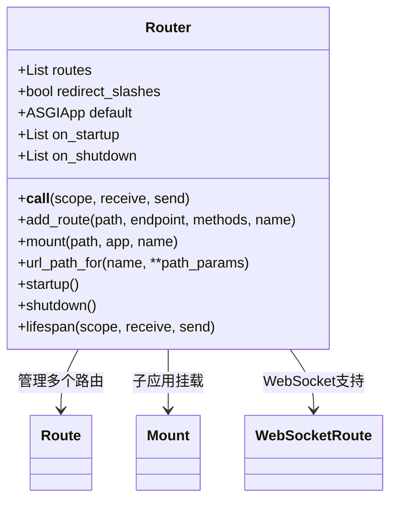
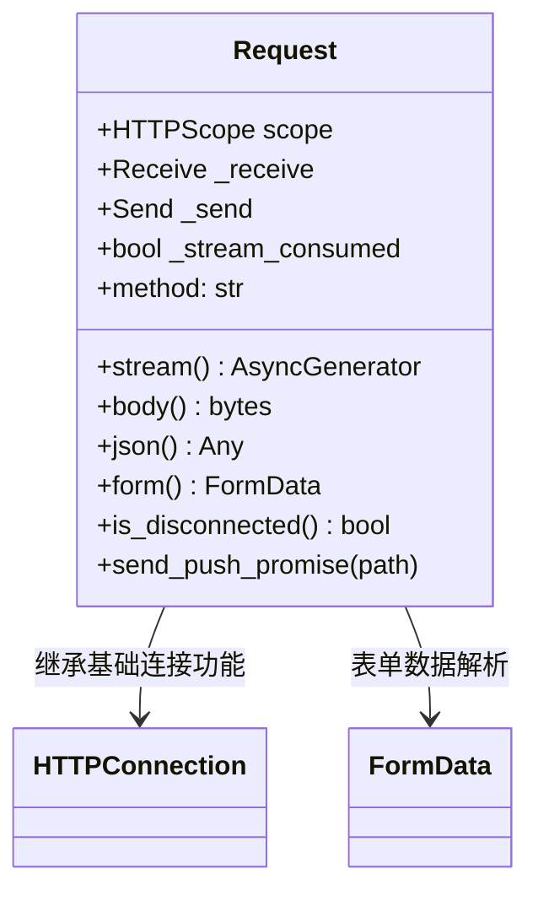
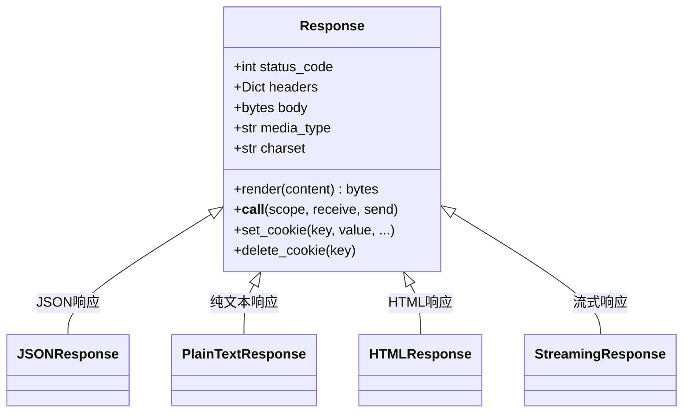
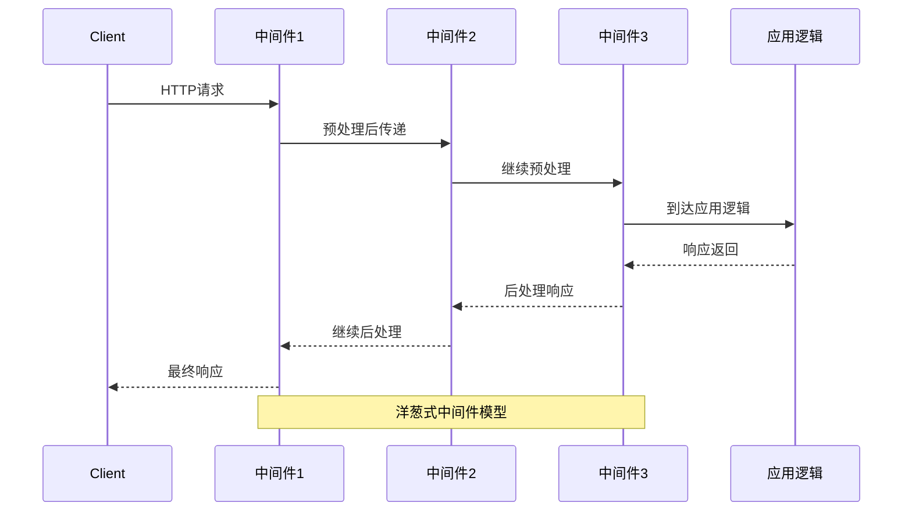
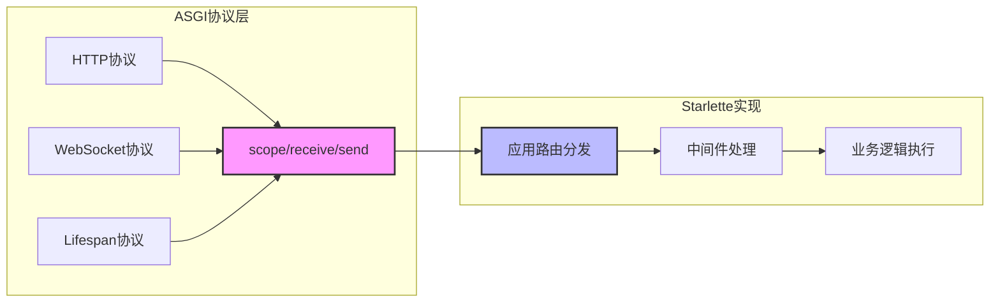
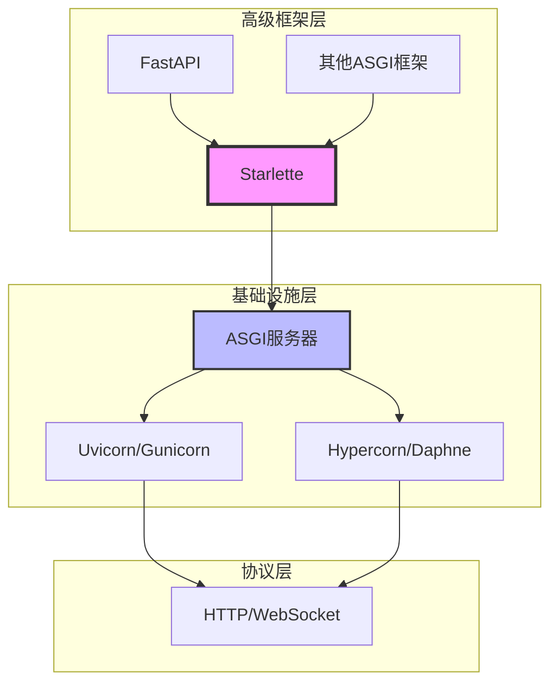

# Starlette 系统全景分析

> **使命宣言**: Starlette 是一个轻量级 ASGI Web 框架，专注于构建高性能异步Web应用和API。它通过极简的API设计和完整的ASGI协议实现，为开发者提供了既简洁又强大的Web开发基础设施。

## 核心价值定位

Starlette在现代Python Web框架生态中占据独特位置：它不是"又一个Web框架"，而是**ASGI时代的基础设施级框架**。它为FastAPI等上层框架提供了坚实的底层支撑，同时也可以直接用于构建高性能Web应用。

### 设计哲学体现

- **轻量级但不简单**：最小化外部依赖，但提供完整的Web开发功能
- **异步优先设计**：从底层开始的纯异步架构，天然支持高并发
- **组合胜过继承**：通过组合各种组件来构建复杂应用
- **标准遵循至上**：严格遵循ASGI、HTTP等Web标准

## 系统架构概览

## 核心组件深度剖析

### 1. Starlette 主应用类 `starlette/applications.py:27`

**核心职责**: 作为整个Web应用的入口点和协调中心，管理路由、中间件、异常处理和生命周期。

**关键设计模式**：
- **组合模式**: 将Router、中间件栈等组件组合成完整应用
- **装饰器模式**: 中间件栈的洋葱式包装
- **工厂模式**: route装饰器动态创建路由

### 2. Router 路由系统 `starlette/routing.py:579`

**核心职责**: 负责URL路径匹配、请求分发和应用生命周期管理。

**架构亮点**：
- **统一的路由接口**: HTTP和WebSocket路由使用相同的管理机制
- **子应用支持**: 通过Mount实现微服务架构
- **生命周期集成**: startup/shutdown事件与ASGI生命周期协议完美结合

### 3. Request 请求处理 `starlette/requests.py:198`

**核心职责**: 提供异步的HTTP请求数据访问接口，支持流式处理和多种数据格式。

**设计精髓**：
- **流式处理**: 支持大文件上传而不占用大量内存
- **惰性解析**: JSON和表单数据按需解析，提高性能
- **连接管理**: 实时检测客户端连接状态

### 4. Response 响应构建 `starlette/responses.py:30`

**核心职责**: 构建和发送HTTP响应，支持多种内容类型和异步发送。

## 中间件架构设计

### BaseHTTPMiddleware `starlette/middleware/base.py:95`

Starlette的中间件架构是其最精妙的设计之一：

**架构优势**：
- **完全异步**: 所有中间件都是异步的，支持并发处理
- **双向拦截**: 可以在请求处理前后都执行逻辑
- **异常安全**: 与异常处理系统无缝集成

## ASGI协议完整实现

Starlette对ASGI 3.0协议的实现是其成功的关键：

## 核心竞争优势

### 1. 性能卓越
- **纯异步架构**: 从底层开始的异步设计，天然支持高并发
- **内存效率**: 流式处理和惰性解析，最小化内存占用
- **零拷贝优化**: 在可能的情况下避免不必要的数据复制

### 2. 架构优雅
- **清晰的职责分离**: 路由、中间件、请求处理各司其职
- **可组合性**: 各组件可以灵活组合，构建不同规模的应用
- **扩展性**: 开放的中间件和路由系统，支持第三方扩展

### 3. 标准遵循
- **ASGI 3.0完整实现**: 支持HTTP、WebSocket、Lifespan三种协议
- **HTTP语义正确**: 严格遵循HTTP规范，确保兼容性
- **测试友好**: 提供完整的测试客户端支持

## 生态系统定位

Starlette在Python Web框架生态中的定位：

## 总结：Starlette的价值

Starlette成功地证明了"小而美"的框架设计理念。它通过：

1. **极简的API设计**使得学习成本最小化
2. **完整的功能实现**满足现代Web开发的各种需求  
3. **优异的性能表现**支持高并发Web应用
4. **良好的扩展性**为上层框架提供坚实基础

这使得Starlette不仅可以直接用于构建Web应用，更重要的是为整个Python异步Web生态奠定了技术基础。FastAPI的成功很大程度上验证了Starlette架构设计的正确性。

---

*下一篇：[02-L2-核心架构深入分析](02-L2-核心架构深入分析.md) - 深入探讨路由系统、中间件机制和请求响应处理的具体实现*