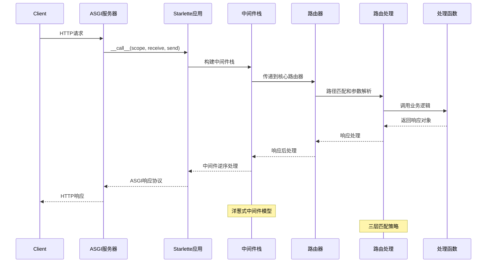
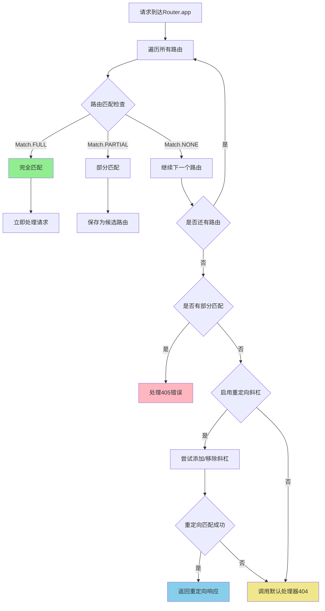
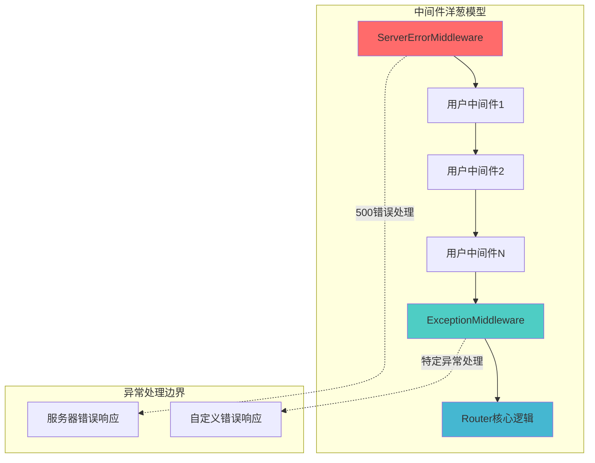
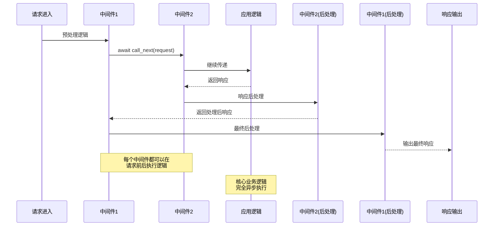
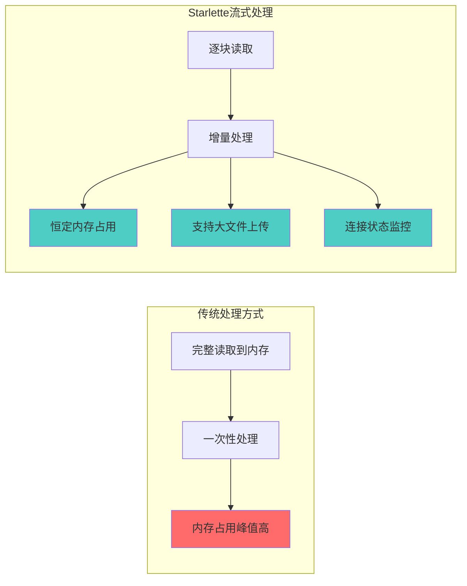
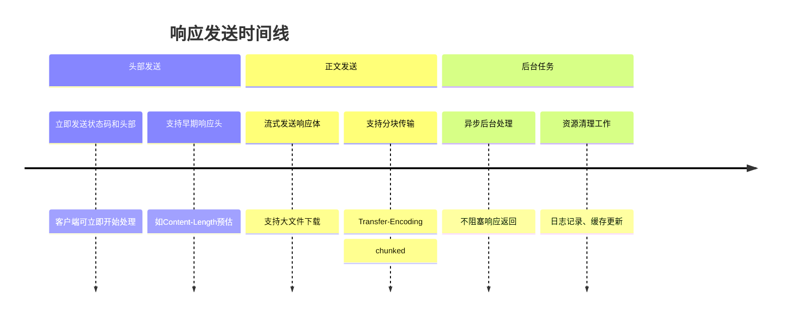
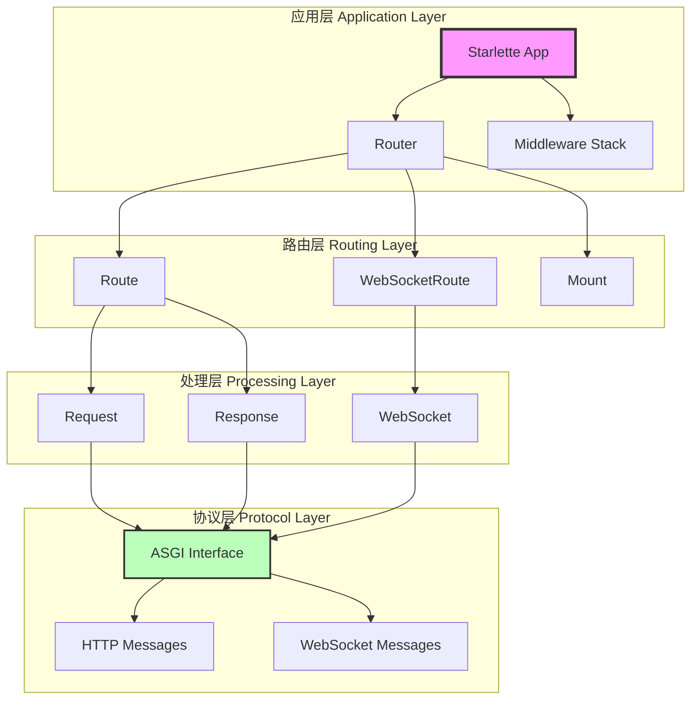
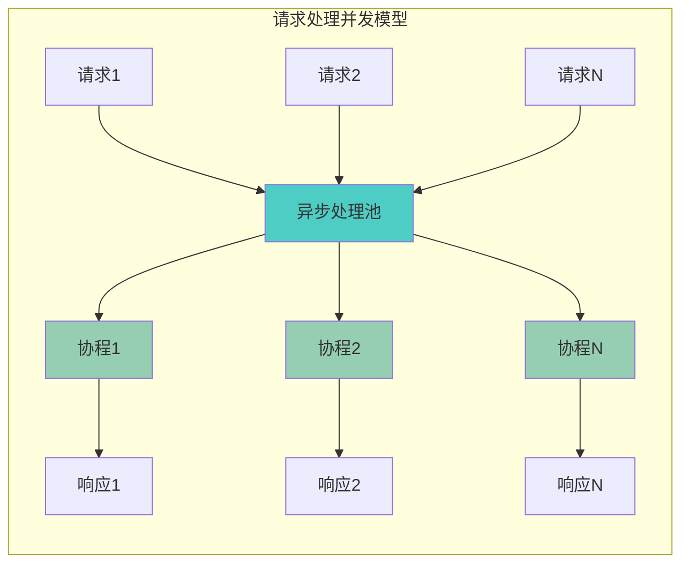

# Starlette 核心架构深入分析

> **核心主题**: 深入剖析Starlette的路由系统、中间件机制和请求响应处理流程，揭示其高性能异步架构的实现精髓。

## 完整的请求处理工作流

Starlette的请求处理是一个精心设计的异步管道，每个环节都体现了ASGI协议的优势和异步编程的精髓。



## 路由系统深度剖析

### 路由匹配的三层策略 `starlette/routing.py:717`

Starlette的路由匹配算法展现了对HTTP语义的深度理解：



**关键设计洞察**：
- **完全匹配优先**: 确保精确路由优先于模糊匹配
- **部分匹配处理**: 正确区分404（路径不存在）和405（方法不允许）错误
- **智能重定向**: 自动处理URL尾部斜杠，提升用户体验
- **默认兜底机制**: 确保所有请求都有明确的处理结果

### Route类的路径编译机制 `starlette/routing.py:209`

```mermaid
classDiagram
    class Route {
        +str path
        +Callable endpoint
        +Set methods
        +Pattern path_regex
        +str path_format
        +Dict param_convertors
        
        +matches(scope) Tuple[Match, Scope]
        +url_path_for(name, **params) str
        +handle(scope, receive, send)
    }
    
    Route --> PathConvertor : 参数转换
    Route --> RegexPattern : 路径匹配
    Route --> URLPath : 反向解析
    
    note for Route : "编译时优化：\n1. 路径 → 正则表达式\n2. 参数提取器\n3. URL构建模板"
```

**路径编译的性能优化**：

```python
# 路径模式: "/users/{user_id:int}/posts/{post_id:int}"
# 编译后生成：
path_regex = re.compile(r"^/users/(?P<user_id>[0-9]+)/posts/(?P<post_id>[0-9]+)$")
path_format = "/users/{user_id}/posts/{post_id}"  
param_convertors = {"user_id": IntConvertor(), "post_id": IntConvertor()}
```

这种**编译时优化**策略避免了运行时的重复解析，大幅提升了路由匹配性能。

## 中间件架构的精妙设计

### 中间件栈构建机制 `starlette/applications.py:79`

Starlette的中间件系统是其架构中最精妙的部分之一：

```python
def build_middleware_stack(self) -> ASGIApp:
    # 固定的异常处理顺序
    middleware = (
        [Middleware(ServerErrorMiddleware, handler=error_handler, debug=debug)]
        + self.user_middleware  # 用户中间件
        + [Middleware(ExceptionMiddleware, handlers=exception_handlers, debug=debug)]
    )
    
    # 逆序包装，形成洋葱结构
    app = self.router
    for cls, args, kwargs in reversed(middleware):
        app = cls(app, *args, **kwargs)
    return app
```

**中间件栈的层次化设计**：



**设计精髓**：
1. **双层异常边界**: ServerError和Exception中间件形成完整的错误边界
2. **用户中间件保护**: 用户中间件被包装在异常处理层之间，确保错误安全
3. **逆序包装模式**: 通过reversed()确保中间件按注册顺序执行，但包装顺序相反

### BaseHTTPMiddleware的异步处理模式



## 异步请求处理机制

### Request对象的流式处理设计 `starlette/requests.py:218`

Starlette的Request设计体现了对大数据处理和内存效率的深度考虑：

```python
async def stream(self) -> AsyncGenerator[bytes, None]:
    # 防止重复消费
    if self._stream_consumed:
        raise RuntimeError("Stream consumed")
    
    while not self._stream_consumed:
        message = await self._receive()
        if message["type"] == "http.request":
            body = message.get("body", b"")
            if not message.get("more_body", False):
                self._stream_consumed = True
            if body:
                yield body
        elif message["type"] == "http.disconnect":
            self._is_disconnected = True
            raise ClientDisconnect()
    yield b""
```

**流式处理的核心优势**：



### 惰性解析策略的性能优化

Request对象采用惰性解析策略，避免不必要的计算和内存分配：

```python
async def body(self) -> bytes:
    if not hasattr(self, "_body"):
        # 只有在首次访问时才合并数据流
        chunks: list[bytes] = []
        async for chunk in self.stream():
            chunks.append(chunk)
        self._body = b"".join(chunks)
    return self._body

async def json(self) -> Any:
    if not hasattr(self, "_json"):
        # 只有在需要JSON数据时才进行解析
        body = await self.body()
        self._json = json.loads(body)
    return self._json
```

## 响应系统的ASGI协议实现

### Response的分阶段发送机制 `starlette/responses.py:155`

Starlette的Response实现完美遵循了ASGI HTTP响应协议：

```python
async def __call__(self, scope: Scope, receive: Receive, send: Send) -> None:
    # 第一阶段：发送响应头
    await send({
        "type": "http.response.start",
        "status": self.status_code,
        "headers": self.raw_headers,
    })
    
    # 第二阶段：发送响应体
    await send({
        "type": "http.response.body", 
        "body": self.body
    })
    
    # 第三阶段：执行后台任务（可选）
    if self.background is not None:
        await self.background()
```

**分阶段发送的优势**：



## 核心组件协作模式分析

### 组件间的依赖关系和数据流



### 设计模式在架构中的应用

**1. 装饰器模式 - 中间件系统**
- 中间件栈通过装饰器模式层层包装核心应用
- 每个中间件都可以在请求前后添加处理逻辑
- 支持动态添加和组合中间件功能

**2. 组合模式 - 路由系统**
- Router组合多个Route对象形成路由树
- 支持嵌套路由和子应用挂载
- 统一的接口处理不同类型的路由

**3. 工厂模式 - 路由创建**
- `@app.route()` 装饰器作为Route对象的工厂
- 根据参数动态创建不同配置的路由
- 支持批量路由创建和配置

**4. 观察者模式 - 生命周期事件**
- startup/shutdown事件的订阅和通知机制
- 支持多个事件处理器的注册和执行
- 异步事件处理不阻塞应用启动

## 性能优化的架构设计

### 异步并发处理能力



**关键性能特性**：
- **全异步架构**: 从ASGI接口到业务逻辑全链路异步
- **零拷贝优化**: 流式处理避免不必要的数据复制
- **内存高效**: 惰性解析和流式处理控制内存占用
- **并发友好**: 无共享状态的设计支持高并发处理

### 编译时优化策略

- **路径编译**: 路由模式编译为正则表达式，避免运行时解析
- **中间件预构建**: 应用启动时构建中间件栈，运行时直接调用
- **类型转换器缓存**: 参数转换器复用，减少对象创建开销

## 架构优势总结

Starlette的核心架构展现了现代Web框架设计的最佳实践：

### 1. **异步优先的设计理念**
- 从底层ASGI协议到上层API全面异步化
- 支持高并发请求处理，单进程即可处理大量连接

### 2. **组件化的模块设计**
- 路由、中间件、请求处理各司其职
- 清晰的接口边界，易于测试和扩展

### 3. **性能导向的实现细节**
- 编译时优化减少运行时开销
- 流式处理和惰性解析控制内存使用

### 4. **标准兼容的协议实现**
- 完整的ASGI 3.0协议支持
- 正确的HTTP语义处理

这种架构设计使得Starlette既可以作为轻量级微框架直接使用，也可以作为更高级框架（如FastAPI）的基础设施，为Python异步Web开发奠定了坚实的技术基础。

---

*下一篇：[03-L3-关键实现细节分析](03-L3-关键实现细节分析.md) - 深入探讨核心算法、数据结构和性能优化技术的具体实现*