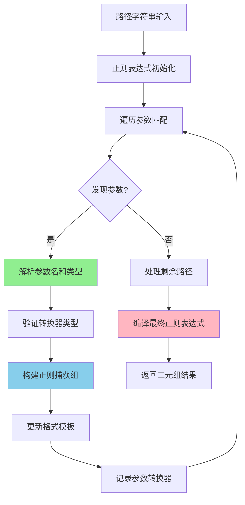
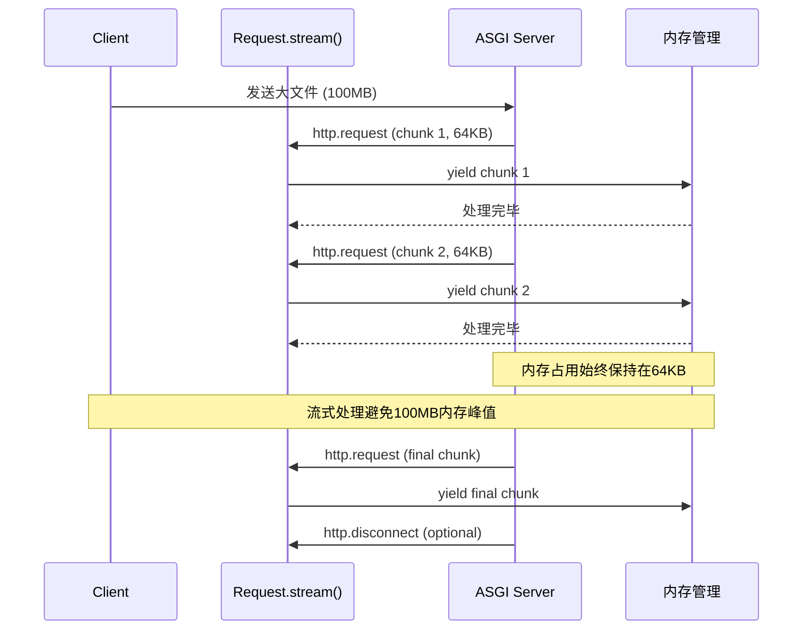
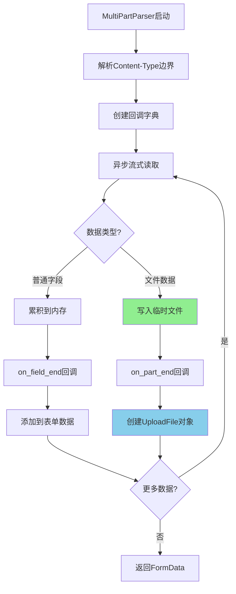
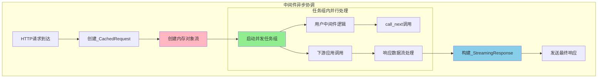

# Starlette 关键实现细节分析

> **核心主题**: 深入剖析Starlette的核心算法、数据结构和性能优化技术，揭示其高性能实现的技术细节。

## 路径编译算法 - 高性能URL匹配的秘密

### compile_path 函数的精妙设计 `starlette/routing.py:123`

Starlette的路径匹配性能之所以卓越，得益于其编译时优化策略：

```python
def compile_path(path: str) -> tuple[Pattern[str], str, dict[str, Convertor[Any]]]:
    # 输入: "/{username:str}/posts/{post_id:int}"
    # 输出: (正则表达式, 格式模板, 参数转换器映射)
```

**算法核心流程**：



**关键代码解析**：

```python
# 参数匹配正则表达式
PARAM_REGEX = re.compile(r"{([a-zA-Z_][a-zA-Z0-9_]*)(:[a-zA-Z_][a-zA-Z0-9_]*)?}")

for match in PARAM_REGEX.finditer(path):
    param_name, convertor_type = match.groups("str")
    convertor_type = convertor_type.lstrip(":")
    
    # 构建正则表达式捕获组
    path_regex += re.escape(path[idx : match.start()])
    path_regex += f"(?P<{param_name}>{convertor.regex})"
    
    # 构建格式模板（用于反向URL生成）
    path_format += path[idx : match.start()]
    path_format += "{%s}" % param_name
```

**性能优化细节**：
- **一次编译，多次使用**: 路径编译只在路由注册时执行一次
- **预编译正则表达式**: 避免运行时重复编译的开销
- **参数转换器缓存**: 转换器对象复用，减少内存分配

## 参数转换器系统 - 类型安全的URL参数处理

### 转换器类层次设计 `starlette/convertors.py:10`

Starlette的参数转换器系统采用了优雅的面向对象设计：

```mermaid
classDiagram
    class Convertor~T~ {
        <<Generic>>
        +str regex
        +convert(value: str) T
        +to_string(value: T) str
    }
    
    class StringConvertor {
        +regex = "[^/]+"
        +convert(value: str) str
        +to_string(value: str) str
    }
    
    class IntegerConvertor {
        +regex = "[0-9]+"
        +convert(value: str) int
        +to_string(value: int) str
    }
    
    class FloatConvertor {
        +regex = "[0-9]+(\\.[0-9]+)?"
        +convert(value: str) float
        +to_string(value: float) str
    }
    
    class UUIDConvertor {
        +regex = "[0-9a-fA-F]{8}-?..."
        +convert(value: str) UUID
        +to_string(value: UUID) str
    }
    
    class PathConvertor {
        +regex = ".*"
        +convert(value: str) str  
        +to_string(value: str) str
    }
    
    Convertor <|-- StringConvertor
    Convertor <|-- IntegerConvertor
    Convertor <|-- FloatConvertor
    Convertor <|-- UUIDConvertor
    Convertor <|-- PathConvertor
```

**核心设计特色**：

1. **双向转换能力**：
   ```python
   # URL → Python类型
   int_convertor.convert("123")  # → 123
   
   # Python类型 → URL
   int_convertor.to_string(123)  # → "123"
   ```

2. **正则表达式集成**：
   每个转换器都定义了对应的正则表达式，用于路径匹配：
   ```python
   IntegerConvertor.regex = "[0-9]+"     # 只匹配正整数
   FloatConvertor.regex = r"[0-9]+(\.[0-9]+)?"  # 匹配小数
   ```

3. **类型安全验证**：
   ```python
   def to_string(self, value: int) -> str:
       value = int(value)
       assert value >= 0, "Negative integers are not supported"
       return str(value)
   ```

4. **可扩展的转换器注册系统**：
   ```python
   CONVERTOR_TYPES: dict[str, Convertor[Any]] = {
       "str": StringConvertor(),
       "path": PathConvertor(), 
       "int": IntegerConvertor(),
       "float": FloatConvertor(),
       "uuid": UUIDConvertor(),
   }
   
   def register_url_convertor(key: str, convertor: Convertor[Any]) -> None:
       CONVERTOR_TYPES[key] = convertor
   ```

## Headers数据结构 - 高效HTTP头部处理

### Headers类的内存优化设计 `starlette/datastructures.py:502`

Starlette的Headers实现在性能和易用性之间找到了完美平衡：

```mermaid
classDiagram
    class Headers {
        -List~Tuple[bytes,bytes]~ _list
        +__init__(headers, raw, scope)
        +__getitem__(key: str) str
        +__contains__(key: str) bool
        +getlist(key: str) List[str]
        +keys() Iterable[str]
        +values() Iterable[str] 
        +items() Iterable[Tuple[str,str]]
    }
    
    note for Headers : "内部存储：[(b'content-type', b'application/json')]<br/>外部接口：headers['content-type'] → 'application/json'"
```

**存储策略的巧妙设计**：

```python
def __init__(self, headers=None, raw=None, scope=None):
    self._list: list[tuple[bytes, bytes]] = []
    
    if headers is not None:
        # 字符串 → 字节，小写化处理
        self._list = [
            (key.lower().encode("latin-1"), value.encode("latin-1"))
            for key, value in headers.items()
        ]
    elif scope is not None:
        # 直接使用ASGI scope中的原始头部数据
        self._list = scope["headers"] = list(scope["headers"])
```

**高效查找算法**：
```python
def __getitem__(self, key: str) -> str:
    get_header_key = key.lower().encode("latin-1")
    for header_key, header_value in self._list:
        if header_key == get_header_key:
            return header_value.decode("latin-1")
    raise KeyError(key)
```

**关键性能优化**：
- **字节级存储**: 内部使用bytes避免重复编码
- **大小写不敏感**: 存储时统一转为小写
- **零拷贝集成**: 直接复用ASGI scope数据
- **latin-1编码**: HTTP头部标准编码，性能最优

## 异步流式处理 - 内存高效的数据处理

### Request流式数据处理 `starlette/requests.py:218`

Starlette的流式处理是其内存高效性的核心：



**异步生成器的核心实现**：

```python
async def stream(self) -> AsyncGenerator[bytes, None]:
    if hasattr(self, "_body"):
        # 已缓存的body直接返回
        yield self._body
        yield b""
        return
        
    if self._stream_consumed:
        raise RuntimeError("Stream consumed")
        
    while not self._stream_consumed:
        message = await self._receive()
        if message["type"] == "http.request":
            body = message.get("body", b"")
            if not message.get("more_body", False):
                self._stream_consumed = True
            if body:
                yield body  # 流式yielding，不积累
        elif message["type"] == "http.disconnect":
            self._is_disconnected = True
            raise ClientDisconnect()
    yield b""
```

**惰性解析策略**：
```python
async def body(self) -> bytes:
    if not hasattr(self, "_body"):
        # 只在第一次访问时收集所有chunks
        chunks: list[bytes] = []
        async for chunk in self.stream():
            chunks.append(chunk)
        self._body = b"".join(chunks)
    return self._body  # 后续访问直接返回缓存
```

## 表单解析器 - 多部分数据的高效处理

### MultiPartParser的流式解析 `starlette/formparsers.py:125`

处理文件上传是Web框架的重要挑战，Starlette的实现展现了出色的内存管理：



**关键的内存管理策略**：

```python
class MultiPartParser:
    spool_max_size = 1024 * 1024  # 1MB - 小文件内存缓存
    max_part_size = 1024 * 1024   # 1MB - 单个part最大尺寸
    
    def on_part_data(self, data: bytes, start: int, end: int) -> None:
        message_bytes = data[start:end]
        if self._current_part.file is None:
            # 普通字段：内存累积
            if len(self._current_part.data) + len(message_bytes) > self.max_part_size:
                raise MultiPartException("Part exceeded maximum size")
            self._current_part.data.extend(message_bytes)
        else:
            # 文件数据：延迟写入队列
            self._file_parts_to_write.append((self._current_part, message_bytes))
```

**SpooledTemporaryFile的智能使用**：
```python
# 小文件内存存储，大文件溢出到磁盘
tempfile = SpooledTemporaryFile(max_size=self.spool_max_size)
self._current_part.file = UploadFile(
    file=tempfile,
    filename=filename,
    headers=Headers(raw=self._current_part.item_headers),
)
```

## 中间件的异步协调机制

### BaseHTTPMiddleware的并发处理 `starlette/middleware/base.py:100`

Starlette的中间件系统使用了复杂但高效的异步协调机制：



**复杂的异步流处理**：

```python
async def __call__(self, scope: Scope, receive: Receive, send: Send) -> None:
    request = _CachedRequest(scope, receive)
    response_sent = anyio.Event()
    
    async def call_next(request: Request) -> Response:
        # 创建内存对象流用于异步通信
        streams = anyio.create_memory_object_stream()
        send_stream, recv_stream = streams
        
        async def coro() -> None:
            # 在独立协程中运行下游应用
            with send_stream:
                await self.app(scope, receive_or_disconnect, send_no_error)
        
        # 并发执行用户逻辑和下游应用
        async with anyio.create_task_group() as task_group:
            task_group.start_soon(coro)
            
            # 构建流式响应对象
            response = _StreamingResponse(
                status_code=message["status"], 
                content=body_stream()
            )
            return response
```

**并发安全的关键机制**：
- **anyio.Event()**: 用于协调响应发送状态
- **create_memory_object_stream()**: 异步消息传递通道
- **create_task_group()**: 结构化并发管理
- **ExceptionGroup处理**: 优雅的异常聚合和传播

## StreamingResponse - 大数据响应的流式发送

### 双重异步任务协调 `starlette/responses.py:240`

```python
async def __call__(self, scope: Scope, receive: Receive, send: Send) -> None:
    spec_version = tuple(map(int, scope.get("asgi", {}).get("spec_version", "2.0").split(".")))
    
    if spec_version >= (2, 4):
        # ASGI 2.4+ 支持直接流式发送
        try:
            await self.stream_response(send)
        except OSError:
            raise ClientDisconnect()
    else:
        # 旧版ASGI需要并发监听断开连接
        async with anyio.create_task_group() as task_group:
            async def wrap(func):
                await func()
                task_group.cancel_scope.cancel()
                
            task_group.start_soon(wrap, partial(self.stream_response, send))
            task_group.start_soon(wrap, partial(self.listen_for_disconnect, receive))
```

**流式发送的核心实现**：
```python
async def stream_response(self, send: Send) -> None:
    await send({
        "type": "http.response.start",
        "status": self.status_code,
        "headers": self.raw_headers,
    })
    
    # 逐块发送响应体
    async for chunk in self.body_iterator:
        if not isinstance(chunk, (bytes, memoryview)):
            chunk = chunk.encode(self.charset)
        await send({
            "type": "http.response.body", 
            "body": chunk, 
            "more_body": True
        })
    
    # 发送结束标记
    await send({"type": "http.response.body", "body": b"", "more_body": False})
```

## 性能优化技术总结

### 内存管理优化

**1. 零拷贝策略**：
- Headers直接复用ASGI scope数据
- 字节级存储避免重复编码/解码
- 流式处理避免大内存分配

**2. 惰性计算**：
- Request.body()按需缓存
- Request.json()延迟解析
- 路径参数按需转换

**3. 对象池化**：
- 参数转换器单例复用
- 正则表达式预编译缓存
- 临时文件智能溢出管理

### 并发处理优化

**1. 结构化并发**：
- anyio任务组管理
- 异常安全的资源清理
- 优雅的取消传播

**2. 异步生成器**：
- 流式数据处理
- 背压控制机制
- 连接状态监控

**3. 管道化处理**：
- 中间件洋葱模型
- 请求响应管道
- 异步上下文管理

### 算法效率优化

**1. 编译时优化**：
- 路径正则表达式预编译
- 参数转换器查找表
- HTTP方法集合预计算

**2. 查找算法优化**：
- Headers线性查找（适合小集合）
- 路由树扁平化存储
- 参数提取一次遍历

**3. 协议层优化**：
- ASGI消息最小化解析
- 头部latin-1编码优化
- 响应分阶段发送

## 关键实现的设计启示

### 1. **性能与简洁的平衡**
Starlette的实现展现了在追求性能的同时保持代码简洁性的艺术。每个优化都有明确的性能收益，没有过度工程化。

### 2. **异步优先的设计思维**
所有I/O操作都设计为异步的，从底层ASGI接口到上层业务逻辑，形成了完整的异步生态。

### 3. **内存效率的极致追求**
通过流式处理、惰性计算、零拷贝等技术，实现了内存使用的最优化，支持处理大型请求而不会导致内存溢出。

### 4. **类型安全与性能的结合**
参数转换器系统在提供类型安全的同时，通过预编译和缓存技术保证了高性能。

### 5. **错误处理的全面性**
从连接断开检测到异常边界管理，Starlette在各个层面都考虑了错误情况的处理，确保了系统的健壮性。

这些实现细节共同构成了Starlette高性能Web框架的技术基础，为理解现代异步Web框架的设计提供了宝贵的参考。

---

*下一篇：[04-L4-设计哲学与权衡分析](04-L4-设计哲学与权衡分析.md) - 深入探讨Starlette背后的技术选择依据和架构决策权衡*