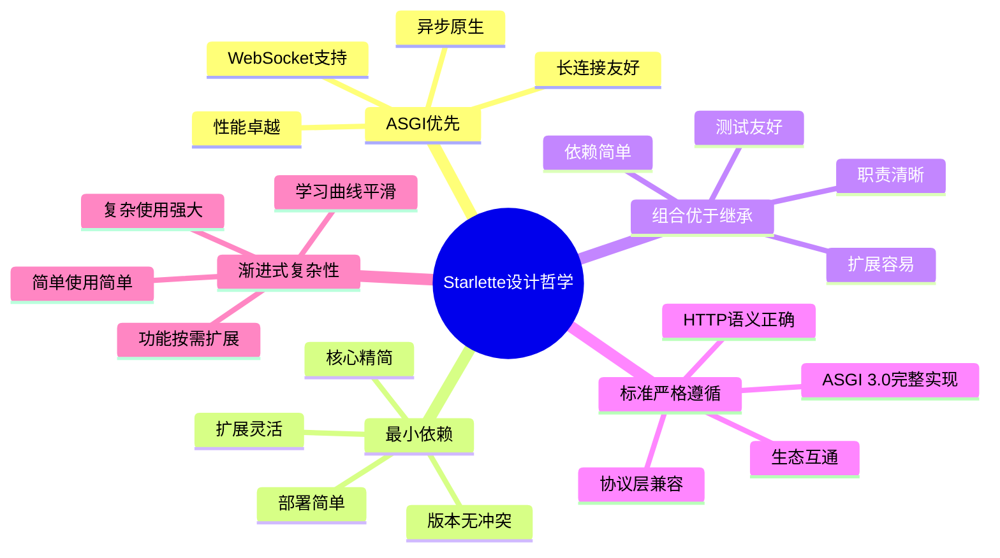
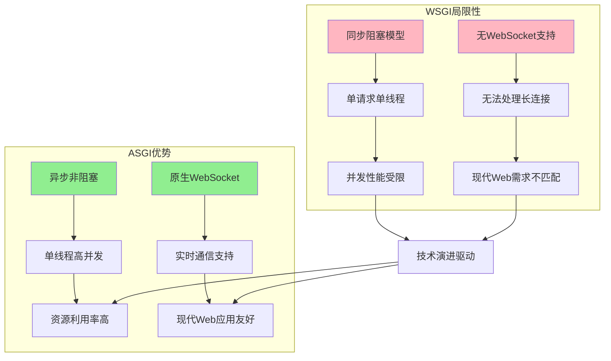
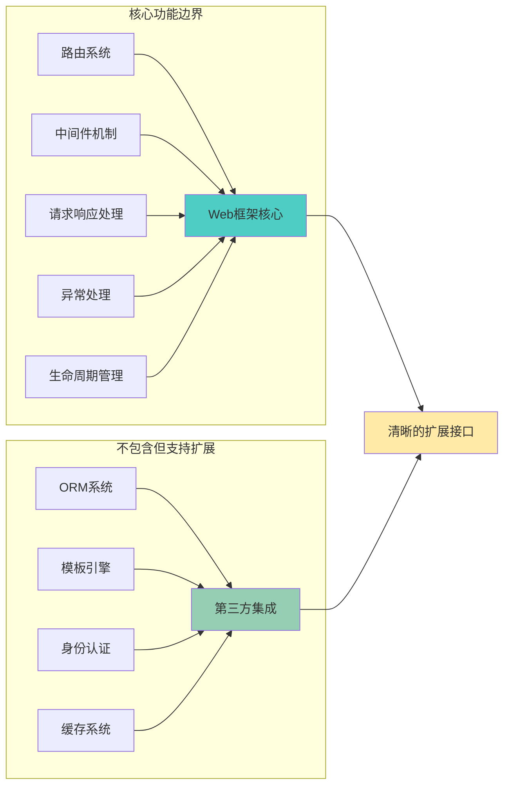
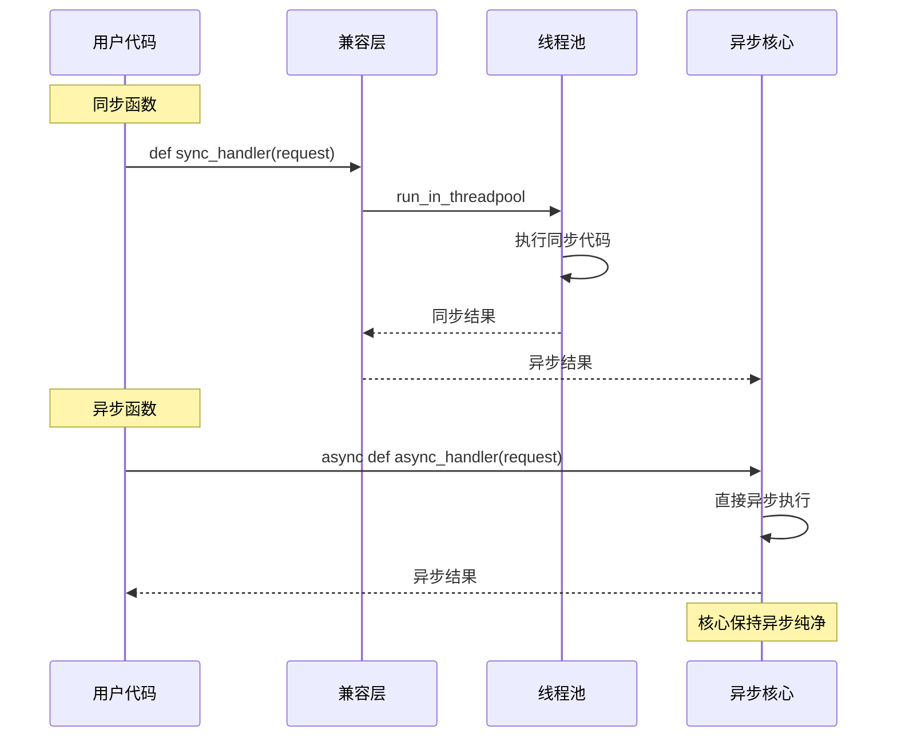
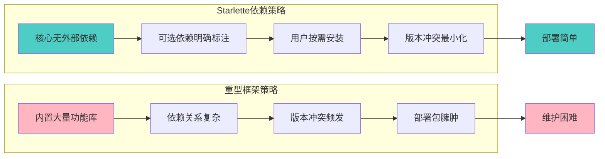
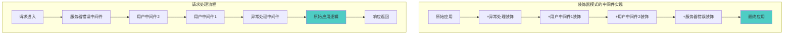
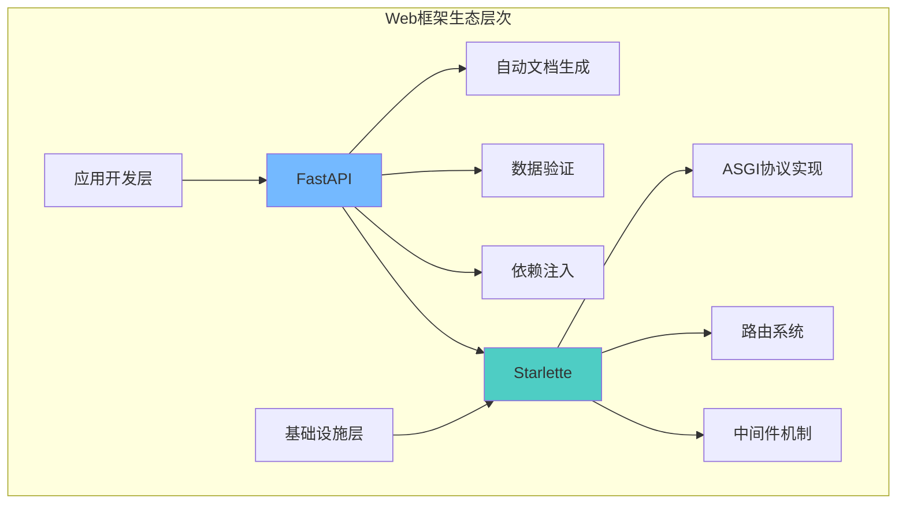

# Starlette 设计哲学与权衡分析

> **核心主题**: 深入探讨Starlette背后的技术选择依据、架构决策权衡，以及其设计哲学在现代Web框架发展中的意义。

## 核心设计哲学概览

Starlette的设计哲学可以用"**精简而不简单，异步而不复杂**"来概括。它在多个关键维度上做出了深思熟虑的权衡选择，形成了独特的技术定位。



## 关键技术选择的深度权衡

### 1. ASGI vs WSGI：前瞻性的架构选择

**选择ASGI的核心理由**：



**权衡成本分析**：

| 维度 | WSGI | ASGI | Starlette选择ASGI的权衡 |
|------|------|------|----------------------|
| **学习曲线** | 平缓 | 陡峭 | 牺牲易学性换取技术先进性 |
| **生态成熟度** | 丰富 | 发展中 | 承担生态建设成本获得技术领先 |
| **并发性能** | 中等 | 优秀 | 性能优势是核心价值主张 |
| **长连接支持** | 无 | 原生 | 为现代Web需求提供基础 |
| **调试复杂度** | 简单 | 复杂 | 通过工具和设计降低调试难度 |

**战略意义**：这个选择为Starlette奠定了技术基础，使其成为Python异步Web生态的重要基石。

### 2. 简洁性 vs 功能完整性：最小而完整的设计理念

**"最小而完整"的设计哲学**：



**功能边界的精心设计**：

1. **包含的核心功能**：
   - HTTP请求路由和分发
   - 中间件洋葱模型
   - 请求响应对象抽象
   - WebSocket协议支持
   - 生命周期事件管理
   - 异常处理机制

2. **故意排除的功能**：
   - 数据库抽象层（ORM）
   - 模板引擎集成
   - 身份认证系统
   - 表单验证
   - 国际化支持

**权衡逻辑**：
```python
# Starlette的哲学：提供清晰的扩展点而非内置功能
from starlette.applications import Starlette
from starlette.middleware import Middleware

# 用户可以自由选择数据库层
# from sqlalchemy.ext.asyncio import create_async_engine  # SQLAlchemy
# from tortoise.contrib.starlette import register_tortoise  # Tortoise-ORM
# from databases import Database  # Databases

app = Starlette(
    middleware=[
        # 用户自由选择中间件
        Middleware(SomeAuthMiddleware),  # 可选的认证中间件
        Middleware(SomeCORSMiddleware),  # 可选的CORS中间件
    ]
)
```

这种设计使得Starlette既避免了"意见过于强烈"的问题，又保持了核心功能的完整性。

### 3. 性能 vs 易用性：透明优化的艺术

**透明优化策略**：Starlette在追求性能的同时，将复杂性对用户透明化。

```mermaid
graph TD
    subgraph "用户可见的简单API"
        A[app.route装饰器] --> B[简洁的路由定义]
        C[Request.json()] --> D[直观的数据访问]
        E[Response对象] --> F[标准的响应接口]
    end
    
    subgraph "透明的性能优化"
        G[路径编译为正则] --> H[编译时优化]
        I[Headers字节级存储] --> J[内存效率优化]
        K[流式请求处理] --> L[大数据处理优化]
        M[异步生成器] --> N[并发性能优化]
    end
    
    B --> G
    D --> I
    D --> K
    F --> M
    
    style B fill:#74B9FF
    style D fill:#74B9FF
    style F fill:#74B9FF
    style H fill:#55A3FF
    style J fill:#55A3FF
    style L fill:#55A3FF
    style N fill:#55A3FF
```

**性能优化的分层策略**：

1. **编译时优化**（用户无感知）：
   ```python
   # 用户写的简单路径
   @app.route("/users/{user_id:int}/posts/{post_id:int}")
   
   # Starlette内部编译为高效正则表达式
   # ^/users/(?P<user_id>[0-9]+)/posts/(?P<post_id>[0-9]+)$
   ```

2. **运行时优化**（API保持简洁）：
   ```python
   # 用户简单调用
   body = await request.body()
   
   # 内部实现惰性解析 + 缓存
   async def body(self) -> bytes:
       if not hasattr(self, "_body"):
           chunks = []
           async for chunk in self.stream():  # 流式处理
               chunks.append(chunk)
           self._body = b"".join(chunks)  # 一次性缓存
       return self._body
   ```

3. **内存优化**（透明实现）：
   ```python
   # 用户正常访问Headers
   content_type = request.headers["content-type"]
   
   # 内部使用字节存储 + 懒转换
   def __getitem__(self, key: str) -> str:
       get_header_key = key.lower().encode("latin-1")  # 一次编码
       for header_key, header_value in self._list:     # 字节级查找
           if header_key == get_header_key:
               return header_value.decode("latin-1")   # 按需解码
   ```

### 4. 异步纯净 vs 同步兼容：渐进式迁移支持

**渐进式异步化策略**：



**兼容性实现的巧妙设计**：

```python
# starlette/routing.py
def request_response(func):
    """同步/异步函数的统一包装器"""
    f: Callable[[Request], Awaitable[Response]] = (
        func if is_async_callable(func) 
        else functools.partial(run_in_threadpool, func)  # 同步函数包装
    )
    
    async def app(scope: Scope, receive: Receive, send: Send) -> None:
        request = Request(scope, receive, send)
        response = await f(request)  # 统一的异步调用
        await response(scope, receive, send)
    
    return app
```

**权衡考量**：
- **优势**：降低学习门槛，支持渐进式迁移
- **成本**：增加了实现复杂度，可能影响纯异步应用的性能
- **决策**：选择支持渐进式迁移，体现了实用主义的设计哲学

## 架构决策的深度分析

### 1. 组合优于继承：清晰的依赖关系

**Starlette的组合模式应用**：

```mermaid
classDiagram
    class Starlette {
        -Router router
        -List middleware_stack  
        -Dict exception_handlers
        +__call__(scope, receive, send)
    }
    
    class Router {
        -List routes
        -List on_startup
        -List on_shutdown
        +add_route(path, endpoint)
        +url_path_for(name, params)
    }
    
    class Route {
        -str path
        -Callable endpoint
        -Set methods
        +matches(scope)
        +handle(scope, receive, send)
    }
    
    Starlette *-- Router : 组合
    Router *-- Route : 组合
    
    note for Starlette : "通过组合而非继承<br/>实现功能扩展"
    note for Router : "路由集合的管理者<br/>而非路由的父类"
```

**vs 传统继承模式的对比**：

```python
# 传统继承模式（Django风格）
class BaseHandler:
    def handle_request(self, request): pass

class GetHandler(BaseHandler):
    def handle_request(self, request): pass

class PostHandler(BaseHandler): 
    def handle_request(self, request): pass

# Starlette组合模式
class Route:
    def __init__(self, path: str, endpoint: Callable, methods: list):
        self.endpoint = endpoint  # 组合任意可调用对象
        
# 更灵活的使用方式
@app.route("/", methods=["GET", "POST"])  # 一个端点处理多方法
async def multi_method_handler(request):
    if request.method == "GET": return get_logic()
    elif request.method == "POST": return post_logic()
```

**组合模式的优势体现**：
- **测试友好**：每个组件可以独立测试
- **职责清晰**：Router负责路由管理，Route负责请求处理
- **扩展灵活**：新的路由类型通过组合而非继承添加
- **依赖简单**：避免了复杂的继承层次

### 2. 标准遵循 vs 创新平衡：适度创新的智慧

**ASGI协议的严格遵循**：

```python
# 严格按照ASGI 3.0规范实现
async def app(scope: Scope, receive: Receive, send: Send) -> None:
    assert scope["type"] in ("http", "websocket", "lifespan")
    
    # HTTP协议处理
    if scope["type"] == "http":
        await handle_http(scope, receive, send)
    
    # WebSocket协议处理  
    elif scope["type"] == "websocket":
        await handle_websocket(scope, receive, send)
        
    # Lifespan协议处理
    elif scope["type"] == "lifespan":
        await handle_lifespan(scope, receive, send)
```

**在标准基础上的API创新**：

```python
# 创新的装饰器语法（相比原始ASGI应用）
@app.route("/users/{user_id:int}")  # 类型化路径参数
async def get_user(request):
    user_id = request.path_params["user_id"]  # 自动类型转换
    return JSONResponse({"id": user_id})

# vs 原始ASGI应用的复杂性
async def raw_asgi_app(scope, receive, send):
    # 手动解析路径、处理参数类型转换等...
```

**创新与标准的平衡点**：
- **协议层**：100%遵循ASGI标准，确保互操作性
- **API层**：适度创新，提升开发体验
- **扩展点**：保持开放性，支持第三方扩展

### 3. 依赖最小化：纯净的技术栈

**依赖策略对比**：



**最小依赖的实现策略**：

```python
# pyproject.toml 中的依赖策略
[project]
name = "starlette"
dependencies = []  # 核心零依赖！

[project.optional-dependencies]
full = [
    "httpx",           # 测试客户端
    "jinja2",          # 模板支持
    "python-multipart", # 表单解析
    "itsdangerous",    # 会话支持
    "pyyaml",          # 配置文件支持
]
```

**权衡分析**：
- **优势**：部署简单、启动快速、版本冲突少
- **成本**：用户需要自行选择和集成第三方库
- **结果**：更适合作为基础设施而非应用框架

## 设计模式的深度应用

### 1. 装饰器模式：中间件系统的优雅实现

**中间件洋葱模型的装饰器本质**：



**装饰器模式的代码体现**：

```python
def build_middleware_stack(self) -> ASGIApp:
    middleware = (
        [Middleware(ServerErrorMiddleware, handler=error_handler)]
        + self.user_middleware  
        + [Middleware(ExceptionMiddleware, handlers=exception_handlers)]
    )
    
    # 装饰器模式：每个中间件装饰下一层
    app = self.router
    for cls, args, kwargs in reversed(middleware):
        app = cls(app, *args, **kwargs)  # 装饰器包装
    return app
```

### 2. 工厂模式：路由创建的灵活性

**路由装饰器的工厂模式**：

```python
def route(self, path: str, methods: list = None, **kwargs):
    """路由装饰器工厂"""
    def decorator(func):
        # 根据参数创建不同的路由对象
        route_obj = Route(path, func, methods=methods, **kwargs)
        self.routes.append(route_obj)
        return func
    return decorator

# 使用工厂创建不同配置的路由
@app.route("/users", methods=["GET", "POST"])
@app.route("/api/v1/users", methods=["GET"])  # 同一函数多路由
async def users_handler(request): pass
```

### 3. 策略模式：参数转换器系统

**转换器的策略模式实现**：

```python
# 策略接口
class Convertor(Generic[T]):
    def convert(self, value: str) -> T: pass
    def to_string(self, value: T) -> str: pass

# 具体策略实现
class IntegerConvertor(Convertor[int]):
    def convert(self, value: str) -> int:
        return int(value)

# 策略选择和使用
CONVERTOR_TYPES = {
    "int": IntegerConvertor(),
    "str": StringConvertor(),
    # ... 更多策略
}

# 运行时策略选择
convertor = CONVERTOR_TYPES[convertor_type]
converted_value = convertor.convert(raw_value)
```

## 与其他框架的设计对比

### 1. Starlette vs Flask：异步时代的范式转换

**设计理念对比**：

| 维度 | Flask | Starlette | 设计权衡分析 |
|------|-------|-----------|-------------|
| **并发模型** | 同步+多线程 | 异步单线程 | Starlette选择异步获得更高并发性能 |
| **插件系统** | 丰富的Blueprint和Extension | 最小核心+组合扩展 | Flask重装配，Starlette重组合 |
| **学习曲线** | 平缓 | 陡峭 | Starlette牺牲易学性换取技术先进性 |
| **生态成熟度** | 极其丰富 | 快速发展 | Flask优势明显，但Starlette潜力巨大 |

**代码风格对比**：

```python
# Flask风格：同步、装配式
from flask import Flask, request, jsonify

app = Flask(__name__)

@app.route('/users/<int:user_id>')
def get_user(user_id):
    # 同步数据库查询
    user = User.query.get(user_id)
    return jsonify(user.to_dict())

# Starlette风格：异步、组合式  
from starlette.applications import Starlette
from starlette.responses import JSONResponse

async def get_user(request):
    user_id = request.path_params["user_id"]
    # 异步数据库查询
    user = await User.get(user_id)
    return JSONResponse(user.dict())

app = Starlette(routes=[
    Route('/users/{user_id:int}', get_user)
])
```

### 2. Starlette vs FastAPI：基础设施与应用框架的分层

**定位差异分析**：



**设计分工的智慧**：

```python
# Starlette：提供基础设施
from starlette.applications import Starlette
from starlette.responses import JSONResponse

async def endpoint(request):
    # 手动参数提取和验证
    user_id = int(request.path_params["user_id"])
    return JSONResponse({"user_id": user_id})

# FastAPI：基于Starlette提供应用层功能
from fastapi import FastAPI

app = FastAPI()  # 内部使用Starlette

@app.get("/users/{user_id}")  # 自动文档生成
async def get_user(user_id: int):  # 自动类型验证
    return {"user_id": user_id}  # 自动序列化
```

**分层设计的价值**：
- **职责清晰**：Starlette专注协议和性能，FastAPI专注开发体验
- **复用性强**：Starlette可以支撑多种上层框架
- **演进独立**：两个层次可以独立优化和演进

## 设计权衡的整体评价

### 成功的权衡决策

1. **ASGI选择的前瞻性**：
   - 为Python Web生态的异步化转型奠定了基础
   - 证明了技术前瞻性选择的长远价值

2. **最小核心的智慧**：
   - 避免了"厨房水槽"问题
   - 为不同使用场景提供了灵活性

3. **性能与易用性的平衡**：
   - 透明优化策略既保证性能又维护API简洁性
   - 渐进式复杂性设计降低了学习门槛

### 需要持续关注的挑战

1. **学习曲线问题**：
   - 异步编程对新手不够友好
   - 需要更好的文档和教学资源

2. **生态建设**：
   - 相比Flask/Django，第三方库生态仍需发展
   - 需要持续的社区建设投入

3. **调试复杂性**：
   - 异步代码的调试相对复杂
   - 需要更好的开发工具支持

## 设计哲学的深远影响

### 对Python Web生态的贡献

1. **技术路径引领**：
   - 证明了异步Web框架的可行性和优势
   - 为后续框架（FastAPI、Quart等）提供了技术基础

2. **架构模式示范**：
   - "基础设施+应用框架"的分层模式
   - 组合优于继承的实践案例

3. **性能标杆建立**：
   - 在保持Python易用性的前提下达到了接近Go/Node.js的性能
   - 改变了"Python Web应用性能差"的印象

### 对现代Web开发的启示

1. **简洁性的力量**：
   - 证明了"少即是多"的设计理念
   - 展示了核心功能精准定位的价值

2. **标准遵循的重要性**：
   - 通过严格遵循ASGI标准获得了良好的互操作性
   - 为整个生态的健康发展做出了贡献

3. **渐进式设计的智慧**：
   - 通过渐进式复杂性和渐进式迁移支持
   - 平衡了创新与兼容性的矛盾

## 结语：设计哲学的时代价值

Starlette的设计哲学体现了现代软件开发的几个重要趋势：

1. **性能意识的觉醒**：在云计算和微服务时代，框架性能直接影响成本和用户体验
2. **异步编程的普及**：异步模式已成为高并发系统的标准选择
3. **组合优于继承**：函数式和组合式设计越来越受到青睐
4. **最小化依赖**：在复杂系统中，简单性成为了稀缺价值

Starlette成功地将这些理念融入到一个具体的Web框架实现中，为Python Web开发的现代化转型提供了重要的技术基础和设计参考。它的成功不仅在于技术实现的优秀，更在于设计理念的前瞻性和权衡决策的智慧。

---

*下一篇：[05-L5-洞察总结与改进建议](05-L5-洞察总结与改进建议.md) - 总结分析洞察，提出改进建议和学习启示*