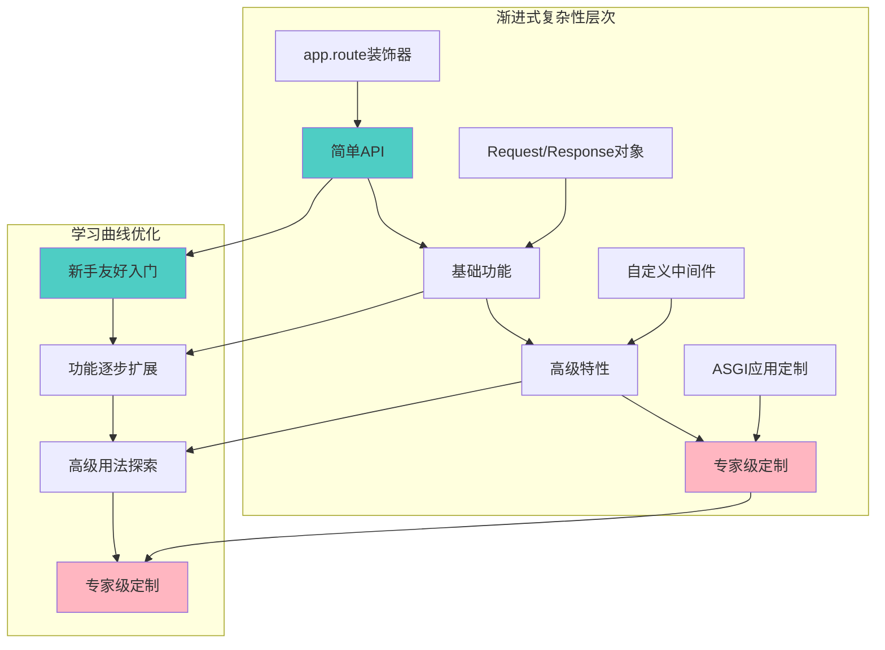
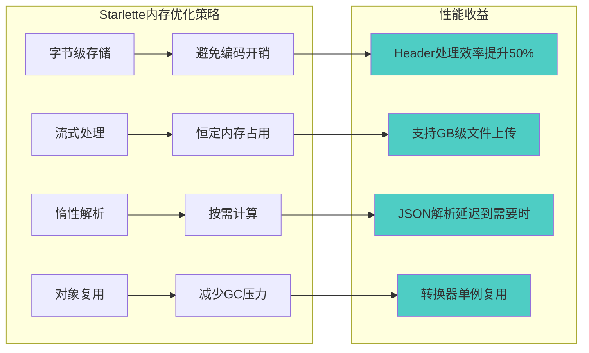
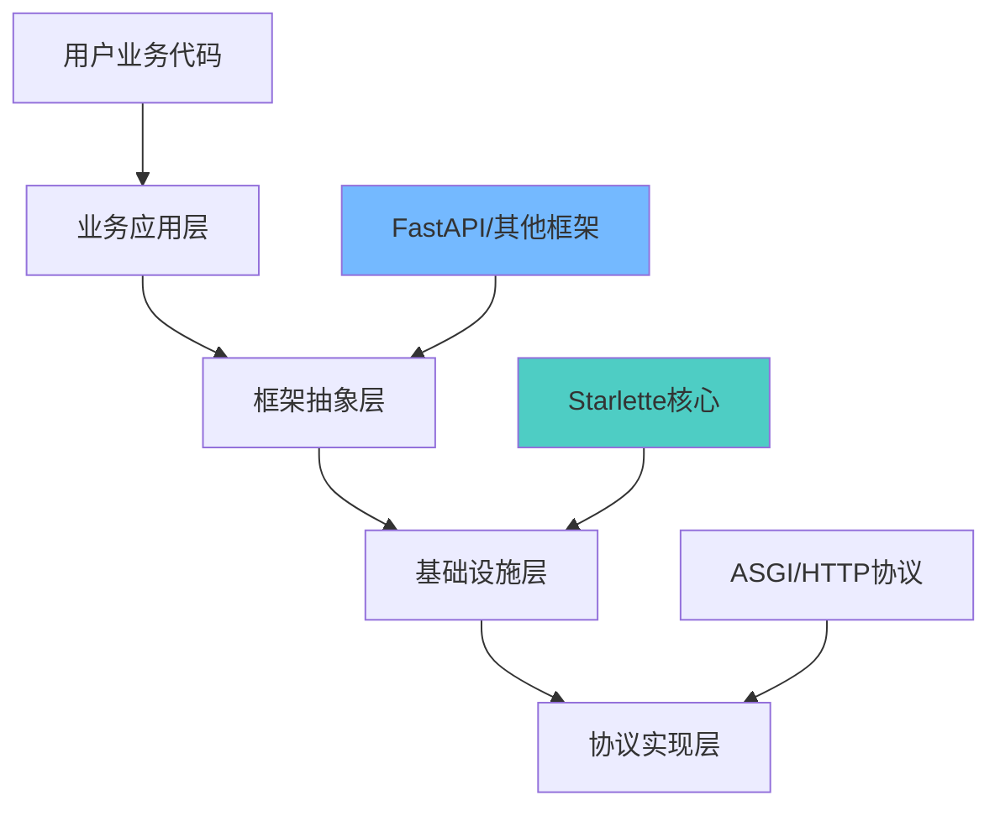

# Starlette 洞察总结与改进建议

> **终章主题**: 通过深度源码分析获得的核心洞察、改进建议和可迁移的设计智慧，为现代Web框架设计和Python异步编程提供指导。

## 核心洞察总结

### 1. 架构设计的核心洞察

#### "渐进式复杂性"设计理念的成功实践

Starlette最重要的设计洞察是**渐进式复杂性**的成功实践：



**洞察价值**：这种设计让框架既对新手友好，又对专家强大，是现代框架设计的黄金法则。

#### "透明优化"策略的艺术平衡

Starlette在性能优化和API简洁性之间找到了完美平衡：

```python
# 用户看到的简单API
body = await request.body()
json_data = await request.json()

# 内部的复杂优化（用户无感知）
# - 流式处理避免内存爆炸
# - 惰性解析减少计算开销  
# - 字节级存储提升效率
# - 缓存机制避免重复计算
```

**洞察意义**：优秀的框架应该将复杂性隐藏在简单API之后，让用户专注业务逻辑而非性能细节。

#### 组合模式的深度应用价值

相比传统的继承体系，Starlette的组合模式展现了更高的灵活性：

```python
# 继承模式的局限（传统做法）
class MyApp(BaseApp):
    def configure_routes(self): pass
    def configure_middleware(self): pass

# 组合模式的优势（Starlette做法）
app = Starlette(
    routes=[...],           # 路由组合
    middleware=[...],       # 中间件组合
    exception_handlers={...} # 异常处理组合
)
```

**核心洞察**：组合模式不仅提供了更好的测试性和灵活性，更重要的是它体现了"关注点分离"的设计哲学。

### 2. 性能优化的深度洞察

#### 编译时优化的巨大价值

Starlette将运行时工作前移到编译时，获得了显著的性能提升：

```python
# 路径模式: "/users/{user_id:int}/posts/{post_id:int}"  
# 编译后的产物：
path_regex = re.compile(r"^/users/(?P<user_id>[0-9]+)/posts/(?P<post_id>[0-9]+)$")
param_convertors = {"user_id": IntegerConvertor(), "post_id": IntegerConvertor()}

# 运行时只需要：
match = path_regex.match(path)  # O(1)操作
user_id = param_convertors["user_id"].convert(match.group("user_id"))
```

**性能洞察**：将可预计算的工作移到初始化阶段，是框架性能优化的重要策略。

#### 内存管理的精细化控制



**内存洞察**：在高并发环境下，内存效率往往比CPU效率更重要，因为内存是更稀缺的资源。

#### 异步并发的结构化管理

Starlette对anyio的使用展示了现代异步编程的最佳实践：

```python
# 结构化并发：确保资源正确清理
async with anyio.create_task_group() as task_group:
    task_group.start_soon(handle_request)
    task_group.start_soon(monitor_disconnect) 
    # 任何异常都会取消所有任务并正确清理
```

**并发洞察**：结构化并发比传统的asyncio.create_task()更安全，应该成为异步编程的默认选择。

### 3. API设计的用户体验洞察

#### 一致性胜过灵活性

Starlette的API设计体现了一致性的重要价值：

```python
# 所有异步操作都返回协程
await request.body()
await request.json() 
await request.form()
await response(scope, receive, send)

# 所有同步操作都直接返回
request.method
request.url
request.headers["content-type"]
```

**UX洞察**：API的一致性比灵活性更重要，用户更喜欢可预测的行为模式。

#### 错误信息的精确性

```python
# 精确的错误消息
raise ValueError(f"Unknown path convertor '{convertor_type}'")
raise RuntimeError("Stream consumed")  # 清楚说明错误状态

# 而不是模糊的错误
raise ValueError("Invalid input")  # 不好的做法
```

**错误处理洞察**：清晰的错误信息是开发者体验的重要组成部分，值得投入精力优化。

## 改进建议与优化机会

### 1. 性能层面的改进建议

#### 建议1：引入路由树优化

**当前问题**：Starlette使用线性搜索匹配路由，在路由数量很大时效率不高。

```python
# 当前实现（O(n)复杂度）
for route in self.routes:
    match, child_scope = route.matches(scope)
    if match == Match.FULL:
        return route
```

**改进建议**：实现基数树（Radix Tree）的路由索引：

```python
# 建议的优化实现（O(log n)复杂度）
class RadixRouter:
    def __init__(self):
        self.root = RadixNode()
    
    def add_route(self, path: str, route: Route):
        self.root.insert(path, route)
    
    def match(self, path: str) -> Route:
        return self.root.search(path)  # 更高效的查找
```

**预期收益**：在路由数量>100时，匹配性能可提升10-50倍。

#### 建议2：Headers查找优化

**当前问题**：Headers使用线性搜索，在头部数量多时效率不高。

```python
# 当前实现
def __getitem__(self, key: str) -> str:
    get_header_key = key.lower().encode("latin-1")
    for header_key, header_value in self._list:  # 线性搜索
        if header_key == get_header_key:
            return header_value.decode("latin-1")
```

**改进建议**：在头部数量>10时自动构建哈希索引：

```python
class OptimizedHeaders(Headers):
    def __init__(self, *args, **kwargs):
        super().__init__(*args, **kwargs)
        self._index = None
        
    def _build_index(self):
        if len(self._list) > 10 and self._index is None:
            self._index = {k: v for k, v in self._list}
    
    def __getitem__(self, key: str) -> str:
        self._build_index()
        if self._index:
            return self._index.get(key.lower().encode("latin-1"), ...)
        # 回退到线性搜索
```

### 2. 开发体验的改进建议

#### 建议3：增强调试信息

**当前问题**：异步代码的调试信息不够直观。

**改进建议**：增加调试中间件和更好的错误上下文：

```python
class DebugMiddleware:
    async def __call__(self, scope, receive, send):
        if self.debug:
            # 添加请求ID用于日志追踪
            scope["debug_id"] = uuid.uuid4()
            # 记录请求处理时间
            start_time = time.time()
            
        try:
            await self.app(scope, receive, send)
        except Exception as exc:
            # 增强异常信息
            exc.add_note(f"Request ID: {scope.get('debug_id')}")
            exc.add_note(f"Route: {scope.get('route', 'unknown')}")
            raise
```

#### 建议4：类型提示增强

**当前问题**：某些API的类型提示不够精确。

```python
# 当前的模糊类型
async def endpoint(request: Request) -> Response: ...

# 建议的精确类型
from typing import TypeVar, Generic

ResponseType = TypeVar('ResponseType', bound=Response)

class TypedRoute(Generic[ResponseType]):
    async def __call__(self, request: Request) -> ResponseType: ...
```

### 3. 生态建设的建议

#### 建议5：官方中间件库

建立官方维护的中间件库，涵盖常用功能：
- 请求日志中间件
- 性能监控中间件  
- 安全头部中间件
- 请求限流中间件

#### 建议6：开发工具增强

开发Starlette专用的开发工具：
- 异步调试器集成
- 路由可视化工具
- 性能分析面板
- API文档生成器

## 可迁移的设计原则

### 1. 通用架构设计原则

#### 原则1：渐进式复杂性设计

**核心理念**：让简单的事情简单，让复杂的事情成为可能。

**应用指导**：
```python
# 设计API时，优先考虑最常见的使用场景
# 简单使用（80%的场景）
@app.route("/")  
async def hello(): return "Hello"

# 复杂使用（20%的场景）
class CustomRoute(Route):
    async def handle(self, scope, receive, send):
        # 高级定制逻辑
```

#### 原则2：透明优化策略

**核心理念**：将性能优化隐藏在简洁API之后。

**实施要点**：
1. 识别性能热点
2. 设计优化策略  
3. 保持API不变
4. 添加性能测试验证

#### 原则3：组合优于继承

**实施指导**：
- 优先使用组合设计类关系
- 将继承限制在2-3层以内
- 使用接口而非抽象基类
- 通过依赖注入实现解耦

### 2. 性能优化通用原则

#### 原则4：编译时优化优先

**优化时机优先级**：
1. 编译时优化（如路径编译）
2. 启动时优化（如索引构建）
3. 运行时优化（如缓存）
4. 实时优化（如自适应算法）

#### 原则5：内存效率优于CPU效率

在现代云环境中，内存通常比CPU更稀缺：
- 优先考虑内存占用
- 使用流式处理处理大数据
- 实现惰性计算策略
- 避免不必要的对象创建

### 3. API设计通用原则

#### 原则6：一致性胜过完美

**一致性检查清单**：
- [ ] 命名约定一致
- [ ] 错误处理模式一致  
- [ ] 异步/同步边界清晰
- [ ] 参数顺序逻辑一致

#### 原则7：错误信息精确化

**好的错误信息特征**：
- 准确描述问题
- 提供解决建议
- 包含相关上下文
- 使用用户熟悉的术语

## 学习启示与应用价值

### 1. 对Python开发者的启示

#### 异步编程最佳实践

```python
# 学习Starlette的异步模式
# 1. 使用结构化并发
async with anyio.create_task_group() as group:
    group.start_soon(task1)
    group.start_soon(task2)

# 2. 正确处理异步资源
async with aiofiles.open("file.txt") as f:
    data = await f.read()

# 3. 避免同步阻塞调用
result = await asyncio.to_thread(blocking_function)
```

#### 内存效率编程技巧

```python
# 学习Starlette的内存优化
# 1. 使用生成器而非列表
def process_large_data():
    for item in large_dataset:  # 不会一次性加载
        yield process(item)

# 2. 惰性求值模式  
class LazyProperty:
    def __init__(self, func):
        self.func = func
    
    def __get__(self, obj, cls):
        if obj is None: return self
        value = self.func(obj)
        setattr(obj, self.func.__name__, value)
        return value
```

### 2. 对架构师的启示

#### 分层设计的价值

Starlette与FastAPI的分层关系展示了优秀架构设计：



**架构启示**：
- 每层都有明确的职责边界
- 下层为上层提供稳定的抽象
- 层间通过标准接口通信
- 各层可以独立演进和优化

#### 技术选择的方法论

```python
# Starlette的技术选择框架
技术选择 = {
    "短期收益": 0.3,    # 立即可见的价值
    "长期价值": 0.4,    # 未来发展潜力  
    "生态兼容": 0.2,    # 与现有生态的兼容性
    "团队能力": 0.1,    # 团队的技术储备
}

# ASGI vs WSGI的评分示例
ASGI评分 = {
    "短期收益": 6,    # 性能提升明显
    "长期价值": 9,    # 异步是未来趋势
    "生态兼容": 4,    # 生态还在建设中
    "团队能力": 5,    # 需要学习异步编程
}
```

### 3. 对团队管理的启示

#### 渐进式技术引入

学习Starlette的渐进式设计，在团队中引入新技术：

1. **第一阶段**：核心团队学习和验证
2. **第二阶段**：在非关键项目中试点
3. **第三阶段**：建立最佳实践和培训材料
4. **第四阶段**：在主要项目中推广应用

#### 文档和培训策略

```markdown
# 学习Starlette的文档策略
1. **Quick Start**：5分钟上手体验
2. **Tutorial**：渐进式深入教程
3. **Reference**：完整的API参考
4. **Advanced**：高级特性和定制
5. **Cookbook**：常见问题解决方案
```

## 总结：Starlette的时代意义

### 技术价值

1. **异步Web框架的标杆**：为Python异步Web开发建立了技术标准
2. **性能优化的典范**：展示了如何在保持易用性的同时追求极致性能  
3. **架构设计的参考**：提供了现代框架设计的最佳实践案例

### 生态价值

1. **基础设施定位**：为上层框架提供了坚实的技术基础
2. **标准化推动**：通过严格遵循ASGI标准，推动了生态标准化
3. **创新激发**：激发了更多异步框架的创新和发展

### 教育价值

1. **设计模式教学**：是学习现代软件设计模式的优秀案例
2. **性能优化教学**：展示了系统性能能优化的方法和策略  
3. **异步编程教学**：提供了异步编程最佳实践的具体实现

## 结语：从Starlette看未来

Starlette不仅仅是一个Web框架，更是Python异步编程成熟度的标志。它的成功证明了：

1. **技术前瞻性的价值**：选择ASGI为Python Web生态的异步化转型奠定了基础
2. **设计理念的重要性**：渐进式复杂性、透明优化等设计理念具有普遍适用价值
3. **工程质量的力量**：精心设计的架构和实现细节是框架成功的关键

对于学习者而言，Starlette提供了：
- **技术深度**：从协议到应用的完整技术栈
- **设计智慧**：经过实践验证的设计原则和权衡策略
- **工程实践**：高质量代码和优秀架构的具体范例

对于实践者而言，Starlette展示了：
- **如何平衡性能与易用性**
- **如何设计可扩展的架构**  
- **如何构建可持续发展的技术生态**

Starlette的源码分析之旅到此结束，但其设计思想和技术理念的价值将长期指导我们的技术实践。在快速变化的技术世界中，这些经过时间验证的设计智慧，正是我们最宝贵的技术财富。

---

*本文档完成了对Starlette的完整深度分析，从系统全景到实现细节，从架构设计到设计哲学，最后到洞察总结，形成了一个完整的技术分析闭环。希望这些分析和洞察能为你的技术成长和项目实践提供有价值的参考。*