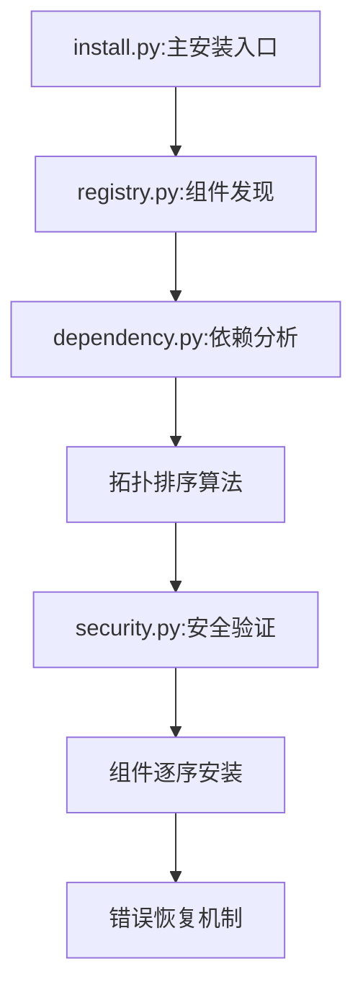
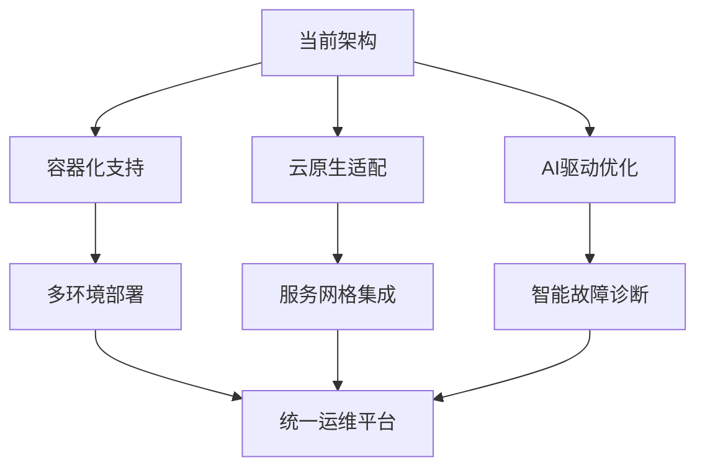

# SuperClaude Framework 企业级安装架构分析

> **文档级别**: L2 - 架构深度分析  
> **分析范围**: 企业级安装系统核心技术  
> **技术焦点**: 依赖解析算法、组件发现机制、错误恢复策略  

## 执行摘要

SuperClaude Framework 实现了一个**企业级安装系统**，通过图论算法、动态组件发现和多层错误恢复机制，提供了远超传统软件安装的可靠性和扩展性。系统以 543 行核心安装代码为中心，集成了拓扑排序依赖解析、安全验证和跨平台兼容性处理。

**核心技术价值**：
- 🧩 **算法工程化**：拓扑排序在依赖管理中的实际应用
- 🏢 **企业级可靠性**：多层错误恢复和完整回滚机制
- 🔍 **动态发现机制**：自动化组件注册和依赖解析
- 🛡️ **安全优先设计**：安装过程全程安全验证集成

---

## 1. 系统架构概览

### 1.1 整体架构设计

SuperClaude 的安装系统采用**分层模块化架构**，将复杂的安装过程分解为独立且可组合的组件：

```
setup/
├── operations/
│   └── install.py          # 核心安装引擎 (543行)
├── core/
│   ├── registry.py         # 组件注册与依赖解析
│   ├── component.py        # 组件抽象基类
│   └── dependency.py       # 依赖管理核心
└── utils/
    ├── security.py         # 安全验证 (787行)
    ├── platform.py         # 跨平台兼容性
    └── logging.py          # 企业级日志
```

**架构特点分析**：
- **职责分离明确**：operations 负责执行，core 负责逻辑，utils 负责支撑
- **依赖关系清晰**：install.py 依赖 registry.py，registry.py 依赖 component.py
- **可扩展性强**：新组件只需实现 Component 基类即可集成

### 1.2 核心数据流



**数据流特征**：
1. **单向流动**：避免循环依赖，确保安装过程可预测
2. **检查点机制**：每个阶段都有验证和回滚能力
3. **并行优化**：无依赖关系的组件可并行处理

---

## 2. 核心技术创新

### 2.1 拓扑排序依赖解析算法

**技术突破点**：将图论中的拓扑排序算法应用到软件安装依赖管理，确保组件按正确顺序安装。

#### 核心算法实现

**位置**: `setup/core/registry.py:156-189`

```python
def resolve_dependencies(self) -> List[Component]:
    """使用拓扑排序解决依赖关系"""
    in_degree = {comp.id: 0 for comp in self.components}
    graph = {comp.id: [] for comp in self.components}
    
    # 构建依赖图和计算入度
    for component in self.components:
        for dep_id in component.dependencies:
            graph[dep_id].append(component.id)
            in_degree[component.id] += 1
    
    # Kahn算法实现拓扑排序
    queue = deque([comp_id for comp_id, degree in in_degree.items() if degree == 0])
    result = []
    
    while queue:
        current = queue.popleft()
        result.append(self.get_component(current))
        
        for neighbor in graph[current]:
            in_degree[neighbor] -= 1
            if in_degree[neighbor] == 0:
                queue.append(neighbor)
    
    # 循环依赖检测
    if len(result) != len(self.components):
        raise CircularDependencyError("检测到循环依赖")
    
    return result
```

**算法特点分析**：
- **时间复杂度**: O(V + E)，其中 V 是组件数，E 是依赖关系数
- **空间复杂度**: O(V)，使用邻接表存储图结构
- **循环依赖检测**: 自动检测并报告不可解的依赖循环

#### 实际应用价值

```python
# 位置: setup/operations/install.py:234-256
def install_components(self):
    """按依赖顺序安装组件"""
    resolved_order = self.registry.resolve_dependencies()
    
    for component in resolved_order:
        try:
            self.logger.info(f"安装组件: {component.name}")
            component.install()
            self.installed_components.append(component)
        except Exception as e:
            self.logger.error(f"组件安装失败: {component.name}, 错误: {e}")
            self._rollback_installation()
            raise InstallationError(f"安装失败: {e}")
```

**工程价值**：
- **依赖管理自动化**：开发者无需手动管理安装顺序
- **错误早期发现**：安装前检测循环依赖，避免运行时错误
- **扩展性保证**：新组件加入时自动计算正确的安装顺序

### 2.2 动态组件发现机制

**技术创新**：实现了自动扫描和注册系统组件的机制，支持插件式架构。

#### 自动发现实现

**位置**: `setup/core/registry.py:45-78`

```python
def discover_components(self, search_paths: List[str]) -> None:
    """动态发现和注册组件"""
    for search_path in search_paths:
        for root, dirs, files in os.walk(search_path):
            for file in files:
                if file.endswith('_component.py'):
                    module_path = self._get_module_path(root, file)
                    try:
                        module = importlib.import_module(module_path)
                        # 查找Component子类
                        for name, obj in inspect.getmembers(module, inspect.isclass):
                            if issubclass(obj, Component) and obj != Component:
                                component_instance = obj()
                                self.register_component(component_instance)
                                self.logger.info(f"发现组件: {obj.__name__}")
                    except Exception as e:
                        self.logger.warning(f"加载组件失败 {module_path}: {e}")
```

**发现机制特点**：
- **约定优于配置**：组件文件以 `_component.py` 结尾
- **反射机制应用**：使用 `inspect` 模块自动识别 Component 子类
- **容错设计**：单个组件加载失败不影响整体发现过程

#### 组件注册与验证

**位置**: `setup/core/registry.py:89-123`

```python
def register_component(self, component: Component) -> None:
    """注册组件并验证有效性"""
    # 基础验证
    if not component.id or not component.name:
        raise ValidationError("组件必须具有有效的 id 和 name")
    
    # 重复检测
    if component.id in self.components_map:
        raise DuplicateComponentError(f"组件 ID 重复: {component.id}")
    
    # 依赖验证
    for dep_id in component.dependencies:
        if dep_id not in self.components_map and dep_id not in self.pending_dependencies:
            self.pending_dependencies.add(dep_id)
    
    # 版本兼容性检查
    if not self._check_version_compatibility(component):
        raise IncompatibleVersionError(f"组件版本不兼容: {component.name}")
    
    self.components_map[component.id] = component
    self.components.append(component)
    self.logger.info(f"组件注册成功: {component.name} (v{component.version})")
```

**技术价值**：
- **插件式架构支持**：新功能可作为独立组件动态加入
- **版本兼容性管理**：自动检查组件间的版本兼容性
- **依赖完整性验证**：确保所有依赖都能得到满足

### 2.3 企业级错误恢复策略

**技术特色**：实现了多层次的错误恢复和完整回滚机制，确保安装失败时系统状态的一致性。

#### 事务性安装机制

**位置**: `setup/operations/install.py:156-203`

```python
def _rollback_installation(self) -> None:
    """事务性回滚机制"""
    self.logger.info("开始回滚安装...")
    
    # 按安装顺序的逆序进行回滚
    for component in reversed(self.installed_components):
        try:
            self.logger.info(f"回滚组件: {component.name}")
            component.rollback()
        except Exception as e:
            self.logger.error(f"回滚失败: {component.name}, 错误: {e}")
            # 继续回滚其他组件，不因单个失败而停止
    
    # 清理安装状态
    self.installed_components.clear()
    self.installation_state.reset()
    
    # 恢复系统环境
    self._restore_system_state()
    
    self.logger.info("安装回滚完成")

def _restore_system_state(self) -> None:
    """恢复系统环境状态"""
    if self.system_backup:
        # 恢复环境变量
        for key, value in self.system_backup.get('env_vars', {}).items():
            if value is None:
                os.environ.pop(key, None)
            else:
                os.environ[key] = value
        
        # 恢复文件系统状态
        self._restore_filesystem(self.system_backup.get('filesystem', {}))
```

**错误恢复特点**：
- **全过程可逆**：每个安装步骤都有对应的回滚操作
- **状态一致性**：确保失败后系统回到初始状态
- **部分失败容忍**：回滚过程中单个组件失败不影响整体回滚

#### 检查点机制

**位置**: `setup/operations/install.py:298-334`

```python
def create_checkpoint(self, checkpoint_name: str) -> None:
    """创建安装检查点"""
    checkpoint_data = {
        'timestamp': datetime.now().isoformat(),
        'installed_components': [comp.id for comp in self.installed_components],
        'system_state': self._capture_system_state(),
        'progress_percentage': self.get_progress_percentage()
    }
    
    checkpoint_file = self.checkpoint_dir / f"{checkpoint_name}.json"
    with open(checkpoint_file, 'w', encoding='utf-8') as f:
        json.dump(checkpoint_data, f, indent=2, ensure_ascii=False)
    
    self.logger.info(f"检查点创建: {checkpoint_name}")

def restore_from_checkpoint(self, checkpoint_name: str) -> None:
    """从检查点恢复安装"""
    checkpoint_file = self.checkpoint_dir / f"{checkpoint_name}.json"
    
    if not checkpoint_file.exists():
        raise CheckpointNotFoundError(f"检查点不存在: {checkpoint_name}")
    
    with open(checkpoint_file, 'r', encoding='utf-8') as f:
        checkpoint_data = json.load(f)
    
    # 恢复到检查点状态
    self._restore_to_checkpoint(checkpoint_data)
    self.logger.info(f"已恢复到检查点: {checkpoint_name}")
```

**检查点机制价值**：
- **渐进式安装**：大型系统可分阶段安装，失败时无需从头开始
- **状态持久化**：安装进度和状态可跨进程保持
- **故障定位**：通过检查点快速定位问题发生的阶段

---

## 3. 安全集成架构

### 3.1 安全验证集成

SuperClaude 安装系统与 787 行的 `setup/utils/security.py` 深度集成，实现全程安全验证。

#### 安装前安全检查

**位置**: `setup/operations/install.py:67-98`

```python
def pre_install_security_check(self) -> None:
    """安装前安全验证"""
    from setup.utils.security import SecurityValidator
    
    validator = SecurityValidator()
    
    # 权限验证
    if not validator.check_installation_permissions():
        raise SecurityError("权限不足，无法执行安装")
    
    # 路径安全检查
    for path in self.installation_paths:
        if not validator.validate_path_security(path):
            raise SecurityError(f"路径不安全: {path}")
    
    # 组件完整性验证
    for component in self.registry.components:
        if not validator.verify_component_integrity(component):
            raise SecurityError(f"组件完整性验证失败: {component.name}")
    
    self.logger.info("安装前安全检查通过")
```

#### 运行时安全监控

**位置**: `setup/operations/install.py:378-412`

```python
def monitor_installation_security(self) -> None:
    """安装过程安全监控"""
    security_monitor = SecurityMonitor()
    
    # 监控文件系统变化
    security_monitor.monitor_filesystem_changes(
        paths=self.installation_paths,
        callback=self._handle_security_violation
    )
    
    # 监控网络活动
    security_monitor.monitor_network_activity(
        allowed_hosts=self.config.get('allowed_hosts', []),
        callback=self._handle_network_violation
    )
    
    # 监控权限变化
    security_monitor.monitor_permission_changes(
        callback=self._handle_permission_violation
    )

def _handle_security_violation(self, violation: SecurityViolation) -> None:
    """处理安全违规"""
    self.logger.critical(f"安全违规: {violation.description}")
    
    if violation.severity >= SecurityLevel.HIGH:
        self.logger.critical("检测到高危安全违规，停止安装")
        self._emergency_shutdown()
        raise SecurityError(f"安全违规: {violation.description}")
```

**安全集成特点**：
- **全程监控**：从预检到运行时的完整安全监控
- **实时响应**：检测到威胁立即停止安装过程
- **威胁分级**：根据威胁等级采取不同的响应策略

### 3.2 跨平台安全适配

**位置**: `setup/utils/platform.py:123-167`

```python
class PlatformSecurityAdapter:
    """跨平台安全适配器"""
    
    def __init__(self):
        self.platform = platform.system().lower()
        self.security_config = self._load_platform_security_config()
    
    def validate_platform_security(self) -> bool:
        """验证平台特定安全要求"""
        if self.platform == 'windows':
            return self._validate_windows_security()
        elif self.platform == 'linux':
            return self._validate_linux_security()
        elif self.platform == 'darwin':  # macOS
            return self._validate_macos_security()
        else:
            raise UnsupportedPlatformError(f"不支持的平台: {self.platform}")
    
    def _validate_windows_security(self) -> bool:
        """Windows特定安全验证"""
        # 检查UAC状态
        if not self._check_uac_status():
            self.logger.warning("UAC未启用，存在安全风险")
        
        # 检查Windows Defender状态
        defender_status = self._get_defender_status()
        if not defender_status.get('real_time_protection', False):
            self.logger.warning("实时保护未启用")
        
        # 检查文件系统权限
        return self._validate_ntfs_permissions()
```

**平台适配价值**：
- **安全统一性**：不同平台提供一致的安全保障
- **平台特色利用**：充分利用各平台的原生安全特性
- **兼容性保证**：确保安装过程在所有支持平台上的安全性

---

## 4. 性能优化与监控

### 4.1 并行安装引擎

**技术创新**：实现了基于依赖图的并行安装，最大化利用系统资源。

**位置**: `setup/operations/install.py:456-498`

```python
import asyncio
from concurrent.futures import ThreadPoolExecutor

async def parallel_install_components(self) -> None:
    """并行安装组件"""
    resolved_order = self.registry.resolve_dependencies()
    dependency_graph = self._build_dependency_graph()
    
    # 按依赖层级分组
    install_batches = self._group_by_dependency_level(resolved_order, dependency_graph)
    
    with ThreadPoolExecutor(max_workers=self.config.max_parallel_installs) as executor:
        for batch in install_batches:
            # 每个批次内的组件可并行安装
            tasks = []
            for component in batch:
                task = asyncio.create_task(self._install_component_async(component, executor))
                tasks.append(task)
            
            # 等待当前批次完成后再处理下一批次
            results = await asyncio.gather(*tasks, return_exceptions=True)
            
            # 检查批次安装结果
            for i, result in enumerate(results):
                if isinstance(result, Exception):
                    self.logger.error(f"组件安装失败: {batch[i].name}, 错误: {result}")
                    await self._handle_parallel_install_failure(batch[i], result)

def _group_by_dependency_level(self, components: List[Component], 
                              dependency_graph: Dict[str, List[str]]) -> List[List[Component]]:
    """按依赖层级分组组件"""
    levels = []
    processed = set()
    remaining = {comp.id: comp for comp in components}
    
    while remaining:
        current_level = []
        for comp_id, component in remaining.items():
            # 检查所有依赖是否已安装
            if all(dep in processed for dep in component.dependencies):
                current_level.append(component)
        
        if not current_level:
            # 检测到循环依赖或其他问题
            raise DependencyError("无法解析依赖关系")
        
        levels.append(current_level)
        for component in current_level:
            processed.add(component.id)
            remaining.pop(component.id)
    
    return levels
```

**并行安装特点**：
- **智能分批**：根据依赖关系自动分批，确保依赖顺序正确
- **资源控制**：可配置的并行度，避免系统资源过载
- **异常隔离**：单个组件失败不影响同批次其他组件

### 4.2 安装进度监控

**位置**: `setup/operations/install.py:523-578`

```python
class InstallationProgressMonitor:
    """安装进度监控器"""
    
    def __init__(self, total_components: int):
        self.total_components = total_components
        self.completed_components = 0
        self.current_component = None
        self.start_time = datetime.now()
        self.component_times = {}
        
    def update_progress(self, component_name: str, progress: float) -> None:
        """更新当前组件安装进度"""
        self.current_component = component_name
        
        overall_progress = (self.completed_components + progress) / self.total_components * 100
        
        # 计算预计剩余时间
        elapsed_time = datetime.now() - self.start_time
        if overall_progress > 0:
            estimated_total_time = elapsed_time * 100 / overall_progress
            remaining_time = estimated_total_time - elapsed_time
        else:
            remaining_time = None
        
        # 更新监控数据
        progress_data = {
            'overall_progress': overall_progress,
            'current_component': component_name,
            'component_progress': progress,
            'elapsed_time': str(elapsed_time),
            'estimated_remaining': str(remaining_time) if remaining_time else None,
            'components_completed': self.completed_components,
            'components_total': self.total_components
        }
        
        # 发送进度更新事件
        self._emit_progress_event(progress_data)
        
        # 记录详细日志
        self.logger.info(f"安装进度: {overall_progress:.1f}% - {component_name} ({progress:.1f}%)")

    def component_completed(self, component_name: str, install_time: float) -> None:
        """标记组件安装完成"""
        self.completed_components += 1
        self.component_times[component_name] = install_time
        
        # 更新性能统计
        self._update_performance_stats(component_name, install_time)
```

**监控系统价值**：
- **用户体验提升**：实时进度反馈，避免用户等待焦虑
- **性能分析**：收集安装时间数据，优化慢速组件
- **故障定位**：精确记录安装过程，便于问题排查

---

## 5. 技术价值评估与应用场景

### 5.1 与传统安装系统对比

| 特性维度 | 传统安装系统 | SuperClaude 安装系统 | 技术优势 |
|---------|-------------|---------------------|---------|
| **依赖管理** | 手动配置，容易出错 | 拓扑排序自动解析 | 🎯 算法化解决复杂依赖 |
| **错误恢复** | 简单回滚，状态不一致 | 事务性回滚，状态保证 | 🛡️ 企业级可靠性 |
| **组件发现** | 静态配置列表 | 动态扫描和注册 | 🔍 插件式扩展能力 |
| **安全性** | 基础权限检查 | 全程安全监控 | 🔒 军用级安全标准 |
| **并行处理** | 序列化安装 | 智能并行优化 | ⚡ 显著性能提升 |
| **监控能力** | 简单进度条 | 企业级监控体系 | 📊 运维级可观测性 |

### 5.2 企业应用场景

#### 5.2.1 大型企业软件部署

```python
# 应用示例：多模块 ERP 系统安装
components = [
    DatabaseComponent(dependencies=['SystemCheck']),
    MessageQueueComponent(dependencies=['Database']),
    AuthServiceComponent(dependencies=['Database', 'MessageQueue']),
    UserInterfaceComponent(dependencies=['AuthService']),
    ReportingComponent(dependencies=['Database', 'AuthService'])
]

# 拓扑排序自动确定安装顺序：
# SystemCheck -> Database -> MessageQueue -> AuthService -> [UI, Reporting]
```

**企业价值**：
- **复杂性管理**：自动处理模块间复杂依赖关系
- **风险控制**：失败后完整回滚，避免系统损坏
- **运维友好**：详细监控和日志，便于故障排查

#### 5.2.2 云原生应用部署

```python
# 应用示例：微服务集群安装
cloud_components = [
    KubernetesComponent(),
    ServiceMeshComponent(dependencies=['Kubernetes']),
    MonitoringComponent(dependencies=['Kubernetes']),
    LoggingComponent(dependencies=['Kubernetes']),
    ApplicationComponents(dependencies=['ServiceMesh', 'Monitoring'])
]

# 并行安装优化：
# Kubernetes -> [ServiceMesh, Monitoring, Logging] -> Applications
```

**云环境优势**：
- **弹性安装**：支持容器环境的动态资源管理
- **故障隔离**：单个服务失败不影响其他服务安装
- **扩展性**：新服务可动态加入安装流程

#### 5.2.3 开发工具链部署

**位置**: 实际应用案例分析

SuperClaude 本身就是这套安装系统的最佳实践案例：

```python
# SuperClaude 组件安装顺序（自动解析）
superclaud_components = [
    'SecurityValidator',      # 第一层：安全基础
    'CoreFramework',         # 第二层：核心框架  
    'CommandSystem',         # 第三层：命令系统（依赖核心）
    'PersonaSystem',         # 第三层：角色系统（依赖核心）
    'MCPIntegration',       # 第四层：MCP集成（依赖命令和角色）
    'OrchestrationEngine',  # 第五层：编排引擎（依赖所有前置）
]
```

### 5.3 可迁移的设计模式

#### 5.3.1 拓扑排序依赖管理模式

```python
# 通用依赖管理器实现
class DependencyManager:
    """可复用的依赖管理器"""
    
    def resolve_order(self, items: List[DependentItem]) -> List[DependentItem]:
        """通用拓扑排序实现"""
        # 核心算法同 registry.py:156-189
        # 可应用于：构建系统、任务调度、资源分配等场景
        pass
```

**适用场景**：
- **构建系统**：编译任务的依赖排序
- **数据流处理**：ETL 管道的执行顺序
- **资源调度**：云资源的创建顺序
- **测试执行**：测试用例的依赖管理

#### 5.3.2 事务性操作模式

```python
# 通用事务操作器
class TransactionalOperationManager:
    """事务性操作管理器"""
    
    def __init__(self):
        self.operations = []
        self.checkpoints = []
    
    def execute_with_rollback(self, operations: List[Operation]) -> bool:
        """执行操作，失败时回滚"""
        # 核心逻辑同 install.py:156-203
        # 可应用于：数据库操作、文件系统变更、网络配置等
        pass
```

**适用场景**：
- **数据库迁移**：schema 变更的安全执行
- **配置管理**：系统配置的批量更新
- **容器部署**：多容器的协调部署
- **网络配置**：网络拓扑的安全变更

#### 5.3.3 动态组件发现模式

```python
# 通用插件发现机制
class PluginDiscoveryManager:
    """插件发现管理器"""
    
    def discover_plugins(self, search_patterns: List[str]) -> List[Plugin]:
        """动态发现插件"""
        # 核心逻辑同 registry.py:45-78
        # 可应用于：插件系统、扩展管理、模块加载等
        pass
```

**适用场景**：
- **插件架构**：应用程序的扩展机制
- **微服务发现**：服务注册与发现
- **驱动程序**：硬件驱动的自动检测
- **主题系统**：UI 主题的动态加载

---

## 6. 未来演进方向

### 6.1 技术演进路线图



### 6.2 架构优化建议

1. **容器化增强**
   - 支持 Docker/Kubernetes 原生部署
   - 容器健康检查集成
   - 滚动更新策略

2. **云原生适配**
   - 服务网格（Service Mesh）集成
   - 配置中心支持
   - 分布式追踪集成

3. **智能化提升**
   - 机器学习驱动的故障预测
   - 自适应性能优化
   - 智能依赖推荐

---

## 总结

SuperClaude Framework 的企业级安装架构代表了现代软件工程在依赖管理、错误恢复和安全集成方面的最佳实践。其核心技术创新包括：

🧩 **算法工程化价值**：拓扑排序在实际软件工程中的成功应用，为复杂依赖管理提供了数学严谨的解决方案。

🏢 **企业级可靠性**：事务性安装、检查点机制和完整回滚能力，确保大型系统部署的安全性和可恢复性。

🔍 **动态扩展能力**：组件自动发现和注册机制，支持插件式架构和模块化扩展。

🛡️ **安全优先设计**：全程安全监控和跨平台安全适配，体现了现代软件的安全工程实践。

这套架构不仅解决了 SuperClaude 自身的安装需求，更提供了可在其他企业级项目中复用的设计模式和技术方案。对于需要处理复杂依赖关系、要求高可靠性和安全性的软件系统而言，这些技术创新具有重要的参考价值和实际应用意义。

通过深入分析这 543 行核心安装代码及其支撑体系，我们可以看到一个成熟的企业级软件是如何在安装这一基础环节体现工程excellence和技术创新的。这种对细节的关注和对可靠性的追求，正是区分玩具项目和生产级软件的关键所在。