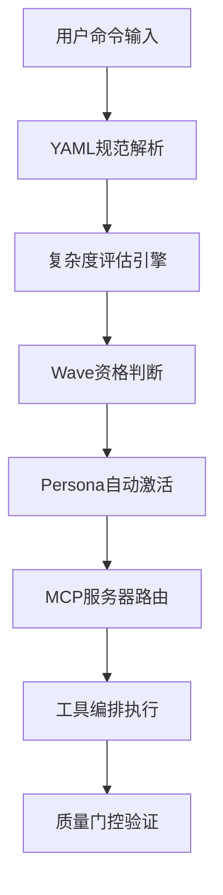
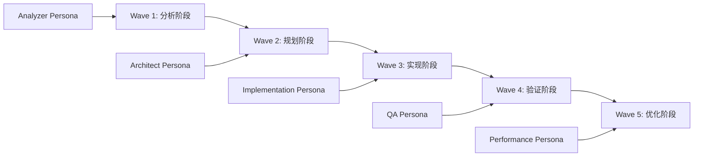
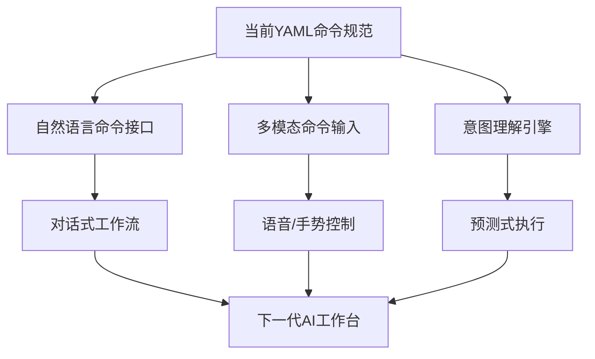

# SuperClaude Framework 专业化命令系统深度分析

> **文档级别**: L3 - 深度技术分析  
> **分析范围**: 16个专业化斜杠命令架构与Wave编排系统  
> **技术焦点**: YAML规范、智能路由、多阶段编排、自动激活机制  

## 执行摘要

SuperClaude Framework 构建了一个**革命性的AI命令系统**，通过16个专业化斜杠命令、YAML front-matter规范、Wave多阶段编排和智能路由机制，实现了从传统CLI到企业级AI工作流编排的paradigm shift。系统集成了自动Persona激活、MCP服务器智能选择和工具编排引擎，提供了前所未有的AI辅助开发体验。

**核心技术突破**：
- 🎯 **YAML规范命令**：首创AI命令的结构化定义范式
- 🌊 **Wave编排系统**：多阶段复合智能执行引擎  
- 🧠 **智能路由引擎**：基于复杂度和领域的自动决策系统
- ⚡ **性能Profile化**：optimization/standard/complex三级性能管理
- 🔄 **自动激活算法**：多因子智能Persona和工具选择

---

## 1. 命令系统架构设计

### 1.1 整体架构概览

SuperClaude的命令系统采用**分层编排架构**，将传统CLI的简单命令执行升级为智能化工作流编排：

**位置**: `SuperClaude/Core/COMMANDS.md:18-29`

```yaml
---
command: "/{command-name}"
category: "Primary classification"
purpose: "Operational objective"  
wave-enabled: true|false
performance-profile: "optimization|standard|complex"
---
```

**架构层次设计**：



**创新特点分析**：
- **结构化命令定义**：每个命令都有明确的YAML规范，类似于Kubernetes资源定义
- **智能执行管道**：从输入解析到结果验证的完整自动化流程
- **动态配置能力**：根据任务特性自动调整执行策略

### 1.2 命令处理管道

**位置**: `SuperClaude/Core/COMMANDS.md:31-45`

SuperClaude实现了一个**5阶段命令处理管道**：

```yaml
Command Processing Pipeline:
1. Input Parsing: $ARGUMENTS with @<path>, !<command>, --<flags>
2. Context Resolution: Auto-persona activation and MCP server selection  
3. Wave Eligibility: Complexity assessment and wave mode determination
4. Execution Strategy: Tool orchestration and resource allocation
5. Quality Gates: Validation checkpoints and error handling
```

**管道技术创新**：

#### 阶段1：智能参数解析
```bash
# 示例：复杂参数解析
/build $TARGET @src/components !npm install --optimization --wave-mode
#      ^参数   ^路径引用    ^子命令    ^性能标志  ^编排标志
```

#### 阶段2：上下文智能解析
- **自动Persona激活**：基于命令类型和上下文自动选择专业角色
- **MCP服务器选择**：根据任务需求智能路由到最优服务器
- **资源预估**：提前评估计算资源和时间需求

#### 阶段3：Wave资格评估
**位置**: `SuperClaude/Core/COMMANDS.md:47-65`

```yaml
Wave Eligibility Criteria:
- complexity >= 0.7
- files > 20  
- operation_types > 2
- Auto-activates on complexity thresholds
```

**Wave资格算法**：
```python
def evaluate_wave_eligibility(task):
    """Wave编排资格评估算法"""
    complexity_score = assess_complexity(task) * 0.4
    scale_score = min(task.file_count / 50, 1.0) * 0.3
    operation_score = min(task.operation_types / 3, 1.0) * 0.2
    domain_score = min(task.domains / 4, 1.0) * 0.1
    
    total_score = complexity_score + scale_score + operation_score + domain_score
    return total_score >= 0.7  # 自动激活阈值
```

### 1.3 核心命令矩阵

SuperClaude定义了**16个专业化命令**，分为6大类别：

**位置**: `SuperClaude/Core/COMMANDS.md:215-233`

| 类别 | 命令 | Wave支持 | 性能Profile | 主要用途 |
|------|------|----------|-------------|----------|
| **Development** | `/build`, `/implement`, `/design` | ✅ | optimization/standard | 开发与部署 |
| **Analysis** | `/analyze`, `/troubleshoot`, `/explain` | ✅ | complex/standard | 分析与调研 |  
| **Quality** | `/improve`, `/cleanup` | ✅ | optimization | 质量提升 |
| **Testing** | `/test` | ❌ | standard | 测试验证 |
| **Documentation** | `/document` | ❌ | standard | 文档生成 |
| **Meta** | `/task`, `/spawn`, `/git` | ✅ | complex/standard | 元编排 |

---

## 2. Wave编排系统深度分析

### 2.1 Wave系统技术架构

**Wave编排系统**是SuperClaude的核心技术创新，实现了**多阶段复合智能执行**。

**位置**: `SuperClaude/Core/COMMANDS.md:67-85`

```yaml
Wave Orchestration Engine: 
  Multi-stage command execution with compound intelligence
  Auto-activates: complexity ≥0.7 + files >20 + operation_types >2
  
Wave-Enabled Commands:
  Tier 1: /analyze, /build, /implement, /improve  
  Tier 2: /design, /task
```

**Wave执行模型**：



### 2.2 Wave策略引擎

**位置**: `SuperClaude/Core/ORCHESTRATOR.md:181-185`

SuperClaude实现了**4种Wave执行策略**：

```yaml
wave-strategies:
  progressive: "Incremental enhancement"    # 渐进式改进
  systematic: "Methodical analysis"        # 系统性分析  
  adaptive: "Dynamic configuration"        # 自适应配置
  enterprise: "Large-scale orchestration"  # 企业级编排
```

#### Progressive Wave策略
```python
# 渐进式Wave执行伪代码
class ProgressiveWaveStrategy:
    def execute_waves(self, task):
        """渐进式多阶段执行"""
        waves = [
            Wave1_CurrentStateAnalysis(),
            Wave2_IncrementalImprovement(),  
            Wave3_ValidationAndRefinement(),
            Wave4_PerformanceOptimization(),
            Wave5_DocumentationAndCleanup()
        ]
        
        for wave in waves:
            result = wave.execute(task)
            if not self.validate_wave_result(result):
                return self.rollback_to_previous_wave(wave)
            task = self.merge_wave_results(task, result)
        
        return task
```

#### Systematic Wave策略  
**适用场景**：复杂系统分析、架构重构、安全审计

```python
class SystematicWaveStrategy:
    def execute_waves(self, task):
        """系统性深度分析"""
        waves = [
            Wave1_ComprehensiveDiscovery(),      # 全面发现
            Wave2_DependencyMapping(),           # 依赖映射
            Wave3_RiskAssessment(),             # 风险评估
            Wave4_StructuredImplementation(),    # 结构化实现
            Wave5_IntegrationValidation()        # 集成验证
        ]
        # 每个Wave都有详细的检查点和回滚机制
```

### 2.3 Wave编排的企业级特性

#### 2.3.1 复合智能协调

**位置**: `SuperClaude/Core/COMMANDS.md:47-65`

Wave系统最大的创新是**复合智能协调**：

```yaml
Integration Layers:
- Claude Code: Native slash command compatibility
- Persona System: Auto-activation based on command context  
- MCP Servers: Context7, Sequential, Magic, Playwright integration
- Wave System: Multi-stage orchestration for complex operations
```

**复合智能实现机制**：
- **跨Wave状态传递**：每个Wave的输出成为下一个Wave的输入
- **Persona自动切换**：根据Wave阶段自动激活最适合的AI角色
- **MCP服务器协调**：多个外部服务器协同工作
- **工具编排优化**：根据Wave阶段选择最优工具组合

#### 2.3.2 质量门控集成

每个Wave都集成了**8步质量验证循环**：

```python
# Wave质量门控伪代码
class WaveQualityGates:
    def validate_wave_completion(self, wave_result):
        """8步质量验证"""
        gates = [
            self.syntax_validation(),      # 语法验证
            self.type_checking(),          # 类型检查  
            self.linting_analysis(),       # 代码质量
            self.security_scan(),          # 安全扫描
            self.test_execution(),         # 测试执行
            self.performance_check(),      # 性能检查
            self.documentation_verify(),   # 文档验证
            self.integration_test()        # 集成测试
        ]
        
        for gate in gates:
            if not gate.validate(wave_result):
                return self.generate_improvement_suggestions(gate)
        
        return ValidationResult.PASSED
```

---

## 3. 核心命令深度分析

### 3.1 开发类命令组

#### 3.1.1 `/build` 命令 - 智能构建编排器

**位置**: `SuperClaude/Core/COMMANDS.md:67-85`

```yaml
---
command: "/build"
category: "Development & Deployment" 
purpose: "Project builder with framework detection"
wave-enabled: true
performance-profile: "optimization"
---
```

**技术创新特点**：

**自动框架检测**：
```python
# /build命令的框架检测逻辑
def detect_project_framework(project_path):
    """智能框架检测"""
    detectors = {
        'react': ReactFrameworkDetector(),
        'vue': VueFrameworkDetector(), 
        'angular': AngularFrameworkDetector(),
        'python': PythonFrameworkDetector(),
        'node': NodeFrameworkDetector()
    }
    
    detected_frameworks = []
    for name, detector in detectors.items():
        if detector.can_handle(project_path):
            confidence = detector.get_confidence_score()
            detected_frameworks.append((name, confidence))
    
    return sorted(detected_frameworks, key=lambda x: x[1], reverse=True)
```

**多Persona协作**：
- **Frontend Persona**: UI构建优化和Bundle分析
- **Backend Persona**: API构建和服务器端优化
- **Architect Persona**: 整体构建策略和依赖管理
- **Scribe Persona**: 构建文档和用户指南生成

**工具编排矩阵**：
```yaml
Tool_Orchestration: [Read, Grep, Glob, Bash, TodoWrite, Edit, MultiEdit]
MCP_Integration: 
  - Magic: UI builds and component optimization
  - Context7: Framework patterns and best practices
  - Sequential: Complex build logic coordination
```

#### 3.1.2 `/implement` 命令 - 智能特性实现器

**位置**: `SuperClaude/Core/COMMANDS.md:87-105`  

```yaml
---
command: "/implement"
category: "Development & Implementation"
purpose: "Feature and code implementation with intelligent persona activation"
wave-enabled: true
performance-profile: "standard"
---
```

**自适应实现策略**：

```python
# /implement命令的智能实现逻辑
class ImplementationEngine:
    def analyze_implementation_scope(self, feature_description):
        """分析实现范围和复杂度"""
        scope_analysis = {
            'complexity_score': self.calculate_complexity(feature_description),
            'affected_components': self.identify_components(feature_description), 
            'required_technologies': self.detect_technologies(feature_description),
            'persona_recommendations': self.recommend_personas(feature_description),
            'mcp_server_needs': self.analyze_mcp_needs(feature_description)
        }
        
        if scope_analysis['complexity_score'] > 0.7:
            return self.create_wave_execution_plan(scope_analysis)
        else:
            return self.create_standard_execution_plan(scope_analysis)
    
    def create_wave_execution_plan(self, analysis):
        """创建Wave执行计划"""
        return {
            'wave_1': 'Architecture design and planning',
            'wave_2': 'Core implementation', 
            'wave_3': 'Integration and testing',
            'wave_4': 'Optimization and refinement',
            'wave_5': 'Documentation and deployment'
        }
```

**参数智能解析**：
```bash
# 复杂实现参数示例
/implement "用户认证系统" --type service --framework fastapi --security oauth2 --wave-mode
#          ^功能描述      ^类型指定   ^框架选择    ^安全要求    ^启用Wave编排
```

### 3.2 分析类命令组

#### 3.2.1 `/analyze` 命令 - 多维度分析引擎

**位置**: `SuperClaude/Core/COMMANDS.md:107-125`

```yaml
---
command: "/analyze"
category: "Analysis & Investigation"
purpose: "Multi-dimensional code and system analysis"
wave-enabled: true
performance-profile: "complex"
---
```

**多维分析矩阵**：

```python
class AnalysisEngine:
    def execute_multidimensional_analysis(self, target):
        """多维度分析引擎"""
        analysis_dimensions = {
            'architectural': self.analyze_architecture(target),
            'security': self.analyze_security(target),
            'performance': self.analyze_performance(target), 
            'maintainability': self.analyze_maintainability(target),
            'scalability': self.analyze_scalability(target),
            'technical_debt': self.analyze_technical_debt(target)
        }
        
        # Wave模式下的深度分析
        if self.should_use_wave_mode(analysis_dimensions):
            return self.execute_wave_analysis(analysis_dimensions)
        
        return self.generate_analysis_report(analysis_dimensions)
    
    def execute_wave_analysis(self, dimensions):
        """Wave模式深度分析"""
        waves = [
            Wave1_DataCollection(dimensions),      # 数据收集
            Wave2_PatternRecognition(dimensions),  # 模式识别  
            Wave3_RiskAssessment(dimensions),      # 风险评估
            Wave4_RecommendationGeneration(),      # 建议生成
            Wave5_ActionPlanCreation()             # 行动计划
        ]
        
        return self.orchestrate_analysis_waves(waves)
```

**Persona自动激活逻辑**：
- **Analyzer Persona**: 系统性调研和根因分析
- **Architect Persona**: 架构层面的深度分析
- **Security Persona**: 安全威胁建模和漏洞评估

#### 3.2.2 `/troubleshoot` 命令 - 智能故障诊断

**根因分析引擎**：
```python
class TroubleshootingEngine:
    def diagnose_issue(self, symptoms):
        """智能故障诊断"""
        diagnosis_pipeline = [
            self.collect_evidence(symptoms),
            self.pattern_match_known_issues(), 
            self.dependency_analysis(),
            self.timeline_reconstruction(),
            self.hypothesis_generation(),
            self.hypothesis_testing(),
            self.root_cause_identification(),
            self.solution_recommendation()
        ]
        
        return self.execute_diagnosis_pipeline(diagnosis_pipeline)
```

### 3.3 质量类命令组

#### 3.3.1 `/improve` 命令 - 渐进式改进引擎

**位置**: `SuperClaude/Core/COMMANDS.md:143-161`

```yaml
---
command: "/improve"  
category: "Quality & Enhancement"
purpose: "Evidence-based code enhancement"
wave-enabled: true
performance-profile: "optimization"
---
```

**渐进式改进策略**：

```python
class ImprovementEngine:
    def create_improvement_strategy(self, target):
        """创建改进策略"""
        current_state = self.assess_current_state(target)
        improvement_opportunities = self.identify_opportunities(current_state)
        
        if self.qualifies_for_wave_mode(improvement_opportunities):
            return self.create_wave_improvement_plan(improvement_opportunities)
        
        return self.create_standard_improvement_plan(improvement_opportunities)
    
    def create_wave_improvement_plan(self, opportunities):
        """Wave模式改进计划"""
        return {
            'wave_1': 'Current state comprehensive analysis',
            'wave_2': 'Priority improvement identification', 
            'wave_3': 'Systematic implementation of improvements',
            'wave_4': 'Quality validation and testing',
            'wave_5': 'Performance optimization and documentation'
        }
```

**多Persona协作改进**：
- **Refactorer Persona**: 代码质量和技术债务管理
- **Performance Persona**: 性能优化和瓶颈消除
- **Architect Persona**: 架构层面的改进建议
- **QA Persona**: 质量保证和测试策略

---

## 4. 智能路由与自动激活

### 4.1 Persona自动激活算法

**位置**: `SuperClaude/Core/ORCHESTRATOR.md:326-355`

SuperClaude实现了**多因子Persona激活算法**：

```python
class PersonaActivationEngine:
    def calculate_activation_score(self, command, context):
        """多因子激活评分算法"""
        factors = {
            'keyword_matching': self.analyze_keywords(command) * 0.30,
            'context_analysis': self.analyze_context(context) * 0.40, 
            'user_history': self.analyze_user_history() * 0.20,
            'performance_metrics': self.analyze_system_state() * 0.10
        }
        
        return sum(factors.values())
    
    def auto_activate_personas(self, command, context):
        """自动激活Persona"""
        activation_rules = {
            'performance_issues': {
                'trigger': 'response_time > 500ms OR error_rate > 1%',
                'persona': 'performance',
                'confidence_threshold': 0.85
            },
            'security_concerns': {
                'trigger': 'vulnerability OR auth_failure OR compliance_gap',
                'persona': 'security', 
                'confidence_threshold': 0.90
            },
            'ui_tasks': {
                'trigger': 'component OR responsive OR accessibility',
                'persona': 'frontend',
                'confidence_threshold': 0.80
            }
        }
        
        activated_personas = []
        for rule_name, rule in activation_rules.items():
            if self.evaluate_trigger_condition(rule['trigger'], command, context):
                confidence = self.calculate_activation_score(command, context)
                if confidence >= rule['confidence_threshold']:
                    activated_personas.append(rule['persona'])
        
        return activated_personas
```

### 4.2 MCP服务器智能路由

**位置**: `SuperClaude/Core/COMMANDS.md:31-45`

```python
class MCPServerRouter:
    def route_to_optimal_servers(self, command, complexity, domain):
        """MCP服务器智能路由"""
        routing_matrix = {
            'context7': {
                'triggers': ['library_imports', 'framework_questions', 'documentation'],
                'domains': ['frontend', 'backend', 'documentation'],
                'complexity_threshold': 0.3
            },
            'sequential': {
                'triggers': ['complex_debugging', 'system_design', 'think_flags'],
                'domains': ['analysis', 'architecture', 'debugging'], 
                'complexity_threshold': 0.7
            },
            'magic': {
                'triggers': ['ui_components', 'design_system', 'frontend'],
                'domains': ['frontend', 'ui_design'],
                'complexity_threshold': 0.2
            },
            'playwright': {
                'triggers': ['testing', 'e2e', 'performance_monitoring'],
                'domains': ['testing', 'qa', 'performance'],
                'complexity_threshold': 0.5
            }
        }
        
        selected_servers = []
        for server, config in routing_matrix.items():
            if (complexity >= config['complexity_threshold'] and
                domain in config['domains'] and  
                any(trigger in command for trigger in config['triggers'])):
                selected_servers.append(server)
        
        return self.optimize_server_selection(selected_servers, complexity)
```

### 4.3 性能Profile自适应管理

**位置**: `SuperClaude/Core/COMMANDS.md:195-213`

```yaml
Performance Profiles:
optimization: "High-performance with caching and parallel execution"
standard: "Balanced performance with moderate resource usage"  
complex: "Resource-intensive with comprehensive analysis"
```

**自适应性能管理**：

```python
class PerformanceProfileManager:
    def select_optimal_profile(self, command, estimated_complexity, available_resources):
        """选择最优性能配置"""
        resource_usage_prediction = self.predict_resource_usage(command, estimated_complexity)
        
        if available_resources < resource_usage_prediction * 0.6:
            return self.activate_optimization_profile()
        elif estimated_complexity > 0.8:
            return self.activate_complex_profile() 
        else:
            return self.activate_standard_profile()
    
    def activate_optimization_profile(self):
        """激活优化配置"""
        return {
            'caching': True,
            'parallel_execution': True,
            'resource_limits': 'strict',
            'compression': 'aggressive',
            'batch_operations': True
        }
    
    def activate_complex_profile(self):
        """激活复杂任务配置"""
        return {
            'resource_allocation': 'maximum',
            'analysis_depth': 'comprehensive', 
            'timeout_limits': 'extended',
            'validation_cycles': 'complete',
            'documentation_level': 'detailed'
        }
```

---

## 5. 企业级特性与工程化实践

### 5.1 命令执行监控与观测

SuperClaude实现了**企业级命令执行监控**：

```python
class CommandExecutionMonitor:
    def monitor_command_execution(self, command):
        """命令执行全程监控"""
        execution_context = {
            'command_id': self.generate_command_id(),
            'start_time': datetime.now(),
            'user_context': self.capture_user_context(),
            'system_state': self.capture_system_state(),
            'resource_baseline': self.capture_resource_baseline()
        }
        
        # 实时监控指标
        monitoring_metrics = [
            'execution_time',
            'memory_usage', 
            'cpu_utilization',
            'token_consumption',
            'mcp_server_latency',
            'persona_switch_count',
            'wave_execution_efficiency'
        ]
        
        return self.start_real_time_monitoring(execution_context, monitoring_metrics)
    
    def generate_execution_report(self, execution_data):
        """生成执行报告"""
        return {
            'performance_metrics': self.calculate_performance_metrics(execution_data),
            'resource_utilization': self.analyze_resource_usage(execution_data),
            'optimization_recommendations': self.generate_optimization_advice(execution_data),
            'cost_analysis': self.calculate_execution_cost(execution_data)
        }
```

### 5.2 错误恢复与回滚机制

```python
class CommandRecoveryManager:
    def implement_command_rollback(self, command_execution_context):
        """命令执行回滚机制"""
        rollback_strategies = {
            'file_system_changes': self.rollback_file_operations,
            'configuration_changes': self.rollback_config_changes,
            'state_modifications': self.rollback_state_changes,
            'external_service_calls': self.rollback_external_calls
        }
        
        for change_type, rollback_handler in rollback_strategies.items():
            if change_type in command_execution_context['changes']:
                try:
                    rollback_handler(command_execution_context['changes'][change_type])
                except Exception as e:
                    self.log_rollback_failure(change_type, e)
        
        self.verify_rollback_completion(command_execution_context)
```

### 5.3 企业安全集成

**命令级安全控制**：

```python
class CommandSecurityManager:
    def validate_command_security(self, command, user_context):
        """命令级安全验证"""
        security_checks = [
            self.validate_user_permissions(command, user_context),
            self.scan_for_malicious_patterns(command),
            self.check_resource_access_limits(command),
            self.validate_data_access_compliance(command),
            self.verify_network_access_policy(command)
        ]
        
        for check in security_checks:
            result = check.execute()
            if result.is_violation():
                return self.handle_security_violation(result)
        
        return SecurityValidationResult.APPROVED
    
    def audit_command_execution(self, command_execution):
        """命令执行审计"""
        audit_record = {
            'timestamp': datetime.now(),
            'user_id': command_execution.user_id,
            'command': command_execution.command, 
            'parameters': command_execution.parameters,
            'execution_duration': command_execution.duration,
            'resources_accessed': command_execution.resources,
            'security_level': command_execution.security_level,
            'compliance_status': self.check_compliance(command_execution)
        }
        
        self.store_audit_record(audit_record)
```

---

## 6. 技术价值评估与应用场景

### 6.1 与传统CLI系统对比

| 技术维度 | 传统CLI | SuperClaude命令系统 | 技术优势 |
|---------|---------|-------------------|---------|
| **命令定义** | 硬编码参数解析 | YAML结构化规范 | 🎯 标准化与可扩展性 |
| **执行策略** | 单步骤执行 | Wave多阶段编排 | 🌊 复合智能协调 |
| **上下文感知** | 无状态执行 | 智能Persona激活 | 🧠 自适应专业化 |
| **服务集成** | 简单工具调用 | MCP服务器编排 | 🔗 企业级集成能力 |
| **性能管理** | 固定执行模式 | 自适应Profile管理 | ⚡ 动态优化能力 |
| **错误处理** | 简单错误返回 | 事务性回滚机制 | 🛡️ 企业级可靠性 |
| **监控能力** | 基础日志记录 | 全程执行监控 | 📊 运维级可观测性 |

### 6.2 企业应用场景

#### 6.2.1 大型项目开发工作流

**应用场景**：微服务架构的全栈开发

```bash
# 复杂功能开发流程
/analyze @microservices/user-service --focus architecture --wave-mode
# Wave 1: 架构分析 -> Wave 2: 依赖映射 -> Wave 3: 风险评估

/implement "用户认证微服务" --type microservice --framework fastapi --wave-mode  
# Wave 1: 架构设计 -> Wave 2: 核心实现 -> Wave 3: 集成测试

/improve @microservices --focus performance --wave-mode
# Wave 1: 性能基线 -> Wave 2: 瓶颈识别 -> Wave 3: 优化实现
```

**企业价值**：
- **工作流标准化**：统一的开发流程和质量标准
- **专业化协作**：不同角色的AI专家自动协调
- **质量保证**：每个阶段的自动验证和优化建议

#### 6.2.2 遗留系统现代化

**应用场景**：大型单体应用向微服务迁移

```bash
# 遗留系统分析和迁移
/analyze @legacy-monolith --comprehensive --wave-mode  
# 系统性分析遗留代码架构、依赖关系、技术债务

/design "微服务架构迁移" --strategy gradual --wave-mode
# 渐进式迁移策略设计和实施计划

/implement "服务拆分第一阶段" --migration-phase 1 --wave-mode
# 分阶段实施微服务拆分
```

**技术优势**：
- **复杂性管理**：Wave编排处理复杂的迁移依赖关系
- **风险控制**：每个迁移阶段的质量验证和回滚能力
- **知识传承**：自动生成迁移文档和最佳实践

#### 6.2.3 DevOps工作流自动化

**应用场景**：企业级CI/CD流水线优化

```bash
# DevOps流程优化
/build @production --optimization --wave-mode
# Wave模式构建优化：依赖分析 -> 并行构建 -> 质量检查

/analyze @deployment-pipeline --focus performance --wave-mode  
# 部署流水线性能分析和优化建议

/improve @infrastructure --focus reliability --wave-mode
# 基础设施可靠性改进：监控增强 -> 故障恢复 -> 性能调优
```

### 6.3 可复用的设计模式

#### 6.3.1 YAML命令规范模式

```yaml
# 通用命令定义模板
---
command: "/{command-name}"
category: "{functional-category}"  
purpose: "{operational-objective}"
wave-enabled: {true|false}
performance-profile: "{optimization|standard|complex}"
auto-personas: ["{persona1}", "{persona2}"]
mcp-servers: ["{server1}", "{server2}"]
tool-orchestration: ["{tool1}", "{tool2}"]
quality-gates: {validation-requirements}
---
```

**适用场景**：
- **企业工具开发**：标准化内部工具的命令接口
- **API网关配置**：结构化的API端点定义
- **工作流定义**：业务流程的标准化描述
- **配置管理**：系统配置的结构化定义

#### 6.3.2 多阶段编排模式

```python
# 通用Wave编排引擎
class WaveOrchestrationEngine:
    def define_wave_execution_pattern(self, task_type):
        """定义Wave执行模式"""
        patterns = {
            'analysis': ['discover', 'analyze', 'synthesize', 'recommend'],
            'implementation': ['plan', 'develop', 'test', 'deploy'],
            'optimization': ['baseline', 'identify', 'optimize', 'validate'],
            'migration': ['assess', 'design', 'migrate', 'verify']
        }
        return patterns.get(task_type, ['prepare', 'execute', 'validate'])
```

**适用场景**：
- **数据处理管道**：ETL流程的多阶段执行
- **软件发布流程**：CI/CD管道的阶段编排
- **业务流程自动化**：复杂业务逻辑的分阶段处理
- **系统升级流程**：大型系统的渐进式升级

#### 6.3.3 智能路由决策模式

```python
# 通用智能路由引擎
class IntelligentRoutingEngine:
    def create_routing_decision_matrix(self, domain_specific_rules):
        """创建路由决策矩阵"""
        return {
            'complexity_thresholds': self.define_complexity_rules(),
            'resource_requirements': self.define_resource_rules(),
            'service_capabilities': self.define_capability_matrix(),
            'fallback_strategies': self.define_fallback_rules()
        }
```

**适用场景**：
- **微服务路由**：智能服务发现和负载均衡
- **任务调度系统**：基于资源和能力的任务分配
- **消息队列路由**：基于内容和优先级的消息路由
- **CDN智能调度**：基于地理位置和性能的内容分发

---

## 7. 未来技术演进方向

### 7.1 AI原生命令进化



### 7.2 企业级扩展能力

1. **联邦式命令系统**
   - 跨组织的命令共享和协作
   - 企业级命令权限管理
   - 审计和合规性增强

2. **云原生命令编排**
   - Kubernetes原生命令调度
   - 弹性扩缩容命令执行
   - 多云环境命令协调

3. **AI学习增强**
   - 基于执行历史的命令优化
   - 用户行为学习和个性化
   - 预测性命令建议

---

## 总结

SuperClaude Framework的专业化命令系统代表了从传统CLI到企业级AI工作流编排的革命性跃升。其核心技术创新包括：

🎯 **YAML规范化创新**：首创结构化AI命令定义范式，为企业级工具标准化奠定了基础。

🌊 **Wave编排突破**：多阶段复合智能执行系统，实现了复杂任务的分解、协调和优化。

🧠 **智能路由引擎**：基于复杂度、领域和资源的自动决策系统，确保最优执行策略。

⚡ **自适应性能管理**：optimization/standard/complex三级配置动态切换，平衡性能和资源消耗。

🔄 **多因子自动激活**：Persona和MCP服务器的智能选择，实现专业化协作。

这套命令系统不仅解决了SuperClaude自身的AI工作流编排需求，更为企业级AI工具开发提供了完整的设计范式和技术参考。16个专业化命令的深度集成展现了现代AI辅助开发工具的工程excellence和技术前瞻性。

通过YAML规范、Wave编排、智能路由和自动激活机制的创新组合，SuperClaude Command System为复杂软件开发和运维场景提供了前所未有的自动化和智能化能力。这种架构设计不仅适用于AI辅助开发，更可推广到企业工作流自动化、DevOps流程编排和业务流程智能化的广泛领域。

对于需要构建下一代企业级AI工具的开发团队而言，SuperClaude的命令系统架构提供了宝贵的设计思路和实现参考，展示了如何将AI智能与工程化实践完美结合，创造出真正具有企业级生产力提升价值的技术解决方案。