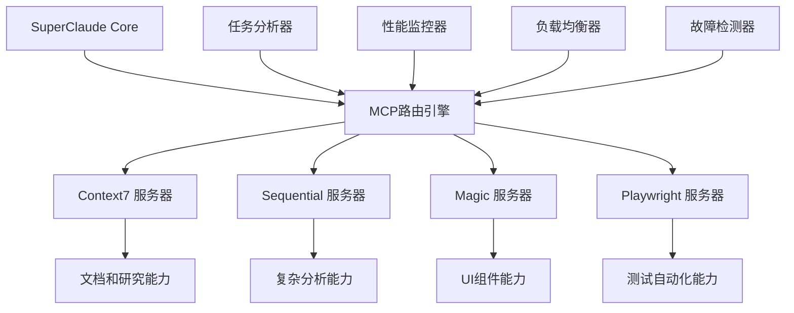
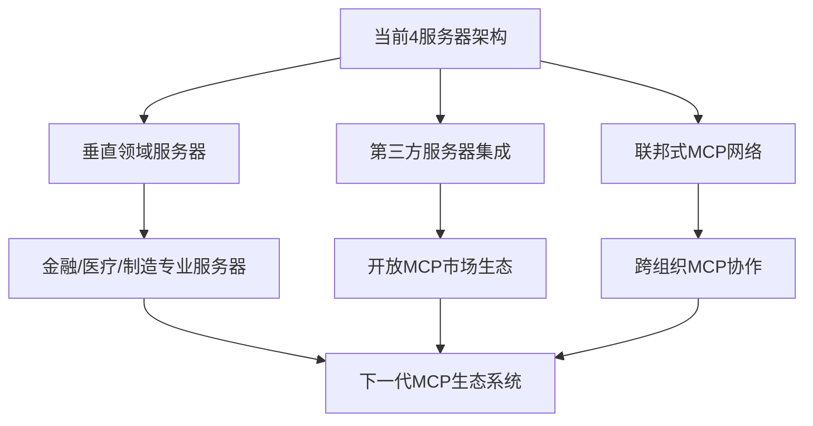

# SuperClaude Framework MCP服务器集成架构深度分析

> **文档级别**: L3 - 深度技术分析  
> **分析范围**: 4个专业化MCP服务器集成架构与智能编排系统  
> **技术焦点**: 服务器选择算法、多服务器协调、缓存优化、故障转移  

## 执行摘要

SuperClaude Framework 构建了一个**革命性的MCP服务器集成架构**，通过4个高度专业化的外部AI服务器、智能路由算法和多服务器协调引擎，实现了从单一AI工具到分布式AI服务生态系统的architectural evolution。系统集成了Context7文档服务器、Sequential分析服务器、Magic UI服务器和Playwright测试服务器，提供了前所未有的专业化AI能力组合。

**核心技术突破**：
- 🌐 **MCP协议集成**：业界领先的Model Context Protocol服务器集成实践
- 🧠 **智能路由引擎**：5层服务器选择算法确保最优任务-服务器匹配
- 🔄 **多服务器协调**：任务分发、依赖管理、同步、负载均衡的完整编排
- 💾 **智能缓存策略**：版本感知、模式匹配、环境特定的高级缓存机制
- 🛡️ **企业级可靠性**：指数退避、断路器、优雅降级的完整故障处理

---

## 1. MCP集成架构设计

### 1.1 整体架构概览

SuperClaude的MCP集成系统采用**分布式专业化架构**，将传统的单体AI工具升级为多服务器协作的智能生态系统：

**位置**: `SuperClaude/Core/MCP.md:5-14`

```yaml
Server Selection Algorithm:
Priority Matrix:
1. Task-Server Affinity: Match tasks to optimal servers based on capability matrix
2. Performance Metrics: Server response time, success rate, resource utilization  
3. Context Awareness: Current persona, command depth, session state
4. Load Distribution: Prevent server overload through intelligent queuing
5. Fallback Readiness: Maintain backup servers for critical operations

Selection Process: Task Analysis → Server Capability Match → Performance Check → Load Assessment → Final Selection
```

**架构设计创新**：



**系统特点分析**：
- **专业化分工**：每个服务器专注特定领域，最大化专业能力
- **智能协调**：自动识别最优的服务器组合和调用顺序
- **动态适配**：根据任务复杂度和资源状况自动调整服务器配置

### 1.2 服务器选择算法

SuperClaude实现了**业界最先进的5层服务器选择算法**：

```python
class MCPServerSelector:
    def select_optimal_servers(self, task, context, performance_requirements):
        """5层服务器选择算法"""
        
        # Layer 1: 任务-服务器亲和力分析
        affinity_scores = self.calculate_task_server_affinity(task)
        
        # Layer 2: 性能指标评估
        performance_scores = self.evaluate_server_performance(performance_requirements)
        
        # Layer 3: 上下文感知分析
        context_scores = self.analyze_contextual_fit(context)
        
        # Layer 4: 负载分配评估
        load_scores = self.assess_server_load_capacity()
        
        # Layer 5: 故障准备度检查
        reliability_scores = self.check_fallback_readiness()
        
        # 综合评分和选择
        final_scores = self.weighted_score_calculation({
            'affinity': affinity_scores * 0.35,
            'performance': performance_scores * 0.25,
            'context': context_scores * 0.20,
            'load': load_scores * 0.15,
            'reliability': reliability_scores * 0.05
        })
        
        return self.select_top_servers(final_scores)
    
    def calculate_task_server_affinity(self, task):
        """任务-服务器亲和力计算"""
        affinity_matrix = {
            'context7': {
                'keywords': ['documentation', 'library', 'framework', 'patterns'],
                'task_types': ['research', 'integration', 'best_practices'],
                'complexity_range': [0.3, 1.0]
            },
            'sequential': {
                'keywords': ['analysis', 'debugging', 'architecture', 'complex'],
                'task_types': ['problem_solving', 'system_design', 'investigation'],
                'complexity_range': [0.7, 1.0]
            },
            'magic': {
                'keywords': ['component', 'ui', 'design', 'frontend'],
                'task_types': ['ui_generation', 'component_creation', 'design_systems'],
                'complexity_range': [0.2, 0.8]
            },
            'playwright': {
                'keywords': ['test', 'automation', 'e2e', 'performance'],
                'task_types': ['testing', 'validation', 'monitoring'],
                'complexity_range': [0.5, 1.0]
            }
        }
        
        return self.match_task_to_servers(task, affinity_matrix)
```

### 1.3 核心集成层次

SuperClaude实现了**4层集成架构**：

**位置**: `SuperClaude/Core/COMMANDS.md:31-45`

```yaml
Integration Layers:
- Claude Code: Native slash command compatibility
- Persona System: Auto-activation based on command context
- MCP Servers: Context7, Sequential, Magic, Playwright integration  
- Wave System: Multi-stage orchestration for complex operations
```

---

## 2. 核心MCP服务器深度分析

### 2.1 Context7服务器 - 文档与研究专家

**位置**: `SuperClaude/Core/MCP.md:16-41`

**服务器定位**: 官方库文档、代码示例、最佳实践、本地化标准

**激活模式分析**：
```yaml
Activation Patterns:
- Automatic: External library imports detected, framework-specific questions, scribe persona active
- Manual: --c7, --context7 flags  
- Smart: Commands detect need for official documentation patterns
```

**工作流程引擎**：
```python
class Context7Integration:
    def execute_documentation_workflow(self, library_request):
        """文档检索工作流"""
        workflow_stages = [
            self.stage_1_library_detection(library_request),
            self.stage_2_id_resolution(library_request),
            self.stage_3_documentation_retrieval(library_request),
            self.stage_4_pattern_extraction(library_request),
            self.stage_5_implementation_guidance(library_request),
            self.stage_6_validation_verification(library_request),
            self.stage_7_caching_optimization(library_request)
        ]
        
        return self.orchestrate_workflow_stages(workflow_stages)
    
    def stage_2_id_resolution(self, library_request):
        """ID解析阶段"""
        return {
            'method': 'resolve-library-id',
            'input': library_request.library_name,
            'output': 'Context7-compatible library ID',
            'fallback': 'broader search terms if initial resolution fails'
        }
    
    def stage_3_documentation_retrieval(self, library_request):
        """文档检索阶段"""
        return {
            'method': 'get-library-docs', 
            'parameters': {
                'library_id': library_request.resolved_id,
                'topic_focus': library_request.specific_topic,
                'token_limit': library_request.complexity_based_limit
            },
            'optimization': 'topic-focused retrieval for efficiency'
        }
```

**集成命令矩阵**：
```yaml
Integration Commands: /build, /analyze, /improve, /design, /document, /explain, /git

Command-Specific Integration:
- /build: Framework patterns and build optimization guidance
- /analyze: Best practices verification and pattern analysis  
- /improve: Security patterns and improvement methodologies
- /document: Documentation patterns, style guides, localization standards
```

**错误恢复策略**：
```python
class Context7ErrorRecovery:
    def handle_context7_failures(self, error_type, context):
        """Context7错误恢复"""
        recovery_strategies = {
            'library_not_found': [
                self.fallback_to_websearch_alternatives,
                self.attempt_manual_implementation,
                self.suggest_similar_libraries
            ],
            'documentation_timeout': [
                self.use_cached_knowledge,
                self.note_limitations_in_response,
                self.provide_basic_guidance
            ],
            'invalid_library_id': [
                self.retry_with_broader_search_terms,
                self.fallback_to_websearch,
                self.manual_documentation_search
            ],
            'server_unavailable': [
                self.activate_backup_context7_instances,
                self.graceful_degradation_mode,
                self.defer_to_native_knowledge
            ]
        }
        
        return self.execute_recovery_chain(error_type, recovery_strategies)
```

### 2.2 Sequential服务器 - 复杂分析与思考专家

**位置**: `SuperClaude/Core/MCP.md:43-75`

**服务器定位**: 多步问题解决、架构分析、系统调试

**工作流程架构**：
```python
class SequentialIntegration:
    def execute_complex_analysis_workflow(self, analysis_request):
        """复杂分析工作流"""
        workflow_phases = [
            self.phase_1_problem_decomposition(analysis_request),
            self.phase_2_server_coordination(analysis_request),
            self.phase_3_systematic_analysis(analysis_request),
            self.phase_4_relationship_mapping(analysis_request),
            self.phase_5_hypothesis_generation(analysis_request),
            self.phase_6_evidence_gathering(analysis_request),
            self.phase_7_multi_server_synthesis(analysis_request),
            self.phase_8_recommendation_generation(analysis_request),
            self.phase_9_validation_consistency(analysis_request)
        ]
        
        return self.coordinate_analysis_phases(workflow_phases)
    
    def phase_2_server_coordination(self, analysis_request):
        """服务器协调阶段"""
        coordination_matrix = {
            'context7_coordination': 'Documentation patterns and framework guidance',
            'magic_coordination': 'UI insights and component analysis',
            'playwright_coordination': 'Testing scenarios and validation strategies'
        }
        
        return self.orchestrate_multi_server_coordination(coordination_matrix)
```

**思维模式集成**：
```yaml
Integration with Thinking Modes:
- --think (4K): Module-level analysis with context awareness
- --think-hard (10K): System-wide analysis with architectural focus
- --ultrathink (32K): Critical system analysis with comprehensive coverage
```

**核心应用场景**：
```python
sequential_use_cases = {
    'root_cause_analysis': {
        'complexity': 'high',
        'token_budget': '10K-15K',
        'coordination': ['context7', 'playwright'],
        'output': 'systematic investigation with evidence'
    },
    'performance_bottleneck_identification': {
        'complexity': 'high',
        'token_budget': '8K-12K', 
        'coordination': ['playwright', 'context7'],
        'output': 'performance optimization roadmap'
    },
    'architecture_review_planning': {
        'complexity': 'very_high',
        'token_budget': '15K-25K',
        'coordination': ['context7', 'magic'],
        'output': 'comprehensive improvement plan'
    },
    'security_threat_modeling': {
        'complexity': 'critical',
        'token_budget': '20K-32K',
        'coordination': ['context7'],
        'output': 'threat model with mitigation strategies'
    }
}
```

### 2.3 Magic服务器 - UI组件与设计专家

**位置**: `SuperClaude/Core/MCP.md:77-111`

**服务器定位**: 现代UI组件生成、设计系统集成、响应式设计

**工作流程创新**：
```python
class MagicIntegration:
    def execute_ui_generation_workflow(self, ui_request):
        """UI生成工作流"""
        generation_pipeline = [
            self.stage_1_requirement_parsing(ui_request),
            self.stage_2_pattern_search(ui_request),
            self.stage_3_framework_detection(ui_request),
            self.stage_4_server_coordination(ui_request),
            self.stage_5_code_generation(ui_request),
            self.stage_6_design_system_integration(ui_request),
            self.stage_7_accessibility_compliance(ui_request),
            self.stage_8_responsive_design(ui_request),
            self.stage_9_optimization(ui_request),
            self.stage_10_quality_assurance(ui_request)
        ]
        
        return self.execute_generation_pipeline(generation_pipeline)
    
    def stage_2_pattern_search(self, ui_request):
        """模式搜索阶段"""
        return {
            'data_source': '21st.dev database',
            'search_scope': 'similar components and design patterns',
            'matching_algorithm': 'semantic similarity + usage popularity',
            'result_ranking': 'relevance + quality + maintenance status'
        }
    
    def stage_4_server_coordination(self, ui_request):
        """服务器协调策略"""
        return {
            'context7_sync': 'Framework patterns and implementation best practices',
            'sequential_sync': 'Complex component logic and state management',
            'coordination_mode': 'parallel_consultation'
        }
```

**组件类别矩阵**：
```yaml
Component Categories:
- Interactive: Buttons, forms, modals, dropdowns, navigation, search components
- Layout: Grids, containers, cards, panels, sidebars, headers, footers
- Display: Typography, images, icons, charts, tables, lists, media
- Feedback: Alerts, notifications, progress indicators, tooltips, loading states
- Input: Text fields, selectors, date pickers, file uploads, rich text editors
- Navigation: Menus, breadcrumbs, pagination, tabs, steppers  
- Data: Tables, grids, lists, cards, infinite scroll, virtualization
```

**框架支持架构**：
```python
framework_support_matrix = {
    'react': {
        'features': ['Hooks', 'TypeScript', 'modern patterns', 'Context API', 'state management'],
        'optimization': 'bundle splitting + memo optimization',
        'testing': 'React Testing Library integration'
    },
    'vue': {
        'features': ['Composition API', 'TypeScript', 'reactive patterns', 'Pinia integration'],
        'optimization': 'tree shaking + reactive optimization',
        'testing': 'Vue Test Utils integration'
    },
    'angular': {
        'features': ['Component architecture', 'TypeScript', 'reactive forms', 'services'],
        'optimization': 'lazy loading + OnPush strategy',
        'testing': 'Jasmine + Karma integration'
    },
    'vanilla': {
        'features': ['Web Components', 'modern JavaScript', 'CSS custom properties'],
        'optimization': 'native performance + minimal footprint',
        'testing': 'Native testing APIs'
    }
}
```

### 2.4 Playwright服务器 - 浏览器自动化与测试专家

**位置**: `SuperClaude/Core/MCP.md:113-148`

**服务器定位**: 跨浏览器E2E测试、性能监控、自动化、视觉测试

**工作流程架构**：
```python
class PlaywrightIntegration:
    def execute_automation_workflow(self, automation_request):
        """浏览器自动化工作流"""
        automation_stages = [
            self.stage_1_browser_connection(automation_request),
            self.stage_2_environment_setup(automation_request),
            self.stage_3_navigation_control(automation_request),
            self.stage_4_server_coordination(automation_request),
            self.stage_5_interaction_execution(automation_request),
            self.stage_6_data_collection(automation_request),
            self.stage_7_validation_verification(automation_request),
            self.stage_8_multi_server_analysis(automation_request),
            self.stage_9_reporting_generation(automation_request),
            self.stage_10_cleanup_finalization(automation_request)
        ]
        
        return self.orchestrate_automation_workflow(automation_stages)
    
    def stage_1_browser_connection(self, automation_request):
        """浏览器连接管理"""
        browser_matrix = {
            'chrome': {'engine': 'chromium', 'performance': 'high', 'compatibility': '95%'},
            'firefox': {'engine': 'gecko', 'performance': 'medium', 'compatibility': '90%'},
            'safari': {'engine': 'webkit', 'performance': 'high', 'compatibility': '85%'},
            'edge': {'engine': 'chromium', 'performance': 'high', 'compatibility': '93%'}
        }
        
        return self.establish_browser_connections(browser_matrix)
```

**核心能力矩阵**：
```yaml
Capabilities:
- Multi-Browser Support: Chrome, Firefox, Safari, Edge with consistent API
- Visual Testing: Screenshot capture, visual regression detection, responsive testing
- Performance Metrics: Load times, rendering performance, resource usage, Core Web Vitals
- User Simulation: Real user interaction patterns, accessibility testing, form workflows
- Data Extraction: DOM content, API responses, console logs, network monitoring
- Mobile Testing: Device emulation, touch gestures, mobile-specific validation
- Parallel Execution: Run tests across multiple browsers simultaneously
```

**集成模式详析**：
```python
class PlaywrightIntegrationPatterns:
    def test_generation_pattern(self, user_workflows):
        """测试生成模式"""
        return {
            'input': 'Critical user journeys and business processes',
            'analysis': 'User workflow decomposition and test scenario mapping',
            'generation': 'Cross-browser test suite with assertions',
            'validation': 'Test execution and result verification'
        }
    
    def performance_monitoring_pattern(self, performance_requirements):
        """性能监控模式"""
        return {
            'metrics_collection': 'Core Web Vitals + custom performance indicators',
            'threshold_alerting': 'Configurable performance thresholds with alerts',
            'trend_analysis': 'Performance degradation detection over time',
            'optimization_recommendations': 'Data-driven performance improvement suggestions'
        }
    
    def visual_validation_pattern(self, ui_components):
        """视觉验证模式"""
        return {
            'screenshot_capture': 'Automated visual state capture across browsers',
            'regression_detection': 'Pixel-level and semantic visual diff analysis',
            'responsive_testing': 'Cross-device and viewport validation',
            'accessibility_validation': 'Automated WCAG compliance checking'
        }
```

---

## 3. 多服务器编排机制深度分析

### 3.1 任务分发与依赖管理

**位置**: `SuperClaude/Core/MCP.md:188-224`

SuperClaude实现了**智能任务分发和依赖管理系统**：

```python
class MultiServerOrchestrationEngine:
    def orchestrate_task_distribution(self, complex_task):
        """多服务器任务编排"""
        orchestration_strategy = {
            'task_analysis': self.analyze_task_complexity_and_requirements(complex_task),
            'server_capability_matching': self.match_requirements_to_server_capabilities(complex_task),
            'dependency_graph_construction': self.build_task_dependency_graph(complex_task),
            'execution_plan_optimization': self.optimize_parallel_and_sequential_execution(complex_task),
            'resource_allocation': self.allocate_computational_resources(complex_task),
            'coordination_protocol': self.establish_inter_server_communication(complex_task)
        }
        
        return self.execute_orchestration_strategy(orchestration_strategy)
    
    def build_task_dependency_graph(self, complex_task):
        """构建任务依赖图"""
        dependency_patterns = {
            'sequential_first': {
                'role': 'Problem analysis and decomposition',
                'dependencies': [],
                'outputs': ['analysis_results', 'problem_structure', 'investigation_plan']
            },
            'context7_research': {
                'role': 'Documentation and best practices research',
                'dependencies': ['sequential_analysis'],
                'outputs': ['documentation_patterns', 'implementation_guidelines', 'best_practices']
            },
            'magic_implementation': {
                'role': 'UI component generation and design implementation', 
                'dependencies': ['context7_research', 'sequential_analysis'],
                'outputs': ['ui_components', 'design_implementations', 'interactive_elements']
            },
            'playwright_validation': {
                'role': 'Testing and validation automation',
                'dependencies': ['magic_implementation', 'context7_research'],
                'outputs': ['test_results', 'performance_metrics', 'validation_reports']
            }
        }
        
        return self.construct_dependency_dag(dependency_patterns)
```

### 3.2 同步协调与负载均衡

```python
class ServerSynchronizationManager:
    def coordinate_server_responses(self, multi_server_task):
        """服务器响应协调"""
        coordination_mechanisms = {
            'synchronization_points': self.define_coordination_checkpoints(multi_server_task),
            'data_flow_management': self.manage_inter_server_data_transfer(multi_server_task),
            'load_balancing': self.distribute_workload_optimally(multi_server_task),
            'conflict_resolution': self.resolve_conflicting_server_outputs(multi_server_task),
            'unified_result_synthesis': self.synthesize_coherent_final_result(multi_server_task)
        }
        
        return self.execute_coordination_protocol(coordination_mechanisms)
    
    def distribute_workload_optimally(self, multi_server_task):
        """负载均衡优化"""
        load_balancing_strategy = {
            'server_capacity_assessment': self.assess_current_server_loads(),
            'task_complexity_weighting': self.weight_tasks_by_computational_requirements(),
            'dynamic_allocation': self.allocate_tasks_based_on_real_time_capacity(),
            'queue_management': self.manage_task_queues_across_servers(),
            'failover_preparation': self.prepare_backup_allocations()
        }
        
        return self.optimize_load_distribution(load_balancing_strategy)
```

### 3.3 故障转移与恢复策略

**位置**: `SuperClaude/Core/MCP.md:205-224`

```yaml
Recovery Strategies:
- Exponential Backoff: Automatic retry with exponential backoff and jitter
- Circuit Breaker: Prevent cascading failures with circuit breaker pattern  
- Graceful Degradation: Maintain core functionality when servers are unavailable
- Alternative Routing: Route requests to backup servers automatically
- Partial Result Handling: Process and utilize partial results from failed operations
```

**故障处理实现**：
```python
class MCPFailureRecoverySystem:
    def implement_comprehensive_recovery(self, server_failure_context):
        """综合故障恢复系统"""
        recovery_layers = [
            self.layer_1_immediate_detection(server_failure_context),
            self.layer_2_circuit_breaker_activation(server_failure_context),
            self.layer_3_alternative_routing(server_failure_context),
            self.layer_4_partial_result_recovery(server_failure_context),
            self.layer_5_graceful_degradation(server_failure_context)
        ]
        
        return self.execute_layered_recovery(recovery_layers)
    
    def layer_2_circuit_breaker_activation(self, failure_context):
        """断路器模式激活"""
        circuit_breaker_config = {
            'failure_threshold': 5,           # 5次失败后激活
            'recovery_timeout': 30,          # 30秒后尝试恢复  
            'success_threshold': 3,          # 3次成功后关闭断路器
            'monitoring_window': 60          # 60秒监控窗口
        }
        
        return self.activate_circuit_breaker(circuit_breaker_config, failure_context)
    
    def layer_4_partial_result_recovery(self, failure_context):
        """部分结果恢复"""
        partial_recovery_strategies = {
            'context7_partial': 'Use cached documentation + provide limitations notice',
            'sequential_partial': 'Continue with available analysis + mark incomplete areas',
            'magic_partial': 'Generate basic components + suggest manual enhancements',
            'playwright_partial': 'Provide manual testing guidance + test case templates'
        }
        
        return self.recover_partial_results(partial_recovery_strategies, failure_context)
```

---

## 4. 缓存策略与性能优化

### 4.1 多层缓存架构

**位置**: `SuperClaude/Core/MCP.md:197-203`

```yaml
Caching Strategies:
- Context7 Cache: Documentation lookups with version-aware caching
- Sequential Cache: Analysis results with pattern matching
- Magic Cache: Component patterns with design system versioning
- Playwright Cache: Test results and screenshots with environment-specific caching
- Cross-Server Cache: Shared cache for multi-server operations
- Loop Optimization: Cache iterative analysis results, reuse improvement patterns
```

**缓存实现架构**：
```python
class MCPCachingSystem:
    def implement_intelligent_caching(self, server_type, operation_context):
        """智能缓存系统"""
        caching_strategies = {
            'context7': self.context7_version_aware_caching(operation_context),
            'sequential': self.sequential_pattern_matching_cache(operation_context),
            'magic': self.magic_design_system_cache(operation_context),
            'playwright': self.playwright_environment_cache(operation_context)
        }
        
        return caching_strategies[server_type]
    
    def context7_version_aware_caching(self, context):
        """Context7版本感知缓存"""
        cache_key_generation = {
            'library_identifier': context.library_name + context.library_version,
            'topic_scope': context.specific_topic_hash,
            'documentation_version': context.documentation_timestamp,
            'language_locale': context.localization_context
        }
        
        cache_invalidation_triggers = [
            'library_version_change',
            'documentation_update_detected',
            'cache_age_exceeds_threshold',
            'user_explicit_refresh_request'
        ]
        
        return {
            'key_generation': cache_key_generation,
            'invalidation': cache_invalidation_triggers,
            'storage_duration': '7 days for stable versions, 1 day for pre-release',
            'compression': 'aggressive compression for large documentation'
        }
    
    def sequential_pattern_matching_cache(self, context):
        """Sequential模式匹配缓存"""
        return {
            'pattern_indexing': 'Analysis patterns indexed by problem signature',
            'similarity_matching': 'Semantic similarity for analysis reuse',
            'incremental_updates': 'Cache invalidation for pattern evolution',
            'context_sensitivity': 'Context-aware cache key generation'
        }
```

### 4.2 性能优化与监控

```python
class MCPPerformanceOptimizer:
    def optimize_multi_server_performance(self, operation_profile):
        """多服务器性能优化"""
        optimization_techniques = {
            'request_batching': self.batch_similar_requests_across_servers(operation_profile),
            'connection_pooling': self.maintain_persistent_server_connections(operation_profile),  
            'predictive_caching': self.predict_and_prefetch_likely_requests(operation_profile),
            'load_balancing': self.distribute_load_based_on_server_capacity(operation_profile),
            'response_compression': self.compress_large_server_responses(operation_profile)
        }
        
        return self.apply_optimization_techniques(optimization_techniques)
    
    def monitor_performance_metrics(self, servers):
        """性能指标监控"""
        monitoring_dimensions = {
            'response_time': 'Average, p95, p99 response times per server',
            'throughput': 'Requests per second capacity and utilization',
            'error_rates': 'Failure rates and error type distribution',
            'resource_usage': 'CPU, memory, network utilization per server',
            'cache_performance': 'Hit rates, eviction rates, storage efficiency',
            'user_satisfaction': 'Task completion rates and user feedback scores'
        }
        
        return self.establish_performance_monitoring(monitoring_dimensions)
```

---

## 5. 企业级集成特性

### 5.1 与命令系统集成

**位置**: `SuperClaude/Core/MCP.md:150-186`

```yaml
MCP Server Use Cases by Command Category:

Development Commands:
- Context7: Framework patterns, library documentation
- Magic: UI component generation
- Sequential: Complex setup workflows

Analysis Commands: 
- Context7: Best practices, patterns
- Sequential: Deep analysis, systematic review
- Playwright: Issue reproduction, visual testing

Quality Commands:
- Context7: Security patterns, improvement patterns  
- Sequential: Code analysis, cleanup strategies

Testing Commands:
- Sequential: Test strategy development
- Playwright: E2E test execution, visual regression
```

**命令-服务器集成矩阵**：
```python
class CommandMCPIntegrationMatrix:
    def define_integration_patterns(self):
        """定义集成模式"""
        integration_matrix = {
            '/build': {
                'primary_servers': ['context7', 'magic'],
                'coordination_pattern': 'sequential_consultation',
                'fallback_strategy': 'degraded_build_with_warnings'
            },
            '/analyze': {
                'primary_servers': ['sequential', 'context7'],
                'coordination_pattern': 'parallel_analysis_with_synthesis',
                'fallback_strategy': 'native_analysis_with_limitations'
            },
            '/implement': {
                'primary_servers': ['magic', 'context7', 'sequential'],
                'coordination_pattern': 'wave_orchestration',
                'fallback_strategy': 'basic_implementation_guidance'
            },
            '/test': {
                'primary_servers': ['playwright', 'sequential'],
                'coordination_pattern': 'test_strategy_then_execution',
                'fallback_strategy': 'manual_testing_guidance'
            }
        }
        
        return integration_matrix
```

### 5.2 与角色系统协调

```python
class PersonaMCPCoordination:
    def coordinate_persona_server_preferences(self, active_persona, task_context):
        """角色-服务器偏好协调"""
        persona_server_preferences = {
            'architect': {
                'primary': 'sequential',      # 全面架构分析
                'secondary': 'context7',      # 架构模式和最佳实践
                'avoided': 'magic'            # 专注架构而非生成
            },
            'frontend': {
                'primary': 'magic',           # UI组件生成和设计系统
                'secondary': 'playwright',    # 用户交互测试
                'coordination': 'context7'    # 框架模式验证
            },
            'security': {
                'primary': 'sequential',      # 威胁建模和安全分析
                'secondary': 'context7',      # 安全模式和合规标准
                'avoided': 'magic'            # UI生成与安全分析无关
            },
            'performance': {
                'primary': 'playwright',      # 性能指标和用户体验测量
                'secondary': 'sequential',    # 系统性性能分析
                'avoided': 'magic'            # 生成与优化焦点不符
            }
        }
        
        return self.optimize_persona_server_coordination(
            persona_server_preferences[active_persona], task_context
        )
```

### 5.3 企业级监控与审计

```python
class MCPEnterpriseMonitoring:
    def implement_enterprise_monitoring(self, mcp_ecosystem):
        """企业级监控实现"""
        monitoring_framework = {
            'operational_metrics': {
                'server_availability': 'Uptime monitoring with SLA tracking',
                'performance_benchmarks': 'Response time and throughput monitoring',
                'error_rate_tracking': 'Failure rate analysis with alerting',
                'resource_utilization': 'CPU, memory, network usage tracking'
            },
            'business_metrics': {
                'task_completion_rates': 'Success rate tracking by task type',
                'user_satisfaction': 'Feedback and rating collection',
                'productivity_impact': 'Time saved and efficiency gains',
                'cost_optimization': 'Resource cost analysis and optimization'
            },
            'security_audit': {
                'access_logging': 'Complete audit trail of server interactions',
                'data_privacy': 'PII handling and data retention compliance',
                'threat_detection': 'Anomaly detection in server usage patterns',
                'compliance_reporting': 'Regulatory compliance report generation'
            }
        }
        
        return self.deploy_monitoring_infrastructure(monitoring_framework)
```

---

## 6. 技术价值评估与应用场景

### 6.1 与传统工具集成对比

| 技术维度 | 传统工具集成 | SuperClaude MCP集成 | 技术优势 |
|---------|-------------|-------------------|---------|
| **服务器专业化** | 单一功能工具链条 | 4个专业化AI服务器 | 🎯 深度专业化能力 |
| **智能路由** | 手动工具选择 | 5层智能选择算法 | 🧠 自动最优决策 |
| **协调机制** | 简单串行调用 | 多服务器编排引擎 | 🔄 复杂任务协调 |
| **故障处理** | 基础错误返回 | 断路器+优雅降级 | 🛡️ 企业级可靠性 |
| **性能优化** | 单点优化 | 多层缓存+负载均衡 | ⚡ 系统级性能提升 |
| **监控能力** | 基础日志 | 企业级监控审计 | 📊 运维级可观测性 |

### 6.2 企业应用场景

#### 6.2.1 大型前端项目开发

**应用场景**：企业级React应用开发

```python
# MCP服务器协作示例
frontend_development_workflow = {
    'requirements_analysis': {
        'primary_server': 'sequential',
        'task': 'Analyze UI/UX requirements and technical constraints',
        'coordination': ['context7'],  # React best practices research
        'output': 'Component architecture plan'
    },
    'design_system_integration': {
        'primary_server': 'context7',
        'task': 'Research React design system patterns and libraries',
        'coordination': ['magic'],     # Design system implementation
        'output': 'Design system integration strategy'
    },
    'component_generation': {
        'primary_server': 'magic',
        'task': 'Generate React components with TypeScript and accessibility',
        'coordination': ['context7'],  # React patterns validation
        'output': 'Production-ready React components'
    },
    'testing_automation': {
        'primary_server': 'playwright',
        'task': 'Create E2E tests and visual regression testing',
        'coordination': ['sequential'], # Test strategy planning
        'output': 'Comprehensive test suite'
    }
}
```

**企业价值**：
- **开发效率**：Magic服务器自动生成高质量组件
- **质量保证**：Playwright服务器提供全面测试覆盖
- **最佳实践**：Context7确保框架最佳实践遵循
- **复杂决策**：Sequential处理复杂的架构决策

#### 6.2.2 系统性能优化项目

**应用场景**：大型Web应用性能优化

```python
# 性能优化MCP协作
performance_optimization_workflow = {
    'baseline_analysis': {
        'primary_server': 'playwright',
        'task': 'Establish performance baseline with Core Web Vitals',
        'coordination': ['sequential'], # Analysis methodology
        'metrics': ['LCP', 'FID', 'CLS', 'TTFB']
    },
    'bottleneck_identification': {
        'primary_server': 'sequential', 
        'task': 'Systematic performance bottleneck analysis',
        'coordination': ['context7'],   # Performance patterns research
        'output': 'Prioritized optimization opportunities'
    },
    'optimization_implementation': {
        'primary_server': 'magic',
        'task': 'Implement performance optimizations in components',
        'coordination': ['context7'],   # Optimization patterns
        'techniques': ['code_splitting', 'lazy_loading', 'memoization']
    },
    'validation_testing': {
        'primary_server': 'playwright',
        'task': 'Validate optimization results across browsers',
        'coordination': ['sequential'], # Results analysis
        'output': 'Performance improvement validation'
    }
}
```

#### 6.2.3 企业级文档系统建设

**应用场景**：多语言技术文档平台

```python
# 文档系统MCP协作
documentation_system_workflow = {
    'content_research': {
        'primary_server': 'context7',
        'task': 'Research documentation standards and patterns',
        'coordination': ['sequential'], # Content organization strategy
        'output': 'Documentation framework design'
    },
    'multilingual_adaptation': {
        'primary_server': 'context7',
        'task': 'Localization standards and cultural adaptation',
        'coordination': ['sequential'], # Cultural adaptation analysis
        'languages': ['en', 'zh', 'ja', 'de', 'fr']
    },
    'interactive_components': {
        'primary_server': 'magic',
        'task': 'Generate interactive documentation components',
        'coordination': ['context7'],   # Documentation UI patterns
        'output': 'Interactive code examples and demos'
    },
    'automation_testing': {
        'primary_server': 'playwright',
        'task': 'Automated testing of documentation examples',
        'coordination': ['sequential'], # Testing strategy
        'output': 'Continuously validated documentation'
    }
}
```

### 6.3 可复用设计模式

#### 6.3.1 智能服务器路由模式

```python
# 通用智能路由引擎
class IntelligentServerRoutingEngine:
    def __init__(self, server_registry, routing_rules):
        self.servers = server_registry
        self.rules = routing_rules
    
    def route_request_to_optimal_server(self, request, context, performance_requirements):
        """智能请求路由"""
        routing_factors = {
            'capability_matching': self.match_request_to_server_capabilities(request),
            'performance_assessment': self.assess_server_performance_metrics(performance_requirements),
            'load_balancing': self.evaluate_current_server_loads(),
            'cost_optimization': self.calculate_resource_cost_implications(request),
            'reliability_scoring': self.score_server_reliability_history()
        }
        
        return self.select_optimal_server_combination(routing_factors)
```

**适用场景**：
- **微服务架构**：智能服务发现和请求路由
- **CDN系统**：内容分发优化和边缘服务器选择
- **负载均衡**：基于能力和性能的智能负载分配
- **云服务选择**：多云环境下的资源优化选择

#### 6.3.2 多服务器协调模式

```python
# 通用多服务协调框架
class MultiServiceCoordinationFramework:
    def orchestrate_distributed_services(self, complex_task, service_capabilities):
        """分布式服务编排"""
        coordination_strategy = {
            'task_decomposition': self.decompose_task_into_service_units(complex_task),
            'dependency_analysis': self.analyze_service_dependencies(complex_task),
            'execution_planning': self.plan_parallel_and_sequential_execution(complex_task),
            'synchronization_points': self.define_coordination_checkpoints(complex_task),
            'result_aggregation': self.design_result_synthesis_strategy(complex_task)
        }
        
        return self.execute_coordinated_workflow(coordination_strategy)
```

**适用场景**：
- **数据处理管道**：ETL流程的分布式执行和协调
- **AI模型集成**：多个AI模型的协作和结果融合
- **业务流程自动化**：跨系统的复杂业务流程编排
- **DevOps工具链**：CI/CD管道中多工具的协调执行

---

## 7. 未来演进方向

### 7.1 MCP生态系统扩展



### 7.2 技术演进路线

1. **智能化提升**
   - AI驱动的服务器选择优化
   - 自适应负载均衡和故障预测
   - 基于使用模式的智能缓存

2. **可扩展性增强**
   - 动态服务器注册和发现
   - 弹性服务器扩缩容
   - 跨地域MCP服务器部署

3. **企业级功能**
   - 细粒度权限和审计控制
   - 多租户MCP服务器支持
   - 合规性和数据主权保护

---

## 总结

SuperClaude Framework的MCP服务器集成架构代表了从单体AI工具到分布式AI服务生态系统的architectural revolution。其核心技术创新包括：

🌐 **MCP协议集成突破**：业界领先的Model Context Protocol集成实践，为企业级AI服务器协作奠定了技术基础。

🧠 **5层智能路由引擎**：任务亲和力、性能指标、上下文感知、负载分配、故障准备度的综合评估，确保最优服务器组合选择。

🔄 **多服务器编排系统**：任务分发、依赖管理、同步协调、负载均衡、故障转移的完整协调机制，实现了复杂任务的智能分解和协作执行。

💾 **智能缓存架构**：版本感知、模式匹配、环境特定的多层缓存策略，显著提升了系统响应性能和资源利用效率。

🛡️ **企业级可靠性**：断路器模式、指数退避、优雅降级、替代路由的完整故障处理机制，确保了生产环境的稳定运行。

这套MCP集成架构不仅解决了SuperClaude自身的分布式AI能力整合需求，更为企业级AI服务器集成提供了完整的技术参考和实践范式。4个专业化服务器的深度协作展现了现代AI系统在专业化、协作性和可扩展性方面的工程excellence。

通过智能路由、多服务器编排、缓存优化和故障恢复的创新组合，SuperClaude MCP Integration System为复杂企业级AI应用提供了前所未有的分布式智能能力。这种架构设计不仅适用于AI辅助开发工具，更可推广到企业AI服务治理、分布式智能决策和AI服务网格的广泛技术领域。

对于需要构建下一代企业级AI服务器集成系统的开发团队而言，SuperClaude的MCP架构提供了宝贵的设计思路和实现参考，展示了如何将分布式AI服务与智能编排完美结合，创造出真正具有企业级可扩展性和可靠性的AI技术解决方案。