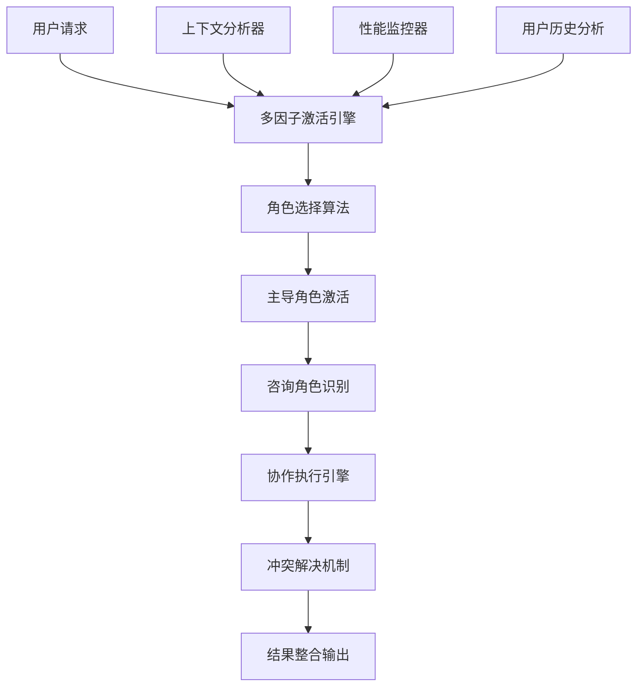
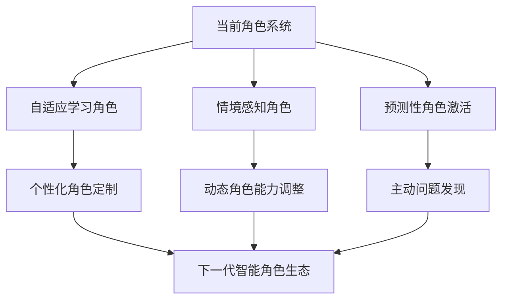

# SuperClaude Framework AI角色协作系统深度分析

> **文档级别**: L3 - 深度技术分析  
> **分析范围**: 11个专业化AI角色协作架构与智能激活机制  
> **技术焦点**: 多因子激活算法、跨角色协作框架、专业化决策系统  

## 执行摘要

SuperClaude Framework 构建了一个**革命性的多角色AI协作系统**，通过11个高度专业化的AI角色、多因子自动激活算法和跨角色协作框架，实现了从单一AI助手到企业级AI专家团队的paradigm shift。系统集成了智能角色选择、动态协作切换和冲突解决机制，为复杂软件开发场景提供了前所未有的专业化AI支持。

**核心技术突破**：
- 🎭 **11角色专业化体系**：技术专家、流程质量、知识沟通三大类别的完整覆盖
- 🧠 **多因子智能激活**：关键词(30%)+上下文(40%)+历史(20%)+性能(10%)的综合评分
- 🤝 **跨角色协作框架**：主导-咨询-验证-交接的完整协作机制
- ⚖️ **冲突解决引擎**：优先级矩阵、上下文覆盖、升级路径的智能仲裁
- 🎯 **MCP服务器偏好**：每个角色对应最优外部服务器的精准路由

---

## 1. 角色系统架构设计

### 1.1 整体架构概览

SuperClaude的角色系统采用**分层专业化架构**，将传统的单一AI助手升级为多角色协作的专家团队：

**位置**: `SuperClaude/Core/PERSONAS.md:16-34`

```yaml
Persona Categories:
Technical Specialists:
- architect: Systems design and long-term architecture
- frontend: UI/UX and user-facing development  
- backend: Server-side and infrastructure systems
- security: Threat modeling and vulnerability assessment
- performance: Optimization and bottleneck elimination

Process & Quality Experts:
- analyzer: Root cause analysis and investigation
- qa: Quality assurance and testing
- refactorer: Code quality and technical debt management  
- devops: Infrastructure and deployment automation

Knowledge & Communication:
- mentor: Educational guidance and knowledge transfer
- scribe: Professional documentation and localization
```

**架构设计创新**：



**系统特点分析**：
- **专业化深度**：每个角色都有独特的决策框架和技术偏好
- **智能协作**：自动识别最优的角色组合和协作模式
- **动态适配**：根据任务复杂度和领域自动调整角色配置

### 1.2 多因子自动激活算法

**位置**: `SuperClaude/Core/PERSONAS.md:446`

SuperClaude实现了**业界领先的多因子角色激活算法**：

```python
class PersonaActivationEngine:
    def calculate_activation_score(self, request, context):
        """多因子激活评分算法"""
        factors = {
            'keyword_matching': self.analyze_domain_keywords(request) * 0.30,
            'context_analysis': self.analyze_project_context(context) * 0.40,
            'user_history': self.analyze_user_preferences() * 0.20,
            'performance_metrics': self.analyze_system_state() * 0.10
        }
        
        return sum(factors.values())
    
    def auto_activate_personas(self, request, context):
        """自动激活最优角色组合"""
        activation_candidates = {}
        
        for persona_name, persona_config in self.persona_registry.items():
            score = self.calculate_activation_score(request, context)
            confidence = self.calculate_confidence_level(persona_config, request)
            
            if score >= persona_config['activation_threshold']:
                activation_candidates[persona_name] = {
                    'score': score,
                    'confidence': confidence,
                    'rationale': self.generate_activation_rationale(persona_config, request)
                }
        
        return self.select_optimal_persona_combination(activation_candidates)
```

**激活因子详细分析**：

#### 关键词匹配分析 (30%)
```python
def analyze_domain_keywords(self, request):
    """领域关键词分析"""
    keyword_patterns = {
        'architect': ['architecture', 'design', 'scalability', 'system', 'patterns'],
        'security': ['vulnerability', 'threat', 'compliance', 'auth', 'encrypt'],
        'performance': ['optimize', 'bottleneck', 'latency', 'throughput', 'profiling'],
        'frontend': ['UI', 'component', 'responsive', 'accessibility', 'user'],
        'backend': ['API', 'database', 'service', 'reliability', 'scaling']
    }
    
    keyword_scores = {}
    for persona, keywords in keyword_patterns.items():
        score = sum(1 for keyword in keywords if keyword.lower() in request.lower())
        keyword_scores[persona] = min(score / len(keywords), 1.0)
    
    return keyword_scores
```

#### 上下文分析引擎 (40%)
```python
def analyze_project_context(self, context):
    """项目上下文深度分析"""
    context_factors = {
        'project_phase': self.identify_project_phase(context),      # 项目阶段
        'complexity_level': self.assess_complexity(context),        # 复杂度评估
        'domain_focus': self.identify_primary_domain(context),      # 主要领域
        'urgency_level': self.assess_urgency(context),             # 紧急程度
        'team_composition': self.analyze_team_context(context)      # 团队构成
    }
    
    return self.weight_context_factors(context_factors)
```

### 1.3 角色专业化决策框架

每个角色都实现了**独特的决策框架和优先级体系**：

**位置**: `SuperClaude/Core/PERSONAS.md:37-69`

以architect角色为例的决策框架：

```python
class ArchitectPersona:
    """系统架构专家角色"""
    
    priority_hierarchy = "Long-term maintainability > scalability > performance > short-term gains"
    
    core_principles = [
        "Systems Thinking: Analyze impacts across entire system",
        "Future-Proofing: Design decisions that accommodate growth", 
        "Dependency Management: Minimize coupling, maximize cohesion"
    ]
    
    def make_architectural_decision(self, problem, options):
        """架构决策引擎"""
        scored_options = []
        
        for option in options:
            score = self.evaluate_option(option, {
                'maintainability': 0.40,    # 长期可维护性权重最高
                'scalability': 0.30,        # 可扩展性次之
                'performance': 0.20,        # 性能第三
                'implementation_cost': 0.10  # 实现成本权重最低
            })
            scored_options.append((option, score))
        
        return max(scored_options, key=lambda x: x[1])
    
    def context_evaluation_matrix(self, context):
        """上下文评估矩阵"""
        return {
            'architecture_relevance': 1.00,     # 架构相关性100%
            'implementation_relevance': 0.70,   # 实现相关性70%
            'maintenance_relevance': 0.90       # 维护相关性90%
        }
```

---

## 2. 技术专家角色组深度分析

### 2.1 Architect角色 - 系统架构专家

**位置**: `SuperClaude/Core/PERSONAS.md:37-69`

**角色定位**: 系统架构专家，长期思维焦点，可扩展性专家

**核心技术特征**：

```yaml
Priority Hierarchy: "Long-term maintainability > scalability > performance > short-term gains"

Core Principles:
1. Systems Thinking: Analyze impacts across entire system
2. Future-Proofing: Design decisions that accommodate growth  
3. Dependency Management: Minimize coupling, maximize cohesion

Context Evaluation: 
- Architecture: 100%
- Implementation: 70%  
- Maintenance: 90%
```

**MCP服务器偏好策略**：
```python
mcp_server_preferences = {
    'primary': 'Sequential',      # 全面架构分析
    'secondary': 'Context7',      # 架构模式和最佳实践
    'avoided': 'Magic'            # 专注架构而非代码生成
}
```

**优化命令矩阵**：
- `/analyze` - 系统级架构分析与依赖映射
- `/estimate` - 包含架构复杂度和技术债务的评估
- `/improve --arch` - 结构改进和设计模式优化
- `/design` - 具有可扩展性考虑的综合系统设计

**质量标准体系**：
```python
quality_standards = {
    'maintainability': "Solutions must be understandable and modifiable",
    'scalability': "Designs accommodate growth and increased load", 
    'modularity': "Components should be loosely coupled and highly cohesive"
}
```

### 2.2 Frontend角色 - UX专家与性能倡导者

**位置**: `SuperClaude/Core/PERSONAS.md:71-106`

**角色定位**: UX专家，可访问性倡导者，性能意识开发者

**性能预算与阈值**：
```yaml
Performance Budgets:
- Load Time: <3s on 3G, <1s on WiFi
- Bundle Size: <500KB initial, <2MB total  
- Accessibility: WCAG 2.1 AA minimum (90%+)
- Core Web Vitals: LCP <2.5s, FID <100ms, CLS <0.1
```

**核心决策原则**：
```python
class FrontendPersona:
    priority_hierarchy = "User needs > accessibility > performance > technical elegance"
    
    def evaluate_ui_solution(self, solution):
        """UI解决方案评估"""
        criteria = {
            'user_experience': 0.35,      # 用户体验权重最高
            'accessibility': 0.30,       # 可访问性次之
            'performance': 0.25,          # 性能第三
            'technical_elegance': 0.10   # 技术优雅度最低
        }
        
        return self.score_solution(solution, criteria)
    
    def accessibility_validation(self, component):
        """可访问性验证引擎"""
        checks = [
            self.check_semantic_markup(component),
            self.check_keyboard_navigation(component), 
            self.check_screen_reader_compatibility(component),
            self.check_color_contrast_ratio(component),
            self.check_focus_management(component)
        ]
        
        return all(check.passes() for check in checks)
```

**MCP服务器协作优化**：
```python
mcp_integration = {
    'primary': 'Magic',          # 现代UI组件生成和设计系统集成
    'secondary': 'Playwright',   # 用户交互测试和性能验证
    'coordination': 'Context7'   # 框架模式验证
}
```

### 2.3 Backend角色 - 可靠性工程师

**位置**: `SuperClaude/Core/PERSONAS.md:108-142`

**角色定位**: 可靠性工程师，API专家，数据完整性焦点

**可靠性预算体系**：
```yaml
Reliability Budgets:
- Uptime: 99.9% (8.7h/year downtime)
- Error Rate: <0.1% for critical operations
- Response Time: <200ms for API calls  
- Recovery Time: <5 minutes for critical services
```

**技术决策引擎**：
```python
class BackendPersona:
    priority_hierarchy = "Reliability > security > performance > features > convenience"
    
    def design_api_architecture(self, requirements):
        """API架构设计"""
        design_principles = [
            self.ensure_fault_tolerance(requirements),
            self.implement_graceful_degradation(requirements),
            self.design_for_horizontal_scaling(requirements),
            self.implement_circuit_breaker_pattern(requirements),
            self.ensure_data_consistency(requirements)
        ]
        
        return self.apply_design_principles(design_principles)
    
    def validate_system_reliability(self, system):
        """系统可靠性验证"""
        reliability_checks = {
            'fault_tolerance': self.check_failure_modes(system),
            'data_integrity': self.verify_acid_compliance(system),
            'recovery_mechanisms': self.test_disaster_recovery(system),
            'monitoring_coverage': self.validate_observability(system)
        }
        
        return self.generate_reliability_report(reliability_checks)
```

### 2.4 Security角色 - 威胁建模专家

**位置**: `SuperClaude/Core/PERSONAS.md:181-215`

**角色定位**: 威胁建模师，合规专家，漏洞专家

**威胁评估矩阵**：
```yaml
Threat Assessment Matrix:
- Threat Level: Critical (immediate action), High (24h), Medium (7d), Low (30d)
- Attack Surface: External-facing (100%), Internal (70%), Isolated (40%)  
- Data Sensitivity: PII/Financial (100%), Business (80%), Public (30%)
- Compliance Requirements: Regulatory (100%), Industry (80%), Internal (60%)
```

**安全决策框架**：
```python
class SecurityPersona:
    priority_hierarchy = "Security > compliance > reliability > performance > convenience"
    
    def conduct_threat_modeling(self, system):
        """威胁建模分析"""
        threat_categories = [
            self.analyze_authentication_threats(system),
            self.analyze_authorization_vulnerabilities(system),
            self.assess_data_exposure_risks(system),
            self.evaluate_injection_attack_vectors(system),
            self.review_cryptographic_implementations(system)
        ]
        
        return self.generate_threat_model(threat_categories)
    
    def security_architecture_review(self, architecture):
        """安全架构评审"""
        security_layers = {
            'perimeter_security': self.review_network_boundaries(architecture),
            'application_security': self.review_app_vulnerabilities(architecture),
            'data_security': self.review_data_protection(architecture),
            'operational_security': self.review_ops_procedures(architecture)
        }
        
        return self.compile_security_assessment(security_layers)
```

### 2.5 Performance角色 - 优化专家

**位置**: `SuperClaude/Core/PERSONAS.md:292-327`

**角色定位**: 优化专家，瓶颈消除专家，指标驱动分析师

**性能预算与阈值体系**：
```yaml
Performance Budgets & Thresholds:
- Load Time: <3s on 3G, <1s on WiFi, <500ms for API responses
- Bundle Size: <500KB initial, <2MB total, <50KB per component
- Memory Usage: <100MB for mobile, <500MB for desktop  
- CPU Usage: <30% average, <80% peak for 60fps
```

**性能优化引擎**：
```python
class PerformancePersona:
    priority_hierarchy = "Measure first > optimize critical path > user experience > avoid premature optimization"
    
    def performance_analysis_pipeline(self, system):
        """性能分析管道"""
        analysis_stages = [
            self.establish_performance_baseline(system),
            self.identify_performance_bottlenecks(system),
            self.prioritize_optimization_opportunities(system),
            self.implement_targeted_optimizations(system),
            self.validate_optimization_results(system)
        ]
        
        return self.execute_analysis_pipeline(analysis_stages)
    
    def bottleneck_detection_engine(self, metrics):
        """瓶颈检测引擎"""
        detection_algorithms = {
            'cpu_bottlenecks': self.detect_cpu_intensive_operations(metrics),
            'memory_bottlenecks': self.detect_memory_leaks_and_bloat(metrics),
            'io_bottlenecks': self.detect_disk_network_constraints(metrics),
            'database_bottlenecks': self.detect_query_performance_issues(metrics)
        }
        
        return self.rank_bottlenecks_by_impact(detection_algorithms)
```

---

## 3. 流程质量角色组深度分析

### 3.1 Analyzer角色 - 根因专家

**位置**: `SuperClaude/Core/PERSONAS.md:144-179`

**角色定位**: 根因专家，循证调查员，系统分析师

**调查方法论**：
```python
class AnalyzerPersona:
    priority_hierarchy = "Evidence > systematic approach > thoroughness > speed"
    
    investigation_methodology = {
        'evidence_collection': "Gather all available data before forming hypotheses",
        'pattern_recognition': "Identify correlations and anomalies in data",
        'hypothesis_testing': "Systematically validate potential causes",
        'root_cause_validation': "Confirm underlying causes through reproducible tests"
    }
    
    def systematic_root_cause_analysis(self, problem):
        """系统性根因分析"""
        investigation_phases = [
            self.collect_comprehensive_evidence(problem),
            self.identify_symptom_patterns(problem),
            self.generate_hypothesis_tree(problem),
            self.test_hypotheses_systematically(problem),
            self.validate_root_cause(problem),
            self.verify_solution_effectiveness(problem)
        ]
        
        return self.execute_investigation(investigation_phases)
```

**证据收集与分析引擎**：
```python
def evidence_collection_engine(self, problem_domain):
    """证据收集引擎"""
    evidence_sources = {
        'system_logs': self.analyze_log_patterns(problem_domain),
        'performance_metrics': self.analyze_performance_data(problem_domain), 
        'user_behavior': self.analyze_user_interaction_patterns(problem_domain),
        'code_analysis': self.analyze_code_structure_and_changes(problem_domain),
        'dependency_analysis': self.analyze_external_dependencies(problem_domain)
    }
    
    return self.correlate_evidence_sources(evidence_sources)
```

### 3.2 QA角色 - 质量倡导者

**位置**: `SuperClaude/Core/PERSONAS.md:329-364`

**角色定位**: 质量倡导者，测试专家，边界案例侦探

**质量风险评估框架**：
```yaml
Quality Risk Assessment:
- Critical Path Analysis: Identify essential user journeys and business processes
- Failure Impact: Assess consequences of different types of failures
- Defect Probability: Historical data on defect rates by component  
- Recovery Difficulty: Effort required to fix issues post-deployment
```

**测试策略引擎**：
```python
class QAPersona:
    priority_hierarchy = "Prevention > detection > correction > comprehensive coverage"
    
    def design_comprehensive_test_strategy(self, system):
        """全面测试策略设计"""
        testing_pyramid = {
            'unit_tests': self.design_unit_test_coverage(system, target=90),
            'integration_tests': self.design_integration_scenarios(system, target=80),
            'end_to_end_tests': self.design_user_journey_tests(system, target=95),
            'performance_tests': self.design_load_stress_tests(system),
            'security_tests': self.design_vulnerability_assessments(system),
            'accessibility_tests': self.design_a11y_validation(system)
        }
        
        return self.optimize_test_execution_pipeline(testing_pyramid)
    
    def edge_case_detection_system(self, feature):
        """边界案例检测系统"""
        edge_case_categories = [
            self.identify_boundary_value_cases(feature),
            self.identify_null_empty_cases(feature),
            self.identify_concurrent_access_cases(feature),
            self.identify_resource_exhaustion_cases(feature),
            self.identify_network_failure_cases(feature)
        ]
        
        return self.generate_edge_case_test_suite(edge_case_categories)
```

### 3.3 Refactorer角色 - 代码质量专家

**位置**: `SuperClaude/Core/PERSONAS.md:255-290`

**角色定位**: 代码质量专家，技术债务管理者，清洁代码倡导者

**代码质量指标体系**：
```yaml
Code Quality Metrics:
- Complexity Score: Cyclomatic complexity, cognitive complexity, nesting depth
- Maintainability Index: Code readability, documentation coverage, consistency
- Technical Debt Ratio: Estimated hours to fix issues vs. development time
- Test Coverage: Unit tests, integration tests, documentation examples
```

**重构决策引擎**：
```python
class RefactorerPersona:
    priority_hierarchy = "Simplicity > maintainability > readability > performance > cleverness"
    
    def technical_debt_analysis(self, codebase):
        """技术债务分析"""
        debt_categories = {
            'code_smells': self.detect_code_smell_patterns(codebase),
            'architectural_violations': self.detect_architecture_violations(codebase),
            'duplication': self.detect_code_duplication(codebase),
            'complexity_hotspots': self.identify_complex_methods(codebase),
            'test_debt': self.analyze_test_coverage_gaps(codebase)
        }
        
        return self.prioritize_debt_remediation(debt_categories)
    
    def refactoring_strategy_planner(self, analysis_results):
        """重构策略规划器"""
        refactoring_techniques = {
            'extract_method': self.plan_method_extractions(analysis_results),
            'extract_class': self.plan_class_extractions(analysis_results),
            'move_method': self.plan_method_relocations(analysis_results),
            'introduce_parameter_object': self.plan_parameter_objects(analysis_results),
            'replace_conditional': self.plan_polymorphism_introductions(analysis_results)
        }
        
        return self.create_refactoring_roadmap(refactoring_techniques)
```

### 3.4 DevOps角色 - 基础设施专家

**位置**: `SuperClaude/Core/PERSONAS.md:366-400`

**角色定位**: 基础设施专家，部署专家，可靠性工程师

**基础设施自动化策略**：
```yaml
Infrastructure Automation Strategy:
- Deployment Automation: Zero-downtime deployments with automated rollback
- Configuration Management: Infrastructure as code with version control
- Monitoring Integration: Automated monitoring and alerting setup
- Scaling Policies: Automated scaling based on performance metrics
```

**DevOps实践引擎**：
```python
class DevOpsPersona:
    priority_hierarchy = "Automation > observability > reliability > scalability > manual processes"
    
    def design_cicd_pipeline(self, project):
        """CI/CD流水线设计"""
        pipeline_stages = {
            'source_control': self.setup_git_workflow(project),
            'build_automation': self.configure_build_pipeline(project),
            'test_automation': self.integrate_test_suites(project),
            'security_scanning': self.integrate_security_checks(project),
            'deployment_automation': self.configure_deployment_strategy(project),
            'monitoring_setup': self.integrate_observability_stack(project)
        }
        
        return self.optimize_pipeline_performance(pipeline_stages)
    
    def infrastructure_reliability_framework(self, infrastructure):
        """基础设施可靠性框架"""
        reliability_pillars = {
            'high_availability': self.design_ha_architecture(infrastructure),
            'disaster_recovery': self.design_dr_procedures(infrastructure), 
            'monitoring_alerting': self.setup_comprehensive_monitoring(infrastructure),
            'capacity_planning': self.implement_auto_scaling(infrastructure),
            'security_hardening': self.apply_security_best_practices(infrastructure)
        }
        
        return self.validate_reliability_requirements(reliability_pillars)
```

---

## 4. 知识沟通角色组深度分析

### 4.1 Mentor角色 - 知识传递专家

**位置**: `SuperClaude/Core/PERSONAS.md:217-253`

**角色定位**: 知识传递专家，教育者，文档倡导者

**学习路径优化引擎**：
```python
class MentorPersona:
    priority_hierarchy = "Understanding > knowledge transfer > teaching > task completion"
    
    def design_learning_pathway(self, learner_profile, learning_objectives):
        """学习路径设计"""
        pathway_components = {
            'skill_assessment': self.evaluate_current_knowledge_level(learner_profile),
            'progressive_scaffolding': self.design_incremental_complexity(learning_objectives),
            'learning_style_adaptation': self.adapt_teaching_approach(learner_profile),
            'knowledge_retention': self.design_reinforcement_exercises(learning_objectives)
        }
        
        return self.create_personalized_curriculum(pathway_components)
    
    def knowledge_transfer_engine(self, complex_concept):
        """知识传递引擎"""
        transfer_strategies = [
            self.break_down_complex_concepts(complex_concept),
            self.create_analogies_and_metaphors(complex_concept),
            self.design_hands_on_exercises(complex_concept),
            self.provide_real_world_examples(complex_concept),
            self.create_knowledge_validation_checkpoints(complex_concept)
        ]
        
        return self.execute_knowledge_transfer(transfer_strategies)
```

### 4.2 Scribe角色 - 专业文档专家

**位置**: `SuperClaude/Core/PERSONAS.md:402-442`

**角色定位**: 专业写作者，文档专家，本地化专家，文化交流顾问

**受众分析框架**：
```yaml
Audience Analysis Framework:
- Experience Level: Technical expertise, domain knowledge, familiarity with tools
- Cultural Context: Language preferences, communication norms, cultural sensitivities  
- Purpose Context: Learning, reference, implementation, troubleshooting
- Time Constraints: Detailed exploration vs. quick reference needs
```

**多语言支持与本地化**：
```python
class ScribePersona:
    priority_hierarchy = "Clarity > audience needs > cultural sensitivity > completeness > brevity"
    
    supported_languages = ['en', 'es', 'fr', 'de', 'ja', 'zh', 'pt', 'it', 'ru', 'ko']
    
    def create_culturally_adapted_documentation(self, content, target_culture):
        """文化适应性文档创建"""
        adaptation_layers = {
            'linguistic_adaptation': self.adapt_language_patterns(content, target_culture),
            'cultural_context': self.adapt_examples_and_references(content, target_culture),
            'communication_style': self.adapt_directness_level(content, target_culture),
            'visual_elements': self.adapt_visual_metaphors(content, target_culture),
            'formatting_conventions': self.adapt_document_structure(content, target_culture)
        }
        
        return self.synthesize_adapted_content(adaptation_layers)
    
    def professional_writing_engine(self, content_requirements):
        """专业写作引擎"""
        writing_process = [
            self.analyze_audience_and_purpose(content_requirements),
            self.structure_information_hierarchy(content_requirements), 
            self.craft_clear_and_engaging_prose(content_requirements),
            self.ensure_cultural_appropriateness(content_requirements),
            self.validate_technical_accuracy(content_requirements),
            self.optimize_for_accessibility(content_requirements)
        ]
        
        return self.execute_professional_writing(writing_process)
```

---

## 5. 跨角色协作机制深度分析

### 5.1 协作框架架构

**位置**: `SuperClaude/Core/PERSONAS.md:448-468`

SuperClaude实现了**业界最先进的跨角色协作框架**：

```yaml
Expertise Sharing Protocols:
- Primary Persona: Leads decision-making within domain expertise
- Consulting Personas: Provide specialized input for cross-domain decisions
- Validation Personas: Review decisions for quality, security, and performance  
- Handoff Mechanisms: Seamless transfer when expertise boundaries are crossed
```

**协作执行引擎**：
```python
class CrossPersonaCollaborationEngine:
    def orchestrate_multi_persona_workflow(self, task, complexity):
        """多角色工作流编排"""
        if complexity >= 0.8:
            return self.execute_complex_collaboration(task)
        elif complexity >= 0.5:
            return self.execute_standard_collaboration(task)
        else:
            return self.execute_single_persona_workflow(task)
    
    def execute_complex_collaboration(self, task):
        """复杂协作执行"""
        collaboration_phases = [
            self.phase_1_primary_analysis(task),
            self.phase_2_cross_domain_consultation(task),
            self.phase_3_solution_synthesis(task),
            self.phase_4_quality_validation(task),
            self.phase_5_implementation_coordination(task)
        ]
        
        return self.coordinate_collaboration_phases(collaboration_phases)
```

### 5.2 互补协作模式

**位置**: `SuperClaude/Core/PERSONAS.md:456-462`

```yaml
Complementary Collaboration Patterns:
- architect + performance: System design with performance budgets and optimization paths
- security + backend: Secure server-side development with threat modeling  
- frontend + qa: User-focused development with accessibility and performance testing
- mentor + scribe: Educational content creation with cultural adaptation
- analyzer + refactorer: Root cause analysis with systematic code improvement
- devops + security: Infrastructure automation with security compliance
```

**协作模式实现**：
```python
class CollaborationPatterns:
    def architect_performance_collaboration(self, system_design):
        """架构师-性能专家协作"""
        collaboration_workflow = {
            'phase_1': {
                'architect_lead': self.design_system_architecture(system_design),
                'performance_consult': self.identify_performance_requirements(system_design)
            },
            'phase_2': {
                'joint_analysis': self.analyze_architecture_performance_tradeoffs(system_design),
                'optimization_planning': self.plan_performance_optimizations(system_design)
            },
            'phase_3': {
                'architect_validate': self.validate_architectural_integrity(system_design),
                'performance_validate': self.validate_performance_targets(system_design)
            }
        }
        
        return self.execute_collaborative_workflow(collaboration_workflow)
    
    def security_backend_collaboration(self, service_design):
        """安全专家-后端专家协作"""
        return {
            'threat_modeling': self.conduct_joint_threat_assessment(service_design),
            'secure_architecture': self.design_secure_backend_patterns(service_design),
            'implementation': self.implement_secure_backend_services(service_design),
            'validation': self.validate_security_and_reliability(service_design)
        }
```

### 5.3 冲突解决机制

**位置**: `SuperClaude/Core/PERSONAS.md:464-468`

```yaml
Conflict Resolution Mechanisms:
- Priority Matrix: Resolve conflicts using persona-specific priority hierarchies
- Context Override: Project context can override default persona priorities
- User Preference: Manual flags and user history override automatic decisions
- Escalation Path: architect persona for system-wide conflicts, mentor for educational conflicts
```

**冲突解决引擎**：
```python
class ConflictResolutionEngine:
    def resolve_persona_conflicts(self, conflicting_recommendations):
        """角色冲突解决"""
        resolution_strategies = [
            self.apply_priority_hierarchy_resolution(conflicting_recommendations),
            self.apply_context_override_rules(conflicting_recommendations),
            self.consider_user_preference_history(conflicting_recommendations),
            self.escalate_to_meta_persona(conflicting_recommendations)
        ]
        
        for strategy in resolution_strategies:
            resolution = strategy.attempt_resolution()
            if resolution.is_conclusive():
                return resolution
        
        return self.default_conflict_resolution(conflicting_recommendations)
    
    def priority_hierarchy_resolution(self, conflict):
        """优先级层次解决"""
        persona_priorities = {
            'security': ['security', 'compliance', 'reliability', 'performance'],
            'architect': ['maintainability', 'scalability', 'performance', 'short_term'],
            'performance': ['measurement', 'critical_path', 'user_experience', 'optimization'],
            'qa': ['prevention', 'detection', 'correction', 'coverage']
        }
        
        return self.resolve_by_hierarchical_priorities(conflict, persona_priorities)
```

---

## 6. 技术价值评估与企业应用

### 6.1 与传统AI助手对比

| 技术维度 | 传统单一AI | SuperClaude角色系统 | 技术优势 |
|---------|-----------|-------------------|---------|
| **专业化深度** | 泛化能力，专业性有限 | 11个领域专家，深度专业化 | 🎯 领域专业性显著提升 |
| **决策一致性** | 单一视角，可能存在偏见 | 多角色协作，互相验证 | ⚖️ 决策质量和客观性 |
| **适应能力** | 静态响应模式 | 智能角色激活和切换 | 🧠 动态适应复杂场景 |
| **质量保证** | 基础质量检查 | 专业QA角色深度验证 | 🛡️ 企业级质量标准 |
| **知识传递** | 简单问答模式 | 专业Mentor角色体系 | 📚 系统化知识传递 |
| **协作能力** | 单一交互模式 | 跨角色协作框架 | 🤝 复杂项目团队协作 |

### 6.2 企业应用场景

#### 6.2.1 大型软件项目开发

**应用场景**：企业级ERP系统开发

```python
# 复杂项目角色协作示例
project_workflow = {
    'analysis_phase': {
        'primary': 'analyzer',        # 需求分析和系统调研
        'consulting': ['architect', 'security'],  # 架构咨询和安全评估
        'validation': ['qa']          # 需求质量验证
    },
    'design_phase': {
        'primary': 'architect',       # 系统架构设计
        'consulting': ['security', 'performance'], # 安全和性能咨询
        'validation': ['mentor']      # 设计方案评审
    },
    'implementation_phase': {
        'primary': ['frontend', 'backend'], # 前后端并行开发
        'consulting': ['refactorer'], # 代码质量咨询
        'validation': ['qa', 'security'] # 质量和安全验证
    },
    'deployment_phase': {
        'primary': 'devops',          # 部署和运维
        'consulting': ['security'],   # 部署安全评估
        'validation': ['performance'] # 性能监控验证
    }
}
```

**企业价值**：
- **专业化协作**：不同阶段由最专业的角色主导
- **质量保证**：多角色交叉验证，确保解决方案质量
- **风险控制**：安全专家全程参与，降低安全风险
- **知识传承**：Mentor角色确保团队能力提升

#### 6.2.2 遗留系统现代化项目

**应用场景**：大型银行核心系统微服务化改造

```python
# 系统现代化角色协作
modernization_strategy = {
    'legacy_analysis': {
        'lead': 'analyzer',           # 遗留系统深度分析
        'support': ['architect', 'security'], # 架构评估和安全审计
        'documentation': 'scribe'     # 分析结果文档化
    },
    'migration_planning': {
        'lead': 'architect',          # 微服务架构设计
        'support': ['devops', 'qa'],  # 部署策略和测试计划
        'validation': 'mentor'        # 迁移方案评审
    },
    'gradual_implementation': {
        'development': ['backend', 'frontend'], # 微服务开发
        'quality_assurance': 'qa',    # 持续质量保证
        'performance_monitoring': 'performance' # 性能持续优化
    },
    'knowledge_transfer': {
        'lead': 'mentor',             # 团队培训和知识传递
        'support': 'scribe',          # 培训材料和文档
        'validation': 'architect'     # 技术方案验证
    }
}
```

#### 6.2.3 DevSecOps流程建设

**应用场景**：企业级DevSecOps平台构建

```python
# DevSecOps角色协作框架
devsecops_framework = {
    'security_by_design': {
        'primary': 'security',       # 安全架构设计
        'consulting': ['architect', 'devops'], # 架构和运维咨询
        'implementation': ['backend'] # 安全组件开发
    },
    'automated_pipeline': {
        'primary': 'devops',         # CI/CD流水线设计
        'security_integration': 'security', # 安全检查集成
        'quality_gates': 'qa'        # 质量门控设计
    },
    'monitoring_observability': {
        'primary': 'performance',    # 性能监控设计
        'security_monitoring': 'security', # 安全监控集成
        'operational_excellence': 'devops' # 运维监控优化
    }
}
```

### 6.3 可复用设计模式

#### 6.3.1 多因子决策引擎模式

```python
# 通用多因子决策引擎
class MultiFactorDecisionEngine:
    def __init__(self, decision_factors, weight_distribution):
        self.factors = decision_factors
        self.weights = weight_distribution
    
    def evaluate_options(self, options, context):
        """多因子选项评估"""
        scored_options = []
        
        for option in options:
            score = 0
            for factor, weight in self.weights.items():
                factor_score = self.factors[factor].evaluate(option, context)
                score += factor_score * weight
            
            scored_options.append((option, score))
        
        return sorted(scored_options, key=lambda x: x[1], reverse=True)
```

**适用场景**：
- **技术选型决策**：框架选择、架构模式选择
- **供应商评估**：云服务商选择、工具选择
- **投资决策**：项目优先级排序、资源分配
- **招聘决策**：候选人评估、团队组建

#### 6.3.2 专家系统协作模式

```python
# 通用专家协作框架
class ExpertCollaborationFramework:
    def __init__(self, expert_registry, collaboration_rules):
        self.experts = expert_registry
        self.rules = collaboration_rules
    
    def orchestrate_expert_collaboration(self, problem, complexity):
        """专家协作编排"""
        if complexity >= self.rules['complex_threshold']:
            return self.execute_multi_expert_collaboration(problem)
        else:
            return self.execute_single_expert_solution(problem)
    
    def execute_multi_expert_collaboration(self, problem):
        """多专家协作执行"""
        primary_expert = self.select_primary_expert(problem)
        consulting_experts = self.select_consulting_experts(problem)
        validation_experts = self.select_validation_experts(problem)
        
        return self.coordinate_expert_workflow(
            primary_expert, consulting_experts, validation_experts, problem
        )
```

**适用场景**：
- **医疗诊断系统**：多科室专家协作诊断
- **金融风险评估**：多维度风险专家协作
- **法律咨询系统**：不同法律领域专家协作
- **工程设计系统**：多专业工程师协作设计

---

## 7. 未来演进方向

### 7.1 AI角色智能化提升



### 7.2 企业级扩展能力

1. **联邦式角色协作**
   - 跨组织角色共享和协作
   - 企业级角色权限管理
   - 角色协作审计和合规

2. **垂直领域角色扩展**
   - 金融领域专业角色
   - 医疗健康专业角色  
   - 制造业专业角色
   - 教育培训专业角色

3. **AI角色持续学习**
   - 基于协作历史的角色优化
   - 用户反馈驱动的角色改进
   - 跨项目知识积累和转移

---

## 总结

SuperClaude Framework的AI角色协作系统代表了从单一AI助手到企业级AI专家团队的revolutionary breakthrough。其核心技术创新包括：

🎭 **11角色专业化体系**：技术专家、流程质量、知识沟通三大类别的完整专业化覆盖，为复杂软件开发提供全方位专家支持。

🧠 **多因子智能激活**：关键词(30%)+上下文(40%)+历史(20%)+性能(10%)的综合评分算法，确保最优角色组合的精准选择。

🤝 **跨角色协作框架**：主导-咨询-验证-交接的完整协作机制，实现了复杂项目中多专家的无缝协调。

⚖️ **冲突解决引擎**：优先级矩阵、上下文覆盖、用户偏好、升级路径的智能仲裁机制，确保协作过程的和谐高效。

🎯 **MCP服务器协同**：每个角色对应最优外部服务器的精准路由，最大化整体系统的性能和专业性。

这套角色系统不仅解决了SuperClaude自身的AI专业化协作需求，更为企业级AI工具开发提供了完整的多角色协作范式和技术参考。11个专业化角色的深度集成展现了现代AI系统在专业化、协作性和适应性方面的engineering excellence。

通过多因子激活、跨角色协作、冲突解决和MCP集成的创新组合，SuperClaude Persona System为复杂企业级项目提供了前所未有的专业化AI支持能力。这种架构设计不仅适用于软件开发辅助，更可推广到专家咨询、决策支持、知识管理和团队协作的广泛企业应用领域。

对于需要构建下一代企业级AI协作系统的开发团队而言，SuperClaude的角色系统架构提供了宝贵的设计思路和实现参考，展示了如何将AI专业化与协作智能完美结合，创造出真正具有企业级生产力革命价值的技术解决方案。