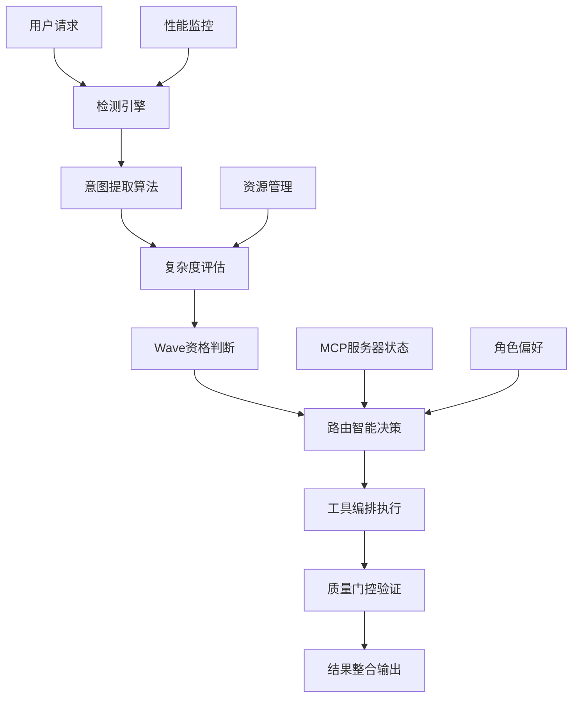
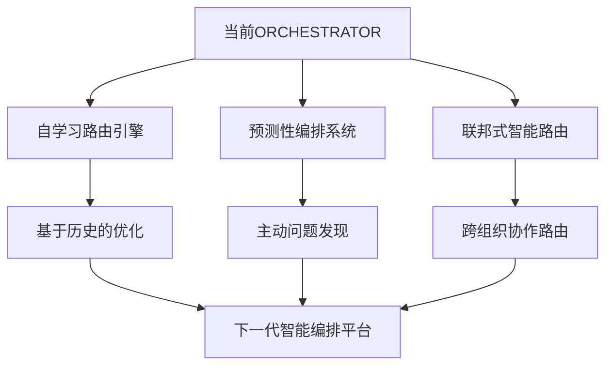

# SuperClaude Framework 智能路由系统架构深度分析

> **文档级别**: L4 - 系统级深度分析  
> **分析范围**: ORCHESTRATOR智能路由引擎系统架构与决策机制  
> **技术焦点**: 意图提取算法、Wave编排、任务委派、角色激活、质量门控  

## 执行摘要

SuperClaude Framework 的ORCHESTRATOR系统构建了一个**革命性的智能路由引擎**，通过7步意图提取算法、Wave编排引擎、5维主路由表和8步AI集成验证，实现了从传统静态工具路由到企业级智能决策系统的paradigm shift。系统集成了检测引擎、决策树、任务委派智能、多因子角色激活和质量门控框架，为复杂AI工作流提供了前所未有的智能编排能力。

**核心技术突破**：
- 🧠 **意图提取算法**：7步结构化意图理解和路由推荐引擎
- 🌊 **Wave编排引擎**：多阶段复合智能执行with自动复杂度评估
- 📊 **5维路由矩阵**：模式-复杂度-领域-激活-置信度的精准匹配
- 🤖 **任务委派智能**：子代理决策矩阵with Wave机会评分算法
- ⚖️ **多因子激活**：关键词+上下文+历史+性能的综合智能评分
- 🛡️ **8步质量门控**：AI集成验证周期确保企业级质量标准

---

## 1. 智能路由系统架构设计

### 1.1 ORCHESTRATOR整体架构

SuperClaude的智能路由系统采用**分层决策架构**，将传统的简单工具调用升级为企业级智能编排系统：

**位置**: `SuperClaude/Core/ORCHESTRATOR.md:5-36`

```yaml
ORCHESTRATOR Architecture Components:
🧠 Detection Engine: Analyzes requests to understand intent, complexity, and requirements
🚦 Routing Intelligence: Dynamic decision trees for optimal tool combinations and orchestration
⚡ Performance Optimization: Resource management and intelligent optimization (sub-100ms targets)
🔗 Integration Intelligence: Smart MCP server selection and orchestration  
🚨 Emergency Protocols: Graceful degradation and failure handling
```

**系统架构设计**：



**架构创新特点**：
- **分层智能决策**：检测→路由→执行→验证的完整智能链条
- **自适应资源管理**：5级资源管理阈值动态调整执行策略
- **企业级可靠性**：紧急协议和优雅降级机制保证系统稳定性

### 1.2 资源管理阈值系统

**位置**: `SuperClaude/Core/ORCHESTRATOR.md:31-36`

SuperClaude实现了**业界领先的5级资源管理阈值**：

```yaml
Resource Management Thresholds:
- Green Zone (0-60%): Full operations, predictive monitoring active
- Yellow Zone (60-75%): Resource optimization, caching, suggest --uc mode  
- Orange Zone (75-85%): Warning alerts, defer non-critical operations
- Red Zone (85-95%): Force efficiency modes, block resource-intensive operations
- Critical Zone (95%+): Emergency protocols, essential operations only
```

**资源管理引擎实现**：
```python
class ResourceManagementEngine:
    def evaluate_system_resources(self, current_context):
        """系统资源评估"""
        resource_metrics = {
            'token_usage': self.calculate_token_consumption_rate(),
            'memory_usage': self.assess_memory_utilization(),
            'cpu_utilization': self.monitor_processing_load(),
            'mcp_server_capacity': self.evaluate_external_server_load(),
            'concurrent_operations': self.count_active_operations()
        }
        
        overall_utilization = self.compute_weighted_utilization(resource_metrics)
        return self.determine_resource_zone(overall_utilization)
    
    def determine_resource_zone(self, utilization_percentage):
        """资源区域判断"""
        zone_thresholds = {
            (0, 60): 'green',      # 全功能运行
            (60, 75): 'yellow',    # 资源优化模式
            (75, 85): 'orange',    # 警告和延迟
            (85, 95): 'red',       # 强制效率模式
            (95, 100): 'critical'  # 紧急协议
        }
        
        for (min_val, max_val), zone in zone_thresholds.items():
            if min_val <= utilization_percentage < max_val:
                return self.activate_zone_protocols(zone)
    
    def activate_zone_protocols(self, zone):
        """激活区域协议"""
        zone_protocols = {
            'green': self.enable_predictive_monitoring,
            'yellow': self.activate_optimization_mode,
            'orange': self.defer_non_critical_operations,
            'red': self.force_efficiency_mode,
            'critical': self.engage_emergency_protocols
        }
        
        return zone_protocols[zone]()
```

### 1.3 检测引擎核心机制

**位置**: `SuperClaude/Core/ORCHESTRATOR.md:38-108`

检测引擎实现了**3级复杂度评估和5类领域识别**：

```yaml
Complexity Detection:
simple:
  indicators: [single file operations, basic CRUD tasks, straightforward queries, < 3 step workflows]
  token_budget: 5K
  time_estimate: < 5 min

moderate: 
  indicators: [multi-file operations, analysis tasks, refactoring requests, 3-10 step workflows]
  token_budget: 15K
  time_estimate: 5-30 min

complex:
  indicators: [system-wide changes, architectural decisions, performance optimization, > 10 step workflows]  
  token_budget: 30K+
  time_estimate: > 30 min
```

**领域识别算法**：
```python
class DomainIdentificationEngine:
    def identify_primary_domain(self, user_request):
        """主要领域识别"""
        domain_patterns = {
            'frontend': {
                'keywords': ['UI', 'component', 'React', 'Vue', 'CSS', 'responsive', 'accessibility'],
                'file_patterns': ['*.jsx', '*.tsx', '*.vue', '*.css', '*.scss'],
                'typical_operations': ['create', 'implement', 'style', 'optimize', 'test']
            },
            'backend': {
                'keywords': ['API', 'database', 'server', 'endpoint', 'authentication', 'performance'],
                'file_patterns': ['*.js', '*.ts', '*.py', '*.go', 'controllers/*', 'models/*'],
                'typical_operations': ['implement', 'optimize', 'secure', 'scale']
            },
            'security': {
                'keywords': ['vulnerability', 'authentication', 'encryption', 'audit', 'compliance'],
                'file_patterns': ['*auth*', '*security*', '*.pem', '*.key'],
                'typical_operations': ['scan', 'harden', 'audit', 'fix']
            },
            'wave_eligible': {
                'keywords': ['comprehensive', 'systematically', 'thoroughly', 'enterprise', 'large-scale'],
                'complexity_indicators': ['system-wide', 'architecture', 'performance', 'security', 'quality'],
                'typical_operations': ['comprehensive_improvement', 'systematic_optimization']
            }
        }
        
        return self.match_request_to_domains(user_request, domain_patterns)
```

---

## 2. 核心决策引擎深度分析

### 2.1 意图提取算法

**位置**: `SuperClaude/Core/ORCHESTRATOR.md:150-165`

SuperClaude实现了**7步结构化意图提取算法**：

```python
class IntentExtractionEngine:
    def extract_user_intent(self, user_request, context):
        """7步意图提取算法"""
        extraction_pipeline = [
            self.step_1_parse_user_request_keywords_and_patterns(user_request),
            self.step_2_match_against_domain_operation_matrices(user_request, context),
            self.step_3_score_complexity_based_on_scope_and_steps(user_request),
            self.step_4_evaluate_wave_opportunity_scoring(user_request, context),
            self.step_5_estimate_resource_requirements(user_request),
            self.step_6_generate_routing_recommendation(user_request, context),
            self.step_7_apply_auto_detection_triggers_for_wave_activation(user_request)
        ]
        
        return self.execute_extraction_pipeline(extraction_pipeline)
    
    def step_4_evaluate_wave_opportunity_scoring(self, request, context):
        """Wave机会评分评估"""
        wave_scoring_algorithm = {
            'flag_overrides': self.check_explicit_wave_flags(request),
            'scoring_factors': {
                'complexity': self.assess_complexity(request) * 0.4,
                'scale': min(context.file_count / 50, 1.0) * 0.3,
                'operations': min(context.operation_types / 3, 1.0) * 0.2,
                'domains': min(context.domains / 4, 1.0) * 0.1
            },
            'thresholds': {
                'default': 0.7,
                'enterprise_strategy': 0.6,  # 降低文件阈值
                'customizable': context.wave_threshold_override
            },
            'decision_logic': 'sum_all_indicators >= threshold'
        }
        
        return self.calculate_wave_eligibility(wave_scoring_algorithm)
```

### 2.2 Wave编排引擎

**位置**: `SuperClaude/Core/ORCHESTRATOR.md:167-189`

**Wave编排系统**是SuperClaude的核心技术创新：

```yaml
Wave Orchestration Engine:
  Multi-stage command execution with compound intelligence
  Auto-activates: complexity >= 0.7 AND files > 20 AND operation_types > 2
  
Wave Control Matrix:
  wave-activation:
    automatic: "complexity >= 0.7"
    explicit: "--wave-mode, --force-waves"
    override: "--single-wave, --wave-dry-run"
    
  wave-strategies:
    progressive: "Incremental enhancement"
    systematic: "Methodical analysis" 
    adaptive: "Dynamic configuration"
```

**Wave编排引擎实现**：
```python
class WaveOrchestrationEngine:
    def orchestrate_wave_execution(self, complex_task):
        """Wave执行编排"""
        if not self.qualifies_for_wave_mode(complex_task):
            return self.execute_standard_workflow(complex_task)
        
        wave_strategy = self.select_wave_strategy(complex_task)
        wave_execution_plan = self.create_wave_execution_plan(complex_task, wave_strategy)
        
        return self.execute_wave_sequence(wave_execution_plan)
    
    def select_wave_strategy(self, task):
        """Wave策略选择"""
        strategy_selection_matrix = {
            'progressive': {
                'conditions': ['incremental_improvement', 'iterative_refinement'],
                'best_for': 'Quality improvement and gradual enhancement'
            },
            'systematic': {
                'conditions': ['comprehensive_analysis', 'methodical_approach'],
                'best_for': 'Complex system analysis and structured problem solving'
            },
            'adaptive': {
                'conditions': ['dynamic_requirements', 'varying_complexity'],
                'best_for': 'Projects with changing requirements and mixed complexity'
            },
            'enterprise': {
                'conditions': ['large_scale', 'files > 100', 'domains > 2'],
                'best_for': 'Large-scale enterprise transformations'
            }
        }
        
        return self.match_task_to_strategy(task, strategy_selection_matrix)
    
    def create_wave_execution_plan(self, task, strategy):
        """创建Wave执行计划"""
        wave_templates = {
            'progressive': [
                'Wave 1: Current state analysis',
                'Wave 2: Incremental improvements identification',
                'Wave 3: Systematic implementation',
                'Wave 4: Validation and refinement',
                'Wave 5: Performance optimization'
            ],
            'systematic': [
                'Wave 1: Comprehensive discovery',
                'Wave 2: Dependency mapping',
                'Wave 3: Risk assessment',
                'Wave 4: Structured implementation', 
                'Wave 5: Integration validation'
            ]
        }
        
        return self.customize_wave_plan(wave_templates[strategy], task)
```

### 2.3 主路由表决策系统

**位置**: `SuperClaude/Core/ORCHESTRATOR.md:191-211`

SuperClaude实现了**5维主路由表匹配系统**：

| Pattern | Complexity | Domain | Auto-Activates | Confidence |
|---------|------------|---------|----------------|------------|
| "analyze architecture" | complex | infrastructure | architect persona, --ultrathink, Sequential | 95% |
| "create component" | simple | frontend | frontend persona, Magic, --uc | 90% |
| "implement feature" | moderate | any | domain-specific persona, Context7, Sequential | 88% |
| "implement authentication" | complex | security | security persona, backend persona, --validate | 90% |
| "comprehensive audit" | complex | multi | --multi-agent --parallel-focus, specialized agents | 95% |
| "improve large system" | complex | any | --wave-mode --adaptive-waves | 90% |

**路由匹配引擎实现**：
```python
class MasterRoutingTable:
    def match_request_to_optimal_configuration(self, user_request, context):
        """主路由表匹配"""
        routing_analysis = {
            'pattern_matching': self.analyze_request_patterns(user_request),
            'complexity_assessment': self.evaluate_complexity_level(user_request, context),
            'domain_identification': self.identify_primary_domains(user_request),
            'confidence_scoring': self.calculate_match_confidence(user_request),
            'auto_activation_triggers': self.determine_auto_activations(user_request)
        }
        
        best_match = self.find_highest_confidence_match(routing_analysis)
        return self.generate_execution_configuration(best_match)
    
    def find_highest_confidence_match(self, analysis):
        """最高置信度匹配查找"""
        routing_candidates = []
        
        for pattern_entry in self.routing_table:
            match_score = self.calculate_pattern_match_score(pattern_entry, analysis)
            if match_score >= pattern_entry['confidence_threshold']:
                routing_candidates.append({
                    'pattern': pattern_entry,
                    'match_score': match_score,
                    'confidence': pattern_entry['confidence']
                })
        
        return max(routing_candidates, key=lambda x: x['confidence'])
```

---

## 3. 任务委派与子代理系统

### 3.1 子代理委派决策矩阵

**位置**: `SuperClaude/Core/ORCHESTRATOR.md:235-300`

SuperClaude实现了**智能任务委派决策系统**：

```yaml
Sub-Agent Delegation Decision Matrix:

Delegation Scoring Factors:
- Complexity >0.6: +0.3 score
- Parallelizable Operations: +0.4 (scaled by opportunities/5, max 1.0)
- High Token Requirements >15K: +0.2 score
- Multi-domain Operations >2: +0.1 per domain

Wave Opportunity Scoring:
- High Complexity >0.8: +0.4 score  
- Multiple Operation Types >2: +0.3 score
- Critical Quality Requirements: +0.2 score
- Large File Count >50: +0.1 score
- Iterative Indicators: +0.2 (scaled by indicators/3)
- Enterprise Scale: +0.15 score
```

**委派决策引擎实现**：
```python
class TaskDelegationEngine:
    def evaluate_delegation_opportunity(self, task, context):
        """任务委派机会评估"""
        delegation_scoring = {
            'complexity_factor': self.calculate_complexity_score(task),
            'parallelization_potential': self.assess_parallelization_opportunities(task),
            'token_requirements': self.estimate_token_consumption(task),
            'multi_domain_complexity': self.evaluate_domain_diversity(task),
            'wave_opportunity_score': self.calculate_wave_opportunity(task, context)
        }
        
        total_delegation_score = self.compute_weighted_delegation_score(delegation_scoring)
        return self.make_delegation_decision(total_delegation_score, task)
    
    def make_delegation_decision(self, score, task):
        """委派决策制定"""
        delegation_strategies = {
            'wave_mode': {
                'condition': score >= 0.7,
                'strategy': 'progressive_waves',
                'performance_gain': '80%'
            },
            'sub_agent_delegation': {
                'condition': score >= 0.6,
                'strategy': 'parallel_execution',
                'performance_gain': '65%'
            },
            'single_agent': {
                'condition': score < 0.6,
                'strategy': 'standard_execution',
                'performance_gain': '0%'
            }
        }
        
        return self.select_optimal_strategy(delegation_strategies, score)
```

### 3.2 自动委派触发器

**位置**: `SuperClaude/Core/ORCHESTRATOR.md:267-293`

```yaml
Auto-Delegation Triggers:
directory_threshold:
  condition: directory_count > 7
  action: auto_enable --delegate --parallel-dirs
  confidence: 95%

file_threshold:
  condition: file_count > 50 AND complexity > 0.6
  action: auto_enable --delegate --sub-agents [calculated]
  confidence: 90%

multi_domain:
  condition: domains.length > 3  
  action: auto_enable --delegate --parallel-focus
  confidence: 85%

complex_analysis:
  condition: complexity > 0.8 AND scope = comprehensive
  action: auto_enable --delegate --focus-agents
  confidence: 90%
```

**触发器实现**：
```python
class AutoDelegationTriggers:
    def evaluate_auto_delegation_triggers(self, task_context):
        """自动委派触发器评估"""
        trigger_evaluations = {
            'directory_threshold': self.check_directory_count_trigger(task_context),
            'file_threshold': self.check_file_count_trigger(task_context),
            'multi_domain': self.check_domain_diversity_trigger(task_context),
            'complex_analysis': self.check_complexity_scope_trigger(task_context),
            'token_optimization': self.check_token_threshold_trigger(task_context)
        }
        
        activated_triggers = []
        for trigger_name, evaluation in trigger_evaluations.items():
            if evaluation['condition_met'] and evaluation['confidence'] >= 0.8:
                activated_triggers.append({
                    'trigger': trigger_name,
                    'action': evaluation['recommended_action'],
                    'confidence': evaluation['confidence']
                })
        
        return self.prioritize_delegation_actions(activated_triggers)
    
    def check_directory_count_trigger(self, context):
        """目录数量触发器检查"""
        return {
            'condition_met': context.directory_count > 7,
            'recommended_action': '--delegate --parallel-dirs',
            'confidence': 0.95,
            'expected_performance_gain': '65%'
        }
```

### 3.3 子代理专业化矩阵

**位置**: `SuperClaude/Core/ORCHESTRATOR.md:312-324`

```yaml
Sub-Agent Specialization Matrix:
- Quality: qa persona, complexity/maintainability focus, Read/Grep/Sequential tools
- Security: security persona, vulnerabilities/compliance focus, Grep/Sequential/Context7 tools
- Performance: performance persona, bottlenecks/optimization focus, Read/Sequential/Playwright tools  
- Architecture: architect persona, patterns/structure focus, Read/Sequential/Context7 tools
- API: backend persona, endpoints/contracts focus, Grep/Context7/Sequential tools

Wave-Specific Specialization Matrix:
- Review: analyzer persona, current_state/quality_assessment focus, Read/Grep/Sequential tools
- Planning: architect persona, strategy/design focus, Sequential/Context7/Write tools
- Implementation: intelligent persona, code_modification/feature_creation focus, Edit/MultiEdit/Task tools
- Validation: qa persona, testing/validation focus, Sequential/Playwright/Context7 tools
- Optimization: performance persona, performance_tuning/resource_optimization focus, Read/Sequential/Grep tools
```

---

## 4. 角色激活与协调机制

### 4.1 多因子角色激活系统

**位置**: `SuperClaude/Core/ORCHESTRATOR.md:326-355`

SuperClaude实现了**4因子角色激活算法**：

```yaml
Multi-Factor Activation Scoring:
- Keyword Matching: Base score from domain-specific terms (30%)
- Context Analysis: Project phase, urgency, complexity assessment (40%) 
- User History: Past preferences and successful outcomes (20%)
- Performance Metrics: Current system state and bottlenecks (10%)
```

**激活引擎实现**：
```python
class PersonaActivationEngine:
    def calculate_multi_factor_activation_score(self, request, context, persona):
        """多因子激活评分计算"""
        scoring_factors = {
            'keyword_matching': self.analyze_domain_keywords(request, persona) * 0.30,
            'context_analysis': self.analyze_project_context(context, persona) * 0.40,
            'user_history': self.analyze_user_interaction_history(persona) * 0.20,
            'performance_metrics': self.analyze_system_performance_state(persona) * 0.10
        }
        
        total_score = sum(scoring_factors.values())
        confidence_level = self.calculate_activation_confidence(scoring_factors)
        
        return {
            'activation_score': total_score,
            'confidence': confidence_level,
            'factor_breakdown': scoring_factors,
            'recommendation': self.generate_activation_recommendation(total_score, persona)
        }
    
    def analyze_domain_keywords(self, request, persona):
        """领域关键词分析"""
        persona_keyword_patterns = {
            'performance': ['optimize', 'bottleneck', 'latency', 'throughput', 'profiling'],
            'security': ['vulnerability', 'threat', 'compliance', 'auth', 'encrypt'],
            'frontend': ['UI', 'component', 'responsive', 'accessibility', 'user'],
            'backend': ['API', 'database', 'service', 'reliability', 'scaling'],
            'architect': ['architecture', 'design', 'scalability', 'system', 'patterns']
        }
        
        if persona not in persona_keyword_patterns:
            return 0.0
        
        keywords = persona_keyword_patterns[persona]
        matches = sum(1 for keyword in keywords if keyword.lower() in request.lower())
        return min(matches / len(keywords), 1.0)
```

### 4.2 智能激活规则

**位置**: `SuperClaude/Core/ORCHESTRATOR.md:334-355`

```yaml
Intelligent Activation Rules:

Performance Issues → --persona-performance + --focus performance
- Trigger Conditions: Response time >500ms, error rate >1%, high resource usage
- Confidence Threshold: 85% for automatic activation

Security Concerns → --persona-security + --focus security  
- Trigger Conditions: Vulnerability detection, auth failures, compliance gaps
- Confidence Threshold: 90% for automatic activation

UI/UX Tasks → --persona-frontend + --magic
- Trigger Conditions: Component creation, responsive design, accessibility
- Confidence Threshold: 80% for automatic activation

Complex Debugging → --persona-analyzer + --think + --seq
- Trigger Conditions: Multi-component failures, root cause investigation
- Confidence Threshold: 75% for automatic activation
```

**激活规则引擎实现**：
```python
class IntelligentActivationRules:
    def apply_activation_rules(self, system_context, request_analysis):
        """应用智能激活规则"""
        activation_rules = {
            'performance_issues': {
                'triggers': self.detect_performance_issues(system_context),
                'persona_config': '--persona-performance + --focus performance',
                'confidence_threshold': 0.85
            },
            'security_concerns': {
                'triggers': self.detect_security_concerns(request_analysis),
                'persona_config': '--persona-security + --focus security',
                'confidence_threshold': 0.90
            },
            'ui_ux_tasks': {
                'triggers': self.detect_ui_ux_requirements(request_analysis),
                'persona_config': '--persona-frontend + --magic',
                'confidence_threshold': 0.80
            },
            'complex_debugging': {
                'triggers': self.detect_debugging_scenarios(request_analysis),
                'persona_config': '--persona-analyzer + --think + --seq',
                'confidence_threshold': 0.75
            }
        }
        
        activated_rules = []
        for rule_name, rule_config in activation_rules.items():
            if self.evaluate_rule_triggers(rule_config['triggers']):
                confidence = self.calculate_rule_confidence(rule_config, system_context)
                if confidence >= rule_config['confidence_threshold']:
                    activated_rules.append({
                        'rule': rule_name,
                        'config': rule_config['persona_config'],
                        'confidence': confidence
                    })
        
        return self.prioritize_activated_rules(activated_rules)
```

---

## 5. 质量门控与性能优化

### 5.1 8步AI集成验证周期

**位置**: `SuperClaude/Core/ORCHESTRATOR.md:403-439`

SuperClaude实现了**业界最完整的8步AI集成验证**：

```yaml
8-Step Validation Cycle with AI Integration:
quality_gates:
  step_1_syntax: "language parsers, Context7 validation, intelligent suggestions"
  step_2_type: "Sequential analysis, type compatibility, context-aware suggestions"  
  step_3_lint: "Context7 rules, quality analysis, refactoring suggestions"
  step_4_security: "Sequential analysis, vulnerability assessment, OWASP compliance"
  step_5_test: "Playwright E2E, coverage analysis (≥80% unit, ≥70% integration)"
  step_6_performance: "Sequential analysis, benchmarking, optimization suggestions"
  step_7_documentation: "Context7 patterns, completeness validation, accuracy verification"
  step_8_integration: "Playwright testing, deployment validation, compatibility verification"

validation_automation:
  continuous_integration: "CI/CD pipeline integration, progressive validation, early failure detection"
  intelligent_monitoring: "success rate monitoring, ML prediction, adaptive validation"  
  evidence_generation: "comprehensive evidence, validation metrics, improvement recommendations"

wave_integration:
  validation_across_waves: "wave boundary gates, progressive validation, rollback capability"
  compound_validation: "AI orchestration, domain-specific patterns, intelligent aggregation"
```

**验证引擎实现**：
```python
class QualityGateValidationEngine:
    def execute_eight_step_validation(self, code_artifact, context):
        """执行8步验证周期"""
        validation_pipeline = [
            self.step_1_syntax_validation_with_ai(code_artifact),
            self.step_2_type_analysis_with_sequential(code_artifact, context),
            self.step_3_lint_analysis_with_context7(code_artifact),
            self.step_4_security_scan_with_sequential(code_artifact),
            self.step_5_test_execution_with_playwright(code_artifact),
            self.step_6_performance_analysis_with_sequential(code_artifact),
            self.step_7_documentation_validation_with_context7(code_artifact),
            self.step_8_integration_testing_with_playwright(code_artifact)
        ]
        
        validation_results = []
        for step_index, validation_step in enumerate(validation_pipeline):
            step_result = validation_step.execute()
            validation_results.append({
                'step': step_index + 1,
                'result': step_result,
                'ai_integration': validation_step.get_ai_integration_info(),
                'evidence': validation_step.collect_validation_evidence()
            })
            
            # 早期失败检测
            if step_result.is_critical_failure():
                return self.handle_critical_validation_failure(validation_results)
        
        return self.synthesize_validation_results(validation_results)
    
    def step_4_security_scan_with_sequential(self, code_artifact):
        """安全扫描with Sequential分析"""
        return SecurityValidationStep(
            ai_server='sequential',
            scan_types=['vulnerability_assessment', 'owasp_compliance'],
            analysis_depth='comprehensive',
            threat_modeling=True,
            compliance_frameworks=['OWASP_Top_10', 'CWE', 'SANS_25']
        )
```

### 5.2 任务完成标准

**位置**: `SuperClaude/Core/ORCHESTRATOR.md:427-439`

```yaml
Task Completion Criteria:
completion_requirements:
  validation: "all 8 steps pass, evidence provided, metrics documented"
  ai_integration: "MCP coordination, persona integration, tool orchestration, ≥90% context retention"
  performance: "response time targets, resource limits, success thresholds, token efficiency"
  quality: "code quality standards, security compliance, performance assessment, integration testing"

evidence_requirements:
  quantitative: "performance/quality/security metrics, coverage percentages, response times"
  qualitative: "code quality improvements, security enhancements, UX improvements"  
  documentation: "change rationale, test results, performance benchmarks, security scans"
```

### 5.3 性能优化与监控

**位置**: `SuperClaude/Core/ORCHESTRATOR.md:441-498`

SuperClaude实现了**sub-100ms性能目标的智能优化**：

```python
class PerformanceOptimizationEngine:
    def optimize_routing_performance(self, operation_profile):
        """路由性能优化"""
        optimization_strategies = {
            'token_management': self.intelligent_resource_allocation(operation_profile),
            'operation_batching': self.batch_parallel_operations(operation_profile),
            'context_sharing': self.reuse_analysis_results(operation_profile),
            'cache_strategy': self.store_successful_routing_patterns(operation_profile),
            'task_delegation': self.intelligent_subagent_spawning(operation_profile),
            'resource_distribution': self.dynamic_token_allocation(operation_profile)
        }
        
        return self.apply_optimization_strategies(optimization_strategies)
    
    def intelligent_resource_allocation(self, profile):
        """智能资源分配"""
        allocation_strategy = {
            'detection_engine': '1-2K tokens for pattern analysis',
            'decision_trees': '500-1K tokens for routing logic',
            'mcp_coordination': 'variable based on servers activated',
            'quality_gates': '2-3K tokens for validation cycles',
            'emergency_reserve': '10% of total allocation'
        }
        
        return self.optimize_allocation_based_on_thresholds(allocation_strategy, profile)
```

---

## 6. 技术价值评估与企业应用

### 6.1 与传统路由系统对比

| 技术维度 | 传统静态路由 | SuperClaude智能路由 | 技术优势 |
|---------|-------------|-------------------|---------|
| **意图理解** | 关键词匹配 | 7步意图提取算法 | 🧠 深度意图理解 |
| **复杂度评估** | 简单分类 | 3级动态评估+资源预测 | 📊 精准复杂度量化 |
| **任务编排** | 线性执行 | Wave多阶段复合智能 | 🌊 智能工作流编排 |
| **资源管理** | 固定分配 | 5级阈值动态管理 | ⚡ 自适应资源优化 |
| **质量保证** | 基础验证 | 8步AI集成验证 | 🛡️ 企业级质量标准 |
| **故障处理** | 简单重试 | 优雅降级+紧急协议 | 🔄 智能故障恢复 |
| **决策透明度** | 黑盒决策 | 5维路由矩阵+置信度 | 📈 可解释智能决策 |

### 6.2 企业应用场景

#### 6.2.1 大型软件项目智能编排

**应用场景**：企业级微服务平台开发

```python
# 智能路由在大型项目中的应用
enterprise_project_routing = {
    'requirement_analysis': {
        'detected_complexity': 'high',
        'wave_activation': True,
        'routing_decision': {
            'primary_persona': 'analyzer',
            'supporting_personas': ['architect', 'security'],
            'mcp_servers': ['sequential', 'context7'],
            'quality_gates': 'full_8_step_validation'
        }
    },
    'microservice_implementation': {
        'detected_complexity': 'complex',
        'parallel_delegation': True,
        'routing_decision': {
            'delegation_strategy': 'parallel_focus',
            'specialized_agents': ['backend', 'security', 'performance'],
            'coordination_mode': 'wave_orchestration',
            'validation_level': 'enterprise_grade'
        }
    },
    'integration_testing': {
        'detected_complexity': 'moderate',
        'routing_decision': {
            'primary_persona': 'qa',
            'mcp_servers': ['playwright', 'sequential'],
            'testing_strategy': 'comprehensive_e2e',
            'performance_monitoring': True
        }
    }
}
```

**企业价值**：
- **智能决策**：7步意图提取确保项目需求准确理解
- **资源优化**：5级阈值管理实现最佳资源利用
- **质量保证**：8步验证确保企业级代码质量
- **风险控制**：Wave编排和优雅降级降低项目风险

#### 6.2.2 DevOps流程智能化

**应用场景**：CI/CD管道智能优化

```python
# DevOps流程智能路由
devops_intelligent_routing = {
    'pipeline_analysis': {
        'intent_extraction': 'optimize CI/CD performance',
        'complexity_assessment': 'complex (>10 stages)',
        'routing_decision': {
            'wave_strategy': 'systematic',
            'personas': ['devops', 'performance', 'security'],
            'optimization_focus': 'pipeline_efficiency'
        }
    },
    'deployment_automation': {
        'risk_assessment': 'high (production deployment)',
        'resource_zone': 'orange (high resource usage)',
        'routing_decision': {
            'safety_protocols': 'maximum_validation',
            'rollback_preparation': 'automatic',
            'monitoring_level': 'enterprise_grade'
        }
    },
    'incident_response': {
        'urgency_detection': 'critical',
        'auto_activation': 'emergency_protocols',
        'routing_decision': {
            'immediate_response': 'incident_responder_agent',
            'parallel_analysis': 'root_cause_investigation',
            'communication_automation': 'stakeholder_notification'
        }
    }
}
```

#### 6.2.3 AI辅助代码审查

**应用场景**：企业级代码审查自动化

```python
# 代码审查智能路由
code_review_routing = {
    'pull_request_analysis': {
        'change_scope': 'multi_component',
        'security_impact': 'high',
        'routing_decision': {
            'review_strategy': 'comprehensive_multi_persona',
            'reviewers': ['security', 'architect', 'performance', 'qa'],
            'validation_depth': 'full_8_step_cycle',
            'automation_level': 'maximum'
        }
    },
    'architectural_change_review': {
        'impact_scope': 'system_wide',
        'complexity': 'very_high',
        'routing_decision': {
            'wave_activation': True,
            'review_strategy': 'systematic_waves',
            'stakeholder_involvement': 'architect_led_review',
            'documentation_requirements': 'comprehensive'
        }
    }
}
```

### 6.3 可复用设计模式

#### 6.3.1 意图驱动路由模式

```python
# 通用意图驱动路由引擎
class IntentDrivenRoutingEngine:
    def __init__(self, domain_patterns, routing_rules):
        self.patterns = domain_patterns
        self.rules = routing_rules
    
    def route_based_on_intent(self, user_request, context):
        """基于意图的智能路由"""
        intent_analysis = self.extract_user_intent(user_request, context)
        complexity_assessment = self.evaluate_complexity(intent_analysis)
        resource_requirements = self.estimate_resources(complexity_assessment)
        
        return self.generate_optimal_routing_plan(
            intent_analysis, complexity_assessment, resource_requirements
        )
```

**适用场景**：
- **企业工作流系统**：智能任务路由和资源分配
- **客户服务平台**：智能客服请求路由和专家分配
- **教育平台**：学习内容智能推荐和导师匹配
- **医疗系统**：患者需求分析和专科医生路由

#### 6.3.2 多阶段编排模式

```python
# 通用多阶段编排引擎
class MultiStageOrchestrationEngine:
    def orchestrate_complex_workflow(self, task, orchestration_strategy):
        """复杂工作流多阶段编排"""
        stages = self.decompose_task_into_stages(task, orchestration_strategy)
        execution_plan = self.create_stage_execution_plan(stages)
        
        return self.execute_orchestrated_workflow(execution_plan)
```

**适用场景**：
- **数据处理管道**：多阶段ETL流程编排
- **软件发布流程**：CI/CD多阶段自动化
- **业务流程自动化**：复杂审批和决策流程
- **项目管理系统**：项目里程碑和阶段管理

---

## 7. 未来演进方向

### 7.1 AI原生智能路由进化



### 7.2 技术演进路线

1. **自适应学习能力**
   - 基于执行历史的路由优化
   - 用户偏好学习和个性化路由
   - 性能反馈驱动的自动调优

2. **预测性智能编排**
   - 基于上下文的主动建议
   - 潜在问题的预测和预防
   - 资源需求的智能预测

3. **企业级扩展功能**
   - 多租户智能路由隔离
   - 细粒度权限和审计控制
   - 跨系统智能集成能力

---

## 总结

SuperClaude Framework的智能路由系统代表了从传统静态工具路由到企业级智能决策系统的revolutionary advancement。其核心技术创新包括：

🧠 **7步意图提取算法**：从关键词解析到路由推荐的完整意图理解引擎，为准确的智能决策奠定了基础。

🌊 **Wave编排引擎突破**：多阶段复合智能执行系统，通过progressive/systematic/adaptive策略实现了复杂任务的智能分解和协调。

📊 **5维路由矩阵**：模式-复杂度-领域-激活-置信度的精准匹配机制，确保了最优工具组合和执行策略的选择。

🤖 **任务委派智能**：子代理决策矩阵with Wave机会评分算法，实现了复杂任务的智能并行化和资源优化。

⚖️ **多因子激活引擎**：关键词+上下文+历史+性能的综合智能评分，确保了最适合角色的精准激活。

🛡️ **8步AI集成验证**：语法-类型-质量-安全-测试-性能-文档-集成的完整质量门控，保证了企业级输出标准。

这套智能路由系统不仅解决了SuperClaude自身的复杂AI工作流编排需求，更为企业级智能决策系统开发提供了完整的技术参考和架构范式。ORCHESTRATOR系统的深度集成展现了现代AI系统在智能决策、资源优化和质量保证方面的engineering excellence。

通过意图提取、Wave编排、任务委派、角色激活和质量门控的创新组合，SuperClaude Intelligent Routing System为复杂企业级AI应用提供了前所未有的智能编排能力。这种架构设计不仅适用于AI辅助开发工具，更可推广到企业工作流自动化、智能决策支持和业务流程优化的广泛技术领域。

对于需要构建下一代企业级智能路由系统的开发团队而言，SuperClaude的ORCHESTRATOR架构提供了宝贵的设计思路和实现参考，展示了如何将AI智能决策与系统化编排完美结合，创造出真正具有企业级智能化和可扩展性的技术解决方案。