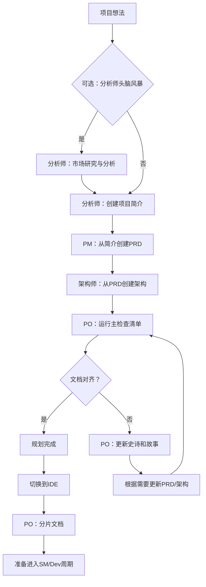
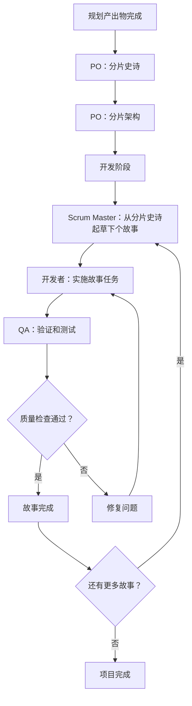

# BMAD-METHOD 架构深度分析

## 项目概述

BMAD-METHOD（敏捷AI驱动开发的突破性方法）是一个基于代理式敏捷开发（Agentic Agile Driven Development）的通用AI智能体框架。该框架旨在通过专业化的AI智能体来变革各个领域的开发模式，从软件开发到创意写作、商业策略、个人健康等多个领域。

### 核心理念

BMAD-METHOD的核心理念建立在两个关键创新之上：

1. **代理式规划（Agentic Planning）**：专门的智能体（分析师、产品经理、架构师）通过协作创建详细且一致的产品需求文档（PRD）和架构文档。

2. **上下文工程开发（Context-Engineered Development）**：Scrum Master智能体将详细的计划转化为包含完整上下文的超详细开发故事，确保开发智能体拥有实施所需的全部信息。

### 项目特点

- **通用性**：适用于任何领域的专业化AI应用
- **模块化**：基于代理、任务、模板、工作流的模块化架构
- **扩展性**：支持扩展包系统，可轻松添加新的领域专业知识
- **双环境支持**：同时支持IDE集成和Web界面使用

## 系统架构概览

### 整体架构图

```
BMAD-METHOD 生态系统
├── bmad-core/                    # 核心框架
│   ├── agents/                   # 智能体定义
│   ├── agent-teams/              # 智能体团队配置
│   ├── workflows/                # 工作流定义
│   ├── templates/                # 文档模板
│   ├── tasks/                    # 任务定义
│   ├── checklists/               # 质量检查清单
│   └── data/                     # 知识库数据
├── expansion-packs/              # 扩展包
│   ├── bmad-2d-phaser-game-dev/  # 2D游戏开发包
│   ├── bmad-2d-unity-game-dev/   # Unity游戏开发包
│   └── bmad-infrastructure-devops/ # DevOps基础设施包
├── tools/                        # 工具集
│   ├── builders/                 # 构建工具
│   ├── flattener/                # 代码扁平化工具
│   └── installer/                # 安装管理器
├── dist/                         # 分发包
├── docs/                         # 文档
└── common/                       # 通用组件
```

### 核心组件分析

#### 1. 智能体系统（Agents System）

智能体是BMAD-METHOD的核心构建模块，每个智能体都有明确的角色定义和职责范围：

**主要智能体类型**：

- **BMad Master Orchestrator**：主控制器，协调所有智能体的工作
- **分析师（Analyst）**：负责市场研究、竞争分析和项目简介创建
- **产品经理（PM）**：从项目简介创建详细的PRD
- **架构师（Architect）**：基于PRD设计技术架构
- **产品负责人（PO）**：验证文档一致性和完整性
- **Scrum Master（SM）**：将规划转化为开发故事
- **开发者（Developer）**：实施具体的开发任务
- **QA**：质量保证和测试
- **UX专家**：用户体验和界面设计

**智能体定义结构**：

```yaml
agent:
  name: "智能体名称"
  id: "智能体标识"
  title: "职位头衔"
  icon: "图标"
  whenToUse: "使用场景说明"

persona:
  role: "角色定义"
  style: "行为风格"
  identity: "身份认同"
  focus: "专注领域"

commands:
  - help: "帮助命令"
  - task-specific-commands: "特定任务命令"

dependencies:
  tasks: ["依赖的任务列表"]
  templates: ["依赖的模板列表"]
  checklists: ["依赖的检查清单"]
  data: ["依赖的数据文件"]
```

#### 2. 工作流系统（Workflow System）

工作流定义了从项目概念到开发完成的完整流程：

**主要工作流类型**：

- **Greenfield全栈应用开发**：从零开始的全栈应用开发流程
- **Brownfield项目增强**：现有项目的功能增强流程
- **专业化工作流**：针对特定领域的定制化流程

**工作流结构示例**：

```yaml
workflow:
  id: "工作流标识"
  name: "工作流名称"
  description: "工作流描述"
  type: "工作流类型"
  project_types: ["适用的项目类型"]
  
  sequence:
    - agent: "智能体名称"
      creates: "创建的产出物"
      requires: ["依赖的输入"]
      notes: "执行说明"
```

#### 3. 模板系统（Template System）

模板系统提供了标准化的文档生成框架：

**核心模板类型**：

- **PRD模板**：产品需求文档模板
- **架构模板**：技术架构文档模板
- **故事模板**：开发故事模板
- **项目简介模板**：项目概述模板

**模板处理机制**：

- **变量替换**：使用`{{placeholder}}`进行动态内容替换
- **AI指令嵌入**：通过`[[LLM: instructions]]`嵌入AI处理逻辑
- **条件逻辑**：支持基于条件的内容生成

#### 4. 任务系统（Task System）

任务系统定义了可重复执行的具体操作：

**主要任务类型**：

- **文档创建**：`create-doc.md`
- **故事创建**：`create-next-story.md`
- **文档分片**：`shard-doc.md`
- **高级启发**：`advanced-elicitation.md`
- **检查清单执行**：`execute-checklist.md`

### 构建与分发系统

#### Web构建器（Web Builder）

`tools/builders/web-builder.js`负责为Web环境创建智能体包：

**构建流程**：

1. **依赖解析**：递归解析智能体的所有依赖关系
2. **内容聚合**：将所有相关文件的内容合并为单一文本文件
3. **格式化处理**：添加清晰的分隔符和文件路径标识
4. **输出生成**：在`dist/`目录生成可上传的`.txt`文件

#### 代码扁平化工具（Flattener）

专为AI模型设计的代码库准备工具：

**功能特性**：

- **AI优化输出**：生成专为AI模型消费设计的XML格式
- **智能过滤**：自动遵守`.gitignore`模式，排除不必要文件
- **二进制文件检测**：智能识别并排除二进制文件
- **进度跟踪**：实时进度指示器和完整统计信息
- **灵活输出**：可自定义输出位置和命名

### 配置系统

#### 核心配置（core-config.yaml）

```yaml
markdownExploder: true
prd:
  prdFile: docs/prd.md
  prdVersion: v4
  prdSharded: true
  prdShardedLocation: docs/prd
architecture:
  architectureFile: docs/architecture.md
  architectureVersion: v4
  architectureSharded: true
  architectureShardedLocation: docs/architecture
devLoadAlwaysFiles:
  - docs/architecture/coding-standards.md
  - docs/architecture/tech-stack.md
  - docs/architecture/source-tree.md
devDebugLog: .ai/debug-log.md
devStoryLocation: docs/stories
slashPrefix: BMad
```

## 技术架构优势

### 1. 上下文保持机制

BMAD-METHOD通过以下机制解决了AI辅助开发中的上下文丢失问题：

- **分片文档系统**：将大型文档分解为小块，便于AI处理
- **故事内嵌上下文**：每个开发故事包含完整的实施上下文
- **依赖关系映射**：智能体明确知道其依赖的资源和能力

### 2. 质量保证体系

通过多层次的质量控制确保输出质量：

- **检查清单系统**：标准化的质量验证流程
- **多智能体协作**：不同角色的智能体相互验证
- **迭代改进机制**：支持多轮优化和完善

### 3. 扩展性设计

框架的模块化设计支持无限扩展：

- **扩展包机制**：独立的功能模块，可按需添加
- **领域专业化**：针对特定领域的专业智能体和工作流
- **模板自定义**：支持自定义文档模板和工作流程

### 4. 双环境适配

同时支持两种主要使用环境：

- **IDE集成**：直接在开发环境中使用，支持代码生成和项目管理
- **Web界面**：通过预构建包在各种AI聊天界面中使用

## 核心工作流程

### 规划阶段工作流



### 开发周期工作流



## 技术实现细节

### 智能体激活机制

每个智能体都有标准化的激活流程：

1. **读取完整文件**：加载包含完整定义的智能体文件
2. **采用人格角色**：根据YAML定义转换为指定角色
3. **初始化问候**：以指定身份问候用户并说明可用命令
4. **等待指令**：仅响应用户明确的命令或请求

### 依赖解析系统

智能体通过依赖声明系统获取所需资源：

- **按需加载**：仅在需要时加载依赖文件
- **类型映射**：依赖项自动映射到对应的文件路径
- **灵活匹配**：支持模糊匹配用户请求到具体任务

### 命令系统

所有命令都使用`*`前缀，确保清晰的指令识别：

- `*help`：显示可用命令
- `*agent [name]`：切换到指定智能体
- `*task [name]`：执行指定任务
- `*workflow [name]`：启动指定工作流

## 创新特性

### 1. 智能上下文管理

通过故事文件的上下文嵌入机制，确保开发智能体始终拥有完整的实施上下文，避免了传统AI开发中的上下文丢失问题。

### 2. 渐进式文档处理

大型文档通过分片系统被分解为AI可处理的小块，同时保持整体结构的完整性和一致性。

### 3. 多模态环境支持

同一套智能体系统可以在IDE和Web环境中无缝运行，通过构建系统自动适配不同环境的需求。

### 4. 领域特化扩展

扩展包机制允许框架轻松扩展到任何专业领域，从游戏开发到DevOps，从创意写作到商业策略。

## 总结

BMAD-METHOD代表了AI辅助开发的一个重要突破，通过其独特的代理式架构、上下文工程和模块化设计，解决了传统AI开发工具中的关键问题。该框架不仅提供了完整的软件开发生命周期支持，还通过扩展包机制实现了向其他专业领域的无缝扩展。

其创新的双阶段方法（规划阶段的详细协作+开发阶段的上下文丰富故事）确保了AI智能体能够产生高质量、一致性强的输出，同时保持了足够的灵活性来适应各种项目需求和工作环境。