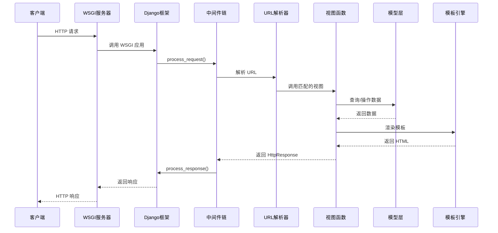

# Django 架构总览

## 🏗️ 整体架构设计哲学

Django 的架构设计体现了以下核心哲学：

### 1. MTV 模式 (Model-Template-View)

Django 采用 MTV 模式，这是对经典 MVC 模式的变体：

```
传统 MVC          Django MTV
Controller   →    View (业务逻辑)
View         →    Template (展示层)
Model        →    Model (数据层)
```

**设计理念**：
- **Model**：数据访问层，负责数据建模和业务规则
- **Template**：表示层，负责数据的展示逻辑
- **View**：控制层，负责业务逻辑和流程控制

### 2. 核心设计原则

#### 约定优于配置 (Convention over Configuration)
```python
# Django 通过约定简化配置
# 应用结构约定
myapp/
    models.py      # 模型定义
    views.py       # 视图逻辑
    urls.py        # URL 配置
    admin.py       # 管理后台
    tests.py       # 测试用例
```

#### DRY 原则 (Don't Repeat Yourself)
```python
# Model 定义自动生成数据库表结构
class Article(models.Model):
    title = models.CharField(max_length=200)
    content = models.TextField()
    
    # 自动生成：
    # - 数据库表结构
    # - Admin 界面
    # - 表单字段
```

#### 松耦合高内聚
```python
# 通过信号机制实现组件解耦
from django.db.models.signals import post_save
from django.dispatch import receiver

@receiver(post_save, sender=Article)
def article_saved(sender, instance, **kwargs):
    # 解耦的事件处理
    pass
```

## 🔧 核心组件架构

### 1. 框架启动流程

```mermaid
graph TD
    A[Django 启动] --> B[导入 settings]
    B --> C[配置日志系统]
    C --> D[初始化应用注册表]
    D --> E[加载已安装应用]
    E --> F[执行应用 ready()]
    F --> G[创建 WSGI/ASGI 应用]
    G --> H[启动服务器]
```

**关键代码分析**：
```python
# django/__init__.py
def setup(set_prefix=True):
    """Django 框架初始化入口"""
    from django.apps import apps
    from django.conf import settings
    from django.urls import set_script_prefix
    from django.utils.log import configure_logging

    # 1. 配置日志系统
    configure_logging(settings.LOGGING_CONFIG, settings.LOGGING)
    
    # 2. 设置 URL 前缀
    if set_prefix:
        set_script_prefix(
            "/" if settings.FORCE_SCRIPT_NAME is None 
            else settings.FORCE_SCRIPT_NAME
        )
    
    # 3. 填充应用注册表 - 核心步骤
    apps.populate(settings.INSTALLED_APPS)
```

### 2. 应用注册表 (Apps Registry)

**核心类**：`django.apps.registry.Apps`

```python
class Apps:
    """应用配置注册表 - Django 的应用管理中心"""
    
    def __init__(self, installed_apps=()):
        # 存储所有模型的映射: app_label -> model_name -> model_class
        self.all_models = defaultdict(dict)
        
        # 应用配置映射: label -> AppConfig
        self.app_configs = {}
        
        # 状态标志
        self.apps_ready = self.models_ready = self.ready = False
        self.ready_event = threading.Event()
        
        # 线程安全锁
        self._lock = threading.RLock()
```

**应用发现与加载流程**：

```mermaid
graph TD
    A[INSTALLED_APPS] --> B[创建 AppConfig]
    B --> C[导入应用模块]
    C --> D[注册模型类]
    D --> E[执行 ready() 回调]
    E --> F[标记为 ready]
```

### 3. 配置系统 (Settings)

**配置加载机制**：
```python
# django/conf/__init__.py
class Settings:
    def __init__(self, settings_module):
        # 1. 加载全局默认配置
        for setting in dir(global_settings):
            if setting.isupper():
                setattr(self, setting, getattr(global_settings, setting))
        
        # 2. 加载项目配置覆盖默认值
        self.SETTINGS_MODULE = settings_module
        mod = importlib.import_module(self.SETTINGS_MODULE)
        
        for setting in dir(mod):
            if setting.isupper():
                setting_value = getattr(mod, setting)
                setattr(self, setting, setting_value)
```

**配置的分层结构**：
```
项目配置 (settings.py)
        ↓ 覆盖
全局默认配置 (global_settings.py)
        ↓ 兜底
框架硬编码配置
```

### 4. URL 路由系统

**路由解析核心**：`django.urls.resolvers.URLResolver`

```python
class URLResolver:
    """URL 解析器 - Django 路由系统的核心"""
    
    def resolve(self, path):
        """解析 URL 路径到视图函数"""
        # 1. 尝试匹配当前级别的 URL 模式
        for pattern in self.url_patterns:
            match = pattern.resolve(path)
            if match:
                return match
        
        # 2. 抛出 404 异常
        raise Resolver404({'tried': tried, 'path': new_path})
```

**路由匹配流程**：

```mermaid
graph TD
    A[请求 URL] --> B[URLResolver.resolve()]
    B --> C{匹配 URLPattern?}
    C -->|是| D[返回 ResolverMatch]
    C -->|否| E[尝试下一个 Pattern]
    E --> C
    E -->|所有Pattern都不匹配| F[抛出 Resolver404]
    D --> G[调用对应 View]
```

## 🔄 请求-响应生命周期

### 完整请求处理流程



### 核心处理器：BaseHandler

```python
# django/core/handlers/base.py
class BaseHandler:
    """请求处理基类"""
    
    def _get_response(self, request):
        """核心请求处理方法"""
        
        # 1. URL 解析
        resolver = get_resolver(urlconf)
        resolver_match = resolver.resolve(request.path_info)
        
        # 2. 设置请求属性
        request.resolver_match = resolver_match
        
        # 3. 调用视图函数
        callback = resolver_match.func
        response = callback(request, *callback_args, **callback_kwargs)
        
        return response
```

### 中间件执行链

**中间件栈设计**：

```
请求方向 →
┌─────────────────┐
│ SecurityMiddleware │ process_request()
├─────────────────┤
│ SessionMiddleware  │ process_request() 
├─────────────────┤
│ AuthenticationMW   │ process_request()
├─────────────────┤
│      View        │ ← 核心视图处理
├─────────────────┤
│ AuthenticationMW   │ process_response()
├─────────────────┤
│ SessionMiddleware  │ process_response()
├─────────────────┤
│ SecurityMiddleware │ process_response()
└─────────────────┘
← 响应方向
```

**中间件装载机制**：
```python
def load_middleware(self, is_async=False):
    """从 settings.MIDDLEWARE 装载中间件"""
    
    handler = self._get_response
    
    # 反向遍历中间件列表，形成洋葱模型
    for middleware_path in reversed(settings.MIDDLEWARE):
        middleware = import_string(middleware_path)
        
        # 实例化中间件，传入内层处理器
        mw_instance = middleware(handler)
        handler = mw_instance
    
    self._middleware_chain = handler
```

## 🧩 组件协作关系

### 1. 应用生态系统

```
Django 项目
├── 项目设置 (settings.py)
├── 主 URL 配置 (urls.py) 
├── WSGI/ASGI 入口 (wsgi.py/asgi.py)
└── 应用包
    ├── App 1 (models, views, urls, admin)
    ├── App 2 (models, views, urls, admin)  
    └── App N (models, views, urls, admin)
```

### 2. 数据流向

```
HTTP Request
    ↓
WSGI Handler → Middleware Chain → URL Router
    ↓              ↓                ↓
  View Function ← Database ← Model Layer
    ↓
Template Engine → Template Files
    ↓
HTTP Response
```

### 3. 依赖注入模式

Django 通过以下机制实现依赖注入：

```python
# 1. 通过 request 对象注入上下文
def my_view(request):
    # request.user - 认证中间件注入
    # request.session - 会话中间件注入
    pass

# 2. 通过 settings 注入配置
from django.conf import settings
DATABASE_URL = settings.DATABASES['default']['NAME']

# 3. 通过信号机制注入扩展点
from django.db.models.signals import pre_save
@receiver(pre_save, sender=MyModel)
def my_handler(sender, instance, **kwargs):
    pass
```

## 💡 架构优势分析

### 1. 开发效率
- **约定减少决策**：标准的项目结构和文件命名
- **自动化生成**：Admin 界面、表单、迁移文件
- **丰富的内置功能**：认证、会话、缓存、国际化

### 2. 可维护性
- **模块化设计**：应用之间松耦合
- **清晰的分层**：MTV 模式职责明确  
- **配置集中管理**：settings 模块统一配置

### 3. 扩展性
- **中间件机制**：可插拔的请求处理管道
- **信号系统**：事件驱动的扩展点
- **自定义字段/标签**：框架核心功能可扩展

### 4. 性能考虑
- **ORM 优化**：惰性求值、查询优化
- **缓存框架**：多层缓存支持
- **静态文件处理**：生产环境优化

## 🎯 设计模式应用

### 1. 注册表模式 (Registry Pattern)
```python
# Apps 注册表管理所有应用
apps.register(AppConfig)
apps.get_app_config('myapp')
```

### 2. 工厂模式 (Factory Pattern)  
```python
# 数据库连接工厂
connections = ConnectionHandler()
connection = connections['default']
```

### 3. 观察者模式 (Observer Pattern)
```python
# Django 信号机制
from django.db.models.signals import post_save
post_save.connect(my_handler, sender=MyModel)
```

### 4. 装饰器模式 (Decorator Pattern)
```python
# 中间件洋葱模型
# 视图装饰器
@login_required
@cache_page(60)
def my_view(request):
    pass
```

### 5. 模板方法模式 (Template Method Pattern)
```python
# BaseHandler 定义处理流程骨架
class BaseHandler:
    def _get_response(self, request):
        # 模板方法定义处理步骤
        resolver_match = self.resolve_request(request)
        response = self.process_view(request, resolver_match)
        return self.finalize_response(response)
```

---

Django 的架构设计体现了多年 Web 开发最佳实践的沉淀，通过合理的抽象和模块化设计，提供了一个既强大又灵活的 Web 开发框架。接下来的章节将深入分析各个核心组件的实现细节。