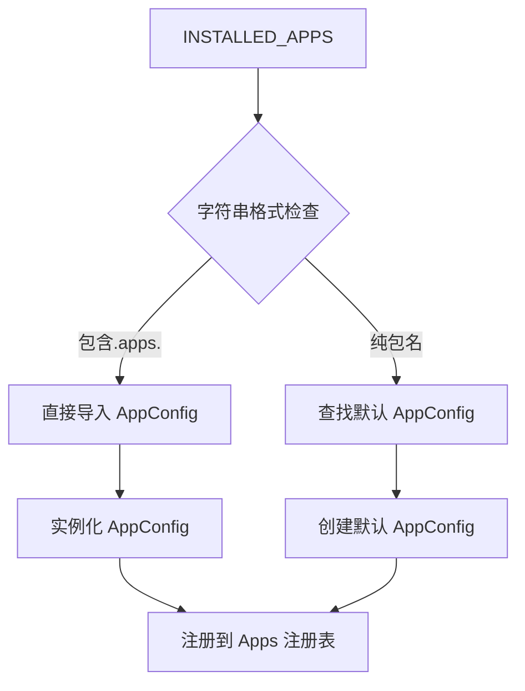
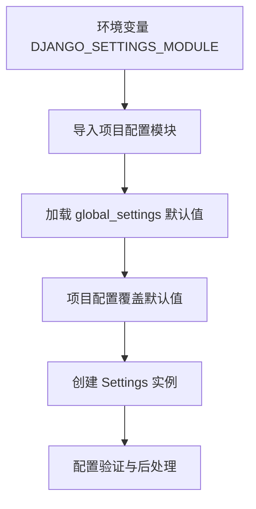

# Django 核心组件深度分析

## 🏗️ 应用系统 (Apps Framework)

Django 的应用系统是整个框架的基石，提供了模块化开发和组件管理的能力。

### 1. AppConfig - 应用配置类

**核心设计**：每个 Django 应用都有一个对应的 `AppConfig` 实例来管理其配置和生命周期。

```python
# django/apps/config.py
class AppConfig:
    """Django 应用配置类"""
    
    def __init__(self, app_name, app_module):
        # 应用的完整 Python 路径，如 'django.contrib.admin'  
        self.name = app_name
        
        # 应用根模块对象
        self.module = app_module
        
        # 应用注册表引用（由注册表设置）
        self.apps = None
        
        # 应用标签（必须在项目中唯一）
        if not hasattr(self, 'label'):
            self.label = app_name.rpartition('.')[2]
            
        # 人类可读的应用名称
        if not hasattr(self, 'verbose_name'):
            self.verbose_name = self.label.title()
            
        # 应用文件系统路径
        if not hasattr(self, 'path'):
            self.path = self._path_from_module(app_module)
```

**生命周期钩子**：
```python
class MyAppConfig(AppConfig):
    name = 'myapp'
    
    def ready(self):
        """应用完全加载后的回调"""
        # 注册信号处理器
        from . import signals
        
        # 执行应用初始化逻辑
        self.setup_app_specific_settings()
```

**应用发现机制**：



### 2. Apps 注册表 - 全局应用管理

**注册表核心结构**：
```python
# django/apps/registry.py
class Apps:
    """应用配置注册表"""
    
    def __init__(self, installed_apps=()):
        # 所有模型的全局注册表
        # 结构: {app_label: {model_name: model_class}}
        self.all_models = defaultdict(dict)
        
        # 应用配置映射 {label: AppConfig}
        self.app_configs = {}
        
        # 注册表状态标记
        self.apps_ready = False      # 应用加载完成
        self.models_ready = False    # 模型导入完成  
        self.ready = False          # 完全就绪
        
        # 线程同步原语
        self.ready_event = threading.Event()
        self._lock = threading.RLock()
```

**应用填充流程**：
```python
def populate(self, installed_apps=None):
    """核心方法：填充应用注册表"""
    
    if self.ready:
        return
    
    with self._lock:
        if self.ready:
            return
        
        # 阶段1: 创建并注册所有 AppConfig
        for app_name in installed_apps:
            app_config = AppConfig.create(app_name)
            self.app_configs[app_config.label] = app_config
        
        # 标记应用就绪
        self.apps_ready = True
        
        # 阶段2: 导入每个应用的 models 模块
        for app_config in self.app_configs.values():
            app_config.import_models()
        
        # 标记模型就绪
        self.models_ready = True
        
        # 阶段3: 执行每个应用的 ready() 回调
        for app_config in self.app_configs.values():
            app_config.ready()
        
        # 标记完全就绪
        self.ready = True
        self.ready_event.set()
```

**模型注册机制**：
```python
def register_model(self, app_label, model):
    """注册模型到全局注册表"""
    
    model_name = model._meta.model_name
    app_models = self.all_models[app_label]
    
    if model_name in app_models:
        if app_models[model_name] is not model:
            raise RuntimeError(f"Conflicting model: {app_label}.{model_name}")
    else:
        app_models[model_name] = model
```

### 3. 全局单例：apps 实例

```python
# django/apps/__init__.py
from .registry import Apps

# 全局应用注册表单例
apps = Apps(installed_apps=None)
```

**使用示例**：
```python
from django.apps import apps

# 获取应用配置
app_config = apps.get_app_config('myapp')

# 获取模型类
MyModel = apps.get_model('myapp', 'MyModel')

# 检查应用状态
if apps.ready:
    # 执行需要应用完全就绪的代码
    pass
```

## ⚙️ 配置系统 (Settings)

Django 的配置系统采用了懒加载和分层覆盖的设计。

### 1. LazySettings - 懒加载代理

**设计模式**：代理模式 + 懒加载

```python
# django/conf/__init__.py
class LazySettings(LazyObject):
    """Django 配置的懒加载代理"""
    
    def _setup(self, name=None):
        """首次访问时加载配置"""
        
        # 1. 获取配置模块路径
        settings_module = os.environ.get(ENVIRONMENT_VARIABLE)
        if not settings_module:
            raise ImproperlyConfigured(
                f"You must define {ENVIRONMENT_VARIABLE}"
            )
        
        # 2. 创建实际的 Settings 对象
        self._wrapped = Settings(settings_module)
    
    def __getattr__(self, name):
        """属性访问拦截器"""
        
        # 触发懒加载
        if self._wrapped is empty:
            self._setup(name)
        
        val = getattr(self._wrapped, name)
        
        # 特殊配置的后处理
        if name in {'MEDIA_URL', 'STATIC_URL'} and val is not None:
            val = self._add_script_prefix(val)
        elif name == 'SECRET_KEY' and not val:
            raise ImproperlyConfigured("SECRET_KEY must not be empty")
        
        # 缓存配置值
        self.__dict__[name] = val
        return val
```

### 2. Settings - 配置对象

**配置加载流程**：



```python
class Settings:
    """Django 配置对象"""
    
    def __init__(self, settings_module):
        # 1. 加载全局默认配置
        for setting in dir(global_settings):
            if setting.isupper():
                setattr(self, setting, getattr(global_settings, setting))
        
        # 2. 存储配置模块名
        self.SETTINGS_MODULE = settings_module
        
        # 3. 导入并加载项目配置
        mod = importlib.import_module(self.SETTINGS_MODULE)
        
        # 4. 项目配置覆盖默认配置
        for setting in dir(mod):
            if setting.isupper():
                setting_value = getattr(mod, setting)
                setattr(self, setting, setting_value)
        
        # 5. 配置检查和验证
        if hasattr(time, 'tzset'):
            # 更新系统时区
            os.environ['TZ'] = self.TIME_ZONE
            time.tzset()
```

### 3. 配置分层结构

```
用户项目配置 (myproject/settings.py)
        ↓ 覆盖
Django 全局默认配置 (global_settings.py)  
        ↓ 兜底
框架硬编码配置
```

**全局配置单例**：
```python
# django/conf/__init__.py
settings = LazySettings()
```

**使用模式**：
```python
from django.conf import settings

# 访问配置（触发懒加载）
if settings.DEBUG:
    print("Debug mode enabled")

# 动态配置检查
if hasattr(settings, 'CUSTOM_SETTING'):
    custom_value = settings.CUSTOM_SETTING
```

## 🌐 WSGI/ASGI 接口实现

Django 同时支持 WSGI 和 ASGI 协议，提供了传统同步和现代异步 Web 应用的能力。

### 1. WSGI 实现 - 同步接口

**WSGIHandler 核心实现**：
```python
# django/core/handlers/wsgi.py
class WSGIHandler(base.BaseHandler):
    """Django WSGI 应用处理器"""
    
    request_class = WSGIRequest
    
    def __init__(self):
        super().__init__()
        self.load_middleware()
    
    def __call__(self, environ, start_response):
        """WSGI 应用入口点"""
        
        # 设置脚本前缀
        set_script_prefix(get_script_name(environ))
        
        # 发送请求开始信号  
        signals.request_started.send(sender=self.__class__, environ=environ)
        
        try:
            # 创建 Django 请求对象
            request = self.request_class(environ)
        except UnicodeDecodeError:
            # 处理编码错误
            response = http.HttpResponseBadRequest()
        else:
            # 处理请求
            response = self.get_response(request)
        
        # 发送请求完成信号
        signals.request_finished.send(sender=self.__class__)
        
        # 返回 WSGI 响应
        return response(environ, start_response)
```

**WSGIRequest - WSGI 请求封装**：
```python
class WSGIRequest(HttpRequest):
    """从 WSGI environ 构造的请求对象"""
    
    def __init__(self, environ):
        # 解析 environ 字典
        script_name = get_script_name(environ)
        path_info = get_path_info(environ)
        
        self.environ = environ
        self.path_info = path_info
        self.path = script_name + path_info
        self.META = environ
        self.method = environ['REQUEST_METHOD'].upper()
        
        # 处理查询字符串
        self.GET = QueryDict(environ.get('QUERY_STRING', ''))
        
        # 处理请求体（延迟解析）
        self._post_parse_error = False
        self._read_started = False
        
        # 解析 Content-Type 和长度
        content_type = environ.get('CONTENT_TYPE', '')
        content_length = self._get_content_length()
        
        # 创建输入流包装器
        if content_length > 0:
            self._stream = LimitedStream(environ['wsgi.input'], content_length)
        else:
            self._stream = environ['wsgi.input']
```

### 2. ASGI 实现 - 异步接口

**ASGIHandler 异步处理器**：
```python
# django/core/handlers/asgi.py  
class ASGIHandler(base.BaseHandler):
    """Django ASGI 应用处理器"""
    
    request_class = ASGIRequest
    
    def __init__(self):
        super().__init__()
        self.load_middleware(is_async=True)
    
    async def __call__(self, scope, receive, send):
        """ASGI 应用入口点"""
        
        # 设置异步上下文
        async with ThreadSensitiveContext():
            await self.handle(scope, receive, send)
    
    async def handle(self, scope, receive, send):
        """处理 ASGI 请求"""
        
        if scope['type'] == 'http':
            await self.handle_http(scope, receive, send)
        elif scope['type'] == 'websocket':  
            await self.handle_websocket(scope, receive, send)
        else:
            raise ValueError(f"Unknown scope type: {scope['type']}")
    
    async def handle_http(self, scope, receive, send):
        """处理 HTTP 请求"""
        
        # 读取请求体
        body_file = await self.read_body(receive)
        
        # 创建请求对象
        request = self.request_class(scope, body_file)
        
        # 异步处理请求
        response = await self.get_response_async(request)
        
        # 发送响应
        await self.send_response(response, send)
```

**ASGIRequest - ASGI 请求封装**：
```python
class ASGIRequest(HttpRequest):
    """从 ASGI scope 构造的请求对象"""
    
    def __init__(self, scope, body_file):
        self.scope = scope
        self._post_parse_error = False
        self._read_started = False
        
        # 解析路径信息
        self.path = scope['path']
        self.script_name = get_script_prefix(scope)
        if self.script_name:
            self.path_info = scope['path'].removeprefix(self.script_name)
        else:
            self.path_info = scope['path']
        
        # 构建 META 字典
        self.method = scope['method'].upper()
        query_string = scope.get('query_string', b'').decode()
        
        self.META = {
            'REQUEST_METHOD': self.method,
            'QUERY_STRING': query_string,
            'SCRIPT_NAME': self.script_name,
            'PATH_INFO': self.path_info,
            # 保持 WSGI 兼容性
            'wsgi.multithread': True,
            'wsgi.multiprocess': True,
        }
        
        # 解析客户端信息
        if scope.get('client'):
            self.META['REMOTE_ADDR'] = scope['client'][0]
            self.META['REMOTE_PORT'] = scope['client'][1]
        
        # 解析请求头
        for header_name, header_value in scope.get('headers', []):
            name = header_name.decode('latin1')
            value = header_value.decode('latin1')
            
            # 转换为 CGI 格式
            key = f'HTTP_{name.upper().replace("-", "_")}'
            self.META[key] = value
```

### 3. 协议适配层

**公共接口函数**：
```python
# django/core/wsgi.py
def get_wsgi_application():
    """获取 WSGI 应用的公共接口"""
    django.setup(set_prefix=False)
    return WSGIHandler()

# django/core/asgi.py  
def get_asgi_application():
    """获取 ASGI 应用的公共接口"""
    django.setup(set_prefix=False)
    return ASGIHandler()
```

**部署配置示例**：
```python
# wsgi.py - 传统部署
import os
from django.core.wsgi import get_wsgi_application

os.environ.setdefault('DJANGO_SETTINGS_MODULE', 'myproject.settings')
application = get_wsgi_application()

# asgi.py - 异步部署  
import os
from django.core.asgi import get_asgi_application

os.environ.setdefault('DJANGO_SETTINGS_MODULE', 'myproject.settings')
application = get_asgi_application()
```

## 🔀 URL 路由系统

Django 的 URL 路由系统是请求处理的入口，负责将 URL 映射到对应的视图函数。

### 1. URLResolver - 路由解析器

**核心解析逻辑**：
```python
# django/urls/resolvers.py
class URLResolver:
    """URL 解析器 - 路由系统核心"""
    
    def __init__(self, pattern, urlconf_name, default_kwargs=None, 
                 app_name=None, namespace=None):
        self.pattern = pattern
        self.urlconf_name = urlconf_name
        self.callback = None
        self.default_kwargs = default_kwargs or {}
        self.namespace = namespace
        self.app_name = app_name
        
        # 缓存已解析的 URL 模式
        self._reverse_dict = {}
        self._namespace_dict = {}
        self._app_dict = {}
    
    def resolve(self, path):
        """解析 URL 路径到视图函数"""
        
        path = str(path)  # 确保是字符串
        
        # 尝试匹配当前解析器的模式
        match = self.pattern.match(path)
        if match:
            new_path = path[match.end():]
            
            # 递归解析子模式
            for pattern in self.url_patterns:
                try:
                    sub_match = pattern.resolve(new_path)
                except Resolver404 as e:
                    # 收集已尝试的模式（调试用）
                    tried.extend(e.args[0]['tried'])
                else:
                    if sub_match:
                        # 合并匹配结果
                        sub_match.app_name = self.app_name
                        sub_match.namespace = self.namespace
                        return sub_match
            
            # 所有子模式都不匹配
            raise Resolver404({'tried': tried, 'path': new_path})
        
        # 当前解析器模式不匹配
        raise Resolver404({'tried': [[self.pattern]], 'path': path})
```

### 2. URLPattern - URL 模式

**简单 URL 模式**：
```python  
class URLPattern:
    """单个 URL 模式"""
    
    def __init__(self, pattern, callback, default_kwargs=None, name=None):
        self.pattern = pattern
        self.callback = callback  # 视图函数
        self.default_kwargs = default_kwargs or {}
        self.name = name
    
    def resolve(self, path):
        """匹配路径并返回解析结果"""
        
        match = self.pattern.match(path)
        if match:
            # 提取 URL 参数
            kwargs = match.groupdict()
            args = () if kwargs else match.groups()
            
            # 合并默认参数
            kwargs.update(self.default_kwargs)
            
            return ResolverMatch(
                func=self.callback,
                args=args,
                kwargs=kwargs,
                url_name=self.name,
                route=str(self.pattern.pattern),
            )
        
        return None
```

### 3. URL 配置加载机制

**URLconf 导入和缓存**：
```python
@cached_property
def url_patterns(self):
    """延迟加载和缓存 URL 配置"""
    
    if isinstance(self.urlconf_name, str):
        # 导入 URL 配置模块
        urlconf_module = import_module(self.urlconf_name)
        patterns = urlconf_module.urlpatterns
    else:
        # 直接使用 URL 模式列表
        patterns = self.urlconf_name
    
    # 预处理 URL 模式
    return [self._resolve_pattern(p) for p in patterns]

def _resolve_pattern(self, pattern):
    """处理单个 URL 模式"""
    
    if isinstance(pattern, URLPattern):
        return pattern
    elif isinstance(pattern, URLResolver):
        return pattern  
    else:
        # 兼容旧格式的 URL 配置
        return self._legacy_pattern(pattern)
```

### 4. 反向 URL 解析

**路由反向查找**：
```python  
def reverse(viewname, urlconf=None, args=None, kwargs=None):
    """根据视图名称反向生成 URL"""
    
    if urlconf is None:
        urlconf = get_urlconf()
    
    resolver = get_resolver(urlconf)
    
    # 查找匹配的 URL 模式
    possibilities = resolver.reverse_dict.getlist(viewname)
    
    for possibility in possibilities:
        for result, params in possibility:
            if args:
                if len(args) != len(params):
                    continue
                candidate = result % dict(zip(params, args))
            else:
                if set(kwargs) != set(params):
                    continue  
                candidate = result % kwargs
            
            # 验证生成的 URL 是否有效
            if re.match(resolver.regex.pattern, candidate):
                return candidate
    
    # 找不到匹配的模式
    raise NoReverseMatch(f"Reverse for '{viewname}' not found")
```

### 5. 路由性能优化

**模式编译缓存**：
```python
# URL 模式编译结果缓存
_resolver_cache = {}

@lru_cache(maxsize=None)
def get_resolver(urlconf=None):
    """获取缓存的 URL 解析器"""
    
    if urlconf is None:
        urlconf = settings.ROOT_URLCONF
    
    if urlconf not in _resolver_cache:
        _resolver_cache[urlconf] = URLResolver(
            RegexPattern(r'^/'), urlconf
        )
    
    return _resolver_cache[urlconf]
```

**路由匹配优化策略**：
1. **编译缓存**：正则表达式预编译和缓存
2. **早期退出**：匹配成功后立即返回
3. **模式排序**：将更具体的模式放在前面
4. **惰性加载**：URL 配置按需导入

---

Django 的核心组件通过精心设计的抽象和接口，提供了强大而灵活的 Web 开发基础。应用系统实现了模块化管理，配置系统提供了灵活的配置机制，WSGI/ASGI 接口确保了与各种 Web 服务器的兼容性，URL 路由系统则为请求分发提供了高效的解决方案。这些组件相互配合，构成了 Django 框架的坚实基础。