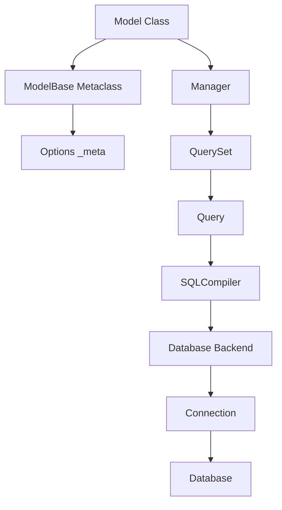

# Django ORM 系统深度解析

Django 的 ORM (Object-Relational Mapping) 是框架最复杂和强大的组件之一，它将面向对象的 Python 代码与关系型数据库无缝连接。

## 🏗️ ORM 架构总览

### 核心组件关系



### ORM 分层架构

```
应用层：Model 类定义
    ↓
对象映射层：ModelBase 元类、Fields
    ↓  
查询抽象层：Manager、QuerySet
    ↓
SQL 构建层：Query、SQLCompiler
    ↓
数据库适配层：Database Backend
    ↓
连接管理层：Connection Pool
    ↓
数据库层：PostgreSQL/MySQL/SQLite
```

## 🧬 ModelBase 元类机制

Django ORM 的核心魔法来自 `ModelBase` 元类，它在类定义时自动进行各种初始化工作。

### 1. 元类实现分析

```python
# django/db/models/base.py
class ModelBase(type):
    """所有 Django 模型的元类"""
    
    def __new__(cls, name, bases, attrs, **kwargs):
        super_new = super().__new__
        
        # 跳过 Model 基类本身的处理
        parents = [b for b in bases if isinstance(b, ModelBase)]
        if not parents:
            return super_new(cls, name, bases, attrs)
        
        # 创建新的模型类
        new_class = super_new(cls, name, bases, {'__module__': attrs.pop('__module__')})
        
        # 创建 Options 实例存储元数据
        attr_meta = attrs.pop('Meta', None)
        if not attr_meta:
            attr_meta = getattr(new_class, 'Meta', None)
        
        # 核心：创建 _meta 属性
        new_class.add_to_class(
            '_meta', 
            Options(attr_meta, app_label=app_label)
        )
        
        # 处理字段定义
        for obj_name, obj in attrs.items():
            new_class.add_to_class(obj_name, obj)
        
        # 注册模型到应用注册表
        new_class._meta.apps.register_model(new_class._meta.app_label, new_class)
        
        return new_class
```

### 2. 字段注册机制

```python
def add_to_class(cls, name, value):
    """向模型类添加属性的核心方法"""
    
    if _has_contribute_to_class(value):
        # 字段和管理器有 contribute_to_class 方法
        value.contribute_to_class(cls, name)
    else:
        # 普通属性直接设置
        setattr(cls, name, value)
```

**字段的 contribute_to_class 机制**：
```python
# django/db/models/fields/__init__.py
class Field:
    def contribute_to_class(self, cls, name):
        """字段向模型类贡献功能"""
        
        # 设置字段属性
        self.set_attributes_from_name(name)
        self.model = cls
        
        # 将字段添加到模型的 _meta 中
        cls._meta.add_field(self, private=False)
        
        # 为字段创建描述器
        setattr(cls, self.attname, self.descriptor_class(self))
        
        # 添加反向关系（对于外键等）
        if hasattr(self, 'contribute_to_related_class'):
            self.contribute_to_related_class(cls, self.remote_field)
```

### 3. 模型继承处理

Django 支持三种模型继承模式：

```python
# 抽象基类继承
class CommonInfo(models.Model):
    name = models.CharField(max_length=100)
    created = models.DateTimeField(auto_now_add=True)
    
    class Meta:
        abstract = True  # 标记为抽象基类

class Student(CommonInfo):  # 继承字段，不创建 CommonInfo 表
    grade = models.CharField(max_length=10)

# 多表继承  
class Place(models.Model):
    name = models.CharField(max_length=50)
    address = models.CharField(max_length=80)

class Restaurant(Place):  # 创建两个表，通过外键关联
    serves_pizza = models.BooleanField(default=False)

# 代理模型继承
class Person(models.Model):
    first_name = models.CharField(max_length=30)
    last_name = models.CharField(max_length=30)

class PersonProxy(Person):  # 同一张表，不同的行为
    class Meta:
        proxy = True
    
    def get_full_name(self):
        return f"{self.first_name} {self.last_name}"
```

## 🗂️ Options 元数据系统

每个模型都有一个 `_meta` 属性，存储模型的元数据信息。

### Options 类实现

```python
# django/db/models/options.py
class Options:
    """模型元数据容器"""
    
    def __init__(self, meta, app_label=None):
        # 基本信息
        self.object_name = None
        self.model_name = None
        self.verbose_name = None
        self.verbose_name_plural = None
        
        # 数据库相关
        self.db_table = ''
        self.db_tablespace = ''
        self.db_table_comment = ''
        
        # 字段集合
        self.local_fields = []      # 本地字段
        self.local_many_to_many = [] # 本地多对多字段
        self.private_fields = []     # 私有字段
        self.fields_map = {}         # 字段映射
        
        # 管理器
        self.managers = []
        self.managers_map = {}
        self.default_manager = None
        
        # 约束和索引
        self.constraints = []
        self.indexes = []
        
        # 权限和排序
        self.permissions = []
        self.default_permissions = ('add', 'change', 'delete', 'view')
        self.ordering = []
        
        # 处理 Meta 类的属性
        if meta:
            for attr_name in meta.__dict__:
                if not attr_name.startswith('_'):
                    setattr(self, attr_name, getattr(meta, attr_name))
    
    def add_field(self, field, private=False):
        """添加字段到模型元数据"""
        
        if private:
            self.private_fields.append(field)
        else:
            self.local_fields.append(field)
            self.setup_proxy(field.remote_field)
        
        # 建立字段映射
        if hasattr(field, 'attname'):
            self.fields_map[field.attname] = field
```

### 元数据的使用

```python
# 获取模型信息
model_name = MyModel._meta.model_name
table_name = MyModel._meta.db_table
app_label = MyModel._meta.app_label

# 获取字段信息
fields = MyModel._meta.get_fields()
field = MyModel._meta.get_field('field_name')

# 获取相关模型
related_objects = MyModel._meta.get_all_related_objects()
```

## 🔍 Manager 和 QuerySet 系统

Manager 是模型与数据库查询之间的接口，QuerySet 实现了具体的查询逻辑。

### 1. Manager 设计模式

```python
# django/db/models/manager.py
class BaseManager:
    """管理器基类"""
    
    creation_counter = 0  # 创建顺序计数器
    
    def __init__(self):
        super().__init__()
        self._set_creation_counter()
        self.model = None        # 绑定的模型类
        self.name = None         # 管理器名称
        self._db = None          # 数据库别名
        self._hints = {}         # 查询提示
    
    def contribute_to_class(self, cls, name):
        """管理器向模型类贡献功能"""
        
        self.name = self.name or name
        self.model = cls
        
        # 设置为模型类的属性
        setattr(cls, name, ManagerDescriptor(self))
        
        # 注册到模型的 _meta 中
        cls._meta.add_manager(self)
        
        # 设置默认管理器
        if not getattr(cls, '_default_manager', None):
            cls._default_manager = self
    
    def get_queryset(self):
        """返回此管理器的 QuerySet"""
        return QuerySet(self.model, using=self._db, hints=self._hints)
    
    def all(self):
        return self.get_queryset()
    
    def filter(self, *args, **kwargs):
        return self.get_queryset().filter(*args, **kwargs)
```

**Manager 描述器**：
```python
class ManagerDescriptor:
    """Manager 的描述器，处理模型类和实例的访问差异"""
    
    def __init__(self, manager):
        self.manager = manager
    
    def __get__(self, instance, cls=None):
        if instance is not None:
            # 从模型实例访问：抛出错误
            raise AttributeError(
                "Manager isn't accessible via %s instances" % cls.__name__
            )
        
        # 从模型类访问：返回管理器
        if cls._meta.abstract:
            raise AttributeError(
                "Manager isn't available; %s is abstract" % (
                    cls._meta.object_name,
                )
            )
        
        # 返回管理器的副本（避免状态污染）
        return cls._meta.managers_map[self.manager.name]
```

### 2. QuerySet 惰性求值机制

QuerySet 是 Django ORM 的核心，实现了惰性求值和链式调用。

```python
# django/db/models/query.py
class QuerySet:
    """QuerySet 实现惰性求值的查询接口"""
    
    def __init__(self, model=None, query=None, using=None, hints=None):
        self.model = model
        self.query = query or sql.Query(self.model)
        self._db = using
        self._hints = hints or {}
        
        # 缓存相关
        self._result_cache = None    # 结果缓存
        self._sticky_filter = False  # 粘性过滤器
        self._for_write = False      # 写操作标记
        
        # 预取相关
        self._prefetch_related_lookups = ()
        self._prefetch_done = False
        
        # 已知相关对象
        self._known_related_objects = {}
        
        # 迭代器类
        self._iterable_class = ModelIterable
    
    def filter(self, *args, **kwargs):
        """过滤查询"""
        return self._filter_or_exclude(False, args, kwargs)
    
    def exclude(self, *args, **kwargs):
        """排除查询"""
        return self._filter_or_exclude(True, args, kwargs)
    
    def _filter_or_exclude(self, negate, args, kwargs):
        """过滤或排除的核心实现"""
        
        if (args or kwargs) and self.query.is_sliced:
            raise TypeError("Cannot filter a query once a slice has been taken.")
        
        # 克隆查询集
        clone = self._chain()
        
        # 构建查询条件
        if args or kwargs:
            q_objects = []
            for arg in args:
                if not isinstance(arg, Q):
                    raise TypeError(
                        "filter() argument must be a Q object, not %r." % type(arg)
                    )
                q_objects.append(arg)
            
            for key, value in kwargs.items():
                q_objects.append(Q(**{key: value}))
            
            # 添加过滤条件到查询
            condition = reduce(operator.and_, q_objects)
            clone.query.add_q(condition, negate=negate)
        
        return clone
    
    def _chain(self, **kwargs):
        """克隆 QuerySet，支持链式调用"""
        
        obj = self._clone()
        for key, val in kwargs.items():
            setattr(obj, key, val)
        return obj
    
    def _clone(self):
        """深度克隆 QuerySet"""
        
        c = self.__class__(
            model=self.model,
            query=self.query.chain(),  # 克隆查询对象
            using=self._db,
            hints=self._hints
        )
        
        # 复制所有状态
        c._sticky_filter = self._sticky_filter
        c._for_write = self._for_write
        c._prefetch_related_lookups = self._prefetch_related_lookups[:]
        c._known_related_objects = self._known_related_objects
        c._iterable_class = self._iterable_class
        c._fields = self._fields
        
        return c
```

### 3. 惰性求值触发点

QuerySet 只在特定情况下才会执行数据库查询：

```python
def _fetch_all(self):
    """从数据库获取所有结果"""
    
    if self._result_cache is None:
        # 执行查询
        self._result_cache = list(self._iterable_class(self))
    
    if self._prefetch_related_lookups and not self._prefetch_done:
        # 执行预取相关对象
        self._prefetch_related_objects()

# 触发查询的操作
def __iter__(self):
    """迭代器协议"""
    self._fetch_all()
    return iter(self._result_cache)

def __len__(self):
    """长度计算"""
    self._fetch_all()
    return len(self._result_cache)

def __getitem__(self, k):
    """索引访问和切片"""
    if not isinstance(k, (int, slice)):
        raise TypeError("QuerySet indices must be integers or slices")
    
    if isinstance(k, slice):
        # 切片：克隆并设置限制
        if k.start is not None and k.start < 0:
            raise ValueError("Negative indexing is not supported")
        
        clone = self._clone()
        if k.stop is not None:
            clone.query.set_limits(k.start, k.stop)
        return clone
    
    # 单个索引：获取单个对象
    clone = self._clone()
    clone.query.set_limits(k, k + 1)
    return list(clone)[0]
```

## 📊 Query 和 SQL 编译

QuerySet 将 Python 操作转换为 SQL 查询的核心在于 Query 对象和 SQLCompiler。

### 1. Query 对象结构

```python
# django/db/models/sql/query.py
class Query:
    """SQL 查询的抽象表示"""
    
    def __init__(self, model, alias_cols=True):
        self.model = model
        self.alias_refcount = {}
        self.alias_map = {}
        self.table_map = {}
        self.default_cols = True
        self.default_ordering = True
        self.standard_ordering = True
        
        # WHERE 子句
        self.where = WhereNode()
        
        # 连接信息
        self.table_map = {model._meta.db_table: [model._meta.db_table]}
        
        # SELECT 字段
        self.select = []
        self.tables = []
        
        # 其他子句
        self.order_by = []
        self.group_by = []
        self.having = WhereNode()
        
        # 限制和偏移
        self.low_mark, self.high_mark = 0, None
        
        # 其他选项
        self.distinct = False
        self.distinct_fields = []
        self.select_for_update = False
        self.select_for_update_nowait = False
    
    def add_q(self, q_object, negate=False):
        """添加 Q 对象到查询条件"""
        
        # 解析 Q 对象为 WhereNode
        clause = WhereNode()
        clause.add(q_object, AND)
        
        if negate:
            clause.negate()
        
        # 合并到现有 WHERE 条件
        self.where.add(clause, AND)
```

### 2. SQL 编译过程

```python
# django/db/models/sql/compiler.py
class SQLCompiler:
    """SQL 编译器基类"""
    
    def __init__(self, query, connection, using, elide_empty=True):
        self.query = query
        self.connection = connection
        self.using = using
        self.elide_empty = elide_empty
        
        # 编译结果缓存
        self.select = None
        self.annotation_col_map = None
        self.klass_info = None
    
    def as_sql(self, with_limits=True, with_col_aliases=False):
        """编译为 SQL 语句"""
        
        # 获取各个子句
        out_cols = []
        col_idx = 1
        
        # SELECT 子句
        if self.query.select:
            out_cols.extend(self.get_select())
        else:
            out_cols.extend(self.get_default_columns())
        
        # FROM 子句  
        from_clause = self.get_from_clause()
        
        # WHERE 子句
        where, w_params = self.compile(self.query.where)
        
        # GROUP BY 子句
        grouping = []
        if self.query.group_by is not None:
            grouping = self.get_group_by(self.query.select + extra_select)
        
        # HAVING 子句
        having = []
        if self.query.having:
            having_clause, h_params = self.compile(self.query.having)
            having = [having_clause]
            params.extend(h_params)
        
        # ORDER BY 子句
        order_by = self.get_order_by()
        
        # 构建完整 SQL
        sql = 'SELECT %s FROM %s' % (
            ', '.join(out_cols),
            from_clause[0] if from_clause else self.quote_name_unless_alias(
                self.query.get_meta().db_table
            )
        )
        
        if where:
            sql += ' WHERE %s' % where
        if grouping:
            sql += ' GROUP BY %s' % ', '.join(grouping)
        if having:
            sql += ' HAVING %s' % ', '.join(having)
        if order_by:
            sql += ' ORDER BY %s' % ', '.join(order_by)
        
        # 添加 LIMIT 和 OFFSET
        if with_limits:
            low_mark, high_mark = self.query.low_mark, self.query.high_mark
            if high_mark is not None:
                sql = self.connection.ops.limit_offset_sql(
                    sql, high_mark - low_mark, low_mark
                )
        
        return sql, tuple(params)
```

## 🚀 性能优化机制

Django ORM 提供了多种性能优化机制。

### 1. 查询优化

**select_related - 减少查询次数**：
```python
# 低效：N+1 查询问题
books = Book.objects.all()
for book in books:
    print(book.author.name)  # 每次都查询数据库

# 高效：使用 JOIN 一次获取
books = Book.objects.select_related('author')
for book in books:
    print(book.author.name)  # 不再查询数据库
```

**prefetch_related - 优化反向关系**：
```python
# 低效：每个作者都查询一次
authors = Author.objects.all()
for author in authors:
    print(author.books.count())

# 高效：预取相关对象
authors = Author.objects.prefetch_related('books')
for author in authors:
    print(author.books.count())  # 使用缓存的结果
```

### 2. 批量操作优化

```python
# bulk_create - 批量创建
Book.objects.bulk_create([
    Book(title='Book 1', author_id=1),
    Book(title='Book 2', author_id=2),
    # ...更多对象
], batch_size=100)

# bulk_update - 批量更新  
books = Book.objects.all()
for book in books:
    book.price *= 1.1

Book.objects.bulk_update(books, ['price'], batch_size=100)
```

### 3. 查询缓存机制

```python
# QuerySet 结果缓存
qs = Book.objects.filter(published=True)

# 第一次访问：执行数据库查询
list(qs)  # 查询数据库，缓存结果

# 后续访问：使用缓存
list(qs)  # 不查询数据库，使用缓存
len(qs)   # 不查询数据库，使用缓存
```

## 🔌 数据库后端抽象

Django ORM 通过数据库后端实现多数据库支持。

### 数据库后端架构

```python
# django/db/backends/base/base.py
class BaseDatabaseWrapper:
    """数据库连接的基类"""
    
    def __init__(self, settings_dict, alias=DEFAULT_DB_ALIAS):
        # 连接配置
        self.settings_dict = settings_dict
        self.alias = alias
        
        # 连接对象
        self.connection = None
        self.autocommit = True
        
        # 特性支持
        self.features_class = BaseDatabaseFeatures
        self.ops_class = BaseDatabaseOperations
        self.client_class = BaseDatabaseClient
        self.creation_class = BaseDatabaseCreation
        self.validation_class = BaseDatabaseValidation
        self.introspection_class = BaseDatabaseIntrospection
        self.schema_editor_class = BaseDatabaseSchemaEditor
        
        # 初始化各个组件
        self.features = self.features_class(self)
        self.ops = self.ops_class(self)
        self.client = self.client_class(self)
        self.creation = self.creation_class(self)
        self.introspection = self.introspection_class(self)
        self.validation = self.validation_class(self)
    
    def connect(self):
        """建立数据库连接"""
        if self.connection is None:
            with self.wrap_database_errors:
                self.ensure_connection()
    
    def ensure_connection(self):
        """确保数据库连接可用"""
        if self.connection is None:
            self.connection = self.get_new_connection(self.get_connection_params())
            self.init_connection_state()
    
    def cursor(self):
        """获取数据库游标"""
        self.ensure_connection()
        return self._cursor()
```

---

Django ORM 通过精巧的设计，将复杂的对象关系映射问题优雅地解决，为开发者提供了既强大又易用的数据访问接口。其元类机制、惰性求值、查询优化等特性体现了框架设计的深度思考和工程实践的智慧。