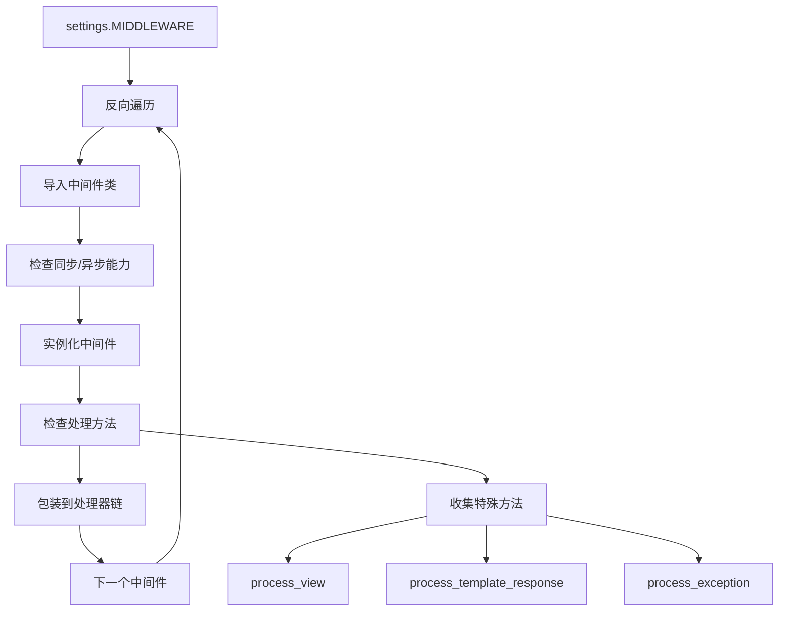

# Django 中间件架构深度解析

Django 的中间件系统是一个优雅的"洋葱模型"架构，为请求-响应处理提供了可插拔的处理管道。

## 🧅 洋葱模型架构

### 中间件执行流程


### 洋葱模型的核心特点

```
               请求方向 →
        ┌─────────────────────────┐
        │   SecurityMiddleware    │ process_request()
        │ ┌─────────────────────┐ │
        │ │  SessionMiddleware  │ │ process_request()
        │ │ ┌─────────────────┐ │ │
        │ │ │ AuthMiddleware  │ │ │ process_request()
        │ │ │ ┌─────────────┐ │ │ │
        │ │ │ │    View     │ │ │ │ ← 核心视图处理
        │ │ │ └─────────────┘ │ │ │
        │ │ │ AuthMiddleware  │ │ │ process_response()
        │ │ └─────────────────┘ │ │
        │ │  SessionMiddleware  │ │ process_response()
        │ └─────────────────────┘ │
        │   SecurityMiddleware    │ process_response()
        └─────────────────────────┘
               ← 响应方向
```

**设计优势**：
1. **职责分离**：每个中间件专注于单一功能
2. **可组合性**：灵活配置中间件栈
3. **双向处理**：请求和响应都可以被拦截处理
4. **异常处理**：支持异常捕获和转换

## 🔧 中间件加载机制

### BaseHandler 中的加载逻辑

```python
# django/core/handlers/base.py
class BaseHandler:
    def load_middleware(self, is_async=False):
        """从 settings.MIDDLEWARE 加载中间件栈"""
        
        self._view_middleware = []
        self._template_response_middleware = []
        self._exception_middleware = []
        
        # 获取响应处理函数（同步/异步）
        get_response = self._get_response_async if is_async else self._get_response
        handler = convert_exception_to_response(get_response)
        handler_is_async = is_async
        
        # 反向遍历中间件配置，构建洋葱模型
        for middleware_path in reversed(settings.MIDDLEWARE):
            middleware_class = import_string(middleware_path)
            
            # 检查中间件的同步/异步能力
            middleware_can_sync = getattr(middleware_class, 'sync_capable', True)
            middleware_can_async = getattr(middleware_class, 'async_capable', False)
            
            if not middleware_can_sync and not middleware_can_async:
                raise RuntimeError(
                    f"Middleware {middleware_path} must have at least one of "
                    f"sync_capable/async_capable set to True."
                )
            
            # 根据能力选择处理模式
            if not handler_is_async and middleware_can_sync:
                middleware_is_async = False
            elif handler_is_async and middleware_can_async:
                middleware_is_async = True
            else:
                # 需要同步异步适配
                middleware_is_async = handler_is_async
                if handler_is_async and not middleware_can_async:
                    # 异步环境下的同步中间件
                    handler = sync_to_async(handler, thread_sensitive=True)
                elif not handler_is_async and not middleware_can_sync:
                    # 同步环境下的异步中间件
                    handler = async_to_sync(handler)
            
            # 实例化中间件
            try:
                mw_instance = middleware_class(handler)
            except MiddlewareNotUsed as exc:
                if settings.DEBUG:
                    if str(exc):
                        logger.debug('MiddlewareNotUsed(%r): %s', middleware_path, exc)
                    else:
                        logger.debug('MiddlewareNotUsed: %r', middleware_path)
                continue
            
            # 收集不同类型的中间件方法
            if mw_instance is None:
                raise ImproperlyConfigured(
                    f'Middleware factory {middleware_path} returned None.'
                )
            
            if hasattr(mw_instance, 'process_view'):
                self._view_middleware.insert(0, mw_instance.process_view)
            if hasattr(mw_instance, 'process_template_response'):
                self._template_response_middleware.append(mw_instance.process_template_response)
            if hasattr(mw_instance, 'process_exception'):
                self._exception_middleware.append(mw_instance.process_exception)
            
            # 更新处理器链
            handler = convert_exception_to_response(mw_instance)
            handler_is_async = middleware_is_async
        
        # 适配最终的处理器
        if handler_is_async != is_async:
            if is_async:
                handler = sync_to_async(handler, thread_sensitive=True)
            else:
                handler = async_to_sync(handler)
        
        self._middleware_chain = handler
```

### 中间件实例化流程



## 📝 中间件接口规范

### 标准中间件类

```python
class MyMiddleware:
    """标准中间件类"""
    
    def __init__(self, get_response):
        """
        中间件初始化
        get_response: 下一个处理器（中间件或视图）
        """
        self.get_response = get_response
        
        # 初始化配置
        self.setup()
    
    def __call__(self, request):
        """
        中间件调用入口（必须实现）
        处理请求并返回响应
        """
        
        # 请求预处理
        response = self.process_request(request)
        if response:
            return response
        
        # 调用下一个处理器
        response = self.get_response(request)
        
        # 响应后处理  
        response = self.process_response(request, response)
        
        return response
    
    def setup(self):
        """初始化配置（可选）"""
        pass
    
    def process_request(self, request):
        """
        请求预处理（可选）
        返回 None：继续处理
        返回 HttpResponse：短路返回
        """
        return None
    
    def process_response(self, request, response):
        """
        响应后处理（可选）
        必须返回 HttpResponse 对象
        """
        return response
```

### 扩展接口方法

```python
class AdvancedMiddleware:
    """提供扩展功能的中间件"""
    
    def process_view(self, request, view_func, view_args, view_kwargs):
        """
        视图调用前处理
        在 URL 解析后、视图调用前执行
        """
        return None
    
    def process_template_response(self, request, response):
        """
        模板响应处理
        只对 TemplateResponse 生效
        """
        return response
    
    def process_exception(self, request, exception):
        """
        异常处理
        当视图抛出异常时调用
        """
        return None
```

### 同步异步兼容性

```python
class AsyncCapableMiddleware:
    """支持异步的中间件"""
    
    # 声明同步异步能力
    sync_capable = True
    async_capable = True
    
    def __init__(self, get_response):
        self.get_response = get_response
        self.is_async = iscoroutinefunction(get_response)
    
    def __call__(self, request):
        if self.is_async:
            return self.__acall__(request)
        else:
            return self.sync_call(request)
    
    async def __acall__(self, request):
        """异步调用路径"""
        
        # 异步请求预处理
        response = await self.aprocess_request(request)
        if response:
            return response
        
        # 调用异步处理器
        response = await self.get_response(request)
        
        # 异步响应后处理
        response = await self.aprocess_response(request, response)
        
        return response
    
    def sync_call(self, request):
        """同步调用路径"""
        
        response = self.process_request(request)
        if response:
            return response
        
        response = self.get_response(request)
        response = self.process_response(request, response)
        
        return response
    
    # 同步方法
    def process_request(self, request):
        return None
    
    def process_response(self, request, response):
        return response
    
    # 异步方法
    async def aprocess_request(self, request):
        return None
    
    async def aprocess_response(self, request, response):
        return response
```

## 🔒 内置中间件分析

### 1. SecurityMiddleware - 安全中间件

```python
# django/middleware/security.py
class SecurityMiddleware(MiddlewareMixin):
    """安全相关的 HTTP 头设置"""
    
    def __init__(self, get_response):
        super().__init__(get_response)
        
        # HSTS (HTTP Strict Transport Security)
        self.sts_seconds = settings.SECURE_HSTS_SECONDS
        self.sts_include_subdomains = settings.SECURE_HSTS_INCLUDE_SUBDOMAINS
        self.sts_preload = settings.SECURE_HSTS_PRELOAD
        
        # 其他安全设置
        self.content_type_nosniff = settings.SECURE_CONTENT_TYPE_NOSNIFF
        self.redirect = settings.SECURE_SSL_REDIRECT
        self.redirect_host = settings.SECURE_SSL_HOST
        self.redirect_exempt = [
            re.compile(r) for r in settings.SECURE_REDIRECT_EXEMPT
        ]
        self.referrer_policy = settings.SECURE_REFERRER_POLICY
        self.cross_origin_opener_policy = settings.SECURE_CROSS_ORIGIN_OPENER_POLICY
    
    def process_request(self, request):
        """强制 HTTPS 重定向"""
        
        path = request.path.lstrip('/')
        if (
            self.redirect and 
            not request.is_secure() and
            not any(pattern.search(path) for pattern in self.redirect_exempt)
        ):
            host = self.redirect_host or request.get_host()
            return HttpResponsePermanentRedirect(
                f"https://{host}{request.get_full_path()}"
            )
    
    def process_response(self, request, response):
        """设置安全相关的响应头"""
        
        # 设置 HSTS 头
        if (
            self.sts_seconds and 
            request.is_secure() and
            'Strict-Transport-Security' not in response
        ):
            sts_header = f'max-age={self.sts_seconds}'
            if self.sts_include_subdomains:
                sts_header += '; includeSubDomains'
            if self.sts_preload:
                sts_header += '; preload'
            response.headers['Strict-Transport-Security'] = sts_header
        
        # 防止 MIME 类型嗅探
        if self.content_type_nosniff:
            response.headers.setdefault('X-Content-Type-Options', 'nosniff')
        
        # 设置 Referrer 策略
        if self.referrer_policy:
            if isinstance(self.referrer_policy, str):
                response.headers.setdefault('Referrer-Policy', self.referrer_policy)
            else:
                response.headers.setdefault(
                    'Referrer-Policy', 
                    ', '.join(self.referrer_policy)
                )
        
        # 跨域开放器策略
        if self.cross_origin_opener_policy:
            response.headers.setdefault(
                'Cross-Origin-Opener-Policy', 
                self.cross_origin_opener_policy
            )
        
        return response
```

### 2. CSRFMiddleware - CSRF 防护

```python
# django/middleware/csrf.py
class CsrfViewMiddleware(MiddlewareMixin):
    """CSRF (Cross-Site Request Forgery) 防护中间件"""
    
    def _accept(self, request):
        # 标记请求为已通过 CSRF 检查
        request.csrf_processing_done = True
        return None
    
    def _reject(self, request, reason):
        # 拒绝请求并记录
        response = _get_failure_view()(request, reason=reason)
        log_response(
            'Forbidden (%s): %s', reason, request.path,
            response=response, request=request, logger=logger
        )
        return response
    
    def process_request(self, request):
        """CSRF 预处理"""
        
        # 获取 CSRF token
        csrf_token = self._get_token(request)
        if csrf_token is not None:
            # 验证 token 格式
            if not _is_token_format_valid(csrf_token):
                _add_new_csrf_cookie(request)
        else:
            # 生成新的 CSRF cookie
            _add_new_csrf_cookie(request)
        
        return self._accept(request)
    
    def process_view(self, request, callback, callback_args, callback_kwargs):
        """在视图调用前进行 CSRF 检查"""
        
        if getattr(request, 'csrf_processing_done', False):
            return None
        
        # 检查视图是否被豁免
        if getattr(callback, 'csrf_exempt', False):
            return None
        
        # 只检查非安全方法
        if request.method not in ('GET', 'HEAD', 'OPTIONS', 'TRACE'):
            return self._check_csrf_token(request)
        
        return self._accept(request)
    
    def _check_csrf_token(self, request):
        """检查 CSRF token"""
        
        # 获取请求中的 token
        try:
            request_csrf_token = request.META.get('CSRF_COOKIE', '')
            if request_csrf_token == '':
                # 从 POST 数据或头部获取 token
                request_csrf_token = request.POST.get('csrfmiddlewaretoken', '')
            if request_csrf_token == '':
                request_csrf_token = request.META.get('HTTP_X_CSRFTOKEN', '')
        except OSError:
            # 处理读取异常
            reason = 'CSRF token from POST incorrect length'
            return self._reject(request, reason)
        
        # 验证 token
        if not request_csrf_token:
            return self._reject(request, REASON_CSRF_TOKEN_MISSING)
        
        # 比较 token
        good_csrf_token = request.META.get('CSRF_COOKIE')
        if not _compare_salted_tokens(request_csrf_token, good_csrf_token):
            return self._reject(request, REASON_BAD_TOKEN)
        
        return self._accept(request)
    
    def process_response(self, request, response):
        """设置 CSRF cookie"""
        
        if not getattr(request, 'csrf_processing_done', False):
            return response
        
        # 如果需要更新 CSRF cookie
        if request.META.get('CSRF_COOKIE_NEEDS_UPDATE'):
            csrf_token = request.META['CSRF_COOKIE']
            response.set_cookie(
                settings.CSRF_COOKIE_NAME,
                csrf_token,
                max_age=settings.CSRF_COOKIE_AGE,
                domain=settings.CSRF_COOKIE_DOMAIN,
                path=settings.CSRF_COOKIE_PATH,
                secure=settings.CSRF_COOKIE_SECURE,
                httponly=settings.CSRF_COOKIE_HTTPONLY,
                samesite=settings.CSRF_COOKIE_SAMESITE,
            )
            # 添加 Vary 头
            patch_vary_headers(response, ('Cookie',))
        
        return response
```

### 3. SessionMiddleware - 会话管理

```python
class SessionMiddleware(MiddlewareMixin):
    """会话管理中间件"""
    
    def __init__(self, get_response):
        super().__init__(get_response)
        engine = import_module(settings.SESSION_ENGINE)
        self.SessionStore = engine.SessionStore
    
    def process_request(self, request):
        """为请求加载会话"""
        
        session_key = request.COOKIES.get(settings.SESSION_COOKIE_NAME)
        request.session = self.SessionStore(session_key)
    
    def process_response(self, request, response):
        """保存会话并设置 cookie"""
        
        try:
            accessed = request.session.accessed
            modified = request.session.modified
            empty = request.session.is_empty()
        except AttributeError:
            return response
        
        # 根据情况处理会话
        if settings.SESSION_SAVE_EVERY_REQUEST:
            # 每次请求都保存
            if not empty:
                request.session.save()
        elif modified:
            # 只在修改时保存
            if not empty:
                request.session.save()
            elif empty and accessed:
                # 清空的会话需要删除
                request.session.delete()
        
        # 设置会话 cookie
        if not empty or settings.SESSION_SAVE_EVERY_REQUEST:
            if request.session.get_expire_at_browser_close():
                max_age = None
                expires = None
            else:
                max_age = request.session.get_expiry_age()
                expires_time = time.time() + max_age
                expires = http_date(expires_time)
            
            response.set_cookie(
                settings.SESSION_COOKIE_NAME,
                request.session.session_key,
                max_age=max_age,
                expires=expires,
                domain=settings.SESSION_COOKIE_DOMAIN,
                path=settings.SESSION_COOKIE_PATH,
                secure=settings.SESSION_COOKIE_SECURE,
                httponly=settings.SESSION_COOKIE_HTTPONLY,
                samesite=settings.SESSION_COOKIE_SAMESITE,
            )
        
        return response
```

## 🎯 自定义中间件开发

### 请求限频中间件

```python
import time
from collections import defaultdict
from django.http import HttpResponse
from django.core.cache import cache

class RateLimitMiddleware:
    """请求限频中间件"""
    
    def __init__(self, get_response):
        self.get_response = get_response
        self.limit = 100  # 每分钟限制请求数
        self.window = 60  # 时间窗口（秒）
    
    def __call__(self, request):
        # 获取客户端 IP
        ip = self.get_client_ip(request)
        
        # 检查频率限制
        if self.is_rate_limited(ip):
            return HttpResponse(
                'Rate limit exceeded. Try again later.',
                status=429,
                headers={'Retry-After': str(self.window)}
            )
        
        response = self.get_response(request)
        return response
    
    def get_client_ip(self, request):
        """获取真实客户端 IP"""
        x_forwarded_for = request.META.get('HTTP_X_FORWARDED_FOR')
        if x_forwarded_for:
            return x_forwarded_for.split(',')[0].strip()
        return request.META.get('REMOTE_ADDR', '')
    
    def is_rate_limited(self, ip):
        """检查是否超过频率限制"""
        
        cache_key = f'rate_limit:{ip}'
        current_time = int(time.time())
        
        # 获取当前时间窗口的请求记录
        requests = cache.get(cache_key, [])
        
        # 过滤掉超出时间窗口的请求
        window_start = current_time - self.window
        requests = [req_time for req_time in requests if req_time > window_start]
        
        # 检查是否超过限制
        if len(requests) >= self.limit:
            return True
        
        # 记录当前请求
        requests.append(current_time)
        cache.set(cache_key, requests, self.window)
        
        return False
```

### 性能监控中间件

```python
import time
import logging
from django.conf import settings

logger = logging.getLogger(__name__)

class PerformanceMonitoringMiddleware:
    """性能监控中间件"""
    
    def __init__(self, get_response):
        self.get_response = get_response
        self.slow_request_threshold = getattr(
            settings, 'SLOW_REQUEST_THRESHOLD', 1.0  # 1秒
        )
    
    def __call__(self, request):
        # 记录开始时间
        start_time = time.time()
        
        # 添加性能数据到请求
        request.performance = {
            'start_time': start_time,
            'db_queries': 0,
            'cache_hits': 0,
            'cache_misses': 0,
        }
        
        response = self.get_response(request)
        
        # 计算处理时间
        end_time = time.time()
        duration = end_time - start_time
        
        # 记录性能指标
        self.record_metrics(request, response, duration)
        
        # 添加性能头部（调试模式）
        if settings.DEBUG:
            response.headers['X-Response-Time'] = f'{duration:.3f}s'
            response.headers['X-DB-Queries'] = str(request.performance['db_queries'])
        
        return response
    
    def record_metrics(self, request, response, duration):
        """记录性能指标"""
        
        # 记录慢请求
        if duration > self.slow_request_threshold:
            logger.warning(
                'Slow request: %s %s took %.3fs',
                request.method,
                request.path,
                duration,
                extra={
                    'request': request,
                    'duration': duration,
                    'status_code': response.status_code,
                }
            )
        
        # 发送到监控系统（如 Prometheus、StatsD 等）
        # self.send_to_monitoring_system(request, response, duration)
```

## 📊 中间件性能与调试

### 中间件执行顺序

```python
# settings.py 配置示例
MIDDLEWARE = [
    'django.middleware.security.SecurityMiddleware',      # 1. 安全检查
    'django.middleware.gzip.GZipMiddleware',             # 2. 响应压缩  
    'django.contrib.sessions.middleware.SessionMiddleware',  # 3. 会话管理
    'django.middleware.common.CommonMiddleware',         # 4. 通用处理
    'django.middleware.csrf.CsrfViewMiddleware',         # 5. CSRF 防护
    'django.contrib.auth.middleware.AuthenticationMiddleware',  # 6. 身份认证
    'django.contrib.messages.middleware.MessageMiddleware',     # 7. 消息框架
    'django.middleware.clickjacking.XFrameOptionsMiddleware',   # 8. 点击劫持防护
    'myapp.middleware.CustomMiddleware',                 # 9. 自定义中间件
]
```

### 中间件调试技巧

```python
class DebuggingMiddleware:
    """调试中间件"""
    
    def __init__(self, get_response):
        self.get_response = get_response
    
    def __call__(self, request):
        print(f"🔍 Processing request: {request.method} {request.path}")
        
        # 请求预处理
        response = self.process_request(request)
        if response:
            print(f"🔄 Early response from middleware")
            return response
        
        # 调用下一层
        response = self.get_response(request)
        
        # 响应后处理
        response = self.process_response(request, response)
        
        print(f"✅ Request completed: {response.status_code}")
        
        return response
    
    def process_request(self, request):
        # 打印请求信息
        print(f"   Headers: {dict(request.headers)}")
        print(f"   User: {getattr(request, 'user', 'Anonymous')}")
        return None
    
    def process_response(self, request, response):
        # 打印响应信息
        print(f"   Response headers: {dict(response.headers)}")
        return response
```

---

Django 的中间件系统通过洋葱模型的优雅设计，提供了强大而灵活的请求处理能力。它不仅支持传统的同步处理，还兼容现代的异步处理模式，为构建高性能的 Web 应用提供了坚实的基础。通过合理设计和配置中间件栈，可以实现安全防护、性能监控、缓存处理等各种横切关注点的统一管理。