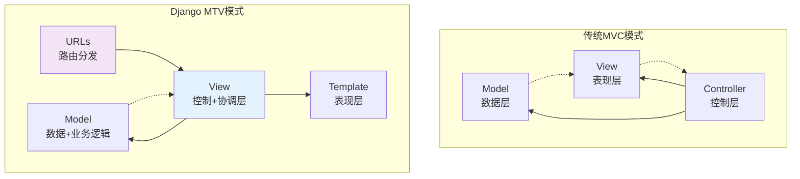
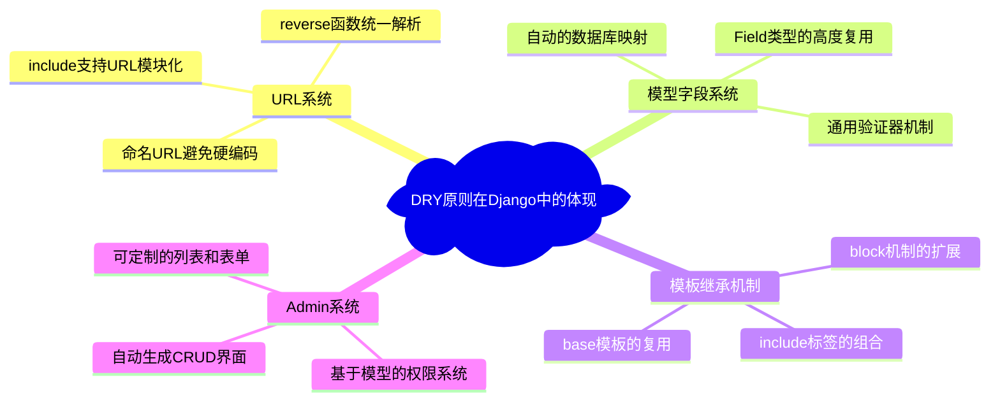
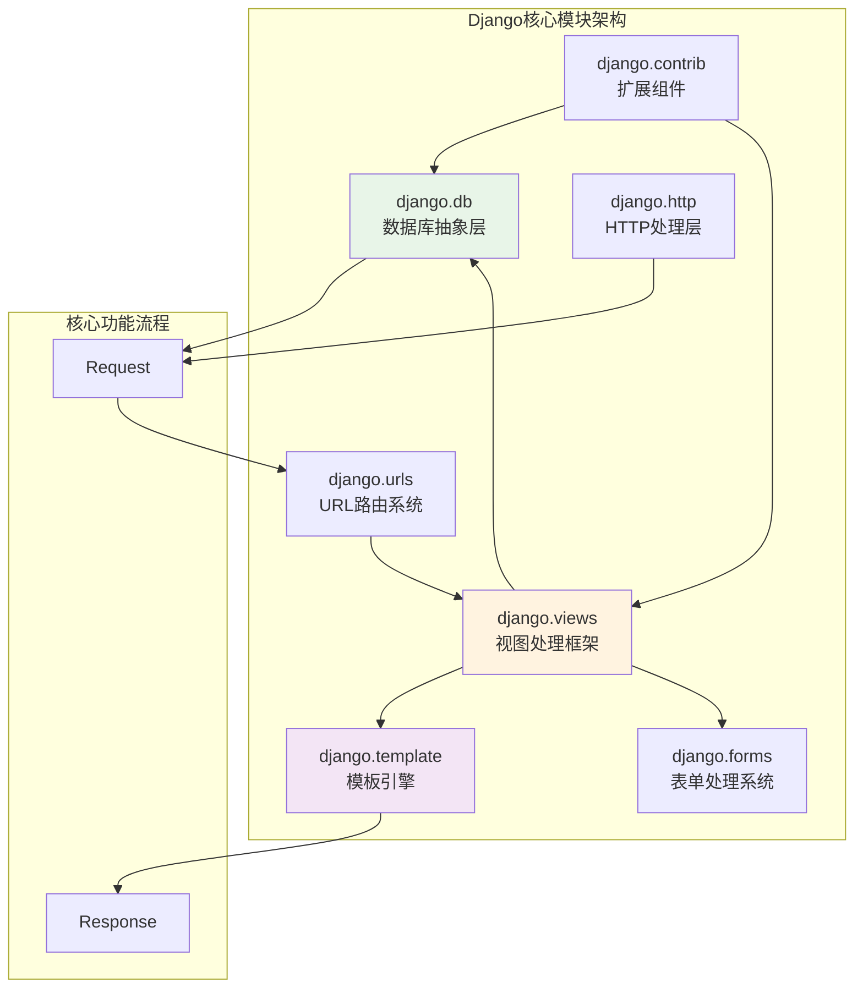
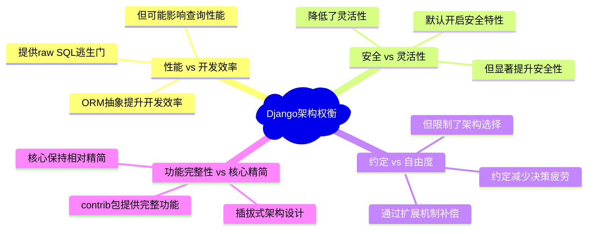

# 架构概览-Django的设计智慧

> Django MTV架构如何重新定义Web开发范式：从传统MVC到现代Web框架的进化之路

## 前言：重新审视Web框架的本质

当我们谈论Web框架时，我们在谈论什么？是简单的工具集合，还是对Web应用本质的深度理解？Django的答案是后者。通过**MTV（Model-Template-View）**架构，Django不仅提供了开发工具，更重要的是提出了一套完整的Web开发哲学。

## 一、MTV架构的设计智慧

### 1.1 从MVC到MTV：不只是重命名



**Ultra Think分析**：Django的MTV不是简单的概念重命名，而是对Web应用本质的重新思考：

```python
# Django MTV的核心洞察
class MTVInsight:
    """
    Django MTV架构的设计洞察
    
    关键问题：Web应用的本质是什么？
    Django的答案：HTTP请求/响应的优雅处理
    """
    
    def view_as_coordinator(self):
        """
        View作为协调者的设计理念
        
        Ultra Think：为什么Django选择View作为核心？
        - Web应用本质是处理HTTP请求/响应
        - View最接近Web的本质：接收请求，返回响应
        - Controller暗示控制，View暗示展示请求处理结果
        """
        return "View = HTTP请求处理器 + 业务逻辑协调器"
    
    def template_independence(self):
        """
        Template独立地位的设计价值
        
        创新点：将Template从View中完全分离
        优势：设计师可以独立工作，逻辑与表现彻底分离
        权衡：增加了一定的复杂性
        """
        return "Template = 独立的表现层 + 设计师友好的语法"
    
    def model_business_semantics(self):
        """
        Model承载业务语义的设计决策
        
        Django选择：Model = Data + Behavior
        优势：业务逻辑有明确的归属
        权衡：可能导致模型过于臃肿
        """
        return "Model = 数据持久化 + 业务规则载体"
```

### 1.2 核心组件的协作机制

```python
# Django核心组件协作的源码级理解
class DjangoRequestCycle:
    """
    Django请求处理周期的核心机制
    
    这个周期体现了MTV架构的完整协作
    """
    
    def __call__(self, request):
        """
        完整的请求处理流程
        
        Ultra Think分析：每一步都体现了Django的设计智慧
        """
        # 1. URL路由：将请求映射到具体处理器
        resolver_match = self.resolve_url(request.path)
        
        # 2. 中间件预处理：横切关注点的优雅处理
        request = self.process_middleware(request, 'request')
        
        # 3. 视图调用：业务逻辑的协调中心
        response = resolver_match.func(request, *resolver_match.args, **resolver_match.kwargs)
        
        # 4. 中间件后处理：响应的统一处理
        response = self.process_middleware(response, 'response')
        
        return response
    
    def resolve_url(self, path):
        """
        URL解析的智能匹配
        
        设计亮点：
        1. 正则表达式的灵活匹配
        2. 命名URL的反向解析
        3. 命名空间的层次化组织
        """
        pass
    
    def process_middleware(self, obj, phase):
        """
        中间件的洋葱模型实现
        
        创新点：请求和响应的对称处理
        """
        pass
```

## 二、Django的核心设计原则

### 2.1 DRY原则的深度实践

Django将DRY（Don't Repeat Yourself）从口号变为实际的工程实践：



**源码级DRY实现**：

```python
# Django DRY原则的源码体现
class DRYImplementation:
    """
    DRY原则在Django源码中的具体实现
    """
    
    def field_system_reuse(self):
        """
        字段系统的DRY实现
        
        Ultra Think：如何实现真正的代码复用？
        """
        # 基础Field类定义了通用行为
        class Field:
            def __init__(self, **options):
                # 通用属性处理
                self.null = options.get('null', False)
                self.blank = options.get('blank', False)
                self.validators = options.get('validators', [])
            
            def validate(self, value, model_instance):
                # 通用验证逻辑
                if not self.blank and value in self.empty_values:
                    raise ValidationError('This field is required')
            
            def to_python(self, value):
                # 子类重写的类型转换
                raise NotImplementedError
        
        # 具体字段类型只需要实现差异化部分
        class IntegerField(Field):
            def to_python(self, value):
                if value is None:
                    return value
                try:
                    return int(value)
                except (TypeError, ValueError):
                    raise ValidationError('Invalid integer')
    
    def url_naming_system(self):
        """
        URL命名系统的DRY体现
        
        设计目标：消除硬编码URL
        """
        # url配置中的命名
        urlpatterns = [
            path('articles/<int:pk>/', views.article_detail, name='article_detail'),
        ]
        
        # 模板中的反向解析
        template_usage = ""
        
        # Python代码中的反向解析
        from django.urls import reverse
        url = reverse('article_detail', args=[article.pk])
        
        return "一次定义，多处使用，统一维护"
```

### 2.2 安全优先的设计哲学

Django将安全从"可选增强"提升为"默认行为"：

```python
class SecurityByDefault:
    """
    Django安全优先设计的具体体现
    
    设计理念：安全应该是默认行为，而不是额外配置
    """
    
    def csrf_protection(self):
        """
        CSRF保护的默认启用
        
        Ultra Think：为什么CSRF保护默认开启？
        - 大多数开发者容易忽视CSRF风险
        - 开启保护的成本远低于被攻击的损失
        - 可以显式禁用，但需要开发者明确决策
        """
        # 默认中间件配置
        MIDDLEWARE = [
            'django.middleware.csrf.CsrfViewMiddleware',  # 默认启用
            # ... 其他中间件
        ]
        
        # 模板中需要明确添加token
        template = """
        <form method="post">
              <!-- 必须显式添加 -->
            <!-- 表单内容 -->
        </form>
        """
        
        return "显式禁用 vs 隐式启用的设计权衡"
    
    def template_auto_escaping(self):
        """
        模板自动转义机制
        
        安全策略：默认转义，显式标记安全内容
        """
        # 默认自动转义
        context = {'user_input': '<script>alert("xss")</script>'}
        rendered = "{{ user_input }}"  # 自动转义为 &lt;script&gt;...
        
        # 需要显式标记为安全
        from django.utils.safestring import mark_safe
        safe_content = mark_safe('<b>This is safe HTML</b>')
        
        return "安全为默认，unsafe为显式"
    
    def sql_injection_prevention(self):
        """
        SQL注入的系统级防护
        
        技术手段：强制参数化查询
        """
        # Django ORM强制参数化
        # 这样的代码无法编写，编译时就会报错
        # User.objects.raw("SELECT * FROM users WHERE name = " + user_input)
        
        # 正确的参数化查询
        users = User.objects.raw(
            "SELECT * FROM users WHERE name = %s", 
            [user_input]
        )
        
        return "从语法层面杜绝SQL注入的可能"
```

### 2.3 约定优于配置的实现策略

```python
class ConventionOverConfiguration:
    """
    Django约定优于配置的具体实现
    
    目标：减少开发者的决策疲劳，提供合理的默认值
    """
    
    def model_conventions(self):
        """
        模型层的约定规则
        """
        class Article(models.Model):
            title = models.CharField(max_length=200)
            
            # 约定1：自动生成表名
            # 规则：app_modelname -> blog_article
            
            # 约定2：自动生成主键
            # 规则：名为'id'的AutoField
            
            # 约定3：自动生成Meta
            class Meta:
                # 自动设置verbose_name
                verbose_name = "Article"
                verbose_name_plural = "Articles"
        
        return "约定减少样板代码，提升开发效率"
    
    def url_conventions(self):
        """
        URL系统的约定规则
        """
        # 约定：应用级URL配置
        # myapp/urls.py
        urlpatterns = [
            path('', views.index, name='index'),
            path('<int:pk>/', views.detail, name='detail'),
        ]
        
        # 约定：项目级URL包含
        # myproject/urls.py
        urlpatterns = [
            path('admin/', admin.site.urls),
            path('myapp/', include('myapp.urls')),
        ]
        
        return "层次化组织，模块化管理"
    
    def template_conventions(self):
        """
        模板系统的约定规则
        """
        # 约定：模板文件位置
        # templates/app_name/template_name.html
        
        # 约定：模板继承层次
        # base.html -> section_base.html -> specific_template.html
        
        # 约定：静态文件组织
        # static/app_name/css|js|images/
        
        return "一致的文件组织，降低认知负荷"
```

## 三、Django源码的模块化设计

### 3.1 清晰的职责边界



### 3.2 扩展机制的设计

```python
class ExtensionMechanism:
    """
    Django扩展机制的设计智慧
    
    核心理念：核心精简，功能可扩展
    """
    
    def middleware_extension(self):
        """
        中间件扩展机制
        
        设计优势：
        1. 横切关注点的统一处理
        2. 可配置的执行顺序
        3. 简单的开发接口
        """
        class CustomMiddleware:
            def __init__(self, get_response):
                self.get_response = get_response
            
            def __call__(self, request):
                # 请求预处理
                self.process_request(request)
                
                response = self.get_response(request)
                
                # 响应后处理
                self.process_response(request, response)
                return response
            
            def process_request(self, request):
                # 自定义请求处理逻辑
                pass
            
            def process_response(self, request, response):
                # 自定义响应处理逻辑
                pass
    
    def template_tag_extension(self):
        """
        模板标签扩展机制
        
        创新点：DSL的可扩展性
        """
        from django import template
        
        register = template.Library()
        
        @register.simple_tag
        def current_time(format_string):
            return datetime.now().strftime(format_string)
        
        # 使用：{% current_time "%Y-%m-%d %I:%M %p" %}
        
        return "简单的装饰器即可扩展模板功能"
    
    def admin_customization(self):
        """
        Admin系统的定制机制
        
        设计理念：约定为主，定制为辅
        """
        @admin.register(Article)
        class ArticleAdmin(admin.ModelAdmin):
            list_display = ['title', 'author', 'created_at']
            list_filter = ['author', 'created_at']
            search_fields = ['title', 'content']
            
            # 高度可定制，但保持简单
        
        return "零配置可用，深度定制可能"
```

## 四、Ultra Think深度洞察

### 4.1 Django架构决策的权衡分析



### 4.2 Django对Web开发的贡献

**1. MTV架构的推广**：
- 重新定义了Web框架的抽象层次
- 影响了后续框架的设计思路
- 证明了约定优于配置的价值

**2. Admin系统的创新**：
- 首创了自动化管理后台的概念  
- 展示了元数据驱动界面生成的可能
- 为CMS系统提供了新的思路

**3. ORM设计的平衡**：
- 在抽象性和性能间找到平衡点
- 延迟求值的广泛应用
- 为Python ORM设计奠定基础

### 4.3 可以改进的设计方面

**批判性思考**：

```python
class PotentialImprovements:
    """
    Django架构的潜在改进空间
    
    Ultra Think：没有完美的架构，只有合适的权衡
    """
    
    def async_support_evolution(self):
        """
        异步支持的渐进式改进
        
        当前状态：Django 3.1+开始支持异步视图
        改进空间：更深层次的异步集成
        """
        # 当前的异步支持
        async def async_view(request):
            data = await fetch_data_async()
            return JsonResponse(data)
        
        # 潜在改进：ORM的原生异步支持
        # articles = await Article.objects.filter(status='published')
        
        return "异步Web开发的完整生态还在进化中"
    
    def type_safety_enhancement(self):
        """
        类型安全的提升空间
        
        现状：运行时类型检查
        改进：编译时类型安全
        """
        # 当前状态：运行时验证
        class Article(models.Model):
            title = models.CharField(max_length=200)  # 运行时检查
        
        # 潜在改进：更强的类型提示
        # from django_types import Model, CharField
        # class Article(Model[ArticleFields]):
        #     title: CharField[200] = CharField(max_length=200)
        
        return "类型安全与动态性的平衡仍在探索"
    
    def microservice_adaptation(self):
        """
        微服务架构的适配
        
        Django的单体应用假设
        vs 现代微服务架构需求
        """
        return "传统Web框架如何适配分布式架构？"
```

## 总结：Django的设计智慧

Django的架构设计体现了深刻的工程智慧：

1. **人本主义技术观**：以开发者体验为中心的设计
2. **实用主义工程观**：解决实际问题胜过理论完美
3. **安全优先原则**：将安全从额外考虑变为默认行为  
4. **约定与灵活性的平衡**：减少决策疲劳同时保留扩展性

通过深入理解Django的架构设计，我们不仅学会了使用框架，更重要的是学会了如何思考和设计复杂的软件系统。

---

**下一章导读**：[02-ORM引擎-数据抽象的艺术](./02-ORM引擎-数据抽象的艺术.md) - 我们将深入Django ORM的源码实现，探索QuerySet的Copy-on-Write机制、Manager系统的描述符协议应用，以及SQL编译器的查询优化策略。