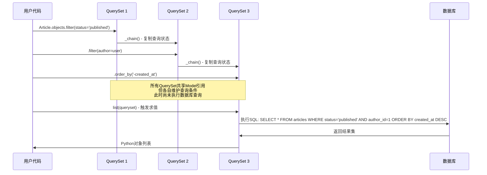
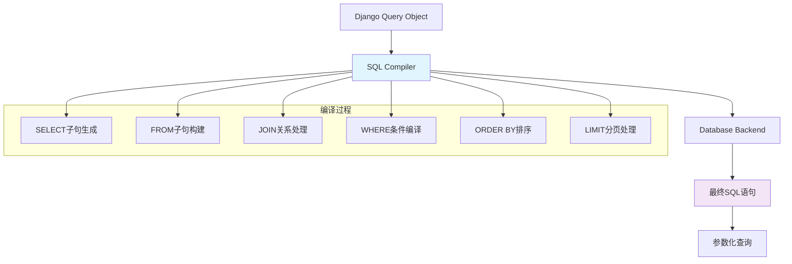
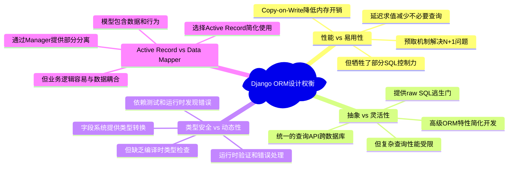

# ORM引擎-数据抽象的艺术

> Django ORM如何在抽象性与性能间找到平衡点：从QuerySet的Copy-on-Write到Manager系统的设计精髓

## 前言：重新审视数据抽象的本质

数据库抽象层的设计是Web框架的核心挑战之一。如何既提供优雅的Python接口，又不牺牲SQL的强大能力？Django ORM的答案蕴含着深刻的设计智慧：**延迟求值**、**Copy-on-Write**和**智能缓存**的巧妙结合。

## 一、QuerySet核心实现机制

### 1.1 Copy-on-Write的设计精髓

Django QuerySet最核心的创新是Copy-on-Write模式，让链式调用既优雅又高效：

```python
# Django QuerySet的Copy-on-Write实现分析
class QuerySetCopyOnWrite:
    """
    QuerySet Copy-on-Write机制的核心实现
    
    设计问题：如何让链式调用既优雅又高效？
    Django的解答：复制查询状态，共享数据缓存
    """
    
    def __init__(self, model=None, query=None, using=None, hints=None):
        self.model = model
        self._db = using
        self._hints = hints or {}
        
        # 核心1：查询对象包含所有查询条件
        self._query = query or sql.Query(self.model)
        
        # 核心2：结果缓存，延迟加载直到访问
        self._result_cache = None
        
        # 核心3：预取相关对象的缓存
        self._prefetch_related_lookups = ()
        self._known_related_objects = {}
    
    def filter(self, *args, **kwargs):
        """
        过滤操作的Copy-on-Write实现
        
        Ultra Think分析：
        - 为什么返回新QuerySet？保证不可变性，支持链式调用
        - Clone操作开销如何？仅复制查询状态，开销极小
        - 如何避免意外修改？每次操作都产生新实例
        """
        return self._filter_or_exclude(False, *args, **kwargs)
    
    def _filter_or_exclude(self, negate, *args, **kwargs):
        """
        过滤和排除的统一实现
        """
        # Copy-on-Write的核心：克隆当前QuerySet
        clone = self._chain()
        
        # 将过滤条件添加到新的查询对象
        if negate:
            clone._query.add_q(~Q(*args, **kwargs))
        else:
            clone._query.add_q(Q(*args, **kwargs))
        
        return clone
    
    def _chain(self):
        """
        Copy-on-Write模式的核心实现
        
        关键洞察：
        - 不复制数据，只复制查询状态
        - 共享模型引用和数据库连接
        - 新QuerySet继承所有查询条件
        """
        obj = self._clone()
        if obj._sticky_filter:
            obj._query.filter_is_sticky = True
        return obj
    
    def _clone(self):
        """
        克隆操作的具体实现
        
        Ultra Think：什么需要复制，什么需要共享？
        """
        # 深度克隆查询对象
        query = self._query.clone()
        
        # 创建新的QuerySet实例
        clone = self.__class__(
            model=self.model,      # 共享模型类引用
            query=query,           # 独立的查询对象
            using=self._db,        # 共享数据库连接
            hints=self._hints      # 共享查询提示
        )
        
        # 复制内部状态
        clone._sticky_filter = self._sticky_filter
        clone._for_write = self._for_write
        clone._prefetch_related_lookups = self._prefetch_related_lookups[:]
        clone._known_related_objects = self._known_related_objects
        clone._iterable_class = self._iterable_class
        
        # 关键：不复制结果缓存！
        clone._result_cache = None
        
        return clone
```

### 1.2 延迟求值的触发机制



```python
class LazyEvaluation:
    """
    延迟求值的多种触发机制
    
    设计目标：最大化性能，最小化不必要的数据库访问
    """
    
    def __iter__(self):
        """
        迭代触发求值 - 最常见的触发方式
        
        Ultra Think：为什么选择迭代作为主要触发方式？
        - 迭代是数据消费的自然方式
        - 符合Python的lazy iterator约定
        - 提供了clear的数据访问语义
        """
        self._fetch_all()
        return iter(self._result_cache)
    
    def __len__(self):
        """
        长度计算触发求值
        
        性能考虑：某些场景下可以优化为COUNT查询
        """
        self._fetch_all()
        return len(self._result_cache)
    
    def __bool__(self):
        """
        布尔值判断触发求值
        
        优化机会：exists()方法可以避免全量查询
        """
        self._fetch_all()
        return bool(self._result_cache)
    
    def __getitem__(self, k):
        """
        索引访问的特殊处理 - 关键优化点
        
        Ultra Think：如何优化切片操作？
        """
        if not isinstance(k, (int, slice)):
            raise TypeError("QuerySet indices must be integers or slices.")
        
        # 如果已经缓存，直接返回
        if self._result_cache is not None:
            return self._result_cache[k]
        
        # 切片优化：转换为SQL LIMIT/OFFSET
        if isinstance(k, slice):
            qs = self._chain()
            if k.start is not None:
                qs._query.set_limits(k.start, k.stop)
            return qs
            
        # 单个索引：使用LIMIT 1优化
        qs = self._chain()
        qs._query.set_limits(k, k + 1)
        return list(qs)[0]
    
    def _fetch_all(self):
        """
        实际执行数据库查询的核心方法
        
        Ultra Think分析：
        - 为什么检查_result_cache？避免重复查询
        - 为什么使用list()？将迭代器转换为列表进行缓存
        - 如何处理预取？通过_prefetch_related_objects处理
        """
        if self._result_cache is None:
            # 执行真正的数据库查询
            self._result_cache = list(self._iterable_class(self))
        
        # 处理预取相关对象
        if self._prefetch_related_lookups and not self._prefetch_done:
            self._prefetch_related_objects()
```

## 二、Manager系统的描述符艺术

### 2.1 Manager与Model的绑定机制

```python
class ManagerDescriptorSystem:
    """
    Manager系统的描述符协议应用
    
    核心问题：如何实现Model.objects的魔法？
    Django的解答：通过描述符协议和元类系统
    """
    
    def contribute_to_class(self, model, name):
        """
        Manager与Model绑定的核心机制
        
        Ultra Think分析：
        - Django如何实现Model.objects的魔法？
        - 通过ModelBase元类在模型创建时动态绑定Manager
        - 为什么要在类创建时绑定而不是实例化时？
        """
        self.name = name
        self.model = model
        
        # 设置模型的默认管理器
        if not hasattr(model, '_default_manager'):
            model._default_manager = self
            
        # 将Manager添加到模型的_meta.managers列表
        model._meta.add_manager(self)
        
        # 关键：在模型类上设置Manager实例
        setattr(model, name, ManagerDescriptor(self))
```

### 2.2 描述符协议的优雅应用

```python
class ManagerDescriptor:
    """
    Manager描述符的实现 - Python描述符协议的优雅应用
    
    解决的问题：
    1. 实例访问vs类访问的不同行为
    2. 防止在实例上意外修改Manager
    3. 提供清晰的错误信息
    """
    
    def __init__(self, manager):
        self.manager = manager
    
    def __get__(self, instance, cls=None):
        """
        描述符协议的核心 - 控制Manager的访问行为
        
        Ultra Think分析：
        - 为什么Model.objects返回Manager？类级别的数据操作
        - 为什么instance.objects会报错？避免混淆实例和类的概念
        - 如何处理继承？通过_deferred检查处理延迟模型
        """
        if instance is not None:
            raise AttributeError(
                "Manager isn't accessible via %s instances" % cls.__name__
            )
        
        if cls._deferred:
            # 延迟模型的特殊处理
            return getattr(cls._meta.concrete_model, self.manager.name)
        
        return cls._meta.managers_map[self.manager.name]
    
    def __set__(self, instance, value):
        """
        禁止在实例上设置Manager
        
        设计理念：Manager是类级别的概念，不应该在实例上修改
        """
        raise AttributeError(
            "Manager isn't accessible via %s instances" % type(instance).__name__
        )
```

### 2.3 自定义Manager的最佳实践

```python
class CustomManagerPatterns:
    """
    自定义Manager的实现模式分析
    
    Ultra Think：何时应该自定义Manager？
    1. 需要封装复杂查询逻辑
    2. 需要修改默认查询集
    3. 需要添加业务相关的查询方法
    """
    
    def basic_custom_manager(self):
        """
        基础自定义Manager - 重写get_queryset
        """
        class PublishedManager(models.Manager):
            def get_queryset(self):
                """
                重写基础查询集 - 最常见的自定义模式
                
                Ultra Think：什么时候应该在Manager级别过滤？
                - 当过滤条件是业务规则的一部分
                - 当需要影响所有相关查询时
                - 当需要提供不同的数据视图时
                """
                return super().get_queryset().filter(
                    status='published',
                    publish_date__lte=timezone.now()
                )
        
        # 使用示例
        class Article(models.Model):
            objects = models.Manager()  # 默认管理器
            published = PublishedManager()  # 自定义管理器
    
    def chainable_manager_pattern(self):
        """
        可链式调用Manager的实现技巧
        
        设计模式：Manager + Custom QuerySet
        """
        class ChainableQuerySet(QuerySet):
            """
            自定义QuerySet支持链式调用
            """
            
            def published(self):
                return self.filter(
                    status='published',
                    publish_date__lte=timezone.now()
                )
            
            def by_author(self, author):
                return self.filter(author=author)
            
            def recent(self, days=7):
                cutoff = timezone.now() - timedelta(days=days)
                return self.filter(created_at__gte=cutoff)
        
        class ChainableManager(Manager):
            """
            支持链式调用的Manager
            """
            def get_queryset(self):
                return ChainableQuerySet(self.model, using=self._db)
            
            def get_queryset(self):
                return ChainableQuerySet(self.model, using=self._db)
        
        # 使用Manager.from_queryset的简化写法
        class ArticleManager(Manager.from_queryset(ChainableQuerySet)):
            pass
        
        # 最终实现：支持复杂的链式调用
        # Article.objects.published().by_author(user).recent(30)
```

## 三、Field系统的类型转换艺术

### 3.1 Field基类的设计精髓

```python
class FieldSystemDesign:
    """
    Django字段系统的基础抽象分析
    
    核心职责：
    1. 数据类型转换 (Python <-> Database)
    2. 验证逻辑的统一接口
    3. SQL生成支持
    4. 序列化/反序列化支持
    """
    
    def field_base_architecture(self):
        """
        Field基类的架构设计
        """
        class Field:
            # 字段属性系统
            empty_strings_allowed = True
            default_validators = []
            default_error_messages = {}
            
            def __init__(self, verbose_name=None, name=None, **kwargs):
                # 字段元数据初始化
                self.name = name
                self.verbose_name = verbose_name
                self.primary_key = kwargs.get('primary_key', False)
                
                # 验证器系统初始化
                self.validators = list(kwargs.get('validators', []))
                
                # 错误消息系统 - MRO based message resolution
                messages = {}
                for c in reversed(self.__class__.__mro__):
                    messages.update(getattr(c, 'default_error_messages', {}))
                messages.update(kwargs.get('error_messages') or {})
                self.error_messages = messages
            
            def contribute_to_class(self, cls, name, private_only=False):
                """
                字段与模型绑定的核心机制
                
                Ultra Think分析：
                - Django如何实现字段到属性的映射？
                - 描述符协议在字段系统中的应用
                - 为什么需要private_only参数？
                """
                self.set_attributes_from_name(name)
                self.model = cls
                cls._meta.add_field(self, private_only)
                
                # 为模型类添加字段描述符
                if not private_only:
                    setattr(cls, name, self)
            
            def __get__(self, instance, owner):
                """字段描述符的获取逻辑"""
                if instance is None:
                    return self
                return instance.__dict__[self.attname]
            
            def __set__(self, instance, value):
                """字段描述符的设置逻辑 - 包含类型转换"""
                instance.__dict__[self.attname] = self.to_python(value)
```

### 3.2 类型转换的智能实现

```python
class TypeConversionSystem:
    """
    Django字段类型转换机制分析
    
    设计挑战：如何在Python类型和数据库类型间优雅转换？
    """
    
    def integer_field_conversion(self):
        """
        整数字段的类型转换实现
        """
        class IntegerField(Field):
            description = "Integer"
            
            def to_python(self, value):
                """
                数据库值转换为Python值
                
                Ultra Think分析：
                - 为什么需要类型转换？数据库类型与Python类型不完全对应
                - 如何处理NULL值？None的特殊处理
                - 错误处理策略？转换失败时的优雅降级
                """
                if value is None:
                    return value
                
                # 已经是整数，直接返回（性能优化）
                if isinstance(value, int):
                    return value
                
                # 字符串转换（常见于表单数据）
                if isinstance(value, str):
                    try:
                        return int(value)
                    except ValueError:
                        raise exceptions.ValidationError(
                            self.error_messages['invalid'],
                            code='invalid',
                            params={'value': value},
                        )
                
                # 浮点数转换（截断小数部分）
                if isinstance(value, float):
                    return int(value)
                
                # 无法转换的类型
                raise exceptions.ValidationError(
                    self.error_messages['invalid'],
                    code='invalid', 
                    params={'value': value},
                )
            
            def get_prep_value(self, value):
                """
                Python值转换为数据库值
                
                设计考虑：数据库可能有特殊的类型要求
                """
                value = super().get_prep_value(value)
                if value is None:
                    return None
                return int(value)
    
    def foreign_key_lazy_loading(self):
        """
        外键字段的延迟加载实现 - 复杂字段的典型案例
        """
        class ForeignKey(Field):
            def __get__(self, instance, cls=None):
                """
                外键字段的获取逻辑 - 延迟加载实现
                
                Ultra Think：如何平衡性能和便利性？
                - 延迟加载减少不必要的查询
                - 缓存机制避免重复查询
                - 透明的API不暴露复杂性
                """
                if instance is None:
                    return self
                
                # 检查是否已缓存相关对象
                cache_name = self.get_cache_name()
                try:
                    rel_obj = getattr(instance, cache_name)
                except AttributeError:
                    # 首次访问，执行延迟加载
                    rel_obj = self.get_object(instance)
                    setattr(instance, cache_name, rel_obj)
                
                if rel_obj is None and not self.null:
                    raise self.related_model.DoesNotExist
                
                return rel_obj
            
            def get_object(self, instance):
                """
                执行实际的数据库查询获取相关对象
                """
                qs = self.related_model._default_manager.db_manager(
                    hints={'instance': instance}
                ).get_queryset()
                
                # 构建查询条件
                rel_obj_attr = self.get_local_related_value(instance)[0]
                if rel_obj_attr is None:
                    return None
                
                return qs.get(**{self.target_field.attname: rel_obj_attr})
```

## 四、SQL编译系统的查询优化

### 4.1 编译器架构设计



### 4.2 查询优化策略

```python
class QueryOptimizationStrategies:
    """
    Django QuerySet性能优化的核心实现
    
    设计目标：在易用性和性能间找到最佳平衡
    """
    
    def select_related_optimization(self):
        """
        预加载外键关系 - 解决N+1查询问题
        
        Ultra Think分析：
        - 如何判断哪些字段需要JOIN？通过字段关系分析
        - 深层关系如何处理？book__author__publisher递归解析
        - 性能权衡：单个复杂查询 vs 多个简单查询
        """
        def select_related(self, *fields):
            if self._fields is not None:
                raise TypeError("Cannot call select_related() after .values() or .values_list()")
            
            obj = self._chain()
            if fields == (None,):
                obj.query.select_related = False
            elif fields:
                obj.query.add_select_related(fields)
            else:
                obj.query.select_related = True
            
            return obj
    
    def prefetch_related_algorithm(self):
        """
        预取多对多/反向外键关系
        
        核心机制：
        1. 第一次查询获取主对象
        2. 第二次查询批量获取相关对象  
        3. 在Python中建立对象关系
        
        Ultra Think：为什么不用JOIN？
        - 多对多关系的JOIN可能产生笛卡尔积
        - 分离查询更容易优化和缓存
        - Python关联的内存效率更高
        """
        def prefetch_one_level(instances, attname, lookup, queryset=None, to_attr=None):
            """
            单层预取的具体实现
            """
            # 获取关系字段
            rel_obj_attr = instances[0]._meta.get_field(attname)
            
            # 构建预取查询
            if queryset is None:
                queryset = rel_obj_attr.related_model._default_manager.all()
            
            # 提取主对象的关键值
            instance_attr = rel_obj_attr.get_attname()
            vals = set()
            for instance in instances:
                val = getattr(instance, instance_attr)
                if val is not None:
                    vals.add(val)
            
            # 批量查询相关对象
            rel_objs = queryset.filter(**{
                rel_obj_attr.field.related_query_name() + '__in': vals
            })
            
            # 建立关联关系映射
            rel_obj_cache = {}
            for rel_obj in rel_objs:
                rel_obj_key = getattr(rel_obj, rel_obj_attr.field.get_attname())
                rel_obj_cache.setdefault(rel_obj_key, []).append(rel_obj)
            
            # 为每个实例设置相关对象
            for instance in instances:
                val = getattr(instance, instance_attr)
                related_objects = rel_obj_cache.get(val, [])
                
                if to_attr:
                    setattr(instance, to_attr, related_objects)
                else:
                    # 设置到关系字段的缓存
                    cache_name = rel_obj_attr.get_cache_name()
                    setattr(instance, cache_name, related_objects)
    
    def bulk_operations_optimization(self):
        """
        批量操作的性能优化
        
        设计理念：单次数据库往返 vs 多次往返
        """
        def bulk_create(self, objs, batch_size=None):
            """
            批量创建对象的优化实现
            """
            # 分批处理，避免超出数据库限制
            if batch_size is None:
                batch_size = 1000
            
            for batch in self._batched_insert(objs, batch_size):
                # 单次INSERT语句插入多行
                self._insert(batch)
        
        def bulk_update(self, objs, fields, batch_size=None):
            """
            批量更新的优化策略
            """
            # 使用CASE WHEN语句批量更新
            # 或者使用VALUES子句的更新语法
            pass
```

## 五、Ultra Think深度洞察

### 5.1 Django ORM的设计权衡分析



### 5.2 关键算法创新点

**1. Copy-on-Write QuerySet**：
```python
class Innovation_1:
    """
    Copy-on-Write QuerySet的创新分析
    
    创新点：链式调用时只复制查询状态，不复制数据
    优势：内存效率高，支持复杂的查询构建  
    权衡：增加了对象管理的复杂性
    
    Ultra Think：还有更好的实现方式吗？
    - 函数式编程的不可变数据结构？
    - 更激进的懒加载策略？
    - 编译时查询优化？
    """
    pass
```

**2. 延迟求值触发机制**：
```python
class Innovation_2:
    """
    延迟求值触发机制的设计分析
    
    创新点：多种触发方式，智能缓存管理
    优势：避免不必要的数据库访问，提升性能
    权衡：调试时可能造成困扰，隐藏了查询时机
    
    Ultra Think：如何改进调试体验？
    - 查询日志的更好集成？
    - 开发时的查询可视化工具？
    - 更智能的查询时机提示？
    """
    pass
```

**3. 预取算法的两阶段设计**：
```python
class Innovation_3:
    """
    预取算法的创新分析
    
    创新点：两阶段查询 + Python关联
    优势：解决N+1问题，保持API简洁
    权衡：内存使用增加，不适合超大数据集
    
    Ultra Think：现代架构下的改进机会？
    - 流式处理大数据集？
    - 更智能的预取策略？
    - 异步预取的可能性？
    """
    pass
```

### 5.3 现代化改进思考

```python
class ModernizationThoughts:
    """
    Django ORM现代化改进的思考
    
    Ultra Think：在保持向后兼容的前提下，如何演进？
    """
    
    def async_orm_evolution(self):
        """
        异步ORM的演进路径
        
        当前状态：Django 4.1+ 开始支持异步QuerySet
        改进空间：更深层次的异步集成
        """
        # 当前的异步支持
        async def get_articles():
            articles = []
            async for article in Article.objects.all():
                articles.append(article)
            return articles
        
        # 潜在的完整异步支持
        # articles = await Article.objects.filter(status='published')
        
        return "异步Web开发生态的完整支持"
    
    def type_safety_improvement(self):
        """
        类型安全的改进空间
        
        现状：运行时类型检查和验证
        改进：编译时类型安全的可能性
        """
        # 当前状态：运行时验证
        class Article(models.Model):
            title = models.CharField(max_length=200)  # 运行时长度检查
        
        # 潜在改进：更强的类型提示集成
        # from typing import Annotated
        # class Article(models.Model):
        #     title: Annotated[str, models.CharField(max_length=200)]
        
        return "类型安全与动态性的更好平衡"
    
    def query_builder_enhancement(self):
        """
        查询构建器的增强可能
        
        灵感：现代SQL构建器的表达力
        """
        # 当前的查询方式
        articles = Article.objects.filter(
            Q(title__icontains='django') | Q(content__icontains='django')
        ).select_related('author').order_by('-created_at')
        
        # 潜在的更表达性的API
        # articles = (Article
        #     .where(lambda a: a.title.contains('django') | a.content.contains('django'))
        #     .include(lambda a: a.author)
        #     .order_by(lambda a: -a.created_at))
        
        return "更表达性和类型安全的查询API"
```

## 总结：数据抽象的设计智慧

Django ORM展现了数据抽象层设计的精髓：

1. **Copy-on-Write机制**：在性能和优雅间找到平衡点
2. **延迟求值策略**：最大化性能，最小化数据库访问
3. **描述符协议应用**：优雅的API设计和清晰的概念边界
4. **智能类型转换**：在Python和数据库类型间无缝桥接
5. **查询优化工具**：为复杂应用提供性能优化手段

通过深入理解Django ORM的设计和实现，我们不仅掌握了高效使用ORM的技巧，更重要的是学会了如何在抽象性和性能间找到最优平衡点。

---

**下一章导读**：[03-视图系统-HTTP请求的编排](./03-视图系统-HTTP请求的编排.md) - 我们将探索Django视图系统如何优雅处理HTTP请求/响应循环，分析CBV与FBV的设计权衡，以及URL路由的智能分发机制。