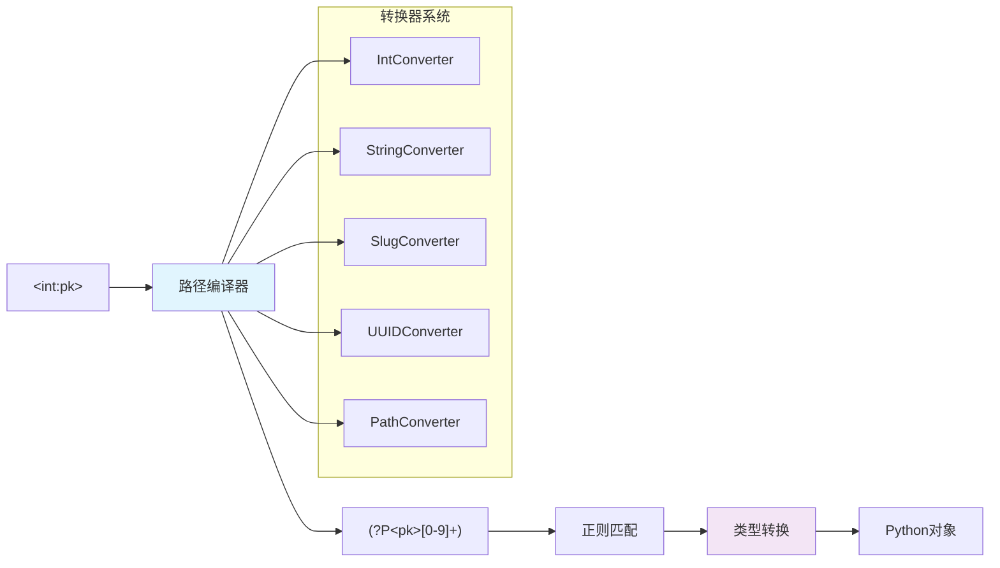
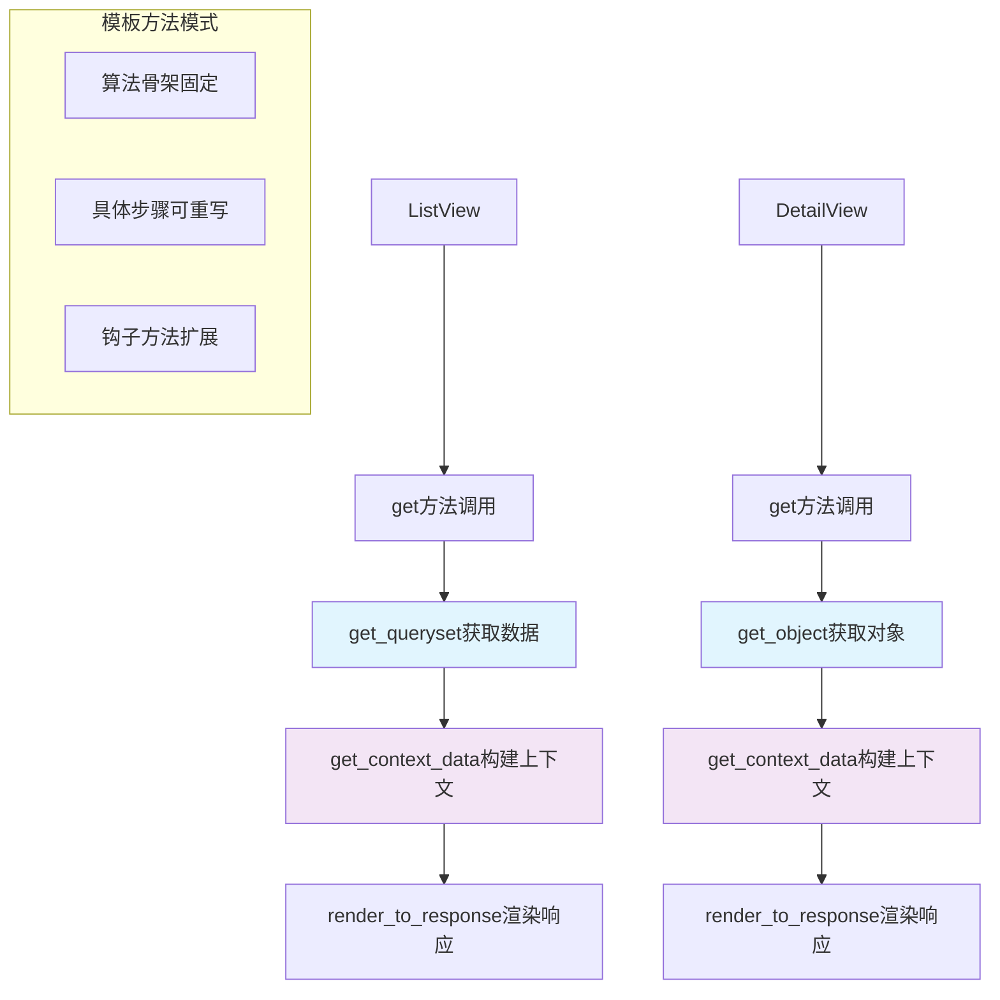
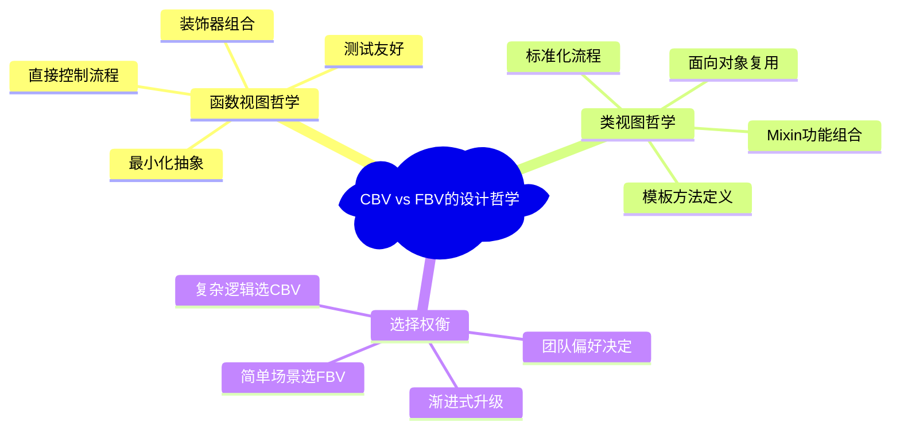

# 视图系统-HTTP请求的编排

> Django视图系统如何优雅处理HTTP请求/响应循环：CBV与FBV的设计权衡，URL路由的智能分发机制

## 前言：重新理解Web请求的本质

Web应用的核心是什么？是数据处理？是用户界面？Django给出了不同的答案：**Web应用的本质是HTTP请求和响应的优雅编排**。视图系统作为这个编排的指挥家，需要在简洁性和功能性之间找到完美平衡。

## 一、URL路由系统：请求的智能分发

### 1.1 URL解析器的核心算法

```python
# Django URL解析的核心机制
class URLResolutionSystem:
    """
    URL解析系统的设计精髓
    
    核心挑战：如何将字符串URL映射到Python可调用对象？
    Django的解答：正则表达式 + 模式匹配 + 参数提取
    """
    
    def resolve_url_pattern(self, path):
        """
        URL解析的核心算法
        
        Ultra Think分析：
        - 为什么选择正则表达式？灵活性和性能的平衡
        - 如何处理嵌套include？递归匹配算法
        - 参数提取如何实现？命名组和位置组的智能处理
        """
        # 1. 模式匹配阶段
        match = self.pattern.match(path)
        if not match:
            return None
        
        # 2. 参数提取阶段
        kwargs = {**self.default_kwargs, **match.groupdict()}
        args = match.groups() if not kwargs else ()
        
        # 3. 递归处理include
        if self.is_include:
            remaining_path = path[match.end():]
            return self.resolve_include(remaining_path, kwargs, args)
        
        # 4. 返回解析结果
        return ResolverMatch(
            func=self.callback,
            args=args,
            kwargs=kwargs,
            url_name=self.name,
            app_names=self.app_names,
            namespaces=self.namespaces
        )
```

### 1.2 路径转换器的设计创新

Django 2.0+引入的路径转换器是URL系统的重要创新：



```python
class PathConverterInnovation:
    """
    路径转换器系统的设计创新分析
    
    创新点：声明式URL参数类型定义
    """
    
    def converter_compilation_process(self):
        """
        转换器编译过程的深度分析
        """
        # 原始路径模式
        route_pattern = 'articles/<int:year>/<str:title>/'
        
        # 编译过程
        compiled_steps = {
            'step_1': '词法分析：识别<int:year>和<str:title>',
            'step_2': '类型解析：int -> IntConverter, str -> StringConverter', 
            'step_3': '正则生成：(?P<year>[0-9]+)/(?P<title>[^/]+)/',
            'step_4': '转换器实例化：创建converter实例',
            'step_5': '参数绑定：绑定转换器到参数名'
        }
        
        return compiled_steps
    
    def type_safety_analysis(self):
        """
        类型安全的实现分析
        
        Ultra Think：Django如何在动态语言中实现类型安全？
        """
        class IntConverter:
            regex = '[0-9]+'
            
            def to_python(self, value):
                """字符串到Python对象的类型转换"""
                try:
                    return int(value)
                except ValueError:
                    raise ValueError(f"Invalid integer: {value}")
            
            def to_url(self, value):
                """Python对象到URL字符串的反向转换"""
                return str(value)
        
        # 类型安全的保证
        benefits = {
            'compile_time': '路径编译时验证转换器存在',
            'runtime_conversion': '运行时自动类型转换',
            'reverse_safety': '反向URL生成的类型安全',
            'error_handling': '清晰的类型转换错误处理'
        }
        
        return benefits
```

### 1.3 URL命名和反向解析的设计智慧

```python
class URLNamingSystem:
    """
    URL命名系统的设计分析
    
    设计目标：消除硬编码URL，提供灵活的URL管理
    """
    
    def reverse_resolution_algorithm(self):
        """
        反向解析算法的核心实现
        
        Ultra Think：如何从视图名称反推URL？
        """
        def reverse(viewname, urlconf=None, args=None, kwargs=None):
            """
            反向解析的核心算法
            
            算法步骤：
            1. 解析viewname（可能包含namespace）
            2. 查找匹配的URL模式
            3. 使用参数填充URL模式
            4. 返回完整URL路径
            """
            # 1. 解析命名空间
            if ':' in viewname:
                namespace, view_name = viewname.rsplit(':', 1)
            else:
                namespace, view_name = None, viewname
            
            # 2. 查找URL模式
            resolver = get_resolver(urlconf)
            pattern = resolver.reverse_dict.get(view_name)
            
            if not pattern:
                raise NoReverseMatch(f"Reverse for '{viewname}' not found")
            
            # 3. 参数替换
            try:
                url = pattern.reverse(args=args, kwargs=kwargs)
            except Exception as e:
                raise NoReverseMatch(f"Reverse failed: {e}")
            
            # 4. 添加namespace前缀
            if namespace:
                url = resolver.namespace_prefix(namespace) + url
            
            return url
    
    def namespace_hierarchy_design(self):
        """
        命名空间层次化设计
        
        设计优势：
        1. 避免URL名称冲突
        2. 支持应用级URL管理  
        3. 提供清晰的URL组织结构
        """
        namespace_example = {
            'project_urls': [
                "path('blog/', include(('blog.urls', 'blog'), namespace='blog'))",
                "path('shop/', include(('shop.urls', 'shop'), namespace='shop'))"
            ],
            'app_urls': [
                "path('articles/', views.article_list, name='article_list')",
                "path('articles/<int:pk>/', views.article_detail, name='article_detail')"
            ],
            'usage': [
                "",
                ""
            ]
        }
        
        return namespace_example
```

## 二、函数视图：简洁性的艺术

### 2.1 函数视图的本质设计

```python
class FunctionViewPhilosophy:
    """
    函数视图的设计哲学分析
    
    核心理念：最小化抽象，最大化直观性
    """
    
    def minimal_abstraction_principle(self):
        """
        最小化抽象原则的体现
        
        Ultra Think：为什么Django选择函数作为视图的基础形式？
        """
        # Django的函数视图本质
        def article_detail(request, pk):
            """
            函数视图的标准形式
            
            设计优势：
            1. 零学习成本 - 就是Python函数
            2. 完全控制 - 没有隐藏的魔法
            3. 测试友好 - 直接调用和断言
            4. 调试简单 - 线性执行流程
            """
            try:
                article = Article.objects.get(pk=pk)
            except Article.DoesNotExist:
                raise Http404("Article not found")
            
            if request.method == 'GET':
                return render(request, 'article_detail.html', {'article': article})
            elif request.method == 'POST':
                # 处理评论提交
                return redirect('article_detail', pk=pk)
            else:
                return HttpResponseNotAllowed(['GET', 'POST'])
        
        return "函数视图 = 零抽象开销 + 最大控制力"
    
    def decorator_composition_pattern(self):
        """
        装饰器组合模式的设计
        
        创新点：通过装饰器实现横切关注点
        """
        @login_required
        @require_http_methods(["GET", "POST"])
        @cache_page(60 * 15)  # 缓存15分钟
        def protected_view(request):
            """
            装饰器组合的强大表达力
            
            Ultra Think：装饰器 vs 继承的权衡？
            - 装饰器：组合式，灵活性高，但可能嵌套过深
            - 继承：结构化，但耦合度高，难以混合使用
            """
            return render(request, 'protected.html')
        
        # 装饰器的执行顺序分析
        execution_order = [
            '1. cache_page - 检查缓存',
            '2. require_http_methods - 验证HTTP方法',  
            '3. login_required - 检查认证',
            '4. protected_view - 执行业务逻辑',
            '5. login_required - 后处理（如果有）',
            '6. require_http_methods - 后处理（如果有）',
            '7. cache_page - 存储缓存'
        ]
        
        return execution_order
```

### 2.2 视图装饰器系统的深度设计

```python
class DecoratorSystemDesign:
    """
    Django装饰器系统的设计分析
    
    设计目标：提供可组合的横切关注点处理
    """
    
    def decorator_pattern_analysis(self):
        """
        装饰器模式在Django中的应用分析
        """
        def require_http_methods(request_method_list):
            """
            HTTP方法限制装饰器的实现
            
            模式分析：
            - 参数化装饰器：支持配置化行为
            - 元信息保持：使用functools.wraps
            - 错误处理：标准化的HTTP错误响应
            """
            def decorator(func):
                @wraps(func)
                def inner(request, *args, **kwargs):
                    if request.method not in request_method_list:
                        logger.warning(
                            'Method Not Allowed (%s): %s', 
                            request.method, request.path,
                            extra={'status_code': 405, 'request': request}
                        )
                        return HttpResponseNotAllowed(request_method_list)
                    return func(request, *args, **kwargs)
                return inner
            return decorator
        
        return "参数化装饰器 + 元信息保持 + 标准化错误处理"
    
    def advanced_decorator_patterns(self):
        """
        高级装饰器模式
        """
        # 条件装饰器
        def conditional_decorator(condition):
            """
            条件性应用装饰器
            """
            def decorator(func):
                if condition:
                    return cache_page(60)(func)
                return func
            return decorator
        
        # 参数验证装饰器
        def validate_params(**validators):
            """
            参数验证装饰器
            """
            def decorator(func):
                @wraps(func)
                def wrapper(request, *args, **kwargs):
                    for param, validator in validators.items():
                        value = request.GET.get(param) or request.POST.get(param)
                        if not validator(value):
                            return HttpResponseBadRequest(f"Invalid {param}")
                    return func(request, *args, **kwargs)
                return wrapper
            return decorator
        
        # 使用示例
        @conditional_decorator(settings.ENABLE_CACHE)
        @validate_params(page=lambda x: x and x.isdigit())
        def article_list(request):
            pass
        
        return "条件装饰器 + 参数验证 = 声明式视图配置"
```

## 三、类视图：面向对象的HTTP处理

### 3.1 View基类的设计精髓

```python
class ViewBaseClassDesign:
    """
    Django View基类的设计分析
    
    核心创新：将HTTP方法映射到类方法
    """
    
    def method_dispatch_algorithm(self):
        """
        HTTP方法分发算法分析
        
        Ultra Think：如何优雅地处理不同HTTP方法？
        """
        class View:
            http_method_names = ['get', 'post', 'put', 'patch', 'delete', 'head', 'options', 'trace']
            
            def dispatch(self, request, *args, **kwargs):
                """
                方法分发的核心算法
                
                算法设计：
                1. 方法名标准化（转小写）
                2. 方法存在性检查
                3. 动态方法调用
                4. 统一错误处理
                """
                method_name = request.method.lower()
                
                # 检查方法是否被支持
                if method_name in self.http_method_names:
                    handler = getattr(self, method_name, self.http_method_not_allowed)
                else:
                    handler = self.http_method_not_allowed
                
                return handler(request, *args, **kwargs)
            
            def http_method_not_allowed(self, request, *args, **kwargs):
                """
                405错误的标准化处理
                """
                allowed_methods = [m.upper() for m in self.http_method_names if hasattr(self, m)]
                return HttpResponseNotAllowed(allowed_methods)
        
        return "动态方法分发 + 统一错误处理 = 优雅的HTTP方法处理"
    
    def as_view_mechanism_analysis(self):
        """
        as_view机制的深度分析
        
        关键问题：如何将类转换为函数？
        """
        @classmethod
        def as_view(cls, **initkwargs):
            """
            类视图到函数视图的转换机制
            
            转换过程：
            1. 参数验证和存储
            2. 创建闭包函数
            3. 每次请求创建新实例
            4. 调用dispatch方法
            """
            # 1. 参数验证
            for key in initkwargs:
                if key in cls.http_method_names:
                    raise TypeError(f'Method name {key} not allowed as keyword argument')
                if not hasattr(cls, key):
                    raise TypeError(f'{cls.__name__} has no attribute {key}')
            
            # 2. 创建视图函数
            def view(request, *args, **kwargs):
                """
                实际的视图函数 - CBV到FBV的桥梁
                
                每次请求的处理流程：
                1. 创建视图类的新实例
                2. 运行setup()设置实例状态
                3. 调用dispatch()处理请求
                """
                self = cls(**initkwargs)
                self.setup(request, *args, **kwargs)
                
                if not hasattr(self, 'request'):
                    raise AttributeError(
                        f'{cls.__name__} instance has no request attribute. '
                        'Did you override setup() and forget to call super()?'
                    )
                
                return self.dispatch(request, *args, **kwargs)
            
            # 3. 保持元信息
            view.view_class = cls
            view.view_initkwargs = initkwargs
            
            return view
        
        return "类到函数的转换 + 实例生命周期管理 = 面向对象的HTTP处理"
```

### 3.2 通用类视图的模板方法模式



```python
class GenericViewTemplateMethod:
    """
    通用类视图的模板方法模式分析
    
    设计理念：定义算法骨架，子类实现具体步骤
    """
    
    def list_view_template_method(self):
        """
        ListView的模板方法分析
        """
        class ListView:
            def get(self, request, *args, **kwargs):
                """
                模板方法：定义处理GET请求的算法骨架
                
                算法步骤：
                1. 获取对象列表
                2. 处理分页
                3. 构建模板上下文
                4. 渲染响应
                """
                # 步骤1：获取对象列表（可重写）
                self.object_list = self.get_queryset()
                
                # 步骤2：检查空列表处理（可重写）
                allow_empty = self.get_allow_empty()
                if not allow_empty and not self.object_list:
                    raise Http404("Empty list and allow_empty is False")
                
                # 步骤3：构建上下文（可重写）
                context = self.get_context_data()
                
                # 步骤4：渲染响应（可重写）
                return self.render_to_response(context)
            
            # 可重写的钩子方法
            def get_queryset(self):
                """钩子方法：获取查询集"""
                if self.queryset is not None:
                    return self.queryset.all()
                elif self.model is not None:
                    return self.model._default_manager.all()
                else:
                    raise ImproperlyConfigured("No queryset or model defined")
            
            def get_context_data(self, **kwargs):
                """钩子方法：构建模板上下文"""
                context = super().get_context_data(**kwargs)
                context['object_list'] = self.object_list
                return context
            
            def get_allow_empty(self):
                """钩子方法：是否允许空列表"""
                return self.allow_empty
        
        return "固定算法骨架 + 可重写钩子方法 = 灵活的通用处理"
    
    def mixin_composition_analysis(self):
        """
        Mixin组合模式分析
        
        Ultra Think：如何通过组合实现功能复用？
        """
        # 功能性Mixin
        class MultipleObjectMixin:
            """多对象处理功能"""
            def get_queryset(self):
                pass
            
            def paginate_queryset(self, queryset, page_size):
                pass
        
        class ContextMixin:
            """上下文处理功能"""
            def get_context_data(self, **kwargs):
                pass
        
        class TemplateResponseMixin:
            """模板响应功能"""
            def render_to_response(self, context):
                pass
        
        # 通过多重继承组合功能
        class ListView(MultipleObjectMixin, TemplateResponseMixin, View):
            """
            组合多个Mixin的功能
            
            继承链分析：
            - MultipleObjectMixin：提供对象列表处理
            - TemplateResponseMixin：提供模板渲染
            - View：提供基础HTTP处理
            """
            pass
        
        # Mixin设计原则
        mixin_principles = {
            'single_responsibility': '每个Mixin只负责一个方面的功能',
            'orthogonality': 'Mixin之间功能正交，不相互依赖',
            'composability': '可以通过多重继承自由组合',
            'method_resolution': '通过MRO确定方法解析顺序'
        }
        
        return mixin_principles
```

### 3.3 CRUD视图的设计模式

```python
class CRUDViewPatterns:
    """
    CRUD视图的设计模式分析
    
    设计目标：为常见的数据操作提供标准化处理
    """
    
    def create_view_pattern(self):
        """
        CreateView的设计模式
        """
        class CreateView:
            def get(self, request, *args, **kwargs):
                """
                GET请求：显示创建表单
                """
                form = self.get_form()
                return self.render_to_response(self.get_context_data(form=form))
            
            def post(self, request, *args, **kwargs):
                """
                POST请求：处理表单提交
                
                处理流程：
                1. 获取表单实例
                2. 验证表单数据
                3. 保存或重新显示表单
                """
                form = self.get_form()
                if form.is_valid():
                    return self.form_valid(form)
                else:
                    return self.form_invalid(form)
            
            def form_valid(self, form):
                """表单验证成功的处理"""
                self.object = form.save()
                return HttpResponseRedirect(self.get_success_url())
            
            def form_invalid(self, form):
                """表单验证失败的处理"""
                return self.render_to_response(self.get_context_data(form=form))
        
        return "GET显示表单 + POST处理提交 = 标准化创建流程"
    
    def update_view_pattern(self):
        """
        UpdateView的设计模式
        """
        class UpdateView:
            def get_object(self):
                """获取要更新的对象"""
                pk = self.kwargs.get('pk')
                return get_object_or_404(self.model, pk=pk)
            
            def get(self, request, *args, **kwargs):
                """GET请求：显示预填充的编辑表单"""
                self.object = self.get_object()
                form = self.get_form()
                return self.render_to_response(self.get_context_data(form=form))
            
            def post(self, request, *args, **kwargs):
                """POST请求：处理更新提交"""
                self.object = self.get_object()
                form = self.get_form()
                
                if form.is_valid():
                    return self.form_valid(form)
                else:
                    return self.form_invalid(form)
        
        return "对象获取 + 表单预填充 + 更新处理 = 完整编辑流程"
```

## 四、请求-响应对象的设计哲学

### 4.1 HttpRequest对象的封装艺术

```python
class HttpRequestDesign:
    """
    HttpRequest对象的设计分析
    
    设计目标：将WSGI环境封装为Python友好的对象
    """
    
    def request_abstraction_analysis(self):
        """
        请求抽象的设计分析
        
        Ultra Think：如何将底层HTTP协议抽象为高层对象？
        """
        class HttpRequest:
            def __init__(self):
                # 核心属性设计
                self.GET = QueryDict()      # GET参数解析
                self.POST = QueryDict()     # POST参数解析  
                self.COOKIES = {}           # Cookie解析
                self.META = {}              # HTTP头部和元数据
                self.FILES = MultiValueDict()  # 文件上传处理
                
                # 请求基础信息
                self.path = ''              # URL路径
                self.method = None          # HTTP方法
                self.content_type = None    # 内容类型
                
                # Django特定属性
                self.resolver_match = None  # URL解析结果
                self.user = None           # 认证用户
                self.session = None        # 会话对象
            
            @cached_property
            def body(self):
                """
                请求体的延迟读取设计
                
                设计考虑：
                - 大文件上传的内存优化
                - 避免重复读取
                - 流式数据的处理
                """
                if not hasattr(self, '_body'):
                    if self._read_started:
                        raise RawPostDataException(
                            "Cannot access body after reading from request stream"
                        )
                    
                    # 检查内容长度限制
                    content_length = int(self.META.get('CONTENT_LENGTH', 0))
                    if content_length > settings.DATA_UPLOAD_MAX_MEMORY_SIZE:
                        raise RequestDataTooBig("Request body too large")
                    
                    self._body = self.read(content_length)
                return self._body
        
        return "WSGI环境 → Python对象 = 协议抽象的艺术"
    
    def security_considerations(self):
        """
        请求对象的安全设计
        """
        security_features = {
            'host_validation': {
                'purpose': '防止Host头注入攻击',
                'implementation': 'ALLOWED_HOSTS设置验证',
                'method': 'get_host()方法的安全检查'
            },
            'content_length_protection': {
                'purpose': '防止DoS攻击',
                'implementation': 'DATA_UPLOAD_MAX_MEMORY_SIZE限制',
                'method': '请求体大小检查'
            },
            'encoding_safety': {
                'purpose': '防止编码攻击',
                'implementation': '统一UTF-8编码处理',
                'method': 'body属性的编码转换'
            },
            'file_upload_security': {
                'purpose': '安全的文件上传处理',
                'implementation': 'TemporaryUploadedFile类',
                'method': '临时文件和内存优化'
            }
        }
        
        return security_features
```

### 4.2 HttpResponse对象的响应艺术

```python
class HttpResponseDesign:
    """
    HttpResponse对象的设计分析
    
    设计理念：统一的响应接口 + 灵活的内容处理
    """
    
    def response_architecture_analysis(self):
        """
        响应架构的设计分析
        """
        class HttpResponse:
            def __init__(self, content=b'', content_type=None, status=None):
                # 状态码处理
                self.status_code = status or 200
                self.reason_phrase = self._reason_phrase_from_status(self.status_code)
                
                # 头部管理
                self.headers = ResponseHeaders()
                if content_type:
                    self.headers['Content-Type'] = content_type
                
                # 内容处理
                self.content = content
                self.closed = False
            
            @property 
            def content(self):
                """内容的统一访问接口"""
                return b''.join(self._container)
            
            @content.setter
            def content(self, value):
                """
                内容设置的智能处理
                
                处理策略：
                - 字符串自动编码为字节
                - 迭代器支持流式内容
                - 统一的容器接口
                """
                if isinstance(value, str):
                    value = value.encode(self.charset or 'utf-8')
                elif hasattr(value, '__iter__') and not isinstance(value, bytes):
                    self._container = value
                    return
                
                self._container = [value]
        
        return "统一接口 + 智能处理 = 灵活的响应系统"
    
    def streaming_response_innovation(self):
        """
        流式响应的设计创新
        """
        class StreamingHttpResponse(HttpResponse):
            """
            流式响应的创新设计
            
            应用场景：
            - 大文件下载
            - 实时数据流
            - CSV/Excel导出
            - 长轮询响应
            """
            
            def __init__(self, streaming_content=(), **kwargs):
                # 不设置content，避免内存加载
                super().__init__(**kwargs)
                self.streaming_content = streaming_content
            
            @property
            def content(self):
                """
                延迟计算完整内容
                
                设计权衡：
                - 支持content属性访问
                - 但会消耗所有内存
                - 主要用于测试和调试
                """
                if hasattr(self, '_content'):
                    return self._content
                
                chunks = []
                for chunk in self.streaming_content:
                    if isinstance(chunk, str):
                        chunk = chunk.encode(self.charset or 'utf-8')
                    chunks.append(chunk)
                
                self._content = b''.join(chunks)
                return self._content
            
            def __iter__(self):
                """流式迭代器 - 核心优化"""
                return iter(self.streaming_content)
        
        # 使用示例
        def csv_export_view(request):
            """CSV导出的流式处理示例"""
            def generate_csv_rows():
                yield "Name,Email,Date\n"
                for user in User.objects.all():
                    yield f"{user.name},{user.email},{user.date_joined}\n"
            
            response = StreamingHttpResponse(
                generate_csv_rows(),
                content_type='text/csv'
            )
            response['Content-Disposition'] = 'attachment; filename="users.csv"'
            return response
        
        return "内存优化 + 实时生成 = 高效的大数据响应"
```

## 五、Ultra Think深度洞察

### 5.1 CBV vs FBV的哲学思辨



```python
class CBVvsFBVPhilosophy:
    """
    CBV vs FBV的深度哲学思辨
    
    Ultra Think：何时选择函数视图，何时选择类视图？
    """
    
    def decision_framework(self):
        """
        选择决策框架
        """
        decision_matrix = {
            'complexity_low': {
                'characteristics': ['简单CRUD', '单一职责', '无状态处理'],
                'recommendation': 'FBV',
                'reason': '函数视图的简洁性优势明显'
            },
            'complexity_medium': {
                'characteristics': ['多HTTP方法', '条件逻辑', '数据验证'],
                'recommendation': 'FBV + 装饰器 或 简单CBV',
                'reason': '两种方式都可行，看团队偏好'
            },
            'complexity_high': {
                'characteristics': ['复杂业务逻辑', '多层继承', '大量代码复用'],
                'recommendation': 'CBV',
                'reason': '面向对象的组织优势显现'
            }
        }
        
        return decision_matrix
    
    def performance_analysis(self):
        """
        性能分析比较
        
        Ultra Think：CBV的性能开销值得吗？
        """
        performance_comparison = {
            'function_view': {
                'call_overhead': '直接函数调用，开销最小',
                'memory_usage': '无实例创建，内存占用少',
                'execution_path': '线性执行，调用栈浅'
            },
            'class_view': {
                'call_overhead': '实例创建 + 方法分发，轻微开销',
                'memory_usage': '每次请求创建实例，内存稍多',
                'execution_path': '方法查找 + 继承链遍历'
            },
            'real_world_impact': {
                'bottleneck': 'HTTP处理开销远大于视图创建开销',
                'conclusion': '性能差异在实际应用中可忽略',
                'optimization_focus': '应关注数据库查询和业务逻辑优化'
            }
        }
        
        return performance_comparison
```

### 5.2 Django视图系统的创新贡献

```python
class ViewSystemInnovations:
    """
    Django视图系统的创新贡献分析
    """
    
    def architectural_innovations(self):
        """
        架构层面的创新
        """
        innovations = {
            'url_routing_elegance': {
                'innovation': '声明式URL配置',
                'impact': '简化了路由管理，提高了可维护性',
                'influence': '影响了后续Web框架的路由设计'
            },
            'generic_views_concept': {
                'innovation': '通用视图的概念',
                'impact': '为常见模式提供开箱即用的解决方案',
                'influence': '启发了其他框架的脚手架工具'
            },
            'decorator_composition': {
                'innovation': '装饰器组合模式',
                'impact': '提供了灵活的横切关注点处理',
                'influence': '成为Python Web开发的标准模式'
            },
            'class_based_views': {
                'innovation': '类视图的HTTP方法分发',
                'impact': '面向对象的请求处理范式',
                'influence': '为复杂视图逻辑提供了组织结构'
            }
        }
        
        return innovations
    
    def design_pattern_contributions(self):
        """
        设计模式的贡献
        """
        pattern_contributions = {
            'template_method_in_web': {
                'pattern': '模板方法模式',
                'application': '通用类视图的算法骨架',
                'value': '标准化了常见Web操作流程'
            },
            'mixin_composition': {
                'pattern': 'Mixin组合模式',
                'application': '功能性混入类的组合',
                'value': '实现了功能的正交化和可重用性'
            },
            'decorator_pattern': {
                'pattern': '装饰器模式',
                'application': '视图装饰器系统',
                'value': '提供了非侵入式的功能增强'
            },
            'factory_method': {
                'pattern': '工厂方法模式', 
                'application': 'as_view()方法',
                'value': '实现了类视图到函数视图的转换'
            }
        }
        
        return pattern_contributions
```

### 5.3 现代Web开发的演进思考

```python
class ModernWebEvolution:
    """
    现代Web开发的演进思考
    
    Ultra Think：Django视图系统如何适应现代Web开发？
    """
    
    def api_first_development(self):
        """
        API优先开发的适应
        """
        modern_adaptations = {
            'rest_api_support': {
                'challenge': 'RESTful API成为主流',
                'django_response': 'Django REST Framework',
                'evolution': '类视图的API化扩展'
            },
            'json_response_handling': {
                'challenge': 'JSON成为主要数据交换格式',
                'django_response': 'JsonResponse类',
                'evolution': '响应对象的多样化'
            },
            'async_support': {
                'challenge': '异步编程需求增长',
                'django_response': 'Django 3.1+ 异步视图支持',
                'evolution': 'async def view()函数支持'
            }
        }
        
        return modern_adaptations
    
    def spa_framework_integration(self):
        """
        单页应用框架的集成
        """
        integration_patterns = {
            'api_backend': {
                'role': 'Django作为纯API后端',
                'pattern': 'DRF + React/Vue前端',
                'advantage': '前后端分离，各司其职'
            },
            'hybrid_rendering': {
                'role': '混合渲染模式',
                'pattern': 'Django模板 + HTMX/Alpine.js',
                'advantage': '保持Django优势，增强交互性'
            },
            'micro_frontend': {
                'role': '微前端架构中的服务',
                'pattern': 'Django子应用 + 独立前端',
                'advantage': '模块化开发和部署'
            }
        }
        
        return integration_patterns
    
    def future_evolution_directions(self):
        """
        未来演进方向预测
        """
        future_directions = {
            'type_safety_enhancement': {
                'trend': '类型安全成为趋势',
                'django_opportunity': '更好的类型注解支持',
                'potential': 'TypedView基类或装饰器'
            },
            'serverless_adaptation': {
                'trend': 'Serverless架构普及',
                'django_opportunity': '轻量化视图处理',
                'potential': 'Function-as-a-Service友好的视图'
            },
            'ai_integration': {
                'trend': 'AI功能集成需求',
                'django_opportunity': '智能视图生成和优化',
                'potential': 'AI驱动的代码生成和优化建议'
            },
            'edge_computing': {
                'trend': '边缘计算兴起',
                'django_opportunity': '分布式视图处理',
                'potential': '边缘友好的轻量级视图框架'
            }
        }
        
        return future_directions
```

## 总结：HTTP请求编排的艺术

Django视图系统展现了HTTP请求处理的设计智慧：

1. **URL路由的声明式设计**：将复杂的URL匹配简化为声明式配置
2. **函数与类视图的双重范式**：在简洁性和功能性间提供选择
3. **装饰器组合的横切处理**：优雅地处理横切关注点
4. **通用视图的模板方法**：为常见模式提供标准化解决方案
5. **请求响应对象的抽象艺术**：将HTTP协议封装为Python友好的接口

通过深入理解Django视图系统，我们不仅学会了如何构建Web应用，更重要的是理解了如何在复杂性和简洁性之间找到平衡点。这种平衡的艺术，正是优秀软件设计的精髓所在。

---

**下一章导读**：[04-模板引擎-表现逻辑的分离](./04-模板引擎-表现逻辑的分离.md) - 我们将探索Django模板系统如何在安全性和灵活性间找到平衡，分析模板编译和渲染的双阶段架构，以及安全转义机制的设计哲学。