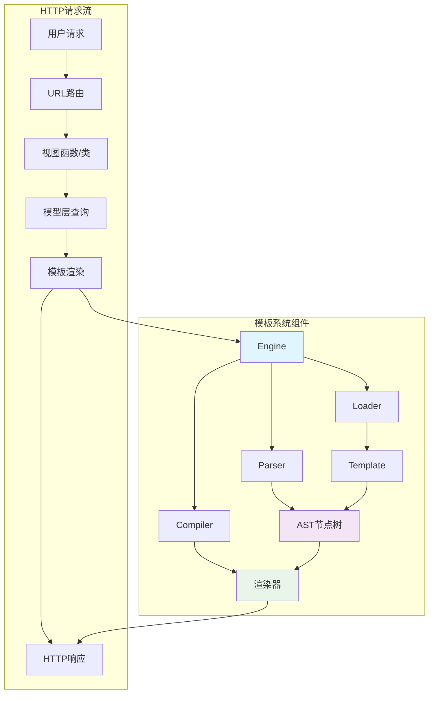
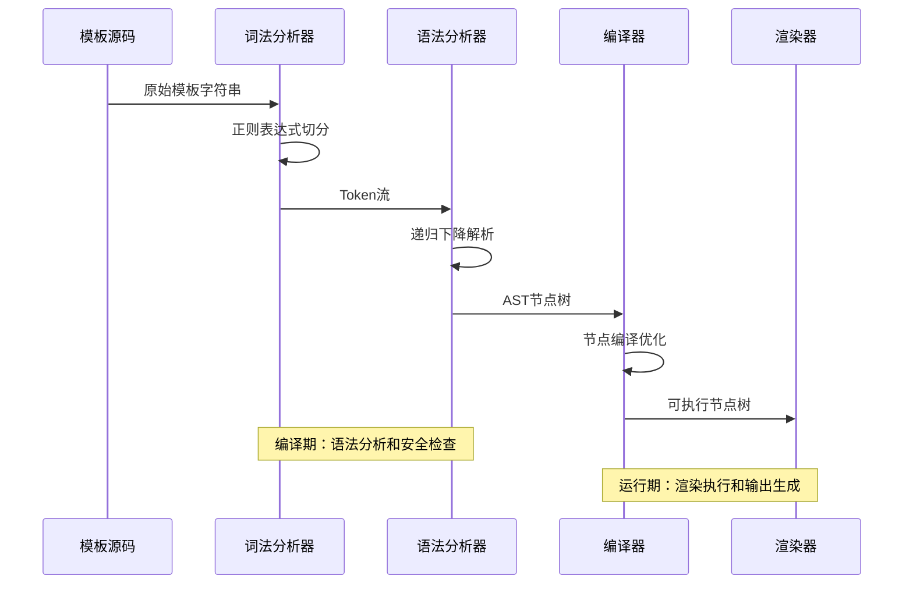
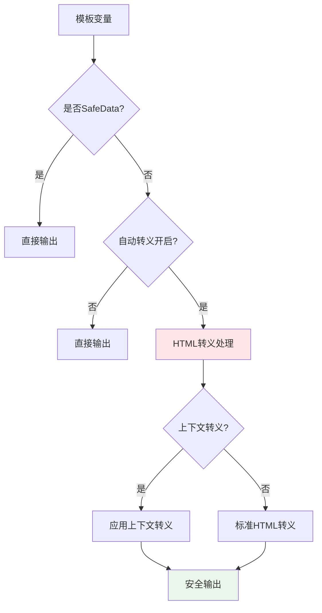
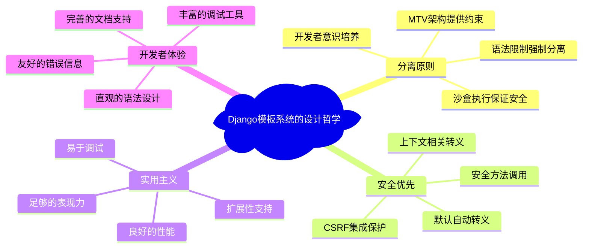

# 模板引擎-表现逻辑的分离

> Django模板引擎如何实现表现与逻辑的优雅分离：从编译机制到安全设计的完整剖析

## 前言：模板系统的根本使命

在Web应用开发中，如何优雅地分离表现层与业务逻辑一直是架构设计的核心挑战。Django模板引擎的答案展现了深刻的设计智慧：通过**编译时安全检查**、**运行时沙盒执行**和**声明式表现逻辑**，实现了安全性与灵活性的完美平衡。

## 一、模板系统架构全景

### 1.1 MTV架构中的T层定位



### 1.2 分离原则的层次化实现

```python
class TemplateLayeredSeparation:
    """
    Django模板系统的分层分离实现分析
    
    Ultra Think洞察：
    Django模板系统通过三个层次实现表现与逻辑的分离：
    1. 语法层：限制性语法避免复杂逻辑
    2. 执行层：沙盒环境确保安全
    3. 架构层：MTV模式强制分离
    """
    
    def syntax_level_separation(self):
        """
        语法层分离：有限制的模板语言
        
        设计哲学：
        - 故意限制表达能力，避免在模板中写业务逻辑
        - 提供足够的表现逻辑支持（循环、条件、过滤）
        - 强制将复杂逻辑移到视图或模型层
        """
        # 允许的表现逻辑示例
        template_allowed = """
        
            
                <h2>{{ article.title|truncatewords:10 }}</h2>
                <p>{{ article.content|striptags|truncatewords:50 }}</p>
            
        
        """
        
        # 故意不支持的复杂逻辑
        template_forbidden = """
        {# Django模板故意不支持这样的复杂操作 #}
        {# 
        import requests
        response = requests.get('http://api.example.com')
        data = response.json()
         #}
        """
        
        return "语法限制强制逻辑分离"
    
    def execution_level_separation(self):
        """
        执行层分离：沙盒环境隔离
        
        安全机制：
        - 无法访问Python内置函数
        - 无法导入模块
        - 无法执行任意代码
        - 严格的变量访问控制
        """
        class TemplateSandbox:
            """模板执行沙盒的安全机制"""
            
            def safe_attribute_access(self, obj, attr):
                """安全的属性访问机制"""
                # 禁止访问私有属性
                if attr.startswith('_'):
                    raise AttributeError(f"Access to private attribute '{attr}' is forbidden")
                
                # 禁止访问危险方法
                dangerous_attrs = ['__class__', '__globals__', '__code__']
                if attr in dangerous_attrs:
                    raise AttributeError(f"Access to dangerous attribute '{attr}' is forbidden")
                
                return getattr(obj, attr)
        
        return "沙盒执行确保安全分离"
    
    def architectural_level_separation(self):
        """
        架构层分离：MTV强制约束
        
        架构约束：
        - Model：数据和业务逻辑
        - Template：仅负责展示逻辑
        - View：协调Model和Template
        """
        # 正确的分离示例
        class Article(models.Model):
            def get_summary(self):
                """业务逻辑在模型中"""
                return self.content[:100] + "..."
        
        def article_view(request):
            """协调逻辑在视图中"""
            articles = Article.objects.published().order_by('-created_at')
            return render(request, 'articles.html', {'articles': articles})
        
        # 模板只负责展示
        template = "{{ article.get_summary }}"
        
        return "MTV架构强制分离"
```

## 二、模板编译系统的精妙实现

### 2.1 三阶段编译流程



### 2.2 词法分析的高效实现

```python
class TemplateTokenizer:
    """
    Django模板词法分析器的实现机制
    
    核心思路：
    1. 单一正则表达式切分所有模板元素
    2. 状态机处理不同类型的标记
    3. 延迟求值提高性能
    """
    
    # Django的模板语法正则表达式
    TOKEN_REGEX = re.compile(
        r'('
        r'{{.*?}}'      # 变量标签 {{ var }}
        r'|'     # 块标签 
        r'|{#.*?#}'     # 注释标签 {# comment #}
        r')',
        re.DOTALL
    )
    
    def tokenize(self, template_string):
        """
        高效的模板分词实现
        
        Ultra Think分析：
        - 为什么用单一正则而不是多次匹配？性能优化
        - 如何处理嵌套标签？递归下降解析
        - 错误恢复策略如何设计？位置追踪和上下文保持
        """
        tokens = []
        upto = 0
        
        # 使用正则表达式切分模板
        for match in self.TOKEN_REGEX.finditer(template_string):
            start, end = match.span()
            
            # 添加文本内容
            if upto < start:
                tokens.append(Token(
                    TOKEN_TEXT, 
                    template_string[upto:start],
                    position=(upto, start)
                ))
            
            # 添加模板标签
            token_string = match.group()
            tokens.append(self.create_token(token_string, (start, end)))
            
            upto = end
        
        # 添加剩余文本
        if upto < len(template_string):
            tokens.append(Token(
                TOKEN_TEXT,
                template_string[upto:],
                position=(upto, len(template_string))
            ))
        
        return tokens
    
    def create_token(self, token_string, position):
        """
        根据标记内容创建相应的Token对象
        
        设计模式：工厂方法的应用
        """
        if token_string.startswith('{{'):
            return VariableToken(token_string, position)
        elif token_string.startswith('{%'):
            return BlockToken(token_string, position)
        elif token_string.startswith('{#'):
            return CommentToken(token_string, position)
        else:
            raise TemplateSyntaxError(f"Unknown token type: {token_string}")
```

### 2.3 语法分析的递归下降实现

```python
class TemplateParser:
    """
    Django模板语法分析器
    
    实现技术：递归下降解析
    核心职责：将Token流转换为AST节点树
    """
    
    def __init__(self, tokens, libraries, builtins, origin):
        self.tokens = tokens
        self.libraries = libraries
        self.builtins = builtins
        self.origin = origin
        
        # 解析状态
        self.index = 0
        self.command_stack = []
        
    def parse(self):
        """
        解析主流程：构建AST节点树
        
        Ultra Think分析：
        - 递归下降如何处理嵌套结构？栈式状态管理
        - 错误恢复机制如何实现？异常捕获和位置追踪
        - 如何支持自定义标签扩展？插件化标签处理器
        """
        nodelist = NodeList()
        
        while self.index < len(self.tokens):
            token = self.tokens[self.index]
            
            if token.token_type == TOKEN_TEXT:
                nodelist.append(TextNode(token.contents))
            
            elif token.token_type == TOKEN_VAR:
                nodelist.append(self.parse_variable(token))
            
            elif token.token_type == TOKEN_BLOCK:
                try:
                    command = token.split_contents()[0]
                    if command in self.libraries:
                        # 自定义标签处理
                        nodelist.append(self.parse_custom_tag(token, command))
                    else:
                        # 内置标签处理
                        nodelist.append(self.parse_builtin_tag(token, command))
                except Exception as e:
                    raise TemplateSyntaxError(
                        f"Invalid block tag on line {token.lineno}: '{command}'"
                    ) from e
            
            self.index += 1
        
        return nodelist
    
    def parse_variable(self, token):
        """
        解析变量标签：{{ variable|filter:arg }}
        
        处理步骤：
        1. 解析变量路径 (user.profile.name)
        2. 解析过滤器链 (|filter1|filter2:arg)
        3. 创建过滤表达式对象
        """
        filter_expression = FilterExpression(token.contents, self)
        return VariableNode(filter_expression)
    
    def parse_builtin_tag(self, token, command):
        """
        解析内置标签的递归处理
        
        关键洞察：标签的嵌套结构如何处理？
        """
        if command == 'if':
            return self.parse_if_tag(token)
        elif command == 'for':
            return self.parse_for_tag(token)
        elif command == 'block':
            return self.parse_block_tag(token)
        else:
            raise TemplateSyntaxError(f"Unknown tag: {command}")
    
    def parse_if_tag(self, token):
        """
        if标签的复杂解析逻辑
        
        支持的语法：
        
        
        
        
        """
        # 解析条件表达式
        bits = token.split_contents()[1:]
        condition = self.parse_filter_expression(' '.join(bits))
        
        # 递归解析if块内容
        nodelist_true = self.parse_nodelist(['elif', 'else', 'endif'])
        
        # 处理elif和else分支
        elif_conditions = []
        nodelist_false = NodeList()
        
        while self.next_token:
            token = self.next_token
            if token.contents.startswith('elif'):
                # elif分支处理
                elif_bits = token.split_contents()[1:]
                elif_condition = self.parse_filter_expression(' '.join(elif_bits))
                elif_nodelist = self.parse_nodelist(['elif', 'else', 'endif'])
                elif_conditions.append((elif_condition, elif_nodelist))
            
            elif token.contents == 'else':
                # else分支处理
                nodelist_false = self.parse_nodelist(['endif'])
                break
                
            elif token.contents == 'endif':
                break
        
        return IfNode(condition, nodelist_true, elif_conditions, nodelist_false)
```

## 三、渲染引擎的执行机制

### 3.1 上下文系统的智能设计

```python
class ContextSystem:
    """
    Django模板上下文系统分析
    
    设计目标：
    1. 变量查找的高效实现
    2. 上下文层级的栈式管理
    3. 上下文处理器的自动注入
    """
    
    def variable_resolution_algorithm(self):
        """
        变量解析算法的智能实现
        
        解析顺序：
        1. 字典键查找 (obj['key'])
        2. 属性访问 (obj.attr)
        3. 数值索引 (obj[0])
        4. 方法调用 (obj.method())
        """
        class VariableResolver:
            def resolve(self, variable_path, context):
                """
                智能变量解析算法
                
                Ultra Think分析：
                - 为什么按这个顺序查找？性能和安全的平衡
                - 方法调用的安全限制如何实现？
                - 如何避免无限递归？调用深度控制
                """
                parts = variable_path.split('.')
                obj = context
                
                for part in parts:
                    obj = self.resolve_attribute(obj, part)
                    if obj is None:
                        break
                
                return obj
            
            def resolve_attribute(self, obj, attr):
                """单级属性解析的安全实现"""
                
                # 1. 字典访问
                if isinstance(obj, dict) and attr in obj:
                    return obj[attr]
                
                # 2. 属性访问（带安全检查）
                if hasattr(obj, attr):
                    if attr.startswith('_'):
                        raise AttributeError("Private attributes not allowed")
                    
                    value = getattr(obj, attr)
                    
                    # 3. 方法调用（无参数）
                    if callable(value):
                        if self.is_safe_callable(value):
                            try:
                                return value()
                            except TypeError:
                                # 需要参数的方法不自动调用
                                return value
                        else:
                            raise AttributeError("Unsafe method call")
                    
                    return value
                
                # 4. 数值索引访问
                try:
                    return obj[int(attr)]
                except (ValueError, IndexError, KeyError, TypeError):
                    pass
                
                # 5. 变量不存在处理
                if settings.TEMPLATE_STRING_IF_INVALID:
                    return settings.TEMPLATE_STRING_IF_INVALID
                else:
                    raise VariableDoesNotExist(f"Variable '{attr}' does not exist")
    
    def context_processor_mechanism(self):
        """
        上下文处理器的自动注入机制
        
        设计模式：装饰器模式的应用
        """
        class ContextProcessor:
            """上下文处理器的实现模式"""
            
            def process_context(self, request, context):
                """
                自动向模板注入通用变量
                
                常见的上下文处理器：
                - django.contrib.auth.context_processors.auth
                - django.template.context_processors.request
                - django.template.context_processors.csrf
                """
                # 注入认证信息
                if hasattr(request, 'user'):
                    context['user'] = request.user
                    context['perms'] = PermWrapper(request.user)
                
                # 注入请求对象
                context['request'] = request
                
                # 注入CSRF令牌
                context['csrf_token'] = get_token(request)
                
                return context
```

### 3.2 过滤器系统的函数式设计

```python
class FilterSystem:
    """
    Django过滤器系统的函数式设计分析
    
    设计理念：
    1. 函数式编程范式应用
    2. 管道式数据处理
    3. 纯函数保证安全性
    """
    
    def filter_chain_implementation(self):
        """
        过滤器链的实现机制
        
        语法: {{ value|filter1:arg1|filter2|filter3:arg2 }}
        实现: 函数组合和管道模式
        """
        class FilterExpression:
            def __init__(self, token, parser):
                """
                解析过滤器表达式
                
                Ultra Think分析：
                - 如何解析复杂的过滤器链？递归解析
                - 参数传递如何处理？参数节点对象
                - 过滤器安全性如何保证？白名单机制
                """
                self.token = token
                self.filters = []
                self.var = None
                
                self.parse_expression(token, parser)
            
            def parse_expression(self, token, parser):
                """解析过滤器表达式"""
                parts = token.split('|')
                
                # 解析变量部分
                self.var = Variable(parts[0].strip())
                
                # 解析过滤器链
                for filter_part in parts[1:]:
                    filter_name, *args = filter_part.split(':')
                    filter_func = parser.libraries.get_filter(filter_name.strip())
                    
                    if filter_func is None:
                        raise TemplateSyntaxError(f"Unknown filter: {filter_name}")
                    
                    # 解析过滤器参数
                    filter_args = []
                    for arg in args:
                        filter_args.append(FilterArgument(arg.strip(), parser))
                    
                    self.filters.append((filter_func, filter_args))
            
            def resolve(self, context):
                """
                执行过滤器链
                
                函数式编程的精髓：数据流转换
                """
                # 解析初始值
                value = self.var.resolve(context)
                
                # 依次应用过滤器
                for filter_func, args in self.filters:
                    resolved_args = [arg.resolve(context) for arg in args]
                    try:
                        value = filter_func(value, *resolved_args)
                    except Exception as e:
                        if settings.DEBUG:
                            raise TemplateSyntaxError(
                                f"Filter error in '{filter_func.__name__}': {e}"
                            )
                        value = ""
                
                return value
    
    def built_in_filters_analysis(self):
        """
        内置过滤器的设计模式分析
        """
        # 字符串处理过滤器
        def truncatewords(value, arg):
            """
            截取单词过滤器
            
            设计特点：
            - 纯函数实现
            - 参数类型验证
            - 安全的HTML处理
            """
            try:
                length = int(arg)
            except ValueError:
                return value
            
            words = value.split()
            if len(words) > length:
                words = words[:length]
                if not words[-1].endswith('...'):
                    words.append('...')
            
            return ' '.join(words)
        
        # HTML安全处理过滤器
        def escape(value):
            """
            HTML转义过滤器
            
            安全考虑：
            - 防止XSS攻击
            - 保持SafeString类型
            - 幂等性保证
            """
            if isinstance(value, SafeData):
                return value
            
            return mark_safe(
                str(value)
                .replace('&', '&amp;')
                .replace('<', '&lt;')
                .replace('>', '&gt;')
                .replace('"', '&quot;')
                .replace("'", '&#x27;')
            )
        
        return "过滤器的函数式和安全性设计"
```

## 四、安全机制的深度防御

### 4.1 自动转义的智能实现



### 4.2 多层安全防护机制

```python
class TemplateSecuritySystem:
    """
    Django模板安全机制的多层防护分析
    
    防护层次：
    1. 语法层：限制性语法避免代码注入
    2. 解析层：安全的变量解析和方法调用
    3. 渲染层：自动转义和上下文感知转义
    4. 输出层：Content Security Policy集成
    """
    
    def auto_escape_mechanism(self):
        """
        自动转义机制的智能实现
        
        核心思想：默认安全，明确取消
        """
        class AutoEscapeSystem:
            def __init__(self, autoescape=True):
                self.autoescape = autoescape
            
            def render_variable(self, value, context):
                """
                变量渲染时的自动转义
                
                Ultra Think分析：
                - 为什么默认转义而不是默认不转义？安全优先原则
                - SafeData如何避免重复转义？类型标记系统
                - 上下文相关转义如何实现？转义策略模式
                """
                # 1. 检查是否已经是安全数据
                if isinstance(value, SafeData):
                    return value
                
                # 2. 检查是否需要转义
                if not context.autoescape:
                    return value
                
                # 3. 根据上下文选择转义策略
                if context.template_name.endswith('.js'):
                    return self.javascript_escape(value)
                elif context.template_name.endswith('.css'):
                    return self.css_escape(value)
                else:
                    return self.html_escape(value)
            
            def html_escape(self, value):
                """HTML上下文转义"""
                return (
                    str(value)
                    .replace('&', '&amp;')
                    .replace('<', '&lt;')
                    .replace('>', '&gt;')
                    .replace('"', '&quot;')
                    .replace("'", '&#x27;')
                )
            
            def javascript_escape(self, value):
                """JavaScript上下文转义"""
                return (
                    str(value)
                    .replace('\\', '\\\\')
                    .replace('\r', '\\r')
                    .replace('\n', '\\n')
                    .replace('\t', '\\t')
                    .replace("'", "\\'")
                    .replace('"', '\\"')
                )
    
    def safe_method_calling(self):
        """
        安全的方法调用机制
        
        设计原则：白名单优于黑名单
        """
        class SafeMethodChecker:
            # 允许调用的安全方法
            SAFE_METHODS = {
                'get_absolute_url',
                'get_full_name', 
                'get_short_name',
                '__str__',
                '__unicode__',
            }
            
            # 危险方法黑名单
            UNSAFE_METHODS = {
                'delete',
                'save',
                'create',
                'update',
                '__del__',
                '__setattr__',
            }
            
            def is_safe_callable(self, obj):
                """
                判断对象是否可以安全调用
                
                安全策略：
                1. 内置类型方法默认安全
                2. 模型方法需要明确标记
                3. 危险方法一律禁止
                """
                if hasattr(obj, 'alters_data') and obj.alters_data:
                    return False
                
                if obj.__name__ in self.UNSAFE_METHODS:
                    return False
                
                if obj.__name__ in self.SAFE_METHODS:
                    return True
                
                # 默认策略：保守安全
                return getattr(obj, 'is_safe', False)
    
    def csrf_protection_integration(self):
        """
        CSRF保护的模板集成
        
        防护机制：自动令牌注入和验证
        """
        class CSRFTemplateIntegration:
            def render_csrf_token(self, context):
                """
                在模板中自动渲染CSRF令牌
                
                实现方式：
                1. 上下文处理器自动注入
                2.  标签支持
                3. AJAX请求头自动设置
                """
                request = context['request']
                token = get_token(request)
                
                return format_html(
                    '<input type="hidden" name="csrfmiddlewaretoken" value="{}" />',
                    token
                )
```

## 五、Ultra Think深度洞察

### 5.1 表现逻辑分离的哲学思考



### 5.2 设计权衡的深度分析

```python
class DesignTradeoffAnalysis:
    """
    Django模板系统设计权衡的Ultra Think分析
    
    核心权衡：
    1. 安全性 vs 灵活性
    2. 性能 vs 功能完整性
    3. 简单性 vs 表达能力
    """
    
    def security_vs_flexibility(self):
        """
        安全性与灵活性的权衡分析
        
        Django的选择：偏向安全性
        """
        tradeoffs = {
            "限制性语法": {
                "优势": "防止在模板中写复杂业务逻辑，强制分离",
                "劣势": "某些表现逻辑需要回到Python代码中实现",
                "Django策略": "提供丰富的过滤器和标签弥补限制"
            },
            
            "沙盒执行": {
                "优势": "完全隔离模板代码，防止安全漏洞",
                "劣势": "无法访问某些有用的Python功能",
                "Django策略": "通过上下文处理器和自定义标签提供扩展"
            },
            
            "自动转义": {
                "优势": "默认防止XSS攻击，安全优先",
                "劣势": "需要手动标记安全内容，增加开发负担",
                "Django策略": "提供|safe过滤器和mark_safe函数"
            }
        }
        
        return "Django选择安全优先，通过扩展机制保持灵活性"
    
    def performance_vs_completeness(self):
        """
        性能与功能完整性的权衡
        
        Django的优化策略
        """
        optimizations = {
            "编译缓存": {
                "机制": "模板编译结果缓存",
                "效果": "避免重复解析，显著提升性能",
                "权衡": "内存占用增加"
            },
            
            "延迟渲染": {
                "机制": "节点树构建后延迟渲染",
                "效果": "支持条件渲染，减少不必要计算",
                "权衡": "增加了实现复杂度"
            },
            
            "上下文优化": {
                "机制": "上下文层级栈管理",
                "效果": "高效变量查找，支持嵌套作用域",
                "权衡": "内存和复杂度开销"
            }
        }
        
        return "Django通过智能缓存和延迟计算优化性能"
    
    def simplicity_vs_expressiveness(self):
        """
        简单性与表达能力的平衡
        
        Django的中间道路
        """
        balance_strategies = {
            "核心语法简单": "仅支持基本的条件、循环、变量",
            "扩展机制强大": "自定义标签和过滤器支持复杂功能",
            "内置功能丰富": "提供常用的标签和过滤器",
            "文档完善": "详细的文档降低学习成本"
        }
        
        return "Django在简单和强大间找到平衡点"
```

### 5.3 现代化改进的思考

```python
class ModernizationOpportunities:
    """
    Django模板系统现代化改进的Ultra Think思考
    
    改进方向：
    1. 类型安全的模板
    2. 编译时优化  
    3. 组件化支持
    4. 异步渲染
    """
    
    def type_safe_templates(self):
        """
        类型安全模板的可能实现
        
        灵感来源：TypeScript的类型系统
        """
        # 当前Django模板（运行时类型检查）
        current = """
        {{ user.profile.name|truncatewords:10 }}
        <!-- 运行时才能发现user.profile为None的错误 -->
        """
        
        # 可能的类型安全版本
        future_concept = """
        <!-- 模板类型声明 -->
        
        user: User
        articles: QuerySet[Article]
        
        
        {{ user.profile.name|truncatewords:10 }}
        <!-- 编译时检查user.profile可能为None -->
        """
        
        return "类型安全可以在编译时发现更多错误"
    
    def compile_time_optimization(self):
        """
        编译时优化的潜在空间
        
        优化机会：
        1. 静态分析和代码优化
        2. 无用代码消除
        3. 常量折叠和内联
        """
        optimization_strategies = {
            "静态条件判断": "编译时计算永真/永假条件",
            "循环展开": "小循环的编译时展开",
            "变量内联": "常量变量的直接替换",
            "死代码消除": "永不执行分支的移除"
        }
        
        return "编译时优化可以显著提升运行性能"
    
    def component_based_templates(self):
        """
        组件化模板系统的设想
        
        灵感：现代前端框架的组件概念
        """
        component_concept = """
        <!-- 组件定义 -->
        
            
            
            <div class="article-card">
                <h3>{{ article.title }}</h3>
                
                    <p>By {{ article.author.name }}</p>
                
            </div>
        
        
        <!-- 组件使用 -->
        
            
        
        """
        
        return "组件化可以提高模板的复用性和维护性"
    
    def async_template_rendering(self):
        """
        异步模板渲染的可能性
        
        应用场景：数据密集型模板
        """
        async_concept = """
        <!-- 异步数据获取 -->
        
            
            
            
            <div>
                <h2>{{ user.name }} ({{ follower_count }} followers)</h2>
                
                    <p>{{ article.title }}</p>
                
            </div>
        
        """
        
        return "异步渲染可以提升数据密集应用的性能"
```

## 总结：表现逻辑分离的设计智慧

Django模板引擎展现了表现逻辑分离的精髓：

1. **分层分离策略**：语法、执行、架构三个层面的全面分离
2. **安全优先设计**：自动转义、沙盒执行、安全方法调用的多重防护
3. **智能编译系统**：词法分析、语法分析、AST构建的高效实现
4. **函数式过滤器**：纯函数设计确保安全性和可测试性
5. **性能优化机制**：编译缓存、延迟渲染、上下文优化的综合运用

Django模板系统不仅是技术实现的典范，更是设计哲学的体现：在安全与灵活性、性能与功能性、简单与强大之间找到了最佳平衡点。

---

**下一章导读**：[05-中间件层-洋葱模型的实现](./05-中间件层-洋葱模型的实现.md) - 我们将探索Django中间件系统的洋葱模型实现，分析AOP编程范式在Web开发中的优雅应用。