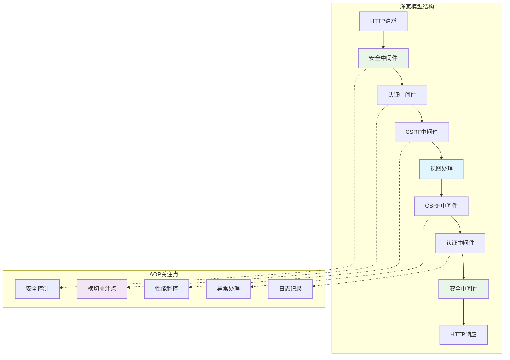
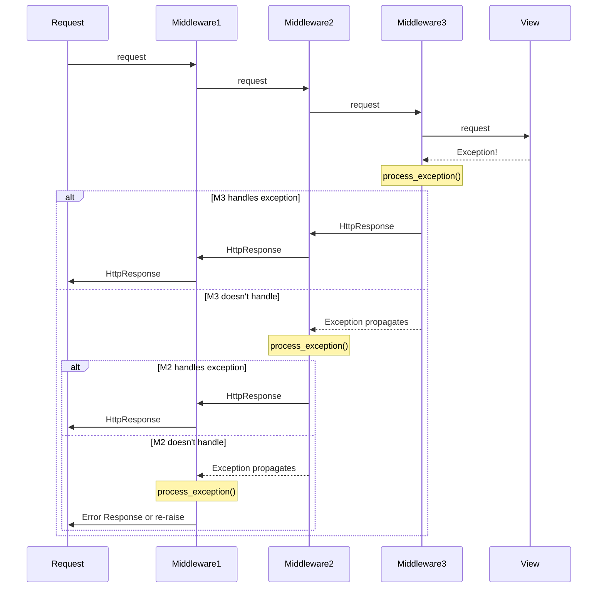
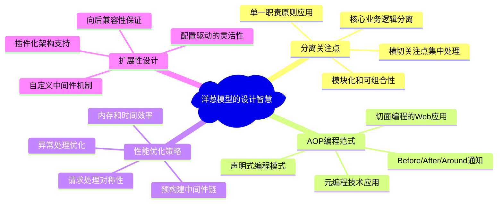

# 中间件层-洋葱模型的实现

> Django中间件系统如何实现横切关注点的优雅管理：从洋葱模型到AOP编程的完整剖析

## 前言：横切关注点的挑战

在Web应用开发中，认证、日志、安全、缓存等横切关注点如何优雅地与核心业务逻辑分离？Django中间件系统给出了精妙的答案：通过**洋葱模型架构**、**责任链模式**和**装饰器组合**，实现了关注点分离的典型范例。

## 一、洋葱模型的架构精髓

### 1.1 洋葱模型的核心思想



### 1.2 洋葱模型的实现机制

```python
class OnionModelImplementation:
    """
    Django洋葱模型的核心实现分析
    
    设计模式：
    1. 装饰器模式：每层中间件装饰内层处理
    2. 责任链模式：请求在中间件间传递
    3. 模板方法模式：统一的处理流程
    """
    
    def middleware_chain_construction(self):
        """
        中间件链构建的核心算法
        
        Ultra Think洞察：
        - 为什么逆序构建？外层中间件需要包装内层
        - 如何实现请求/响应对称处理？函数闭包机制
        - 性能优化在哪里？预构建避免运行时开销
        """
        class MiddlewareChainBuilder:
            def __init__(self, middleware_classes, base_handler):
                self.middleware_classes = middleware_classes
                self.base_handler = base_handler
            
            def build_chain(self):
                """
                构建中间件调用链的核心算法
                
                实现原理：
                1. 从最内层开始（视图处理）
                2. 逐层向外包装中间件
                3. 最终得到完整的洋葱结构
                """
                # 从核心处理器开始
                handler = self.base_handler
                
                # 逆序遍历中间件列表
                for middleware_path in reversed(self.middleware_classes):
                    middleware_class = import_string(middleware_path)
                    
                    # 每个中间件包装内层处理器
                    try:
                        middleware_instance = middleware_class(handler)
                        handler = middleware_instance
                    except MiddlewareNotUsed:
                        # 中间件可以声明不使用
                        continue
                
                return handler
            
            def visualize_chain_structure(self):
                """
                可视化中间件链结构
                """
                structure = """
                最终结构（从外到内）:
                SecurityMiddleware(
                    CommonMiddleware(
                        CsrfViewMiddleware(
                            AuthenticationMiddleware(
                                ViewHandler(request)
                            )
                        )
                    )
                )
                
                调用流程：
                request → Security → Common → Csrf → Auth → View
                response ← Security ← Common ← Csrf ← Auth ← View
                """
                return structure
    
    def request_response_symmetry(self):
        """
        请求/响应对称处理的实现机制
        
        核心思想：每个中间件都有机会处理请求和响应
        """
        class SymmetricMiddleware:
            def __init__(self, get_response):
                """
                初始化：get_response是内层处理器
                """
                self.get_response = get_response
                # 一次性初始化操作可以在这里进行
            
            def __call__(self, request):
                """
                请求处理的核心方法 - 体现洋葱模型精髓
                
                Ultra Think分析：
                - 为什么使用__call__而不是process？统一接口设计
                - 如何保证对称性？通过函数调用栈的天然对称
                - 异常如何传播？通过Python异常机制自动传播
                """
                # === 请求阶段（向内传播） ===
                # 请求预处理：认证、权限、限流等
                self.before_view_processing(request)
                
                try:
                    # 调用内层处理器（可能是另一个中间件或视图）
                    response = self.get_response(request)
                except Exception as e:
                    # 异常处理机会
                    response = self.handle_exception(request, e)
                    if response is None:
                        raise  # 重新抛出异常
                
                # === 响应阶段（向外传播） ===
                # 响应后处理：缓存、压缩、安全头等
                response = self.after_view_processing(request, response)
                
                return response
            
            def before_view_processing(self, request):
                """请求阶段的处理逻辑"""
                # 示例：添加请求时间戳
                request._processing_start = time.time()
            
            def after_view_processing(self, request, response):
                """响应阶段的处理逻辑"""
                # 示例：添加处理时间响应头
                if hasattr(request, '_processing_start'):
                    processing_time = time.time() - request._processing_start
                    response['X-Processing-Time'] = f"{processing_time:.3f}s"
                return response
            
            def handle_exception(self, request, exception):
                """异常处理的优雅机制"""
                # 中间件可以选择处理特定异常
                if isinstance(exception, CustomException):
                    return self.create_error_response(request, exception)
                return None  # 不处理，让异常继续传播
```

## 二、AOP编程范式的实现

### 2.1 横切关注点的识别与处理

```python
class AOPCrosscut­tingConcerns:
    """
    Django中间件实现的AOP横切关注点分析
    
    核心概念：
    - 切面(Aspect)：横切关注点的模块化
    - 切点(Pointcut)：关注点作用的位置
    - 通知(Advice)：在切点执行的代码
    - 织入(Weaving)：将切面集成到程序中
    """
    
    def security_aspect_implementation(self):
        """
        安全切面的实现 - 横切关注点的典型案例
        """
        class SecurityMiddleware:
            """
            安全中间件：安全横切关注点的集中实现
            
            涵盖的安全关注点：
            1. HTTPS重定向
            2. HSTS安全头
            3. 内容类型嗅探保护
            4. XSS保护
            5. 引用策略控制
            """
            
            def __init__(self, get_response):
                self.get_response = get_response
                # 安全配置初始化
                self.force_https = getattr(settings, 'SECURE_REQUIRE_HTTPS', False)
                self.hsts_seconds = getattr(settings, 'SECURE_HSTS_SECONDS', 0)
                self.content_type_nosniff = getattr(settings, 'SECURE_CONTENT_TYPE_NOSNIFF', True)
            
            def __call__(self, request):
                """
                安全切面的织入点
                
                AOP分析：
                - 切点：所有HTTP请求/响应
                - 通知：安全检查和响应头处理
                - 织入：通过中间件机制自动织入
                """
                # === 请求阶段安全检查 ===
                # 切点1：HTTPS强制检查
                if self.force_https and not request.is_secure():
                    return self.redirect_to_https(request)
                
                # 切点2：恶意请求检查
                if self.is_malicious_request(request):
                    return HttpResponseForbidden("Malicious request detected")
                
                # 执行内层处理
                response = self.get_response(request)
                
                # === 响应阶段安全加固 ===
                # 切点3：安全响应头注入
                response = self.add_security_headers(response)
                
                return response
            
            def add_security_headers(self, response):
                """
                安全响应头的统一注入 - 通知(Advice)的具体实现
                
                Ultra Think分析：
                - 为什么在中间件而不是视图中处理？横切关注点不应分散
                - 如何避免重复设置？条件检查机制
                - 性能影响如何？预计算和缓存优化
                """
                # HSTS头设置
                if self.hsts_seconds and request.is_secure():
                    response['Strict-Transport-Security'] = f'max-age={self.hsts_seconds}'
                
                # 内容类型嗅探保护
                if self.content_type_nosniff:
                    response['X-Content-Type-Options'] = 'nosniff'
                
                # XSS保护
                response['X-XSS-Protection'] = '1; mode=block'
                
                # 点击劫持保护
                if 'X-Frame-Options' not in response:
                    response['X-Frame-Options'] = 'DENY'
                
                # 引用策略
                response['Referrer-Policy'] = 'strict-origin-when-cross-origin'
                
                return response
    
    def logging_aspect_implementation(self):
        """
        日志切面：监控和审计横切关注点
        """
        class LoggingMiddleware:
            """
            日志中间件：请求/响应全生命周期监控
            
            监控维度：
            1. 请求来源和参数
            2. 处理时间和性能
            3. 响应状态和大小
            4. 异常和错误信息
            """
            
            def __init__(self, get_response):
                self.get_response = get_response
                self.logger = logging.getLogger('django.request')
            
            def __call__(self, request):
                """
                日志切面的全生命周期监控
                
                AOP维度分析：
                - Before Advice：请求开始时的日志记录
                - After Returning：正常响应的日志记录  
                - After Throwing：异常情况的日志记录
                - Around Advice：性能监控和统计
                """
                # 请求开始监控
                start_time = time.time()
                self.log_request_start(request, start_time)
                
                try:
                    # Around advice开始
                    response = self.get_response(request)
                    
                    # After returning advice
                    processing_time = time.time() - start_time
                    self.log_successful_response(request, response, processing_time)
                    
                    return response
                    
                except Exception as e:
                    # After throwing advice
                    processing_time = time.time() - start_time
                    self.log_exception(request, e, processing_time)
                    raise
            
            def log_request_start(self, request, start_time):
                """请求开始日志 - Before Advice"""
                self.logger.info(
                    f"Request started: {request.method} {request.get_full_path()} "
                    f"from {self.get_client_ip(request)} at {start_time}"
                )
            
            def log_successful_response(self, request, response, processing_time):
                """成功响应日志 - After Returning Advice"""
                self.logger.info(
                    f"Request completed: {request.method} {request.get_full_path()} "
                    f"-> {response.status_code} in {processing_time:.3f}s "
                    f"({len(response.content)} bytes)"
                )
            
            def log_exception(self, request, exception, processing_time):
                """异常日志 - After Throwing Advice"""
                self.logger.error(
                    f"Request failed: {request.method} {request.get_full_path()} "
                    f"-> {type(exception).__name__}: {exception} "
                    f"after {processing_time:.3f}s"
                )
    
    def caching_aspect_implementation(self):
        """
        缓存切面：性能优化横切关注点
        """
        class CachingMiddleware:
            """
            缓存中间件：透明的缓存机制实现
            
            缓存策略：
            1. 请求阶段：缓存查找和命中判断
            2. 响应阶段：缓存生成和存储
            3. 失效处理：TTL和条件失效
            """
            
            def __init__(self, get_response):
                self.get_response = get_response
                self.cache = caches['default']
                self.cache_timeout = getattr(settings, 'CACHE_MIDDLEWARE_SECONDS', 600)
            
            def __call__(self, request):
                """
                缓存切面的Around Advice实现
                
                切面逻辑：
                1. 尝试从缓存获取响应
                2. 如果缓存未命中，执行实际处理
                3. 将结果存储到缓存中
                """
                # 生成缓存键
                cache_key = self.generate_cache_key(request)
                
                # 尝试从缓存获取
                cached_response = self.cache.get(cache_key)
                if cached_response is not None:
                    # 缓存命中，直接返回
                    return cached_response
                
                # 缓存未命中，执行实际处理
                response = self.get_response(request)
                
                # 判断是否可缓存
                if self.is_cacheable(request, response):
                    # 存储到缓存
                    self.cache.set(cache_key, response, self.cache_timeout)
                
                return response
            
            def generate_cache_key(self, request):
                """
                智能缓存键生成
                
                Ultra Think考虑：
                - 如何处理用户相关的请求？用户ID包含在键中
                - 查询参数如何处理？标准化和排序
                - 如何避免键冲突？包含足够的上下文信息
                """
                # 基础信息
                key_parts = [
                    request.method,
                    request.get_full_path(),
                    request.META.get('HTTP_ACCEPT_LANGUAGE', ''),
                ]
                
                # 用户相关（如果需要）
                if hasattr(request, 'user') and request.user.is_authenticated:
                    key_parts.append(f"user:{request.user.id}")
                
                # 生成最终缓存键
                raw_key = ":".join(key_parts)
                return hashlib.md5(raw_key.encode()).hexdigest()
```

## 三、异常处理的层次化设计

### 3.1 异常传播机制



### 3.2 异常处理的最佳实践

```python
class ExceptionHandlingBestPractices:
    """
    Django中间件异常处理的最佳实践分析
    
    设计原则：
    1. 就近处理：异常在最适合的层级处理
    2. 优雅降级：提供有意义的错误响应
    3. 信息保护：避免敏感信息泄露
    4. 可观测性：完善的错误日志和监控
    """
    
    def exception_handling_middleware(self):
        """
        专业的异常处理中间件实现
        """
        class ExceptionHandlingMiddleware:
            def __init__(self, get_response):
                self.get_response = get_response
                self.logger = logging.getLogger('django.request.exception')
            
            def __call__(self, request):
                try:
                    response = self.get_response(request)
                    return response
                except Exception as e:
                    return self.handle_exception(request, e)
            
            def handle_exception(self, request, exception):
                """
                分层异常处理的核心实现
                
                Ultra Think分析：
                - 如何平衡用户体验和安全性？分类错误处理
                - 错误信息如何本地化？国际化错误消息
                - 如何支持不同客户端？内容协商机制
                """
                # 记录异常信息
                self.log_exception(request, exception)
                
                # 根据异常类型进行分类处理
                if isinstance(exception, ValidationError):
                    return self.handle_validation_error(request, exception)
                elif isinstance(exception, PermissionDenied):
                    return self.handle_permission_denied(request, exception)
                elif isinstance(exception, Http404):
                    return self.handle_not_found(request, exception)
                elif isinstance(exception, SuspiciousOperation):
                    return self.handle_suspicious_operation(request, exception)
                else:
                    return self.handle_server_error(request, exception)
            
            def handle_validation_error(self, request, exception):
                """处理验证错误 - 400 Bad Request"""
                if request.content_type == 'application/json':
                    return JsonResponse({
                        'error': 'validation_error',
                        'message': str(exception),
                        'details': exception.message_dict if hasattr(exception, 'message_dict') else {}
                    }, status=400)
                else:
                    return HttpResponseBadRequest("Invalid input data")
            
            def handle_permission_denied(self, request, exception):
                """处理权限拒绝 - 403 Forbidden"""
                if request.user.is_authenticated:
                    return HttpResponseForbidden("Access denied")
                else:
                    # 重定向到登录页面
                    return redirect_to_login(request.get_full_path())
            
            def handle_server_error(self, request, exception):
                """处理服务器错误 - 500 Internal Server Error"""
                # 生成错误追踪ID
                error_id = uuid.uuid4().hex
                
                # 详细错误日志（包含错误ID）
                self.logger.error(
                    f"Server error {error_id}: {type(exception).__name__}: {exception}",
                    extra={
                        'request': request,
                        'error_id': error_id,
                    },
                    exc_info=True
                )
                
                if settings.DEBUG:
                    # 开发环境：返回详细错误信息
                    return HttpResponseServerError(
                        f"Server Error (ID: {error_id}): {exception}"
                    )
                else:
                    # 生产环境：返回通用错误信息
                    return HttpResponseServerError(
                        f"Internal server error. Please contact support with error ID: {error_id}"
                    )
    
    def circuit_breaker_pattern(self):
        """
        断路器模式在中间件中的应用
        
        用途：防止级联故障和系统崩溃
        """
        class CircuitBreakerMiddleware:
            def __init__(self, get_response):
                self.get_response = get_response
                self.failure_count = 0
                self.last_failure_time = None
                self.circuit_open = False
                
                # 配置参数
                self.failure_threshold = 5  # 失败阈值
                self.timeout = 60  # 断路器打开时间（秒）
            
            def __call__(self, request):
                # 检查断路器状态
                if self.circuit_open:
                    if time.time() - self.last_failure_time > self.timeout:
                        # 半开状态：尝试重新请求
                        self.circuit_open = False
                        self.failure_count = 0
                    else:
                        # 断路器仍然打开：快速失败
                        return HttpResponseServiceUnavailable(
                            "Service temporarily unavailable"
                        )
                
                try:
                    response = self.get_response(request)
                    
                    # 请求成功：重置失败计数
                    self.failure_count = 0
                    return response
                    
                except Exception as e:
                    # 请求失败：增加失败计数
                    self.failure_count += 1
                    self.last_failure_time = time.time()
                    
                    # 检查是否需要打开断路器
                    if self.failure_count >= self.failure_threshold:
                        self.circuit_open = True
                    
                    raise
```

## 四、性能优化的中间件实践

### 4.1 性能监控中间件

```python
class PerformanceOptimizationMiddleware:
    """
    性能优化相关的中间件实现分析
    
    优化维度：
    1. 请求/响应时间监控
    2. 数据库查询优化
    3. 内存使用监控
    4. 缓存命中率统计
    """
    
    def performance_monitoring_middleware(self):
        """
        综合性能监控中间件
        """
        class PerformanceMiddleware:
            def __init__(self, get_response):
                self.get_response = get_response
                self.metrics = {
                    'request_count': 0,
                    'total_time': 0,
                    'db_queries': 0,
                    'cache_hits': 0,
                    'cache_misses': 0
                }
            
            def __call__(self, request):
                """
                性能监控的Around Advice实现
                
                监控指标：
                - 响应时间
                - 数据库查询数量
                - 内存使用量
                - 缓存命中率
                """
                start_time = time.time()
                start_queries = len(connection.queries)
                
                # 内存使用监控
                import psutil
                process = psutil.Process()
                start_memory = process.memory_info().rss
                
                try:
                    response = self.get_response(request)
                    
                    # 计算性能指标
                    end_time = time.time()
                    processing_time = end_time - start_time
                    
                    # 数据库查询统计
                    query_count = len(connection.queries) - start_queries
                    
                    # 内存使用变化
                    end_memory = process.memory_info().rss
                    memory_delta = end_memory - start_memory
                    
                    # 更新统计指标
                    self.update_metrics(processing_time, query_count, memory_delta)
                    
                    # 添加性能响应头
                    response['X-Response-Time'] = f"{processing_time:.3f}s"
                    response['X-DB-Queries'] = str(query_count)
                    response['X-Memory-Delta'] = f"{memory_delta / 1024:.1f}KB"
                    
                    # 性能警告检查
                    self.check_performance_warnings(processing_time, query_count, memory_delta)
                    
                    return response
                    
                except Exception as e:
                    # 异常情况也需要记录性能数据
                    processing_time = time.time() - start_time
                    self.log_exception_performance(request, e, processing_time)
                    raise
            
            def update_metrics(self, processing_time, query_count, memory_delta):
                """更新性能指标"""
                self.metrics['request_count'] += 1
                self.metrics['total_time'] += processing_time
                self.metrics['db_queries'] += query_count
                
            def check_performance_warnings(self, processing_time, query_count, memory_delta):
                """性能警告检查"""
                warnings = []
                
                if processing_time > 1.0:
                    warnings.append(f"Slow response: {processing_time:.3f}s")
                
                if query_count > 10:
                    warnings.append(f"Too many DB queries: {query_count}")
                
                if memory_delta > 10 * 1024 * 1024:  # 10MB
                    warnings.append(f"High memory usage: {memory_delta / 1024 / 1024:.1f}MB")
                
                if warnings:
                    logger.warning(f"Performance warnings: {', '.join(warnings)}")
    
    def database_optimization_middleware(self):
        """
        数据库查询优化中间件
        """
        class DatabaseOptimizationMiddleware:
            def __init__(self, get_response):
                self.get_response = get_response
            
            def __call__(self, request):
                """
                数据库优化的实现策略
                
                优化技术：
                1. 查询计数监控
                2. N+1查询检测
                3. 慢查询预警
                4. 连接池监控
                """
                # 开启查询日志
                old_debug = settings.DEBUG
                settings.DEBUG = True
                
                # 清除之前的查询记录
                reset_queries()
                
                try:
                    response = self.get_response(request)
                    
                    # 分析查询模式
                    self.analyze_queries(request, connection.queries)
                    
                    return response
                    
                finally:
                    # 恢复DEBUG设置
                    settings.DEBUG = old_debug
            
            def analyze_queries(self, request, queries):
                """
                查询分析和优化建议
                
                Ultra Think分析：
                - 如何识别N+1查询？相似查询的模式匹配
                - 慢查询阈值如何设定？基于历史数据的动态阈值
                - 优化建议如何生成？基于查询模式的启发式规则
                """
                query_count = len(queries)
                total_time = sum(float(query.get('time', 0)) for query in queries)
                
                # N+1查询检测
                similar_queries = self.detect_similar_queries(queries)
                if similar_queries:
                    logger.warning(
                        f"Potential N+1 query detected in {request.path}: "
                        f"{len(similar_queries)} similar queries"
                    )
                
                # 慢查询检测
                slow_queries = [q for q in queries if float(q.get('time', 0)) > 0.1]
                if slow_queries:
                    logger.warning(
                        f"Slow queries detected in {request.path}: "
                        f"{len(slow_queries)} queries > 100ms"
                    )
                
                # 总体性能评估
                if query_count > 20:
                    logger.warning(f"High query count: {query_count} queries")
                
                if total_time > 0.5:
                    logger.warning(f"High DB time: {total_time:.3f}s total")
            
            def detect_similar_queries(self, queries):
                """N+1查询检测算法"""
                query_patterns = {}
                
                for query in queries:
                    sql = query.get('sql', '')
                    # 简化SQL模式（移除具体参数）
                    pattern = re.sub(r'= \d+', '= ?', sql)
                    pattern = re.sub(r"= '[^']*'", "= '?'", pattern)
                    
                    if pattern in query_patterns:
                        query_patterns[pattern].append(query)
                    else:
                        query_patterns[pattern] = [query]
                
                # 返回重复模式（可能的N+1查询）
                return {k: v for k, v in query_patterns.items() if len(v) > 3}
```

## 五、Ultra Think深度洞察

### 5.1 洋葱模型的设计哲学思考



### 5.2 中间件系统的权衡分析

```python
class MiddlewareDesignTradeoffs:
    """
    Django中间件系统设计权衡的Ultra Think分析
    
    核心权衡：
    1. 灵活性 vs 性能
    2. 功能完整性 vs 复杂度
    3. 调试便利性 vs 执行效率
    """
    
    def flexibility_vs_performance(self):
        """
        灵活性与性能的权衡分析
        """
        tradeoffs = {
            "动态中间件链": {
                "优势": "支持运行时修改中间件配置",
                "劣势": "每次请求都需要构建调用链，性能开销大",
                "Django选择": "预构建静态中间件链，牺牲动态性换取性能"
            },
            
            "丰富的钩子方法": {
                "优势": "提供细粒度的控制点，支持复杂的处理逻辑",
                "劣势": "增加了调用复杂度，可能影响执行效率",
                "Django选择": "平衡钩子数量，提供最常用的控制点"
            },
            
            "异常处理机制": {
                "优势": "每个中间件都有处理异常的机会",
                "劣势": "异常传播链路复杂，调试困难",
                "Django选择": "规范化异常处理流程，提供清晰的传播路径"
            }
        }
        
        return "Django在灵活性和性能间选择了实用主义平衡"
    
    def complexity_management(self):
        """
        复杂度管理的设计策略
        
        Django如何控制中间件系统的复杂度？
        """
        strategies = {
            "统一接口设计": {
                "机制": "标准化的中间件接口和调用约定",
                "效果": "降低开发者理解成本，提高可维护性",
                "实现": "MiddlewareMixin和现代中间件接口"
            },
            
            "分层职责划分": {
                "机制": "不同类型的中间件处理不同层次的关注点",
                "效果": "避免功能重叠，提高系统清晰度",
                "实现": "安全、认证、缓存、日志等专门中间件"
            },
            
            "配置驱动": {
                "机制": "通过MIDDLEWARE设置控制中间件的启用和顺序",
                "效果": "运维友好，便于环境差异化配置",
                "实现": "settings.py中的MIDDLEWARE列表"
            },
            
            "优雅降级": {
                "机制": "中间件可以声明不使用，系统自动跳过",
                "效果": "增强系统的容错能力",
                "实现": "MiddlewareNotUsed异常机制"
            }
        }
        
        return "Django通过标准化、分层和配置化控制复杂度"
    
    def debugging_vs_performance(self):
        """
        调试便利性与执行效率的平衡
        """
        balance_points = {
            "错误信息丰富性": {
                "需求": "开发者需要详细的错误上下文",
                "成本": "收集和格式化错误信息消耗资源",
                "Django策略": "DEBUG模式下提供详细信息，生产环境简化输出"
            },
            
            "中间件执行追踪": {
                "需求": "了解请求在中间件链中的处理流程",
                "成本": "追踪信息的收集和存储开销",
                "Django策略": "可选的性能监控和日志中间件"
            },
            
            "异常栈追踪": {
                "需求": "完整的异常传播路径信息",
                "成本": "异常信息的完整保存和传递",
                "Django策略": "开发模式下保留完整栈追踪"
            }
        }
        
        return "Django通过模式切换平衡调试和性能需求"
```

### 5.3 未来演进方向的思考

```python
class MiddlewareFutureEvolution:
    """
    中间件系统未来演进方向的Ultra Think思考
    
    演进方向：
    1. 异步化完全支持
    2. 微服务友好设计
    3. AI增强的智能中间件
    4. 声明式配置进化
    """
    
    def async_middleware_evolution(self):
        """
        异步中间件的完整支持
        
        当前限制：部分中间件仍然是同步的
        未来方向：原生异步中间件架构
        """
        future_async_concept = """
        # 未来的完全异步中间件
        class AsyncMiddleware:
            def __init__(self, get_response):
                self.get_response = get_response
            
            async def __call__(self, request):
                # 异步前置处理
                await self.async_before_processing(request)
                
                # 异步调用内层处理器
                response = await self.get_response(request)
                
                # 异步后置处理
                response = await self.async_after_processing(request, response)
                
                return response
            
            async def async_before_processing(self, request):
                # 异步数据库查询、缓存操作、外部API调用
                user_data = await async_get_user_data(request.user.id)
                request.user_profile = user_data
            
            async def async_after_processing(self, request, response):
                # 异步日志记录、指标上报
                await async_log_request(request, response)
                return response
        """
        
        return "异步支持将释放中间件的全部潜力"
    
    def microservice_friendly_middleware(self):
        """
        微服务友好的中间件设计
        
        挑战：跨服务的横切关注点处理
        解决方案：分布式中间件架构
        """
        microservice_concept = """
        # 微服务环境下的中间件概念
        class DistributedMiddleware:
            def __init__(self, get_response, service_mesh):
                self.get_response = get_response
                self.service_mesh = service_mesh
            
            async def __call__(self, request):
                # 分布式追踪
                trace_id = await self.service_mesh.start_trace(request)
                request.trace_id = trace_id
                
                # 服务间认证
                if await self.service_mesh.verify_service_auth(request):
                    response = await self.get_response(request)
                else:
                    response = HttpResponseForbidden()
                
                # 分布式指标收集
                await self.service_mesh.collect_metrics(request, response, trace_id)
                
                return response
        """
        
        return "分布式架构需要重新思考中间件的边界"
    
    def ai_enhanced_middleware(self):
        """
        AI增强的智能中间件
        
        应用场景：
        1. 智能安全检测
        2. 自适应性能优化
        3. 预测性缓存
        4. 异常模式识别
        """
        ai_middleware_concept = """
        # AI增强的安全中间件概念
        class AISecurityMiddleware:
            def __init__(self, get_response):
                self.get_response = get_response
                self.ml_model = load_security_model()
            
            async def __call__(self, request):
                # AI威胁检测
                threat_score = await self.ml_model.predict_threat(
                    request.META, request.user, request.POST
                )
                
                if threat_score > 0.8:
                    # 高威胁请求：额外验证或阻断
                    return await self.handle_high_threat_request(request)
                elif threat_score > 0.5:
                    # 中等威胁：增强监控
                    response = await self.get_response(request)
                    await self.enhanced_logging(request, response, threat_score)
                    return response
                else:
                    # 正常请求：常规处理
                    return await self.get_response(request)
        """
        
        return "AI将使中间件具备自适应和预测能力"
    
    def declarative_middleware_config(self):
        """
        声明式中间件配置的进化
        
        当前：命令式的MIDDLEWARE列表
        未来：声明式的中间件配置DSL
        """
        declarative_concept = """
        # 未来的声明式中间件配置
        MIDDLEWARE_CONFIG = {
            'security': {
                'middleware': 'django.middleware.security.SecurityMiddleware',
                'enabled': True,
                'config': {
                    'force_https': True,
                    'hsts_seconds': 31536000
                },
                'conditions': {
                    'environment': ['production', 'staging']
                }
            },
            
            'caching': {
                'middleware': 'django.middleware.cache.CacheMiddleware',
                'enabled': True,
                'config': {
                    'cache_timeout': 300,
                    'cache_anonymous_only': True
                },
                'conditions': {
                    'paths': ['/api/*'],
                    'methods': ['GET', 'HEAD']
                }
            },
            
            'rate_limiting': {
                'middleware': 'custom.middleware.RateLimitMiddleware',
                'enabled': True,
                'config': {
                    'rate': '1000/hour',
                    'burst': 100
                },
                'conditions': {
                    'user_types': ['anonymous']
                }
            }
        }
        """
        
        return "声明式配置将提供更强的表达能力和灵活性"
```

## 总结：洋葱模型的架构智慧

Django中间件系统展现了洋葱模型的设计精髓：

1. **AOP编程范式**：横切关注点的集中处理和模块化管理
2. **责任链模式**：请求在中间件间的有序传播和处理
3. **装饰器组合**：通过函数包装实现的优雅嵌套结构
4. **异常传播机制**：分层的异常处理和优雅降级策略
5. **性能优化设计**：预构建链路和对称处理的高效实现

Django中间件系统不仅解决了横切关注点的技术问题，更重要的是体现了软件架构设计的核心思想：**通过合理的抽象和分层，将复杂性控制在可管理的范围内**。

---

**下一章导读**：[06-设计哲学-Django的工程智慧](./06-设计哲学-Django的工程智慧.md) - 我们将从技术实现上升到设计哲学层面，深度剖析Django框架所体现的软件工程智慧和设计原则。