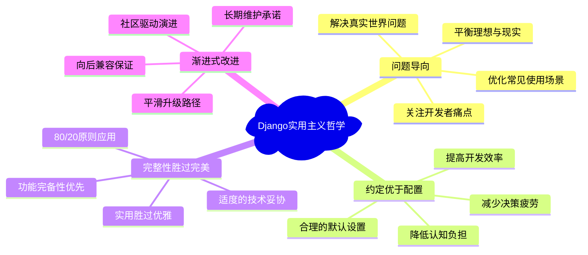
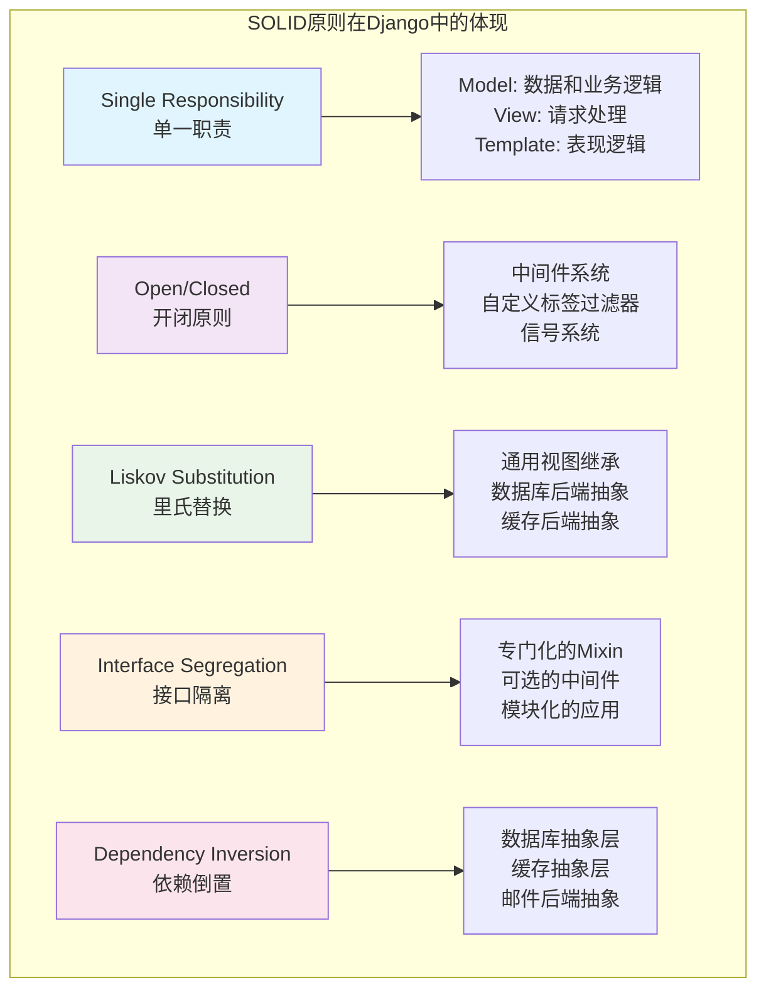
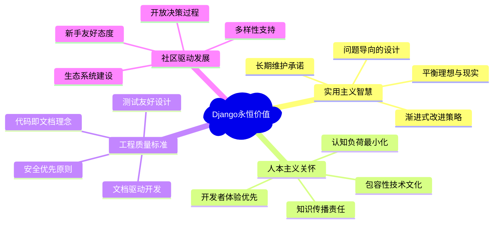

# 设计哲学-Django的工程智慧

> 从技术实现到设计哲学：Django框架所体现的软件工程智慧与实用主义美学

## 前言：技术背后的哲学思考

通过前面五章对Django源码的深入分析，我们不仅理解了Django的技术实现，更重要的是领悟了其背后的设计哲学。Django不仅仅是一个Web框架，更是一套完整的**软件工程哲学体系**的体现。本章将从技术实现上升到哲学层面，深度剖析Django所体现的工程智慧。

## 一、Django的核心设计哲学

### 1.1 实用主义至上的工程观



### 1.2 人本主义的技术观

```python
class HumanisticDesignPhilosophy:
    """
    Django人本主义技术观的具体体现
    
    核心理念：技术服务于人，而不是人服务于技术
    """
    
    def developer_experience_first(self):
        """
        开发者体验优先的设计原则
        
        体现在Django的方方面面：
        1. 直观的API设计
        2. 友好的错误信息
        3. 完善的文档体系
        4. 强大的调试工具
        """
        examples = {
            "直观的ORM API": {
                "设计": "User.objects.filter(is_active=True)",
                "哲学": "接近自然语言的表达方式",
                "价值": "降低学习曲线，提高开发效率"
            },
            
            "友好的错误信息": {
                "设计": "详细的异常栈追踪和解决建议",
                "哲学": "错误是学习的机会，不是挫折",
                "价值": "帮助开发者快速定位和解决问题"
            },
            
            "完善的Admin系统": {
                "设计": "自动生成的管理界面",
                "哲学": "减少重复劳动，关注核心价值",
                "价值": "让开发者专注于业务逻辑"
            }
        }
        
        return examples
    
    def cognitive_load_minimization(self):
        """
        认知负荷最小化策略
        
        Django如何减少开发者的认知负担？
        """
        strategies = {
            "一致性原则": {
                "实现": "统一的命名约定和API风格",
                "例子": "创建对象都用create()，查询都用filter()",
                "效果": "形成肌肉记忆，减少思考成本"
            },
            
            "分层抽象": {
                "实现": "不同层次的抽象隐藏复杂性",
                "例子": "ORM隐藏SQL细节，Form隐藏验证复杂性",
                "效果": "开发者只需关注当前层次的问题"
            },
            
            "智能默认值": {
                "实现": "基于最佳实践的默认配置",
                "例子": "自动转义、CSRF保护、安全设置",
                "效果": "新手也能构建安全的应用"
            }
        }
        
        return "Django让正确的事情变得简单，错误的事情变得困难"
    
    def inclusive_development_culture(self):
        """
        包容性开发文化的体现
        
        Django如何降低技术门槛？
        """
        inclusion_measures = {
            "文档友好性": {
                "特点": "从初学者到专家的完整文档链",
                "价值": "不同水平的开发者都能找到合适的学习材料"
            },
            
            "多语言支持": {
                "特点": "内置国际化和本地化支持",
                "价值": "支持全球开发者用自己的语言开发"
            },
            
            "社区建设": {
                "特点": "友好的社区氛围和行为准则",
                "价值": "创造包容和支持的学习环境"
            },
            
            "渐进学习曲线": {
                "特点": "可以从简单开始，逐步深入",
                "价值": "让更多人能够参与到Web开发中"
            }
        }
        
        return "Django致力于让Web开发变得民主化"
```

## 二、技术决策的深层逻辑

### 2.1 安全优先的设计原则

```python
class SecurityFirstDesignPrinciple:
    """
    Django安全优先设计原则的深度分析
    
    核心观点：安全不是功能，而是约束
    """
    
    def security_by_default_philosophy(self):
        """
        默认安全的设计哲学
        
        Ultra Think洞察：
        为什么Django选择"默认安全"而不是"可选安全"？
        """
        design_decisions = {
            "自动HTML转义": {
                "决策": "模板变量默认转义，需要显式标记为safe",
                "哲学": "安全是默认行为，不安全需要明确声明",
                "权衡": "增加了开发复杂度，但大幅降低了XSS风险",
                "启示": "将安全从"记住要做"变成"忘记也安全""
            },
            
            "CSRF保护默认开启": {
                "决策": "所有POST请求默认要求CSRF令牌",
                "哲学": "让攻击者难以成功，而不是依赖开发者记住",
                "权衡": "API开发需要额外配置，但保护了大多数场景",
                "启示": "好的安全设计是透明的和自动的"
            },
            
            "SQL注入防护": {
                "决策": "ORM默认使用参数化查询",
                "哲学": "让危险操作变得困难而明显",
                "权衡": "牺牲了一些SQL控制力，但防止了常见漏洞",
                "启示": "抽象层可以作为安全层"
            }
        }
        
        philosophy_core = """
        Django安全哲学的核心：
        1. 让正确的事情变得简单
        2. 让错误的事情变得困难
        3. 让危险的事情变得明显
        4. 安全应该是透明的，而不是负担
        """
        
        return design_decisions, philosophy_core
    
    def defense_in_depth_strategy(self):
        """
        纵深防御策略的具体实现
        
        Django如何构建多层次的安全防护？
        """
        defense_layers = {
            "输入层防护": {
                "机制": ["表单验证", "字段类型检查", "长度限制"],
                "目标": "在数据进入系统前进行净化",
                "哲学": "不信任任何外部输入"
            },
            
            "处理层防护": {
                "机制": ["权限检查", "认证验证", "业务逻辑验证"],
                "目标": "确保操作的合法性和权限",
                "哲学": "每个操作都需要明确授权"
            },
            
            "输出层防护": {
                "机制": ["自动转义", "CSP头", "安全响应头"],
                "目标": "防止输出数据被恶意利用",
                "哲学": "不信任数据的输出环境"
            },
            
            "传输层防护": {
                "机制": ["HTTPS强制", "安全Cookie", "HSTS"],
                "目标": "保护数据传输的安全性",
                "哲学": "端到端的安全保护"
            }
        }
        
        return "Django通过多层防护实现安全的纵深防御"
    
    def security_usability_balance(self):
        """
        安全性与可用性的平衡艺术
        
        Django如何在安全和易用间找到平衡？
        """
        balance_examples = {
            "密码验证": {
                "安全需求": "强密码策略防止暴力破解",
                "可用性需求": "用户友好的密码设置体验",
                "Django解决方案": "可配置的密码验证器 + 友好的错误提示",
                "平衡点": "默认合理的安全级别，允许根据需求调整"
            },
            
            "会话管理": {
                "安全需求": "防止会话劫持和固化攻击",
                "可用性需求": "用户不需要频繁重新登录",
                "Django解决方案": "安全的会话配置 + 灵活的过期策略",
                "平衡点": "默认安全，但支持业务需求的定制"
            },
            
            "CORS处理": {
                "安全需求": "防止跨域请求攻击",
                "可用性需求": "支持现代前后端分离架构",
                "Django解决方案": "默认严格的同源策略 + 可配置的CORS中间件",
                "平衡点": "安全为默认，便利需要明确配置"
            }
        }
        
        return "Django选择了安全优先，便利需要明确意图的策略"
```

### 2.2 MTV架构的深层思考

```python
class MTVArchitecturePhilosophy:
    """
    MTV架构设计哲学的深度解析
    
    超越MVC：Django为什么要创造MTV模式？
    """
    
    def mvc_to_mtv_evolution(self):
        """
        从MVC到MTV的进化逻辑
        
        Ultra Think分析：Django的MTV相对于传统MVC有什么创新？
        """
        architectural_evolution = {
            "传统MVC的局限": {
                "问题": "Controller承担了太多责任",
                "表现": [
                    "业务逻辑与表现逻辑混合",
                    "URL路由与控制逻辑耦合",
                    "模板选择逻辑分散"
                ],
                "影响": "导致控制器膨胀和职责不清"
            },
            
            "Django MTV的创新": {
                "Model": "专注于数据和业务逻辑",
                "Template": "纯粹的表现逻辑",
                "View": "协调Model和Template的胶水层",
                "URL配置": "独立的路由层"
            },
            
            "设计哲学差异": {
                "MVC哲学": "Model-View-Controller三层架构",
                "MTV哲学": "数据-表现-协调+路由四层架构",
                "核心差异": "将路由独立出来，让View专注于协调"
            }
        }
        
        mtv_advantages = {
            "职责更清晰": "每层都有明确的单一职责",
            "测试更容易": "各层可以独立测试",
            "维护更简单": "修改一层不会影响其他层",
            "扩展更灵活": "可以独立替换或扩展各层"
        }
        
        return architectural_evolution, mtv_advantages
    
    def web_application_nature_understanding(self):
        """
        Django对Web应用本质的理解
        
        MTV架构体现了Django对Web应用本质的深刻理解
        """
        web_nature_insights = {
            "HTTP的无状态性": {
                "理解": "每个请求都是独立的",
                "体现": "每个View函数处理单个请求-响应周期",
                "设计": "通过Session和Cookie管理状态"
            },
            
            "URL即接口": {
                "理解": "URL是Web应用的API",
                "体现": "独立的URLconf配置",
                "设计": "声明式的URL模式匹配"
            },
            
            "内容与表现分离": {
                "理解": "数据处理和表现应该分离",
                "体现": "Model处理数据，Template处理表现",
                "设计": "Template继承和过滤器系统"
            },
            
            "请求驱动的处理模式": {
                "理解": "Web应用是被动响应的",
                "体现": "View函数接受request返回response",
                "设计": "中间件的洋葱模型处理"
            }
        }
        
        return "Django的MTV架构是对Web应用本质的准确抽象"
    
    def separation_of_concerns_implementation(self):
        """
        关注点分离的具体实现
        
        Django如何通过MTV实现关注点的有效分离？
        """
        separation_strategy = {
            "数据关注点(Model)": {
                "职责": ["数据结构定义", "业务逻辑实现", "数据验证和约束"],
                "隔离机制": "ORM抽象、数据库迁移、模型方法",
                "设计原则": "单一职责、高内聚、低耦合"
            },
            
            "表现关注点(Template)": {
                "职责": ["HTML生成", "数据格式化", "用户界面逻辑"],
                "隔离机制": "模板语言限制、过滤器系统、标签库",
                "设计原则": "逻辑最小化、安全优先、复用性"
            },
            
            "协调关注点(View)": {
                "职责": ["请求处理", "数据准备", "响应生成"],
                "隔离机制": "函数/类视图、装饰器、混入",
                "设计原则": "薄薄一层、单一功能、可测试"
            },
            
            "路由关注点(URLconf)": {
                "职责": ["URL模式匹配", "参数提取", "视图映射"],
                "隔离机制": "独立配置文件、正则表达式、命名空间",
                "设计原则": "声明式、层次化、可维护"
            }
        }
        
        benefits = [
            "开发者可以专注于特定关注点",
            "不同技能的开发者可以并行工作",
            "系统各部分可以独立演进",
            "测试和维护变得更加容易"
        ]
        
        return separation_strategy, benefits
```

## 三、软件工程原则的具体体现

### 3.1 SOLID原则在Django中的应用



### 3.2 设计模式的优雅应用

```python
class DesignPatternsInDjango:
    """
    Django中设计模式的优雅应用分析
    
    Django不是为了使用模式而使用模式，而是自然地应用模式解决问题
    """
    
    def creational_patterns(self):
        """
        创建型模式在Django中的应用
        """
        patterns = {
            "工厂方法模式": {
                "应用": "Manager.get_queryset()方法",
                "作用": "根据不同条件创建不同的QuerySet",
                "优势": "封装对象创建逻辑，支持定制化",
                "代码示例": """
                class PublishedManager(models.Manager):
                    def get_queryset(self):
                        return super().get_queryset().filter(status='published')
                """
            },
            
            "建造者模式": {
                "应用": "QuerySet的链式调用",
                "作用": "逐步构建复杂的查询对象",
                "优势": "灵活的查询构建，延迟执行",
                "代码示例": """
                Article.objects.filter(status='published')
                              .select_related('author')
                              .order_by('-created_at')
                """
            },
            
            "单例模式": {
                "应用": "数据库连接管理",
                "作用": "确保连接对象的唯一性和复用",
                "优势": "资源节约，避免连接泄露",
                "实现": "通过连接池管理实现逻辑上的单例"
            }
        }
        
        return patterns
    
    def structural_patterns(self):
        """
        结构型模式在Django中的应用
        """
        patterns = {
            "装饰器模式": {
                "应用": ["视图装饰器", "中间件系统", "缓存装饰器"],
                "作用": "在不修改原有代码的基础上增加功能",
                "优势": "关注点分离，功能组合灵活",
                "代码示例": """
                @login_required
                @cache_page(60)
                def my_view(request):
                    return HttpResponse("Hello")
                """
            },
            
            "适配器模式": {
                "应用": "数据库后端系统",
                "作用": "统一不同数据库的接口",
                "优势": "数据库无关性，支持多种数据库",
                "实现": "通过DatabaseWrapper适配不同数据库"
            },
            
            "代理模式": {
                "应用": "QuerySet的延迟加载",
                "作用": "延迟数据库查询直到真正需要",
                "优势": "性能优化，避免不必要的查询",
                "实现": "QuerySet作为数据库查询的代理"
            },
            
            "组合模式": {
                "应用": "表单字段的嵌套结构",
                "作用": "统一处理简单字段和复杂字段",
                "优势": "递归处理，结构清晰",
                "实现": "Field类的层次结构"
            }
        }
        
        return patterns
    
    def behavioral_patterns(self):
        """
        行为型模式在Django中的应用
        """
        patterns = {
            "观察者模式": {
                "应用": "Django信号系统",
                "作用": "对象状态变化时通知相关对象",
                "优势": "松散耦合，事件驱动编程",
                "代码示例": """
                from django.db.models.signals import post_save
                from django.dispatch import receiver
                
                @receiver(post_save, sender=User)
                def user_saved_handler(sender, instance, **kwargs):
                    # 用户保存后的处理逻辑
                    pass
                """
            },
            
            "策略模式": {
                "应用": ["数据库后端选择", "缓存后端选择", "邮件后端选择"],
                "作用": "运行时选择不同的算法或策略",
                "优势": "算法与客户端代码分离，支持运行时切换",
                "实现": "通过配置选择不同的后端实现"
            },
            
            "模板方法模式": {
                "应用": ["通用视图", "表单处理", "模型验证"],
                "作用": "定义算法骨架，子类实现具体步骤",
                "优势": "代码复用，一致性保证",
                "代码示例": """
                class ListView(View):
                    def get(self, request):
                        queryset = self.get_queryset()
                        context = self.get_context_data()
                        return self.render_to_response(context)
                """
            },
            
            "命令模式": {
                "应用": "Django管理命令",
                "作用": "将请求封装为对象",
                "优势": "操作参数化，支持撤销和重做",
                "实现": "BaseCommand类和管理命令系统"
            }
        }
        
        return patterns
    
    def pattern_application_philosophy(self):
        """
        Django应用设计模式的哲学
        
        Ultra Think洞察：Django是如何自然地应用设计模式的？
        """
        philosophy = {
            "问题驱动": {
                "原则": "先有问题，再有模式",
                "体现": "Django的每个模式应用都是为了解决具体问题",
                "避免": "为了使用模式而使用模式的过度设计"
            },
            
            "渐进式应用": {
                "原则": "从简单开始，需要时再应用复杂模式",
                "体现": "QuerySet从简单使用到复杂优化的渐进过程",
                "价值": "保持代码的可理解性和可维护性"
            },
            
            "透明性原则": {
                "原则": "模式的应用应该对用户透明",
                "体现": "开发者使用Django时不需要了解底层模式",
                "价值": "降低学习成本，提高开发效率"
            },
            
            "一致性保证": {
                "原则": "同类问题使用相同的模式解决",
                "体现": "所有数据库后端都使用相同的适配器模式",
                "价值": "形成统一的代码风格和架构"
            }
        }
        
        return philosophy
```

## 四、与其他框架的对比分析

### 4.1 框架设计哲学的对比

```python
class FrameworkPhilosophyComparison:
    """
    主流Web框架设计哲学的对比分析
    
    通过对比来理解Django的独特性
    """
    
    def django_vs_flask_philosophy(self):
        """
        Django vs Flask：完整性 vs 灵活性
        """
        comparison = {
            "设计哲学差异": {
                "Django": {
                    "理念": "Batteries Included - 电池包含",
                    "目标": "提供完整的Web开发解决方案",
                    "适用": "快速开发大中型Web应用",
                    "权衡": "学习曲线较陡，但功能完整"
                },
                
                "Flask": {
                    "理念": "Microframework - 微框架",
                    "目标": "提供核心功能，其他通过扩展",
                    "适用": "小型应用或需要高度定制的项目",
                    "权衡": "灵活性高，但需要更多决策"
                }
            },
            
            "技术选择对比": {
                "ORM": {
                    "Django": "内置Django ORM，ActiveRecord模式",
                    "Flask": "无内置ORM，通常使用SQLAlchemy",
                    "影响": "Django更易上手，Flask更灵活"
                },
                
                "模板系统": {
                    "Django": "内置Django模板引擎",
                    "Flask": "默认Jinja2，可选其他引擎",
                    "影响": "Django更安全，Flask更强大"
                },
                
                "管理界面": {
                    "Django": "自动生成的Admin界面",
                    "Flask": "需要第三方扩展或自建",
                    "影响": "Django快速原型，Flask灵活定制"
                }
            },
            
            "使用场景对比": {
                "Django适用": [
                    "内容管理系统",
                    "电商网站",
                    "社交媒体平台",
                    "企业内部系统"
                ],
                
                "Flask适用": [
                    "API服务",
                    "微服务架构",
                    "学习和实验",
                    "高度定制需求"
                ]
            }
        }
        
        philosophical_insight = """
        Django vs Flask体现了两种不同的软件哲学：
        - Django: 约定优于配置，完整性胜过灵活性
        - Flask: 显式胜过隐式，简单胜过复杂
        
        两者都有其价值，关键是选择适合场景的哲学。
        """
        
        return comparison, philosophical_insight
    
    def django_vs_spring_boot_comparison(self):
        """
        Django vs Spring Boot：企业级Web开发的不同路径
        """
        comparison = {
            "语言生态差异": {
                "Django (Python)": {
                    "优势": ["语法简洁", "开发效率高", "丰富的数据科学库"],
                    "适用": "快速开发、数据处理、AI/ML集成"
                },
                
                "Spring Boot (Java)": {
                    "优势": ["类型安全", "企业级特性", "强大的生态系统"],
                    "适用": "大型企业应用、微服务架构"
                }
            },
            
            "架构设计对比": {
                "依赖注入": {
                    "Django": "隐式依赖管理，通过设置和约定",
                    "Spring": "显式依赖注入，通过注解和配置",
                    "影响": "Django更简洁，Spring更可控"
                },
                
                "配置管理": {
                    "Django": "Python设置文件，简单直观",
                    "Spring": "多种配置方式，功能强大",
                    "影响": "Django易上手，Spring适合复杂场景"
                }
            },
            
            "开发体验对比": {
                "学习曲线": {
                    "Django": "相对平缓，文档友好",
                    "Spring Boot": "较陡峭，但功能强大"
                },
                
                "开发速度": {
                    "Django": "快速原型和迭代",
                    "Spring Boot": "企业级开发流程"
                }
            }
        }
        
        return comparison
    
    def framework_evolution_trends(self):
        """
        Web框架演进趋势分析
        
        Django在Web框架演进中的位置
        """
        evolution_trends = {
            "第一代 (传统MVC)": {
                "特点": "服务器端渲染，紧耦合",
                "代表": "早期Rails, Django",
                "优势": "简单直接，SEO友好",
                "局限": "前后端耦合，交互受限"
            },
            
            "第二代 (前后端分离)": {
                "特点": "RESTful API + SPA前端",
                "代表": "Django REST Framework + React/Vue",
                "优势": "前后端独立开发，用户体验好",
                "局限": "复杂度增加，SEO挑战"
            },
            
            "第三代 (全栈框架)": {
                "特点": "同构渲染，服务端组件",
                "代表": "Next.js, Nuxt.js",
                "优势": "兼顾SEO和体验",
                "局限": "技术栈锁定"
            },
            
            "第四代 (边缘计算)": {
                "特点": "边缘渲染，即时构建",
                "代表": "Remix, SvelteKit",
                "优势": "极致性能，渐进增强",
                "挑战": "架构复杂度"
            }
        }
        
        django_position = """
        Django在演进中的定位：
        1. 核心价值持续：稳定、安全、完整的后端解决方案
        2. 适应性改进：Django REST Framework支持前后端分离
        3. 现代化演进：异步视图、ASGI支持等
        4. 生态整合：与现代前端框架的良好集成
        
        Django选择了渐进式演进而不是颠覆式重写，体现了其稳重和务实的哲学。
        """
        
        return evolution_trends, django_position
```

## 五、对现代Web开发的启示

### 5.1 软件工程最佳实践的体现

```python
class SoftwareEngineeringBestPractices:
    """
    Django体现的软件工程最佳实践
    
    这些实践可以应用到其他项目和技术栈中
    """
    
    def maintainability_principles(self):
        """
        可维护性原则的具体实践
        """
        principles = {
            "代码即文档": {
                "Django实践": "清晰的命名、完整的docstring、类型提示",
                "普遍价值": "减少理解成本，提高协作效率",
                "应用建议": "在任何项目中都应重视代码的自解释性"
            },
            
            "约定优于配置": {
                "Django实践": "标准的目录结构、命名约定、默认设置",
                "普遍价值": "减少决策疲劳，提高团队一致性",
                "应用建议": "建立团队编码规范和项目模板"
            },
            
            "分层架构": {
                "Django实践": "MTV分层、中间件系统、应用模块化",
                "普遍价值": "关注点分离，便于测试和维护",
                "应用建议": "在任何复杂系统中都要考虑分层设计"
            },
            
            "渐进式复杂度": {
                "Django实践": "从简单视图到复杂应用的自然演进",
                "普遍价值": "降低学习曲线，支持项目成长",
                "应用建议": "设计时考虑从简单到复杂的升级路径"
            }
        }
        
        return principles
    
    def testing_and_quality_assurance(self):
        """
        测试和质量保证的最佳实践
        """
        practices = {
            "测试友好设计": {
                "Django实践": "TestCase基类、测试客户端、数据库隔离",
                "关键特点": "让正确的测试变得容易",
                "设计要点": [
                    "依赖注入便于Mock",
                    "纯函数易于单元测试",
                    "分层架构支持集成测试"
                ]
            },
            
            "持续集成支持": {
                "Django实践": "manage.py test命令、多数据库支持、并行测试",
                "工程价值": "自动化质量保证，快速反馈",
                "实现要点": [
                    "标准化的测试命令",
                    "环境无关的测试设计",
                    "快速的测试执行"
                ]
            },
            
            "文档驱动开发": {
                "Django实践": "完整的文档体系、代码示例、最佳实践",
                "团队价值": "知识传承，降低维护成本",
                "实践方法": [
                    "API文档自动生成",
                    "示例代码维护",
                    "决策记录文档"
                ]
            }
        }
        
        return practices
    
    def scalability_and_performance_design(self):
        """
        可扩展性和性能设计的智慧
        """
        design_wisdom = {
            "性能优化的层次化": {
                "Django方法": "从ORM查询优化到缓存系统的多层次优化",
                "设计原则": "先保证正确性，再优化性能",
                "实践建议": [
                    "建立性能基准测试",
                    "识别真正的性能瓶颈",
                    "渐进式性能优化"
                ]
            },
            
            "可扩展性的前瞻设计": {
                "Django方法": "数据库抽象、缓存抽象、信号系统",
                "设计原则": "为未来的变化预留空间",
                "实践建议": [
                    "抽象层的合理设计",
                    "配置外部化",
                    "插件化架构支持"
                ]
            },
            
            "优雅降级策略": {
                "Django方法": "缓存失效时的数据库回退、异常处理的多层次",
                "设计原则": "系统应该优雅地处理异常情况",
                "实践建议": [
                    "设计合理的默认值",
                    "实现熔断器模式",
                    "提供降级服务"
                ]
            }
        }
        
        return design_wisdom
```

### 5.2 技术领导力的体现

```python
class TechnicalLeadershipLessons:
    """
    从Django学习技术领导力
    
    Django项目体现的技术领导力原则
    """
    
    def community_driven_development(self):
        """
        社区驱动开发的智慧
        """
        community_principles = {
            "包容性文化": {
                "Django实践": "行为准则、新手友好、多样性支持",
                "价值": "扩大参与者基础，提高项目活力",
                "应用": "在任何技术团队中都要重视文化建设"
            },
            
            "渐进式决策": {
                "Django实践": "DEP(Django Enhancement Proposal)流程",
                "价值": "避免激进变化，保持向后兼容",
                "应用": "重大技术决策需要充分讨论和设计"
            },
            
            "长期视角": {
                "Django实践": "LTS版本策略、长期维护承诺",
                "价值": "为用户提供稳定预期，支持企业应用",
                "应用": "技术选择要考虑长期维护成本"
            }
        }
        
        return community_principles
    
    def balanced_innovation(self):
        """
        平衡创新的艺术
        
        Django如何在创新和稳定间找到平衡？
        """
        innovation_strategy = {
            "保守的核心，激进的边缘": {
                "实践": "核心API保持稳定，新功能通过扩展提供",
                "好处": "保护现有投资，支持新的需求",
                "启示": "架构设计要区分稳定区域和变化区域"
            },
            
            "实验性功能的引入机制": {
                "实践": "通过contrib包引入实验性功能",
                "好处": "降低风险，收集反馈",
                "启示": "新功能需要有明确的成熟路径"
            },
            
            "数据驱动的决策": {
                "实践": "基于用户反馈和使用数据进行功能规划",
                "好处": "避免主观臆断，提高成功率",
                "启示": "技术决策要基于客观数据"
            }
        }
        
        return innovation_strategy
    
    def ecosystem_thinking(self):
        """
        生态系统思维
        
        Django如何构建和维护技术生态？
        """
        ecosystem_strategies = {
            "标准化接口": {
                "实践": "统一的应用接口、标准的扩展机制",
                "效果": "第三方包的蓬勃发展",
                "价值": "网络效应，共同繁荣"
            },
            
            "文档和教育": {
                "实践": "完整的官方文档、教程、最佳实践",
                "效果": "降低学习成本，扩大用户基础",
                "价值": "知识传播，人才培养"
            },
            
            "工具链集成": {
                "实践": "与IDE、部署工具、监控工具的良好集成",
                "效果": "完整的开发体验",
                "价值": "生态系统的协同发展"
            }
        }
        
        return ecosystem_strategies
```

## 六、Ultra Think总结：Django的永恒价值

### 6.1 设计哲学的时代价值



### 6.2 对未来技术发展的启示

```python
class FutureTechInsights:
    """
    Django对未来技术发展的启示
    
    Django的设计哲学在新技术时代仍然有效
    """
    
    def timeless_principles(self):
        """
        跨越时代的永恒原则
        """
        principles = {
            "人本主义技术观": {
                "核心": "技术服务于人，而非人服务于技术",
                "应用": "无论AI、区块链还是量子计算，都要考虑人的因素",
                "价值": "技术发展的根本目标是改善人类生活"
            },
            
            "实用主义工程观": {
                "核心": "解决实际问题比追求技术完美更重要",
                "应用": "新技术的评判标准是解决问题的效果",
                "价值": "避免技术乌托邦主义，保持工程务实"
            },
            
            "渐进式创新策略": {
                "核心": "稳定进化比颠覆式革命更可持续",
                "应用": "技术升级要考虑兼容性和迁移成本",
                "价值": "保护既有投资，降低采用风险"
            },
            
            "生态系统思维": {
                "核心": "技术的成功需要整个生态的支持",
                "应用": "新技术要考虑工具链、人才、社区建设",
                "价值": "单一技术的局限性，需要系统性思考"
            }
        }
        
        return principles
    
    def modern_application_scenarios(self):
        """
        Django哲学在现代场景中的应用
        """
        applications = {
            "AI/ML开发": {
                "Django价值": "快速原型、数据管理、Web界面",
                "哲学应用": "实用主义 - 先解决问题再优化",
                "实践": "用Django快速构建ML模型的Web服务"
            },
            
            "微服务架构": {
                "Django价值": "单一职责、清晰接口、完整功能",
                "哲学应用": "分离关注点 - 每个服务职责明确",
                "实践": "Django应用作为微服务中的专门服务"
            },
            
            "云原生开发": {
                "Django价值": "配置外部化、无状态设计、健康检查",
                "哲学应用": "适应性 - 为运行环境优化",
                "实践": "Django应用的容器化和Kubernetes部署"
            },
            
            "边缘计算": {
                "Django价值": "轻量化部署、离线能力、渐进增强",
                "哲学应用": "优雅降级 - 在资源受限环境下工作",
                "实践": "Django应用的边缘节点部署"
            }
        }
        
        return applications
    
    def future_framework_design_guidance(self):
        """
        对未来框架设计的指导原则
        """
        guidance = {
            "设计原则": {
                "开发者体验优先": "API设计要直观，错误信息要友好",
                "约定优于配置": "提供合理默认值，减少决策负担",
                "渐进式复杂度": "支持从简单到复杂的自然演进",
                "安全默认": "让正确的事情简单，危险的事情困难"
            },
            
            "架构考虑": {
                "分层清晰": "各层职责明确，便于测试和维护",
                "抽象合理": "既不过度抽象也不暴露细节",
                "扩展性": "支持插件化和定制化",
                "向后兼容": "保护用户投资，提供迁移路径"
            },
            
            "社区建设": {
                "包容性文化": "欢迎不同背景的贡献者",
                "文档完善": "从入门到高级的完整文档链",
                "最佳实践": "提供指导而不是强制",
                "长期承诺": "稳定的发布周期和维护计划"
            }
        }
        
        return guidance
```

## 结语：Django的工程智慧传承

Django不仅仅是一个Web框架，它是**软件工程智慧的集大成者**。通过深入分析Django的源码和设计哲学，我们学到的不仅是技术实现，更是软件设计的思维方式：

### 技术层面的收获
- **架构设计思维**：如何通过合理分层实现关注点分离
- **性能优化策略**：从单点优化到系统性优化的方法论
- **安全设计原则**：纵深防御和默认安全的具体实现
- **代码组织艺术**：可维护、可测试、可扩展的代码结构

### 哲学层面的启示
- **实用主义工程观**：解决实际问题比追求技术完美更重要
- **人本主义技术观**：技术应该服务于人，降低使用门槛
- **渐进式创新策略**：稳定演进比颠覆式变革更可持续
- **社区驱动发展**：开放、包容、多样性的技术文化

### 对未来的指导价值
无论技术如何变迁，Django体现的这些设计原则和工程智慧都将持续发挥价值。它告诉我们：
- **好的框架是人与技术的桥梁**，而不是技术展示的舞台
- **优秀的设计是时间的朋友**，经得起岁月的考验
- **技术的价值在于解决问题**，而不在于炫耀复杂性
- **社区的力量大于个人智慧**，协作创造更大价值

Django的工程智慧将继续指导我们在软件开发的道路上前行，无论我们面对的是传统Web开发，还是AI、区块链、量子计算等新兴技术领域。

---

**至此，Django-源码深度解析系列完整结束**。从架构概览到设计哲学，我们完成了从技术实现到思想升华的完整旅程。希望这个系列能够帮助读者不仅掌握Django的使用技巧，更重要的是培养优秀的软件设计思维和工程实践能力。