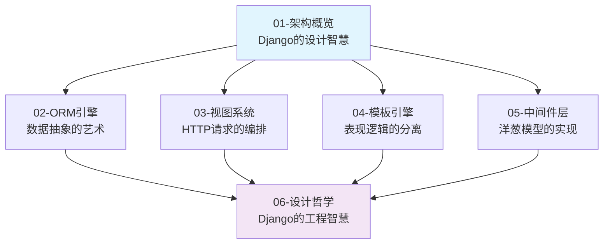

# Django源码深度解析

> 一个完整的Django框架源码分析系列，从架构设计到实现细节的全方位技术探索

## 系列概览

Django作为Python Web开发的旗舰框架，其源码蕴含着深刻的软件工程智慧。本系列采用**Ultra Think**方法论，从批判性思维出发，不仅分析"是什么"，更深入探索"为什么"和"还能怎样"。

### 📚 学习路径

本系列按照**递进式技术叙事**组织，建议按顺序阅读：

### 🎯 分析层次

- **L1 (系统全景)**：整体架构和设计理念 - 10%
- **L2 (架构设计)**：模块协作和数据流 - 30%  
- **L3 (实现细节)**：核心算法和数据结构 - 30%
- **L4 (设计哲学)**：技术选择和权衡思考 - 20%
- **L5 (批判思维)**：改进建议和创新思路 - 10%

### 📖 系列文档

#### 01-架构概览-Django的设计智慧.md
> **核心问题**：Django如何通过MTV架构实现Web应用的优雅抽象？

- Django MTV vs 传统MVC的深度对比
- 核心组件的协作机制分析  
- 约定优于配置的实现策略
- 安全优先的架构设计理念

#### 02-ORM引擎-数据抽象的艺术.md  
> **核心问题**：Django ORM如何平衡抽象性和性能？

- QuerySet的Copy-on-Write实现机制
- Manager系统的描述符协议应用
- Field系统的类型转换和验证机制
- SQL编译器的查询优化策略

#### 03-视图系统-HTTP请求的编排.md
> **核心问题**：Django如何优雅处理HTTP请求/响应循环？

- URL路由的正则匹配与分发机制
- CBV vs FBV的设计权衡分析
- 请求/响应对象的生命周期管理
- 装饰器模式在视图中的应用

#### 04-模板引擎-表现逻辑的分离.md
> **核心问题**：Django模板如何在安全性和灵活性间找到平衡？

- 模板编译和渲染的双阶段架构
- 安全转义机制的实现原理
- 模板标签和过滤器的扩展机制
- 模板继承系统的块覆盖算法

#### 05-中间件层-洋葱模型的实现.md
> **核心问题**：Django中间件如何实现横切关注点的优雅处理？

- 洋葱模型的请求/响应处理机制
- 中间件链的构建和执行流程
- 异常处理和错误传播策略
- 常见中间件的实现模式分析

#### 06-设计哲学-Django的工程智慧.md
> **核心问题**：Django的哪些设计决策值得在其他项目中借鉴？

- 实用主义vs完美主义的工程权衡
- 人本主义技术观的具体体现
- 安全架构设计的创新思路
- Django对Web开发范式的贡献

### 🎨 技术特色

**Ultra Think方法论体现**：
- **批判性分析**：不仅理解实现，更质疑设计决策的合理性
- **多维度思考**：从性能、安全、可维护性等角度综合评估
- **创新性探索**：探讨更好的实现方案和改进空间

**深度源码剖析**：
- **逐行代码分析**：关键算法的源码级解读
- **设计模式识别**：经典模式在框架中的实际应用
- **性能优化洞察**：框架级性能优化技术的学习

**可视化辅助理解**：
- **Mermaid图表**：复杂概念的直观呈现
- **流程图解析**：算法逻辑的可视化表达
- **架构图绘制**：系统结构的清晰展示

### 🚀 学习收益

通过本系列学习，你将获得：

1. **源码级Django理解**：深入掌握Django各模块的实现原理
2. **框架设计思维**：学会分析和评估框架的设计决策  
3. **软件架构能力**：提升大型项目的架构设计水平
4. **性能优化技能**：掌握Web框架级的性能优化技术
5. **批判性思维**：培养对技术方案的深度思考能力

### 📋 阅读建议

- **预备知识**：Python基础、Django使用经验、基本的设计模式了解
- **阅读方式**：建议配合Django源码对照阅读
- **实践建议**：每章读完后尝试实现相关的简化版本
- **讨论交流**：欢迎就技术细节进行深度讨论

---

*让我们开始这场Django源码的深度探索之旅，在技术的海洋中发现设计的智慧！*