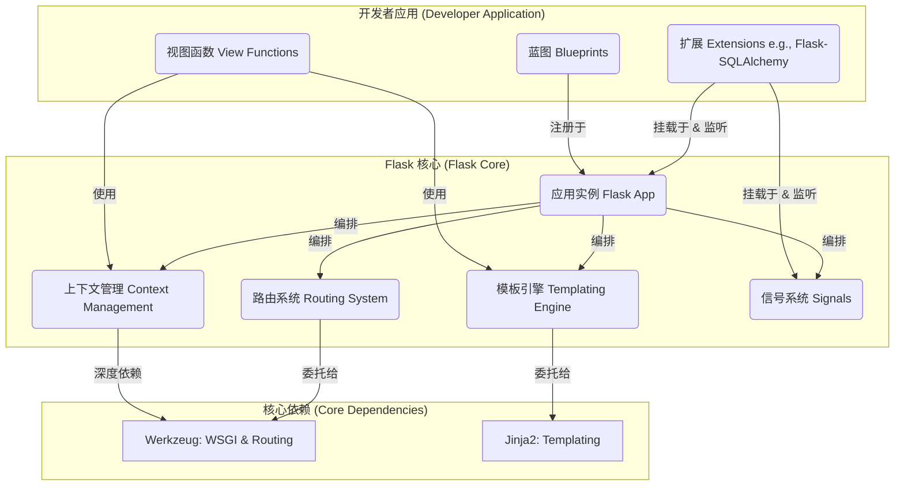

# L1: 系统全景图 - “微”的艺术与代价

## 1. 核心使命与设计哲学

Flask 的使命是为 Web 开发提供一个**简单、灵活且无主见（unopinionated）的基石**。它将“微框架”的哲学发挥到了极致，但这并非仅仅意味着“代码量少”，而是一种深思熟虑的架构宣言，其核心围绕两大原则：

1.  **极简主义与核心专注**：Flask 的核心刻意保持小巧。它只专注于提供一个稳定的 WSGI 应用核心和健壮的请求-响应循环。所有非核心但重要的功能（如ORM、表单验证、身份认证）都被明确地排除在核心之外，交由第三方扩展处理。
2.  **可扩展性为一等公民**：Flask 从设计之初就是为了被扩展。它提供了一套强大的扩展机制（Hooks, Blueprints），使得开发者能够像搭积木一样，自由选择和集成最适合其需求的工具，倡导一种“百家争鸣”的解决方案架构。

这种哲学使得 Flask 成为从简单 API 到高度定制化的复杂 Web 应用的理想选择。

## 2. 系统架构：一个分层的“胶水”框架

Flask 的天才之处不在于它从零创造了什么，而在于它**如何优雅地集成**。它扮演着一个精密的“胶水”层角色，编排着两个强大的底层库（Werkzeug 和 Jinja2），并通过一个极其简洁的 API 将它们的能力暴露给开发者。

**架构分层解析:**

-   **核心依赖 (The Foundation)**:
    -   **Werkzeug**: 提供所有与 WSGI 相关功能的“动力源”，包括请求/响应对象、强大的路由系统以及开发服务器。Flask 是 Werkzeug 功能的“最佳实践封装”。
    -   **Jinja2**: 一个快速、富有表现力且安全的模板引擎。

-   **Flask 核心 (The "Glue")**:
    -   这是 Flask 的心脏（`flask/app.py` 中的 `Flask` 类）。它初始化应用，配置与 Werkzeug 和 Jinja2 的集成，并管理着上下文（Context）、蓝图（Blueprints）和信号（Signals）等核心机制。

-   **开发者应用 (The "Flesh")**:
    -   这里是应用特定逻辑的所在地。开发者通过 Flask 提供的清晰接口（如路由装饰器、模板函数）来构建自己的应用。

## 3. 核心模块识别 (代码-概念映射)

这个概念架构直接反映在 `flask/src/flask/` 的源码结构中：

-   `app.py`: 定义了核心的 `Flask` 类，是应用的主入口和总指挥（B1）。
-   `ctx.py`: 实现了应用上下文和请求上下文的逻辑。这是 `request` 和 `g` 等对象背后的魔法所在（B2）。
-   `routing.py`: 将 Flask 的路由 API (`@app.route`) 与 Werkzeug 底层的路由引擎集成起来（B3）。
-   `templating.py`: 提供了 `render_template` 函数，将应用与 Jinja2 引擎连接起来（B4）。
-   `signals.py`: 定义了基于 Blinker 库的信号，为框架提供了关键的扩展切入点（B5）。
-   `blueprints.py`: 实现了用于模块化应用设计的蓝图功能（A2）。
-   `globals.py`: 定义了像 `request`、`session` 和 `g` 这样全局可用的代理对象。

## 4. Ultra Think: “微”的艺术、代价与智慧

### 4.1 智慧：上下文代理的优雅

Flask 经久不衰的流行源于一个深刻的设计抉择：**它通过其上下文局部代理（context-local proxies），以超凡的优雅解决了无状态协议（HTTP）中的状态管理问题。**

虽然像 `request` 和 `session` 这样的对象看起来像是全局变量，但它们实际上是代理对象，总能解析到当前活动线程（或协程）所对应的那个特定请求的数据。这种设计既提供了全局访问的便利性，又避免了真正全局状态的陷阱，在开发者体验和健壮、可扩展的架构之间取得了完美的平衡。这可以说是 Flask 设计中最才华横溢、最关键的方面。

### 4.2 代价：选择的悖论与责任的转移

“微”和“无主见”是一枚硬币的两面。Flask 赋予开发者极大自由的同时，也带来了相应的代价：

-   **选择的悖论 (Paradox of Choice)**: 对于初学者而言，面对“用哪个ORM？”、“如何组织项目结构？”等一系列开放性问题时，可能会感到不知所措。相比之下，Django 这样“大而全”的框架通过提供“官方唯一推荐”的方式，降低了新手的入门门槛。
-   **责任的转移 (Shift of Responsibility)**: Flask 将许多架构决策的责任从框架设计者转移给了应用开发者。开发者需要自行组合和配置组件，这意味着他们需要具备更高的架构判断力，以确保技术栈的一致性和高质量。一个缺乏经验的团队可能会用 Flask 构建出一个难以维护的“怪物”。

### 4.3 结论：一种哲学而非银弹

Flask 的“微”不是一种技术上的炫耀，而是一种成熟的工程哲学。它相信，对于复杂问题，最好的解决方案往往来自于一系列小而专的工具的有机组合，而非一个庞大、僵化的单体。

它最适合那些**不确定性高、需求易变、需要高度定制化**的项目，以及那些**重视开发者自由和架构掌控力**的团队。选择 Flask，不仅仅是选择一个工具，更是选择一种构建软件的哲学和责任。

---

接下来，我将开始创建全新的 **L2: 请求生命周期** 系列文档，第一篇将是 **`02.1-L2-Request-Entry.md`**，我们将从请求的入口点开始，深入探索 Flask 是如何从原始的 WSGI `environ` 中创建出我们所熟知的 `Request` 对象的。