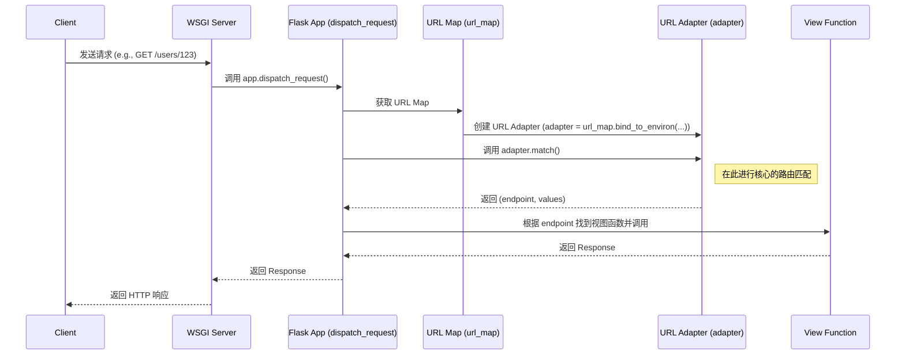

# L2.3: 请求生命周期 - 路由匹配与视图函数定位

当上下文被激活后，`request` 对象已准备就绪。Flask 的下一个核心任务是回答：“这个请求应该由哪个代码块来处理？” 这就是路由系统（Routing System）的职责。本章将深入探讨 Flask 是如何将一个 URL 请求精确地映射到一个特定的视图函数（View Function）上的。

这个过程的核心参与者是 Werkzeug，它为 Flask 提供了强大而灵活的路由功能。

## 1. 核心流程概览

路由匹配发生在 `Flask.dispatch_request()` 方法内部，它委托 `app.url_map` 来执行实际的匹配操作。



## 2. 路由的注册: `@app.route()` 的背后

在 Flask 应用中，最常见的路由定义方式是使用 `@app.route()` 装饰器。

```python
# app.py
from flask import Flask

app = Flask(__name__)

@app.route('/hello')
def hello_world():
    return 'Hello, World!'

@app.route('/users/<int:user_id>')
def show_user_profile(user_id):
    return f'User {user_id}'
```

这个装饰器究竟做了什么？

- **`@app.route()`** 实际上调用了 `app.add_url_rule()` 方法。
- **`add_url_rule(rule, endpoint, view_func, **options)`**: 这是注册路由的核心方法。
    - `rule`: URL 规则字符串，如 `'/users/<int:user_id>'`。
    - `endpoint`: 路由的端点名称。如果未提供，Flask 会默认使用视图函数的名称 (`hello_world`, `show_user_profile`)。Endpoint 是 URL 和视图函数之间的“逻辑名称”。
    - `view_func`: 与此路由关联的视图函数。
- **`Rule` 对象**: `add_url_rule` 方法会创建一个 `werkzeug.routing.Rule` 对象，这个对象封装了所有关于这条路由的信息（URL 模式、端点、支持的 HTTP 方法、参数转换器等）。
- **`app.url_map`**: 创建的 `Rule` 对象被添加到 `app.url_map` 中。`app.url_map` 是一个 `werkzeug.routing.Map` 类的实例，它持有一个所有 `Rule` 对象的列表，是整个路由系统的“注册表”。

## 3. 匹配的核心: `url_adapter.match()`

当请求进入 `dispatch_request` 时，真正的匹配开始了。

1.  **创建 `URL Adapter`**:
    ```python
    # flask/app.py
    def dispatch_request(self):
        req = _request_ctx_stack.top.request
        if req.routing_exception is not None:
            raise req.routing_exception
        rule = req.url_rule
        # ...
    ```
    在 `dispatch_request` 之前，`RequestContext` 在创建时就已经执行了匹配。
    ```python
    # flask/ctx.py
    class RequestContext:
        def __init__(self, app, environ, request=None, session=None):
            # ...
            self.url_adapter = app.create_url_adapter(self.request)
            # ...
            self.match_request()

        def match_request(self):
            try:
                self.request.url_rule, self.request.view_args = \
                    self.url_adapter.match(return_rule=True)
            except HTTPException as e:
                self.request.routing_exception = e
    ```
    - `app.create_url_adapter(request)` 会调用 `app.url_map.bind_to_environ(environ)`。
    - `bind_to_environ` 会创建一个 `MapAdapter` 实例。这个 Adapter 绑定了当前的请求环境（如 `PATH_INFO`, `SERVER_NAME` 等），它是一个“一次性”的对象，专门用于处理当前这一个请求的匹配。

2.  **`MapAdapter.match()` 源码分析**:
    这是 Werkzeug 路由匹配的心脏。它会遍历 `Map` 中所有的 `Rule` 对象。
    ```python
    # werkzeug/routing.py
    class MapAdapter:
        def match(self, path_info=None, method=None, return_rule=False,
                  query_args=None):
            # ...
            for rule in self.map._rules:
                try:
                    # 核心：调用每个 Rule 自己的 match 方法
                    values = rule.match(path, method)
                    if values is not None:
                        if return_rule:
                            return rule, values
                        return rule.endpoint, values
                except RequestRedirect as e:
                    # 处理重定向 (e.g., /path -> /path/)
                    raise
            # 如果循环结束都没有匹配到，则抛出 NotFound 异常
            raise NotFound()
    ```
    - `MapAdapter` 并不亲自做匹配，而是将工作委托给列表中的每一个 `Rule` 对象。
    - `rule.match()` 会使用正则表达式来匹配 `path_info`。Werkzeug 在 `Rule` 对象初始化时，就已经将用户友好的 URL 规则（如 `'/users/<int:user_id>'`）编译成了高效的正则表达式。
    - **动态参数提取**: 如果正则匹配成功，它会从 URL 中提取出动态部分（如 `'123'`），并使用指定的转换器（如 `IntegerConverter`）进行处理。
    - **返回结果**: 匹配成功后，`match()` 返回一个元组 `(endpoint, values)`，其中 `values` 是一个包含了所有动态参数的字典，如 `{'user_id': 123}`。

## 4. Ultra Think: 路由设计的哲学思辨

#### 为什么是“规则列表”而不是“前缀树”？

许多现代 Web 框架（特别是 Go 和 Java 领域的）采用基于前缀树（Trie，或称 Radix Tree）的路由算法，这种算法在理论上具有更优的时间复杂度 O(k)，其中 k 是 URL 的长度。而 Werkzeug 的路由是遍历一个列表，时间复杂度为 O(n)，其中 n 是规则的数量。

那么，为什么 Flask/Werkzeug 选择了这种看似“低效”的方式？

1.  **表达力的胜利**: Werkzeug 的路由系统极其富有表现力。它支持复杂的转换器（converters）、默认值、构建 URL (`url_for`) 等高级功能。例如，你可以定义一个只匹配特定正则表达式的参数 `/<regex("[a-z]{2}"):lang_code>`。这种灵活性是简单的 Trie 结构难以实现的。Trie 路由通常只支持参数捕获和简单的通配符。

2.  **性能的现实**: “理论最优”不等于“实际最快”。对于绝大多数 Web 应用来说，路由规则的数量通常在几十到几百之间，这个规模的 n 非常小。在 n 很小的情况下，遍历列表并执行预编译好的正则表达式的开销，与维护和遍历复杂 Trie 结构的开销相比，可能相差无几，甚至更快。现代 CPU 对线性内存访问（遍历列表）的优化也非常好。

3.  **关注点分离与可扩展性**: Werkzeug 的设计将 `Map`（规则集合）和 `Rule`（单条规则）清晰地分离开。每一条 `Rule` 都是一个自包含的实体，它自己知道如何匹配 URL、如何构建 URL (`build`)。这使得系统非常容易扩展。你可以创建自定义的 `Rule` 子类来实现特殊的匹配逻辑，而无需改动 `Map` 或 `MapAdapter`。

4.  **`url_for` 的反向解析**: Flask 的一个核心优势是 `url_for` 函数，它可以根据 endpoint 和参数动态地构建出正确的 URL。这是“规则列表”设计的直接红利。因为每个 `Rule` 对象都完整地存储了构建 URL 所需的全部信息，反向解析变得非常直接。在 Trie 结构中，实现一个同样功能强大且高效的 `url_for` 会复杂得多。

**结论**: Werkzeug 的路由设计是一个典型的工程权衡案例。它牺牲了理论上的最佳时间复杂度，换取了无与伦比的**表达力、灵活性和强大的反向解析能力**。对于 Web 开发的实际场景而言，这通常是一个非常明智的选择，因为它优化了开发者的体验和框架的功能性，而性能瓶颈在绝大多数应用中几乎不可能出现在路由环节。这体现了 Flask “以开发者为中心”的设计哲学。