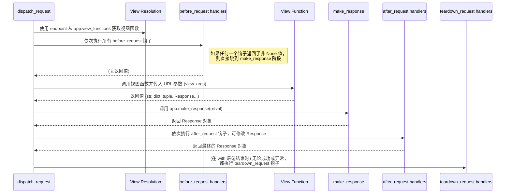

# L2.4: 请求生命周期 - 视图执行与响应生成

路由匹配成功后，Flask 已经拿到了 `endpoint` 和 URL 参数。这是请求生命周期的最后冲刺阶段：执行视图函数，处理其返回值，生成最终的 HTTP 响应，并完成请求的清理工作。本章将解构这一过程，并探讨其背后的设计模式。

## 1. 核心流程概览

整个过程主要围绕 `Flask.dispatch_request()` 和 `Flask.full_dispatch_request()` 展开。



## 2. 从 Endpoint 到视图函数

Flask 如何通过 `endpoint` 找到对应的函数？答案在 `app.view_functions` 字典里。

- **`app.view_functions`**: 这是一个简单的字典，`key` 是 `endpoint` 字符串，`value` 是可调用的视图函数对象。
- **注册时机**: 在调用 `app.add_url_rule(..., view_func=my_view)` 时，Flask 会自动执行 `self.view_functions[endpoint] = view_func`，将端点和函数关联起来。

`dispatch_request` 的核心逻辑如下：

```python
# flask/app.py
def dispatch_request(self):
    req = _request_ctx_stack.top.request
    # ... (前面的路由匹配已在 context 创建时完成)
    rule = req.url_rule
    
    # 从 self.view_functions 字典中查找视图函数
    # 如果 endpoint 是 'static'，则调用特殊的 send_static_file
    return self.ensure_sync(self.view_functions[rule.endpoint])(**req.view_args)
```

## 3. 请求钩子：AOP 的轻量级实现

Flask 的请求钩子（Request Hooks）是其扩展性的基石。它们允许开发者在不修改核心代码的情况下，向请求处理流程中注入自定义逻辑。这是一种面向切面编程（AOP）思想的体现。

- **`@app.before_request`**: 在视图函数执行**之前**运行。常用于：
    - 建立数据库连接并存入 `g` 对象。
    - 检查用户认证状态。
    - 记录请求日志。
    **关键行为**：如果任何一个 `before_request` 函数返回了一个非 `None` 的值，Flask 会立即停止处理，并将这个返回值作为响应内容，跳过后续的 `before_request` 函数和视图函数。

- **`@app.after_request`**: 在视图函数执行**之后**，且其返回值已经被转换成一个 `Response` 对象时运行。常用于：
    - 修改响应头，如添加 `Content-Type`。
    - 对响应内容进行统一格式的包装（例如，封装成 JSON API 格式）。
    - 记录响应信息。
    **关键行为**：每个 `after_request` 函数都必须接收一个 `Response` 对象作为参数，并且**必须返回一个 `Response` 对象**。

- **`@app.teardown_request`**: 在请求上下文被销毁**之前**运行，无论请求处理成功还是失败。常用于：
    - 关闭数据库连接。
    - 释放文件句柄等资源。
    **关键行为**：它接收一个异常对象作为参数（如果请求处理中出现了异常）。它的返回值会被忽略。

## 4. 响应的标准化: `make_response`

视图函数可以返回多种类型的数据，但 HTTP 协议只认识标准的 HTTP 响应。`app.make_response()` 就是连接这两者的桥梁。

```python
# flask/app.py
def make_response(self, rv):
    # ...
    if isinstance(rv, self.response_class):
        return rv  # 如果已经是 Response 对象，直接返回
    if isinstance(rv, (str, bytes, bytearray)):
        return self.response_class(rv) # 字符串直接包装
    if isinstance(rv, dict):
        return self.json.response(rv) # 字典通过 jsonify 转换
    if isinstance(rv, tuple):
        # 元组可以包含 (body, status, headers) 或 (body, status) 或 (body, headers)
        return self.response_class(*rv)
    if rv is None:
        raise ValueError("View function did not return a response.")
    # ... 其他情况，如处理 WSGI app
```

`make_response` 的存在，极大地提升了视图函数的编写体验。开发者可以专注于业务逻辑，返回最自然的数据结构，而将构建 HTTP 响应的繁琐工作交给框架。

## 5. Ultra Think: 钩子机制——微核架构的灵魂

Flask 常被誉为“微框架”，但它的“微”不在于功能的孱弱，而在于其**核心的精简与扩展机制的强大**。请求钩子正是这一哲学的灵魂所在。

1.  **关注点分离 (Separation of Concerns)**: 钩子机制完美地将横切关注点（Cross-Cutting Concerns）与核心业务逻辑分离开。认证、日志、数据库事务管理等逻辑，可以被优雅地安放在 `before_request` 和 `after_request` 钩子中，而视图函数则保持纯粹，只关心它自己的核心职责。这使得代码更易读、更易维护。

2.  **开放/封闭原则 (Open/Closed Principle)**: Flask 的核心请求处理流程是**对修改封闭，对扩展开放**的。你不需要去继承或修改 `Flask` 类本身，就可以通过注册钩子来扩展其行为。这是构建可维护、可扩展软件系统的关键原则。

3.  **插件生态系统的基石**: 几乎所有的 Flask 扩展（Flask-SQLAlchemy, Flask-Login, Flask-Cors 等）都深度依赖请求钩子。例如，`Flask-SQLAlchemy` 在 `teardown_request` 中自动回收数据库会话，`Flask-Login` 在 `before_request` 中加载当前用户。没有钩子机制，Flask 的插件生态将不复存在。

4.  **控制反转 (Inversion of Control)**: 开发者不再需要手动调用认证、日志等函数，而是将这些函数注册到框架中，由框架在适当的时机**回调 (Callback)** 它们。这种控制权的反转，是所有现代框架的共同特征，它简化了应用代码的逻辑，让开发者更专注于业务本身。

**结论**: Flask 的请求钩子看似简单，但它是一种极其强大和优雅的设计模式。它不仅是 AOP 思想的轻量级实现，更是 Flask “微核”架构得以成立的基石。通过钩子，Flask 在保持核心简洁的同时，获得了几乎无限的扩展能力，成功地平衡了简洁性与功能性之间的矛盾。这正是其设计智慧的集中体现。