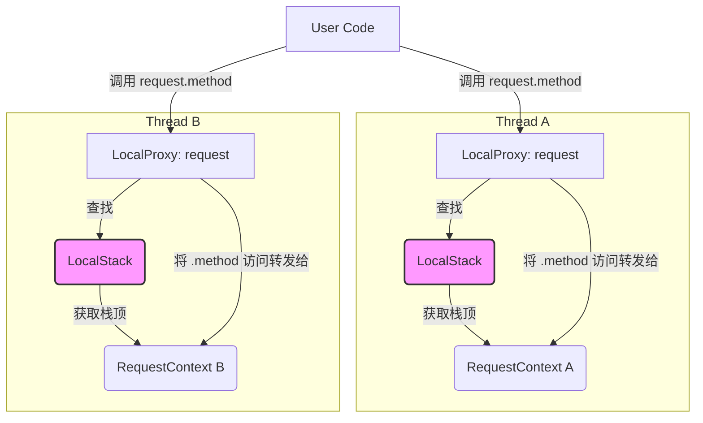

# L3.1: 上下文核心 - LocalProxy 的代理模式解密

在 L2 的探索中，我们看到 `request`、`g`、`current_app` 等对象如同全局变量一样，可以在应用的任何地方被导入和使用，但它们又能神奇地在多线程环境中保持数据隔离。这种“魔法”的根源，就是本章的主角——`werkzeug.local.LocalProxy`。

本章将深入技术底层，彻底揭开 `LocalProxy` 的神秘面纱，理解它如何通过精巧的代理模式，为 Flask 提供了既简洁又线程安全的上下文访问 API。

## 1. 问题：为何需要“代理”？

一个典型的 Web 应用服务器（如 Gunicorn）会使用多个线程或进程来并发处理多个用户请求。假设我们用一个简单的全局变量来存储当前请求的信息：

```python
# 一个天真的实现
current_request = None

def handle_request(request_data):
    global current_request
    current_request = process_request_data(request_data)
    
    # 在应用的深层某个函数调用
    log_user_activity()

def log_user_activity():
    # 直接访问全局变量
    user = current_request.user
    print(f"Logging activity for {user}")
```

当两个请求几乎同时到达时，会发生什么？

1.  **线程 A**: 执行 `handle_request`，将 `current_request` 设置为 `Request_A`。
2.  **线程 B**: 操作系统切换到线程 B，它也执行 `handle_request`，将 `current_request` **覆盖**为 `Request_B`。
3.  **线程 A**: 操作系统切回线程 A，它调用 `log_user_activity`。此时，它读取到的 `current_request` 已经是 `Request_B` 了！

这就是**线程安全**问题。全局变量在并发环境下会造成数据混淆和错乱。我们需要一种机制，使得 `current_request` 这个变量名在所有线程中都可访问，但它在每个线程中指向的对象都不同。这就是 `Thread-Local` 存储模式，而 `LocalProxy` 则是其上的一层优雅封装。

## 2. LocalProxy: 一个聪明的信使

`LocalProxy` 本身不存储任何数据。它像一个信使或接线员，当任何代码尝试访问它时（比如 `request.method`），它会执行一个预先定义好的函数，找到**当前线程**应该持有的那个“真实”对象（比如 `RequestContext` 对象），然后将请求（`.method`）转发给那个真实对象。



如上图所示，用户代码中的 `request` 实际上是 `LocalProxy`。它并不直接处理 `.method` 调用，而是通过 `LocalStack`（一个线程安全的栈结构）找到当前线程对应的 `RequestContext` 对象，再执行 `RequestContext.method`。

## 3. 源码解析：`__getattr__` 的魔力

`LocalProxy` 的魔法核心在于它对 Python 描述符协议的巧妙运用，特别是 `__getattr__` 和其他特殊方法。

```python
# werkzeug/local.py

class LocalProxy:
    __slots__ = ("__local", "__dict__", "__name__", "__wrapped__")

    def __init__(self, local, name=None):
        # local: 一个可调用对象，用于查找真实对象
        # 例如: lambda: _request_ctx_stack.top.request
        object.__setattr__(self, "_LocalProxy__local", local)
        # ...

    def _get_current_object(self):
        """Return the current object.  This is useful if you want
        to pass the object to a function or want to do operations
        that are not supported by the proxy.
        """
        if not hasattr(self.__local, "__release_local__"):
            # 调用 __local() 来获取真实对象
            return self.__local()
        try:
            return self.__local.__get_proxied__()
        except AttributeError:
            raise RuntimeError("no object bound") from None

    # 拦截几乎所有的操作
    @property
    def __dict__(self):
        try:
            return self._get_current_object().__dict__
        except RuntimeError:
            raise AttributeError("__dict__")

    def __getattr__(self, name):
        if name == "__members__":
            return dir(self._get_current_object())
        return getattr(self._get_current_object(), name)

    # ... 同样重载了 __setattr__, __delattr__, __str__, __repr__ 等等
```

- **`__init__(self, local)`**: 构造函数接收一个 `local` 参数，它是一个**可调用对象 (callable)**。在 Flask 中，这个 callable 通常是一个 lambda 函数，其作用是从 `_request_ctx_stack` 或 `_app_ctx_stack` 中取出栈顶的上下文对象。例如，`request` 代理的 `local` 函数就是 `lambda: _request_ctx_stack.top.request`。
- **`_get_current_object(self)`**: 这是代理的核心。它执行 `self.__local()`，即调用初始化时传入的 lambda 函数，从而获得当前线程的真实对象（如 `RequestContext` 实例）。
- **`__getattr__(self, name)`**: 当你执行 `request.method` 时，Python 发现 `request`（一个 `LocalProxy` 实例）本身没有 `method` 属性，于是调用 `__getattr__`。这个方法会：
    1.  调用 `self._get_current_object()` 获取到当前线程的 `RequestContext` 对象。
    2.  使用内置的 `getattr()` 函数，将属性访问 `method` 转发给这个 `RequestContext` 对象。
    3.  返回 `RequestContext.method` 的结果。

通过重载几乎所有的魔术方法（`__setattr__`, `__call__`, `__lt__`, `__add__` 等），`LocalProxy` 使得它自身在行为上与那个“真实对象”几乎一模一样，达到了以假乱真的效果。

## 4. Ultra Think: 代理模式的极致运用与代价

`LocalProxy` 是代理模式（Proxy Pattern）在 Python 中一个教科书级别的、甚至可以说是登峰造极的应用。它解决了线程安全这一棘手问题，并提供了极为简洁的 API。但这种“魔法”并非没有代价。

#### 优点：

1.  **API 的极致简洁 (Decoupling and Simplicity)**: 开发者可以像使用全局变量一样使用 `from flask import request`，而完全无需关心底层的线程隔离和上下文管理。这极大地降低了框架的使用门槛，使得业务代码可以更专注于逻辑本身。代理将“如何找到对象”的复杂性与“如何使用对象”的业务逻辑完全解耦。

2.  **延迟绑定 (Lazy Binding)**: `LocalProxy` 直到被实际访问的那一刻，才会去调用 `_get_current_object()` 查找真实对象。这意味着代理对象 `request` 可以在应用启动时就被创建和导入，但只要没有请求进来，它就不会引发“上下文不存在”的错误。这对于代码的组织和模块化非常有利。

3.  **线程安全保证 (Thread Safety)**: 它从根本上解决了并发环境下的数据污染问题，是 Flask 能够在生产级 WSGI 服务器中稳定运行的基石。

#### 代价与挑战：

1.  **“魔法”的认知成本 (Increased Cognitive Load)**: 对于初学者来说，`request` 的行为是违反直觉的。它看起来像一个普通对象，但 `isinstance(request, Request)` 却可能返回 `False`（因为 `request` 是 `LocalProxy`）。调试时，直接查看 `request` 对象得到的是一个 `LocalProxy` 的描述，而不是真实请求的数据。这种隐蔽的代理层增加了理解和调试的难度，是 Flask 学习曲线中的一个著名“坑”。

2.  **对静态分析不友好 (Challenges for Static Analysis)**: 静态类型检查工具（如 MyPy）很难“看穿”`LocalProxy`。当它们分析 `request.method` 时，它们看到的是 `LocalProxy`，无法直接推断出它代理的是一个 `Request` 对象，因此可能无法提供准确的类型提示和错误检查。虽然现在通过插件和 `typing.TYPE_CHECKING` 有所缓解，但这依然是代理模式带来的固有挑战。

3.  **性能开销 (Performance Overhead)**: 每一次对代理对象的属性访问，都会触发一次函数调用（`_get_current_object()`）和一次 `getattr`。虽然这个开销在现代 Python 中非常小，可以忽略不计，但相比于直接访问一个变量，它在理论上确实存在额外的间接层开销。

**结论**: `LocalProxy` 的设计是 Flask 哲学的一次完美体现——**为了开发者的便利和 API 的优雅，不惜引入一层“魔法”**。它是一个典型的权衡（Trade-off）案例，用一定的认知成本和对工具的挑战，换取了无与伦比的易用性和线程安全的可靠性。理解 `LocalProxy`，不仅是理解 Flask 上下文机制的关键，更是理解现代框架如何通过设计模式来平衡易用性与复杂性的一个绝佳窗口。