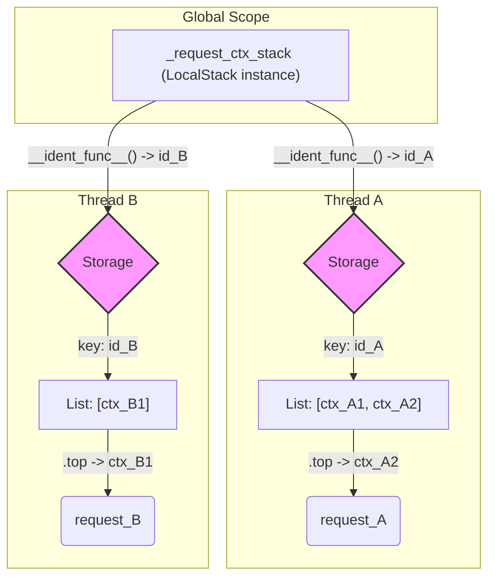

# L3.2: 上下文核心 - 线程本地存储 LocalStack

上一章我们解密了 `LocalProxy` 这个聪明的“信使”，它负责将请求转发给正确的对象。本章我们将探寻这个“正确对象”被存放在哪里。答案是 `werkzeug.local.LocalStack`，一个基于线程本地存储（Thread-Local Storage）技术实现的、为并发环境量身定做的栈结构。

它是 Flask 上下文机制的“保险箱”，确保每个线程都有自己独立的数据空间，互不干扰。

## 1. 一切的基础: `threading.local`

要理解 Werkzeug 的本地存储，必须先了解 Python 标准库中的 `threading.local`。它是一个神奇的类，其实例的属性在每个线程中都是独立的。

```python
import threading
import time

# 创建一个 threading.local 实例
my_data = threading.local()

def worker(thread_id):
    my_data.x = thread_id
    time.sleep(0.1)
    # 每个线程读取到的 my_data.x 都是自己设置的值
    print(f"Thread {thread_id}: my_data.x = {my_data.x}")

threads = []
for i in range(3):
    t = threading.Thread(target=worker, args=(i,))
    threads.append(t)
    t.start()

for t in threads:
    t.join()

# 输出:
# Thread 0: my_data.x = 0
# Thread 1: my_data.x = 1
# Thread 2: my_data.x = 2
```

`my_data` 只有一个实例，但它的属性 `x` 在每个线程中都有一个独立的副本。这就是线程本地存储的核心思想。Werkzeug 正是基于这个原理构建了自己的本地存储系统。

## 2. Werkzeug 的增强: `Local` 与 `__ident_func__`

Werkzeug 并未直接使用 `threading.local`，而是创建了 `werkzeug.local.Local`。它在 `threading.local` 的基础上做了一层封装，主要是为了**兼容 Greenlet**，一种轻量级的并发编程模型（协程）。

```python
# werkzeug/local.py
try:
    from greenlet import getcurrent as get_ident
except ImportError:
    try:
        from _thread import get_ident
    except ImportError:
        from _dummy_thread import get_ident

class Local:
    __slots__ = ("__storage__", "__ident_func__")

    def __init__(self):
        # __storage__ 是一个字典，key 是线程/协程的 ID，value 是存储的数据
        object.__setattr__(self, "__storage__", {})
        # __ident_func__ 是一个函数，用于获取当前线程/协程的唯一标识
        object.__setattr__(self, "__ident_func__", get_ident)

    def __getattr__(self, name):
        try:
            return self.__storage__[self.__ident_func__()][name]
        except KeyError:
            raise AttributeError(name)

    def __setattr__(self, name, value):
        ident = self.__ident_func__()
        storage = self.__storage__
        if ident not in storage:
            storage[ident] = {}
        storage[ident][name] = value
```

- **`__ident_func__`**: 这是 Werkzeug 的关键扩展。它是一个函数，返回当前执行单元的唯一标识。Werkzeug 会优先尝试从 `greenlet` 导入 `getcurrent`，如果失败，则回退到使用线程的 `get_ident`。这使得 `Local` 对象不仅能在多线程环境中工作，也能在基于 Greenlet 的协程环境（如 Gevent）中工作。
- **`__storage__`**: 它是一个普通的字典。`Local` 对象通过 `__ident_func__()` 获取当前线程/协程的 ID，然后用这个 ID 作为 `__storage__` 的 key，来实现数据的隔离存储。

## 3. `LocalStack`: 线程安全的栈

Flask 真正使用的是 `LocalStack`。它继承自 `Local`，但它为每个线程/协程提供的是一个**列表（List）**，并封装了 `push`, `pop`, `top` 等栈操作方法。

```python
# werkzeug/local.py
class LocalStack:
    # ... (初始化与 Local 类似)

    def push(self, obj):
        """Pushes a new item to the stack."""
        # self.stack 访问会触发 Local 的 __getattr__，获取到当前线程的列表
        rv = getattr(self, "stack", None)
        if rv is None:
            self.stack = rv = []
        rv.append(obj)
        return rv

    def pop(self):
        """Removes the topmost item from the stack."""
        stack = getattr(self, "stack", None)
        if stack is None or not stack:
            return None
        return stack.pop()

    @property
    def top(self):
        """The topmost item on the stack."""
        try:
            return self.stack[-1]
        except (AttributeError, IndexError):
            return None
```

`_request_ctx_stack` 和 `_app_ctx_stack` 就是 `LocalStack` 的实例。当调用 `_request_ctx_stack.push(ctx)` 时：
1.  `LocalStack` 内部的 `Local` 机制启动。
2.  它通过 `__ident_func__` 获取当前线程的 ID。
3.  在 `__storage__` 字典中找到该线程对应的那个列表（如果不存在，则创建一个空列表）。
4.  将 `ctx` 对象 `append` 到这个列表的末尾。

由于每个线程操作的都是自己独有的列表，因此 `push`, `pop` 等操作天然就是线程安全的。



## 4. Ultra Think: 为何是“栈”，而非简单的“变量”？

一个自然的问题是：既然 `Local` 已经能实现线程隔离的变量了，为什么 Flask 还需要一个更复杂的 `LocalStack`？只用 `Local` 来存储单个上下文对象不可以吗？

```python
# 设想一个简单的实现
_request_ctx_local = Local()

# 进入上下文
_request_ctx_local.ctx = new_ctx

# 离开上下文
_request_ctx_local.ctx = None
```

这种看似简单的设计，在真实场景中会变得非常脆弱。选择“栈”结构，是 Flask 框架设计深思熟虑的结果，它解决了几个关键问题：

1.  **支持上下文嵌套 (Handling Nested Contexts)**: 这是最核心的原因。在很多场景下，上下文需要嵌套。最典型的例子就是**单元测试**。
    ```python
    with app.test_request_context('/users'):
        # 此处 request.path == '/users'
        # 在一个请求中，模拟另一个请求
        with app.test_request_context('/items'):
            # 此处 request.path == '/items'
        # 退出内层 with 后，上下文必须恢复
        # 此处 request.path 应该恢复为 '/users'
    ```
    如果使用简单的变量覆盖，内层 `with` 退出时，无法知道应该恢复到哪个之前的状态。而“栈”结构完美地解决了这个问题：进入内层 `with` 时 `push` 一个新上下文，退出时 `pop`，外层上下文自然就暴露在了栈顶，状态得以完美恢复。

2.  **保证资源的确定性释放 (Deterministic Resource Management)**: 栈的 `push`/`pop` 操作与 Python 的 `with` 语句（上下文管理器协议 `__enter__`/`__exit__`）是天作之合。Flask 的 `app.request_context()` 返回一个上下文管理器，它在 `__enter__` 时执行 `push`，在 `__exit__` 时执行 `pop`。这确保了**无论 `with` 块内部是否发生异常，上下文的 `pop` 操作一定会被执行**。这是一种健壮的资源管理模式（RAII - Resource Acquisition Is Initialization），避免了上下文泄漏。

3.  **清晰的生命周期管理 (Clear Lifecycle Management)**: 栈结构强制了一种后进先出（LIFO）的生命周期管理模式。这使得上下文的创建和销毁顺序变得清晰、可预测。任何 `push` 操作都必须有一个对应的 `pop` 操作，这种成对出现的约束，大大降低了因忘记清理上下文而导致的 bug。

**结论**: `LocalStack` 并非对 `Local` 的简单功能增强，而是 Flask 框架健壮性的关键设计决策。它通过引入“栈”这一数据结构，优雅地解决了上下文嵌套、资源安全释放和生命周期管理这三大难题。这体现了框架设计者对程序在复杂场景下（如测试、异常处理）稳定性的深刻洞察。它不仅仅是一个线程本地存储，更是一个**带有生命周期和嵌套管理能力的线程本地存储**。