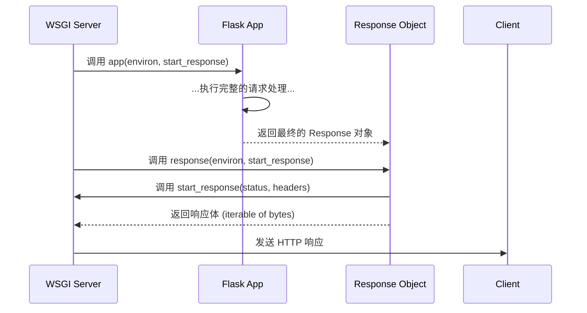

# L4.2: 响应发送与生命周期

> **L4 - 响应处理机制系列 (共2篇)**
> 1. [L4.1: Response 对象的构建与标准化](04.1-L4-Response-Object.md)
> 2. **L4.2: 响应发送与生命周期 (本篇)**

---

## 1. 响应后处理：`after_request` 钩子

在 Flask 将视图函数的返回值通过 `make_response` 标准化为 `Response` 对象之后，但在将其发送给 WSGI 服务器之前，Flask 提供了一个关键的介入点：`after_request` 钩子。这些钩子是注册在 `Flask` 应用实例上的一系列函数，它们会在每个请求成功处理后被调用。

**核心特性:**

*   **接收 `Response` 对象**: 每个 `after_request` 钩子函数都会接收最终的 `Response` 对象作为参数。
*   **必须返回 `Response` 对象**: 钩子函数必须处理传入的 `Response` 对象，并返回一个（可能是修改过的）`Response` 对象。
*   **执行顺序**: 如果注册了多个 `after_request` 钩子，它们会**从最后一个注册的开始，逆序执行**。

**代码示例：添加自定义 HTTP 头部**

```python
from flask import Flask, jsonify

app = Flask(__name__)

@app.after_request
def add_security_headers(response):
    response.headers['X-Content-Type-Options'] = 'nosniff'
    response.headers['X-Frame-Options'] = 'SAMEORIGIN'
    return response

@app.route('/')
def index():
    return jsonify({'status': 'ok'})
```

在这个例子中，无论哪个视图函数被执行，最终的响应都会被 `add_security_headers` 函数拦截，并被添加上额外的安全头部。这是实现全局响应策略（如 CORS、安全头部、日志记录）的理想位置。

## 2. 资源清理：`teardown_request` 钩子

当响应被发送出去后，请求的生命周期即将结束。此时，Flask 会调用 `teardown_request` 钩子。这些钩子的主要职责是执行资源清理工作，无论请求处理过程中是否发生异常。

**核心特性:**

*   **接收异常对象**: `teardown_request` 钩子会接收一个参数，即处理请求时发生的异常对象。如果请求成功，该参数为 `None`。
*   **不修改响应**: `teardown_request` 钩子**不应该**也**不能**修改响应对象。它们的执行发生在响应已经被发送之后。
*   **执行保证**: 无论请求成功与否，`teardown_request` 钩子都会在请求上下文被销毁前执行。

**代码示例：关闭数据库连接**

```python
from flask import Flask, g
import sqlite3

app = Flask(__name__)
DATABASE = '/path/to/database.db'

def get_db():
    db = getattr(g, '_database', None)
    if db is None:
        db = g._database = sqlite3.connect(DATABASE)
    return db

@app.teardown_request
def close_connection(exception):
    db = getattr(g, '_database', None)
    if db is not None:
        db.close()
        print("Database connection closed.")

@app.route('/')
def index():
    cur = get_db().cursor()
    # ... 执行数据库查询 ...
    return '<h1>Data retrieved</h1>'
```

这个例子是 Flask 官方文档中的经典模式。`get_db` 在请求期间按需创建数据库连接并存储在 `g` 对象中。`close_connection` 钩子则确保了在请求结束时，无论是否发生错误，这个数据库连接都会被优雅地关闭，从而避免了资源泄漏。

## 3. 响应发送：与 WSGI 服务器的最终交互

当所有 `after_request` 钩子执行完毕后，Flask 将最终的 `Response` 对象返回给其上层的 WSGI 服务器（如 Gunicorn, uWSGI）。此时，`Response` 对象作为一个可调用对象 (callable) 被执行。

**交互流程:**



1.  WSGI 服务器调用 Flask 应用实例。
2.  Flask 完成路由、视图执行、`make_response` 和 `after_request` 钩子，然后返回一个 `Response` 对象。
3.  WSGI 服务器接收到这个 `Response` 对象，并像调用一个 WSGI 应用一样调用它。
4.  `Response` 对象内部调用服务器传入的 `start_response` 函数，将状态码和头部信息传递给服务器。
5.  `Response` 对象返回一个包含响应体的可迭代对象（通常是包含单个字节串的列表）。
6.  服务器将这些信息组装成一个完整的 HTTP 响应，发送给客户端。
7.  最后，Flask 执行 `teardown_request` 钩子，并销毁请求上下文。

## 4. Ultra Think: 钩子 vs. 中间件 - Flask 与 ASGI/Rack 的哲学分野

Flask 的 `before_request`, `after_request`, `teardown_request` 钩子机制，与许多其他现代框架（如 FastAPI, Ruby on Rails）所采用的**中间件管道 (Middleware Pipeline)** 模型，在设计哲学上存在显著差异。

### Flask 的钩子模型

*   **形态**: 一系列在应用核心处理逻辑的特定切入点（“钩子”）上注册的回调函数。
*   **控制流**: 控制流是固定的。请求进来，执行 `before_request` 钩子，然后是视图，然后是 `after_request` 钩子。钩子本身不能中断或重塑整个流程。
*   **优点**:
    *   **简单直观**: 对于在请求生命周期的特定节点执行通用逻辑（如认证、日志、数据库会话管理），钩子模型非常易于理解和使用。
    *   **低认知负载**: 开发者只需关心在哪个“点”挂载逻辑，而无需理解复杂的调用链。
*   **缺点**:
    *   **灵活性有限**: 钩子无法像中间件那样完全控制请求-响应流。例如，一个 `before_request` 钩子无法捕获视图函数中抛出的异常，也无法在视图执行“之后”再执行某些逻辑（这需要 `after_request`）。

### 中间件管道模型 (ASGI/Rack)

*   **形态**: 一个“洋葱”模型。每个中间件都是一层，它包裹着下一层（可能是另一个中间件，或最终的应用本身）。
*   **控制流**: 每个中间件完全控制何时以及如何调用下一层。它可以在调用下一层之前执行代码，也可以在调用之后执行代码，甚至可以捕获下一层抛出的异常。

```python
# ASGI 中间件伪代码
class MyMiddleware:
    def __init__(self, app):
        self.app = app

    async def __call__(self, scope, receive, send):
        # 在请求到达应用前的逻辑
        print("Middleware: before request")
        try:
            await self.app(scope, receive, send)
        except Exception as e:
            # 捕获应用抛出的异常
            print(f"Middleware: caught exception {e}")
            # 可以返回一个自定义的错误响应
        # 在响应发送回客户端前的逻辑
        print("Middleware: after request")
```

*   **优点**:
    *   **极度灵活和强大**: 中间件提供了对请求-响应周期的完全控制。它可以处理认证、日志、压缩、异常处理、性能监控等几乎所有横切关注点。
    *   **组合性强**: 中间件可以像乐高积木一样被轻松地组合和排序，形成复杂的处理管道。
*   **缺点**:
    *   **较高的认知负载**: 理解“洋葱”模型和每一层的职责需要更多的学习成本。错误的中间件顺序可能导致难以调试的问题。

### 结论：历史的演进与设计的权衡

*   **Flask 的钩子系统**是其作为“微框架”哲学的体现。它提供了一组简单、有效的工具来解决 80% 的常见问题，而没有引入一个复杂的中间件系统的开销。这套设计在 WSGI 的同步世界里工作得非常好，并且对于构建传统的 Web 应用和服务来说，其简洁性依然是一个巨大的优势。

*   **中间件管道**则代表了更现代、更通用的 Web 框架设计思想，尤其是在异步（ASGI）世界里。它提供了无与伦比的灵活性和控制力，是构建需要复杂请求处理逻辑、微服务网关或高度可定制化应用的最佳选择。

这两种模式没有绝对的优劣，它们是不同设计哲学和时代背景下的产物。理解它们的差异，可以帮助我们更深刻地认识到框架设计中的权衡艺术，并为我们自己的项目选择最合适的技术架构。