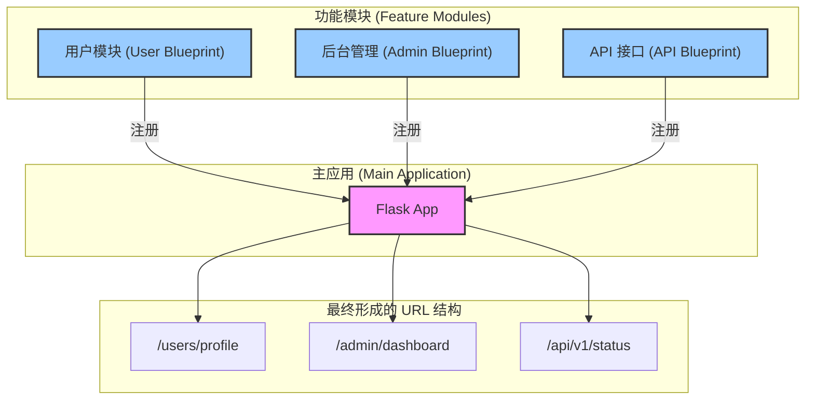

# L5.1: 模块化基石 - 蓝图 Blueprint 的设计哲学

> **L5 - 应用模块化与蓝图系列 (共3篇)**
> 1. **L5.1: 模块化基石 - 蓝图 Blueprint 的设计哲学 (本篇)**
> 2. [L5.2: 蓝图的实现与高级用法](05.2-L5-Blueprint-Advanced.md)
> 3. [L5.3: 蓝图与应用上下文](05.3-L5-Blueprint-Context.md)

---

## 1. 为何需要蓝图？—— 应用增长的烦恼

在 Flask 应用的初期，将所有路由、视图函数和逻辑都放在一个 Python 文件中（例如 `app.py`）是简单快捷的。然而，随着应用功能的不断增加，这种单体文件模式会迅速变得难以维护：

*   **代码臃肿**: 单个文件可能包含成百上千行代码，涵盖用户认证、商品管理、后台面板等多个不同领域的功能。
*   **职责混淆**: 不同的业务逻辑紧密耦合在一起，修改一个功能可能会无意中影响到另一个看似无关的功能。
*   **团队协作困难**: 多名开发者同时修改同一个文件，极易引发代码合并冲突。
*   **可重用性差**: 如果想在另一个项目中复用“用户认证”模块，从这个巨大的文件中剥离相关代码将是一项痛苦的工作。

为了解决这些问题，Flask 引入了 **Blueprint（蓝图）** 的概念。蓝图不是一个可以独立运行的应用，而是一个用于构建或扩展应用的、可重用的**组件蓝图**。

## 2. 蓝图的核心思想：应用的“预制件”

你可以将蓝图想象成建筑工程中的“预制件”或“模块化单元”。一个大型建筑不是逐砖逐瓦在现场搭建的，而是由许多在工厂里预先制造好的模块（如墙体、窗户、楼梯）组合而成。这些预制件本身不是完整的建筑，但它们定义了一部分功能和结构，并且可以被灵活地组装成各种不同的建筑。

在 Flask 中，蓝图扮演着同样的角色：

*   **它是一个功能的集合**: 一个蓝图可以封装一组相关的路由、视图函数、模板、静态文件和错误处理程序。
*   **它不是一个活的应用**: 蓝图知道如何将自己“印”在一个真实的应用上，但它本身无法处理请求。
*   **它可以被多次注册**: 同一个蓝图可以在同一个应用上用不同的 URL 前缀注册多次，实现功能的复用。



## 3. 蓝图的基本使用

创建一个蓝图并将其应用到 Flask 项目中通常分为两步：

**第一步：定义蓝图**

在一个单独的文件中（例如 `views/user.py`），创建一个 `Blueprint` 对象，并像在 `Flask` 应用对象上一样注册路由。

```python
# /views/user.py
from flask import Blueprint, render_template

# 创建一个名为 'user' 的蓝图
# 第一个参数是蓝图的名称，第二个参数是 Python 的模块名或包名
# template_folder 指定该蓝图独立的模板文件夹
user_bp = Blueprint('user', __name__, template_folder='templates')

@user_bp.route('/profile')
def profile():
    # Flask 会自动在 'views/templates/user_profile.html' 中寻找模板
    return render_template('user_profile.html')
```

**第二步：在应用上注册蓝图**

在主应用文件（例如 `app.py`）中，导入蓝图对象并使用 `app.register_blueprint()` 方法将其注册到应用上。

```python
# /app.py
from flask import Flask
from views.user import user_bp

app = Flask(__name__)

# 注册蓝图，并为其添加 URL 前缀
# 现在，user.py 中定义的 /profile 路由会变为 /users/profile
app.register_blueprint(user_bp, url_prefix='/users')

if __name__ == '__main__':
    app.run(debug=True)
```

通过这种方式，我们将用户管理的功能完全封装在了 `user_bp` 这个蓝图中，主应用文件 `app.py` 只负责组装应用，保持了结构的清晰。

## 4. Ultra Think: 蓝图与“分而治之”的设计哲学

Flask 的蓝图机制不仅仅是一个代码组织工具，它深刻地体现了计算机科学中最古老、最强大的设计原则之一：**分而治之 (Divide and Conquer)**。

### 1. 关注点分离 (Separation of Concerns)

蓝图强制开发者将应用按照**功能领域**进行划分。用户管理、支付处理、数据分析等不同的业务逻辑被隔离在各自的蓝图模块中。每个模块都有自己独立的视图、模板甚至静态文件。这正是“关注点分离”原则的完美实践。

*   **高内聚**: 每个蓝图内部的组件都是为了完成一个特定的业务目标而紧密协作的。
*   **低耦合**: 蓝图之间没有直接的依赖关系。它们都只与主应用 `app` 发生交互（通过注册），从而实现了模块间的解耦。

### 2. 命名空间与封装

蓝图通过引入**端点命名空间 (Endpoint Namespace)**，有效地解决了大型应用中可能出现的视图函数命名冲突问题。当你在一个名为 `user` 的蓝图下定义一个 `profile` 视图时，它的端点全名是 `user.profile`。这为 `url_for('user.profile')` 提供了清晰、无歧义的引用路径。

这种封装机制，类似于 Python 的模块系统，是构建可维护的大型系统的基石。它允许开发者在自己的“领地”（蓝图）内自由命名，而不用担心与其他开发者产生冲突。

### 3. 可扩展性的基石

蓝图的设计为 Flask 应用的水平扩展提供了无限可能。一个大型的 Flask 应用可以被看作是一个“微内核”(`Flask` app 对象)加上一系列可插拔的功能插件（蓝图）。

*   **可插拔性**: 想要添加一个新功能？只需创建一个新的蓝图并注册它。想要移除一个旧功能？只需在主应用中注销对应的蓝图即可。这使得应用的功能组合变得极其灵活。
*   **与微服务的关系**: 虽然蓝图运行在同一个进程中，与独立部署的微服务不同，但它在**代码组织层面**实现了类似微服务的理念。每个蓝图都可以被看作一个“内部微服务”，它有清晰的边界和独立的职责。对于许多中小型项目而言，这种“单体优先 (Monolith First)”但内部模块化的架构，是在过度设计（直接上微服务）和混乱（单体大泥球）之间的一个完美平衡点。

### 结论

Flask 的蓝图远不止是“另一个组织代码的方式”。它是一种架构模式，一种将复杂问题分解为简单、独立、可管理子问题的思维方式。通过强制性的模块化和命名空间封装，蓝图引导开发者自然而然地写出更清晰、更健壮、更易于扩展的代码。掌握蓝图的设计哲学，是从“会用 Flask”到“精通 Flask 架构”的关键一步。