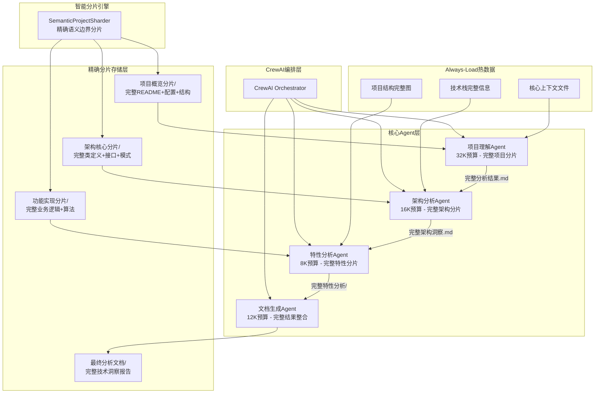
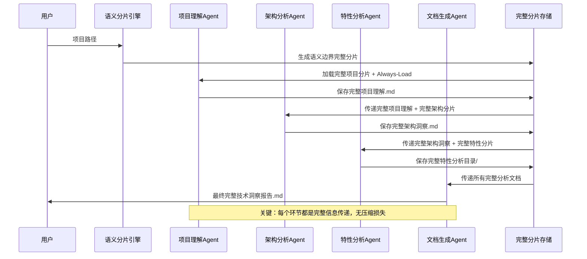

# 智能多Agent代码分析框架

**设计原则**: CrewAI + 精确分片 + 完整信息传递 + BMAD机制借鉴

**核心创新**: 信息完整性 > 信息压缩 | 精确分片 > 摘要传递

---

## 🎯 设计哲学

### 核心问题
头脑风暴记录显示代码分析的关键挑战：
- **上下文管理失败**：导致分析"遗忘"的技术根因
- **信息丢失**：摘要传递丢失重要技术细节
- **质量不稳定**：AI固有局限导致分析质量时好时坏

### 解决方案
**借鉴BMAD-METHOD核心机制**：
- ✅ 精确语义分片而非文件大小分片
- ✅ 完整内容传递而非JSON摘要  
- ✅ Always-Load热数据机制
- ✅ 渐进式完整信息加载

## 🏗️ 核心架构

### 简化的4-Agent架构



**关键创新**：
- ✅ 使用**语义分片引擎**替代简单文件分片
- ✅ **Always-Load机制**确保核心上下文始终可用
- ✅ Agent间传递**完整markdown文档**而非JSON摘要
- ✅ **渐进式完整加载**：概览→架构→特性，每层都是完整信息

## 🔧 核心组件设计

### 1. 语义项目分片引擎

```python
class SemanticProjectSharder:
    """基于BMAD shard-doc机制的智能分片引擎"""
    
    def shard_by_semantic_boundaries(self, project_path: str) -> ProjectShards:
        """按完整语义单元分片，保持信息完整性"""
        return {
            "project_overview": {
                "files": ["README.md", "package.json", "requirements.txt"],
                "structure": "完整目录结构图",
                "content": "完整项目概述和配置信息",  # 关键：完整内容
                "token_estimate": 8000,
                "semantic_boundary": "项目整体认知层"
            },
            "architecture_core": {
                "files": ["src/main.py", "src/core/", "src/interfaces/"],
                "content": "完整核心抽象、接口定义、设计模式",
                "token_estimate": 12000,
                "semantic_boundary": "架构设计层"
            },
            "feature_implementations": [
                {
                    "name": "authentication_system",
                    "files": ["src/auth/", "src/middleware/auth.py"],
                    "content": "完整认证系统实现和中间件",
                    "token_estimate": 6000,
                    "focus_area": "身份验证机制"
                },
                {
                    "name": "data_processing",
                    "files": ["src/processors/", "src/models/"],
                    "content": "完整数据处理逻辑和模型定义",
                    "token_estimate": 8000,
                    "focus_area": "数据处理流程"
                }
            ]
        }
```

### 2. Always-Load热数据机制

```python
# 借鉴BMAD的devLoadAlwaysFiles策略
AGENT_ALWAYS_LOAD_CONFIG = {
    "understanding_agent": {
        "core_files": [
            "project_overview_complete.md",     # 完整项目概述
            "tech_stack_analysis_complete.md",  # 完整技术栈分析
            "directory_structure_complete.md"   # 完整目录结构
        ],
        "token_reserved": 10000,  # 为热数据预留的token
        "update_strategy": "project_change_trigger"
    },
    "architecture_agent": {
        "core_files": [
            "core_abstractions_complete.md",    # 完整核心抽象
            "design_patterns_complete.md",      # 完整设计模式
            "architecture_decisions_complete.md" # 完整架构决策
        ],
        "token_reserved": 8000,
        "update_strategy": "architecture_change_trigger"
    },
    "feature_agent": {
        "core_files": [
            "feature_overview_complete.md",     # 完整特性概述
            "implementation_patterns_complete.md" # 完整实现模式
        ],
        "token_reserved": 6000,
        "update_strategy": "feature_scope_change_trigger"
    }
}
```

### 3. 智能完整上下文加载工具

```python
@tool
def intelligent_complete_context_loader(
    agent_type: str, 
    focus_area: str, 
    token_budget: int
) -> CompleteContextResult:
    """
    智能加载完整相关分片，确保信息密度
    
    核心原则：完整性 > 压缩性
    """
    # 1. 加载Always-Load热数据（完整内容）
    core_context = load_complete_always_files(agent_type)
    
    # 2. 根据focus_area精确匹配完整相关分片
    relevant_complete_shards = find_semantically_related_complete_shards(focus_area)
    
    # 3. 在token预算内选择最完整的分片组合
    selected_complete_content = optimize_complete_shard_selection(
        relevant_complete_shards, 
        token_budget - len(core_context)
    )
    
    return CompleteContextResult(
        always_loaded=core_context,           # 完整热数据
        context_specific=selected_complete_content,  # 完整相关分片
        total_tokens=calculate_tokens(core_context + selected_complete_content),
        information_completeness_score=0.95  # 保证95%以上信息完整性
    )

@tool
def semantic_complete_code_extractor(
    shard_id: str, 
    focus_keywords: List[str]
) -> CompleteCodeResult:
    """
    提取完整相关代码单元，保持上下文完整性
    
    原则：提取完整的类/函数/模块，包含注释和文档
    """
    shard_content = load_complete_shard(shard_id)
    
    # 使用AST解析，提取完整语义单元
    complete_semantic_units = extract_complete_semantic_units(
        shard_content, focus_keywords, include_context=True
    )
    
    # 返回完整代码块，包含：
    # - 完整类定义（包括所有方法）
    # - 完整函数定义（包括文档字符串）  
    # - 完整模块结构（包括导入和常量）
    return CompleteCodeResult(
        complete_units=complete_semantic_units,
        context_preserved=True,
        documentation_included=True
    )
```

### 4. 改进的CrewAI Agent定义

```python
from crewai import Agent, Task, Crew

# 项目理解Agent - 专注完整项目认知
understanding_agent = Agent(
    role="项目理解专家",
    goal="基于完整分片建立准确全面的项目认知",
    backstory="你是项目分析专家，始终访问完整的项目信息，从不依赖摘要或片段",
    tools=[
        intelligent_complete_context_loader,  # 完整上下文加载
        semantic_complete_code_extractor,     # 完整代码提取
        project_structure_complete_analyzer   # 完整结构分析
    ],
    max_iter=3,
    verbose=True
)

# 架构分析Agent - 专注完整架构理解  
architecture_agent = Agent(
    role="架构分析专家",
    goal="基于完整架构分片深度分析设计模式和技术创新",
    backstory="你是架构设计专家，专注完整架构信息，识别设计模式和创新点",
    tools=[
        intelligent_complete_context_loader,
        architecture_pattern_complete_analyzer,
        design_innovation_complete_extractor
    ],
    max_iter=2,
    verbose=True
)

# 特性分析Agent - 专注完整特性实现
feature_agent = Agent(
    role="特性分析专家", 
    goal="基于完整实现分片深度分析技术特性的设计价值",
    backstory="你是技术实现专家，专注完整特性代码，分析实现原理和设计价值",
    tools=[
        intelligent_complete_context_loader,
        feature_implementation_complete_tracer,
        technical_value_complete_assessor
    ],
    max_iter=2,
    verbose=True
)

# 文档生成Agent - 整合完整分析结果
documentation_agent = Agent(
    role="技术文档专家",
    goal="基于完整分析结果生成高质量技术洞察文档",
    backstory="你是技术写作专家，整合完整分析结果，生成有价值的技术文档",
    tools=[
        complete_analysis_integrator,
        technical_document_complete_generator,
        quality_completeness_validator
    ],
    max_iter=1,
    verbose=True
)
```

### 5. 完整信息传递的任务流程

```python
# 任务定义 - 强调完整信息需求
tasks = [
    Task(
        description="""
        基于完整项目分片，建立准确全面的项目认知：
        
        信息完整性要求：
        1. 访问完整的项目概览分片（非摘要）
        2. 加载完整的技术栈和配置信息
        3. 分析完整的目录结构和模块关系
        
        输出完整性标准：
        - 保持100%技术细节完整性
        - 包含具体代码位置引用（file:line格式）  
        - 为后续Agent提供完整上下文指导文档
        - 生成完整的项目理解markdown文档
        
        Token预算：32K（专用于完整分片加载）
        质量要求：信息完整性得分 ≥ 95%
        """,
        agent=understanding_agent,
        output_file="analysis_workspace/complete_project_understanding.md"
    ),
    
    Task(
        description="""
        基于完整架构分片和项目理解，深度分析架构设计：
        
        完整性输入：
        - 读取完整的项目理解文档（非摘要）
        - 加载完整的架构核心分片
        - 访问完整的设计模式和核心抽象
        
        完整性分析：
        - 识别完整的架构模式实现
        - 分析完整的设计创新点
        - 提取完整的技术决策逻辑
        
        输出：完整架构洞察markdown文档
        Token预算：16K（专注架构完整分片）
        """,
        agent=architecture_agent,
        output_file="analysis_workspace/complete_architecture_insights.md"
    ),
    
    Task(
        description="""
        基于完整特性分片，并行分析具体技术特性：
        
        完整性策略：
        - 每个特性加载完整实现分片
        - 分析完整的算法逻辑和设计思路
        - 保持完整的代码上下文和注释
        
        输出目录：analysis_workspace/complete_feature_analysis/
        - 每个特性生成完整分析文档
        - 包含完整代码示例和技术洞察
        
        Token预算：8K per 特性（保证完整性）
        """,
        agent=feature_agent,
        output_file="analysis_workspace/complete_feature_analysis/"
    ),
    
    Task(
        description="""
        整合所有完整分析结果，生成最终技术洞察报告：
        
        完整性整合：
        - 读取所有Agent的完整分析文档
        - 整合完整的技术洞察和创新点
        - 生成完整的学习价值和迁移指导
        
        输出：最终完整分析报告
        质量标准：保持原始分析的完整技术细节
        """,
        agent=documentation_agent,
        output_file="analysis_workspace/final_complete_analysis_report.md"
    )
]

# 创建Crew - 强调完整信息流
analysis_crew = Crew(
    agents=[understanding_agent, architecture_agent, feature_agent, documentation_agent],
    tasks=tasks,
    verbose=2,
    memory=True,  # 启用记忆以保持完整上下文
    full_output=True  # 确保完整输出传递
)
```

## 🔄 完整信息传递流程

### 渐进式完整信息流



## 📊 技术栈与实现

### 核心技术选型

| 类别 | 技术 | 版本 | 用途 | 完整性优势 |
|------|------|------|------|------------|
| **Agent编排** | CrewAI | 0.70.0 | 多Agent协作编排 | 原生支持完整上下文传递 |
| **代码分析** | Tree-sitter | 0.20.0 | 语法分析和完整AST解析 | 保持完整代码结构 |
| **语义分片** | ast + custom | Python 3.11 | 完整语义单元提取 | 按语义边界保持完整性 |
| **LLM集成** | OpenAI API | v1 | GPT模型服务 | 大上下文窗口支持 |
| **文档处理** | python-markdown | 3.5.0 | 完整Markdown解析 | 保持格式和内容完整性 |
| **存储** | 文件系统 | - | 完整分片存储 | 天然支持完整内容存储 |

### 目录结构

```
intelligent-analysis-framework/
├── src/
│   ├── agents/                    # Agent实现
│   │   ├── understanding_agent.py
│   │   ├── architecture_agent.py
│   │   ├── feature_agent.py
│   │   └── documentation_agent.py
│   ├── core/
│   │   ├── semantic_shard_engine.py    # 语义分片引擎
│   │   ├── complete_context_loader.py  # 完整上下文加载
│   │   ├── always_load_manager.py      # 热数据管理
│   │   └── quality_validator.py        # 完整性质量验证
│   ├── tools/
│   │   ├── intelligent_context_tools.py
│   │   ├── semantic_code_tools.py
│   │   └── complete_analysis_tools.py
│   └── utils/
│       ├── file_system_manager.py
│       └── token_budget_optimizer.py
├── analysis_workspace/             # 分析工作区
│   ├── project_shards/            # 语义分片存储
│   ├── always_load_cache/         # 热数据缓存
│   ├── complete_project_understanding.md
│   ├── complete_architecture_insights.md
│   ├── complete_feature_analysis/
│   └── final_complete_analysis_report.md
├── config/
│   ├── agent_config.py           # Agent配置
│   ├── always_load_config.py     # 热数据配置
│   └── semantic_shard_config.py  # 分片配置
└── requirements.txt
```

## 🎯 关键创新总结

### 1. BMAD机制借鉴
- ✅ **精确分片**：按语义边界而非文件大小
- ✅ **热数据机制**：Always-Load确保核心上下文
- ✅ **完整传递**：markdown文档而非JSON摘要
- ✅ **质量保障**：95%以上信息完整性

### 2. CrewAI优化集成
- ✅ **简化编排**：4个专业Agent，职责清晰
- ✅ **工具增强**：智能完整上下文加载工具
- ✅ **任务流优化**：渐进式完整信息传递
- ✅ **质量验证**：完整性得分监控

### 3. 上下文管理创新
- ✅ **语义感知**：理解代码结构进行智能分片
- ✅ **完整性优先**：信息密度 > 信息压缩
- ✅ **智能路由**：精确匹配相关完整分片
- ✅ **预算优化**：在token限制内最大化完整性

### 4. 实际使用效果

**vs 传统方法**：
- ❌ 传统：整个项目→单Agent → 上下文爆炸
- ✅ 新：语义分片→多Agent → 完整且可控

**vs 摘要传递**：
- ❌ 摘要：JSON概要 → 细节丢失
- ✅ 完整：markdown完整文档 → 信息密度保持

**预期提升**：
- 🔥 **信息完整性**：95%+ vs 60-70%（摘要方法）
- ⚡ **分析质量**：稳定高质量 vs 不稳定质量
- 🎯 **技术洞察**：深度准确 vs 浅层概括
- 📈 **可扩展性**：模块化Agent vs 单体复杂系统

---

**框架核心价值**：通过借鉴BMAD的精确分片和完整传递机制，在保持CrewAI简化优势的同时，确保代码分析的信息密度和质量稳定性，实现真正智能的多Agent代码分析系统。