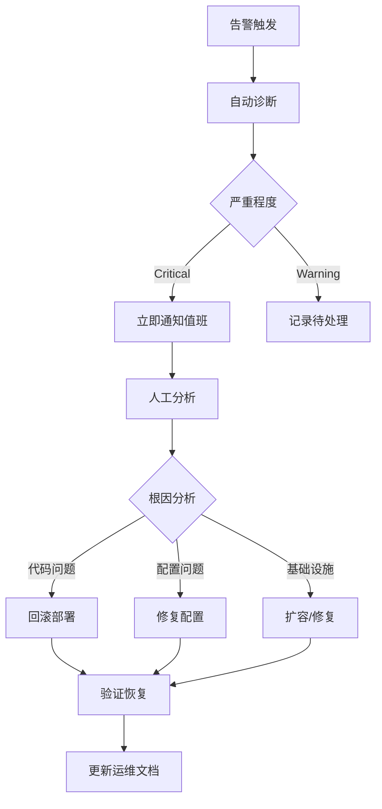

# LangGraph 企业级部署与运维实践

## 🏭 生产部署架构设计

### 企业级部署拓扑

```yaml
# 典型的LangGraph生产部署架构
┌─────────────────────────────────────────────────────────┐
│                   负载均衡层                              │
│ Nginx/Kong + SSL终端 + 限流 + 健康检查                    │
├─────────────────────────────────────────────────────────┤
│                 应用服务层                               │
│ LangGraph应用实例 × N (Docker + Kubernetes)             │
│ - 自动扩缩容 (HPA)                                       │
│ - 滚动更新部署                                           │
│ - 资源限制与监控                                         │
├─────────────────────────────────────────────────────────┤
│                 状态存储层                               │
│ PostgreSQL集群 (主从复制 + 连接池)                       │
│ Redis集群 (分片 + 哨兵模式)                             │
│ 对象存储 S3/MinIO (checkpoint文件)                       │
├─────────────────────────────────────────────────────────┤
│                监控观察层                                │
│ Prometheus + Grafana + AlertManager                    │
│ ELK/EFK Stack (日志聚合)                                │
│ Jaeger/Zipkin (分布式链路追踪)                          │
└─────────────────────────────────────────────────────────┘
```

### Kubernetes部署清单

```yaml
# langgraph-deployment.yaml
apiVersion: apps/v1
kind: Deployment
metadata:
  name: langgraph-app
  labels:
    app: langgraph
spec:
  replicas: 3
  strategy:
    type: RollingUpdate
    rollingUpdate:
      maxSurge: 1
      maxUnavailable: 1
  selector:
    matchLabels:
      app: langgraph
  template:
    metadata:
      labels:
        app: langgraph
    spec:
      containers:
      - name: langgraph
        image: langgraph-app:latest
        ports:
        - containerPort: 8000
        env:
        - name: DATABASE_URL
          valueFrom:
            secretKeyRef:
              name: langgraph-secrets
              key: database-url
        - name: REDIS_URL
          valueFrom:
            secretKeyRef:
              name: langgraph-secrets
              key: redis-url
        resources:
          requests:
            memory: "512Mi"
            cpu: "500m"
          limits:
            memory: "2Gi" 
            cpu: "2000m"
        livenessProbe:
          httpGet:
            path: /health
            port: 8000
          initialDelaySeconds: 30
          periodSeconds: 10
        readinessProbe:
          httpGet:
            path: /ready
            port: 8000
          initialDelaySeconds: 5
          periodSeconds: 5
        volumeMounts:
        - name: config
          mountPath: /app/config
      volumes:
      - name: config
        configMap:
          name: langgraph-config
---
apiVersion: v1
kind: Service
metadata:
  name: langgraph-service
spec:
  selector:
    app: langgraph
  ports:
  - port: 80
    targetPort: 8000
  type: LoadBalancer
---
apiVersion: autoscaling/v2
kind: HorizontalPodAutoscaler
metadata:
  name: langgraph-hpa
spec:
  scaleTargetRef:
    apiVersion: apps/v1
    kind: Deployment
    name: langgraph-app
  minReplicas: 3
  maxReplicas: 20
  metrics:
  - type: Resource
    resource:
      name: cpu
      target:
        type: Utilization
        averageUtilization: 70
  - type: Resource
    resource:
      name: memory
      target:
        type: Utilization
        averageUtilization: 80
```

## 📊 性能监控与指标体系

### 核心监控指标

#### 1. 应用性能指标 (APM)

```python
# 集成Prometheus指标收集
from prometheus_client import Counter, Histogram, Gauge, start_http_server

# LangGraph核心指标
GRAPH_EXECUTION_TOTAL = Counter(
    'langgraph_executions_total',
    'Total graph executions', 
    ['graph_name', 'status']
)

GRAPH_EXECUTION_DURATION = Histogram(
    'langgraph_execution_duration_seconds',
    'Graph execution duration',
    ['graph_name']
)

ACTIVE_GRAPHS = Gauge(
    'langgraph_active_graphs',
    'Currently active graph executions'
)

CHECKPOINT_SAVES_TOTAL = Counter(
    'langgraph_checkpoint_saves_total',
    'Total checkpoint saves',
    ['backend_type', 'status']
)

NODE_EXECUTION_DURATION = Histogram(
    'langgraph_node_execution_seconds',
    'Node execution duration',
    ['graph_name', 'node_name']
)

# 中断和重试指标
INTERRUPTS_TOTAL = Counter(
    'langgraph_interrupts_total',
    'Total graph interrupts',
    ['graph_name', 'node_name', 'reason']
)

RETRIES_TOTAL = Counter(
    'langgraph_retries_total',
    'Total node retries',
    ['graph_name', 'node_name', 'exception_type']
)
```

#### 2. 基础设施指标

```yaml
# Prometheus采集配置
- job_name: 'langgraph-app'
  static_configs:
  - targets: ['langgraph-service:8000']
  metrics_path: '/metrics'
  scrape_interval: 30s
  
# 关键指标
- 系统资源使用率 (CPU、内存、磁盘、网络)
- 数据库连接池状态
- Redis连接和命中率
- HTTP请求响应时间分布
- 错误率和5xx状态码
- 垃圾回收频率和暂停时间
```

### Grafana仪表板设计

```json
{
  "dashboard": {
    "title": "LangGraph Production Monitoring",
    "panels": [
      {
        "title": "Graph Execution Rate",
        "type": "graph",
        "targets": [
          {
            "expr": "rate(langgraph_executions_total[5m])",
            "legendFormat": "{{graph_name}} - {{status}}"
          }
        ]
      },
      {
        "title": "Execution Duration P95",
        "type": "graph", 
        "targets": [
          {
            "expr": "histogram_quantile(0.95, langgraph_execution_duration_seconds_bucket)",
            "legendFormat": "{{graph_name}} P95"
          }
        ]
      },
      {
        "title": "Active Graphs",
        "type": "singlestat",
        "targets": [
          {
            "expr": "langgraph_active_graphs",
            "legendFormat": "Active"
          }
        ]
      },
      {
        "title": "Error Rate",
        "type": "graph",
        "targets": [
          {
            "expr": "rate(langgraph_executions_total{status=\"error\"}[5m]) / rate(langgraph_executions_total[5m])",
            "legendFormat": "Error Rate %"
          }
        ]
      }
    ]
  }
}
```

## 🚨 告警和故障响应

### 告警规则配置

```yaml
# alerting-rules.yml
groups:
- name: langgraph
  rules:
  - alert: LangGraphHighErrorRate
    expr: |
      (
        rate(langgraph_executions_total{status="error"}[5m]) / 
        rate(langgraph_executions_total[5m])
      ) > 0.05
    for: 2m
    labels:
      severity: critical
    annotations:
      summary: "LangGraph error rate is above 5%"
      description: "Error rate is {{ $value | humanizePercentage }}"
      
  - alert: LangGraphHighLatency
    expr: |
      histogram_quantile(0.95, 
        rate(langgraph_execution_duration_seconds_bucket[5m])
      ) > 30
    for: 5m
    labels:
      severity: warning
    annotations:
      summary: "LangGraph execution latency is high"
      description: "P95 latency is {{ $value }}s"
      
  - alert: LangGraphCheckpointFailures
    expr: |
      rate(langgraph_checkpoint_saves_total{status="error"}[5m]) > 0.1
    for: 1m
    labels:
      severity: critical
    annotations:
      summary: "High checkpoint save failure rate"
      description: "Checkpoint failures: {{ $value }}/sec"
      
  - alert: LangGraphDatabaseConnections
    expr: |
      postgres_connections_active / postgres_connections_max > 0.8
    for: 2m
    labels:
      severity: warning
    annotations:
      summary: "Database connection pool nearly exhausted"
```

### 故障响应流程

#### 1. 自动化响应

```python
# 自动故障恢复脚本
class AutoRecoveryHandler:
    def __init__(self):
        self.recovery_strategies = {
            'high_error_rate': self.handle_high_error_rate,
            'high_latency': self.handle_high_latency,
            'checkpoint_failures': self.handle_checkpoint_failures,
            'resource_exhaustion': self.handle_resource_exhaustion
        }
    
    def handle_high_error_rate(self, alert_data):
        """高错误率处理"""
        # 1. 检查是否为特定图的问题
        problem_graph = self.identify_problem_graph()
        
        # 2. 暂时禁用问题图
        if problem_graph:
            self.disable_graph(problem_graph)
            self.notify_oncall("Disabled graph: " + problem_graph)
        
        # 3. 检查依赖服务状态
        self.check_dependencies()
        
        # 4. 触发健康检查
        self.trigger_health_checks()
    
    def handle_checkpoint_failures(self, alert_data):
        """检查点失败处理"""
        # 1. 检查存储后端状态
        backend_status = self.check_storage_backends()
        
        # 2. 尝试切换到备用存储
        if not backend_status['primary']:
            self.switch_to_backup_storage()
        
        # 3. 清理损坏的检查点
        self.cleanup_corrupted_checkpoints()
```

#### 2. 人工介入流程



## 🔍 日志管理与分析

### 结构化日志设计

```python
# 标准化的LangGraph日志格式
import structlog
import json
from datetime import datetime

logger = structlog.get_logger("langgraph")

class LangGraphLogger:
    def __init__(self, graph_name: str, execution_id: str):
        self.graph_name = graph_name
        self.execution_id = execution_id
        self.logger = logger.bind(
            graph_name=graph_name,
            execution_id=execution_id
        )
    
    def log_graph_start(self, input_data):
        self.logger.info(
            "graph_execution_started",
            event_type="graph_start",
            input_size=len(str(input_data)),
            timestamp=datetime.utcnow().isoformat()
        )
    
    def log_node_execution(self, node_name: str, duration: float, status: str):
        self.logger.info(
            "node_executed",
            event_type="node_execution",
            node_name=node_name,
            duration=duration,
            status=status,
            timestamp=datetime.utcnow().isoformat()
        )
    
    def log_checkpoint_save(self, checkpoint_id: str, backend: str, success: bool):
        self.logger.info(
            "checkpoint_saved",
            event_type="checkpoint",
            checkpoint_id=checkpoint_id,
            backend=backend,
            success=success,
            timestamp=datetime.utcnow().isoformat()
        )
    
    def log_interrupt(self, node_name: str, reason: str, context: dict):
        self.logger.warning(
            "graph_interrupted", 
            event_type="interrupt",
            node_name=node_name,
            reason=reason,
            context=context,
            timestamp=datetime.utcnow().isoformat()
        )
```

### ELK Stack集成

```yaml
# logstash配置
input {
  beats {
    port => 5044
  }
}

filter {
  if [fields][app] == "langgraph" {
    json {
      source => "message"
    }
    
    date {
      match => [ "timestamp", "ISO8601" ]
    }
    
    # 提取关键字段
    mutate {
      add_field => { "app_name" => "langgraph" }
      add_field => { "environment" => "%{[fields][env]}" }
    }
    
    # 错误级别映射
    if [event_type] == "error" {
      mutate {
        add_tag => [ "error" ]
        add_field => { "alert_needed" => "true" }
      }
    }
  }
}

output {
  elasticsearch {
    hosts => ["elasticsearch:9200"]
    index => "langgraph-%{+YYYY.MM.dd}"
  }
}
```

## 🔧 调试与故障排查

### 本地调试工具

```python
# LangGraph调试工具集
class LangGraphDebugger:
    def __init__(self, graph):
        self.graph = graph
        self.execution_trace = []
        
    def enable_debug_mode(self):
        """启用详细调试模式"""
        # 添加调试中间件
        self.graph.add_middleware(self.debug_middleware)
        
        # 启用状态快照
        self.graph.enable_state_snapshots()
        
        # 设置断点支持
        self.graph.enable_breakpoints()
    
    def debug_middleware(self, node_name, input_state, output_state):
        """调试中间件"""
        trace_entry = {
            'timestamp': datetime.utcnow(),
            'node_name': node_name,
            'input_state': self.sanitize_state(input_state),
            'output_state': self.sanitize_state(output_state),
            'memory_usage': self.get_memory_usage(),
            'execution_time': self.measure_execution_time()
        }
        self.execution_trace.append(trace_entry)
    
    def export_debug_report(self, filename: str):
        """导出调试报告"""
        report = {
            'graph_structure': self.analyze_graph_structure(),
            'execution_trace': self.execution_trace,
            'performance_analysis': self.analyze_performance(),
            'state_evolution': self.track_state_changes(),
            'error_analysis': self.analyze_errors()
        }
        
        with open(filename, 'w') as f:
            json.dump(report, f, indent=2, default=str)
```

### 生产故障排查清单

#### 快速诊断步骤

1. **检查系统指标**
   ```bash
   # 检查应用状态
   kubectl get pods -l app=langgraph
   kubectl logs -l app=langgraph --tail=100
   
   # 检查资源使用
   kubectl top pods -l app=langgraph
   kubectl describe hpa langgraph-hpa
   ```

2. **检查关键服务**
   ```bash
   # 数据库连接
   psql $DATABASE_URL -c "SELECT count(*) FROM pg_stat_activity;"
   
   # Redis状态
   redis-cli -u $REDIS_URL ping
   redis-cli -u $REDIS_URL info replication
   
   # 检查点存储
   aws s3 ls s3://langgraph-checkpoints/
   ```

3. **分析错误模式**
   ```bash
   # 查看错误日志
   kubectl logs -l app=langgraph | grep ERROR | tail -50
   
   # 分析错误趋势
   curl "http://prometheus:9090/api/v1/query" \
     -d 'query=rate(langgraph_executions_total{status="error"}[5m])'
   ```

## 🚀 性能调优实践

### 数据库优化

```sql
-- PostgreSQL调优
-- 1. 连接池配置
ALTER SYSTEM SET max_connections = 200;
ALTER SYSTEM SET shared_buffers = '2GB';
ALTER SYSTEM SET effective_cache_size = '6GB';
ALTER SYSTEM SET maintenance_work_mem = '512MB';

-- 2. 检查点表优化
CREATE INDEX CONCURRENTLY idx_checkpoints_thread_id 
ON checkpoints(thread_id);

CREATE INDEX CONCURRENTLY idx_checkpoints_created_at 
ON checkpoints(created_at) WHERE created_at > NOW() - INTERVAL '7 days';

-- 3. 分区策略（大量检查点场景）
CREATE TABLE checkpoints_2024_01 PARTITION OF checkpoints
FOR VALUES FROM ('2024-01-01') TO ('2024-02-01');

-- 4. 定期清理
DELETE FROM checkpoints 
WHERE created_at < NOW() - INTERVAL '30 days';
```

### Redis缓存优化

```redis
# Redis配置调优
# 1. 内存优化
maxmemory 2gb
maxmemory-policy allkeys-lru

# 2. 持久化配置
save 900 1      # 15分钟内至少1个key变化则保存
save 300 10     # 5分钟内至少10个key变化则保存
save 60 10000   # 1分钟内至少10000个key变化则保存

# 3. 网络优化  
tcp-keepalive 60
timeout 300

# 4. 连接池配置
redis_pool = redis.ConnectionPool(
    host='redis-cluster',
    port=6379,
    max_connections=50,
    retry_on_timeout=True,
    socket_connect_timeout=5,
    socket_timeout=5
)
```

### 应用层面优化

```python
# LangGraph应用优化配置
class ProductionConfig:
    # 数据库连接池
    DATABASE_POOL_SIZE = 20
    DATABASE_MAX_OVERFLOW = 30
    DATABASE_POOL_TIMEOUT = 30
    
    # Redis缓存
    REDIS_POOL_SIZE = 10
    REDIS_TIMEOUT = 5
    
    # 检查点优化
    CHECKPOINT_BATCH_SIZE = 100
    CHECKPOINT_COMPRESSION = True
    CHECKPOINT_TTL = 2592000  # 30天
    
    # 执行优化
    MAX_CONCURRENT_EXECUTIONS = 50
    NODE_TIMEOUT = 300  # 5分钟
    RETRY_MAX_ATTEMPTS = 3
    RETRY_BACKOFF_FACTOR = 2
    
    # 监控配置
    METRICS_EXPORT_INTERVAL = 30
    HEALTH_CHECK_TIMEOUT = 10
```

## 📈 容量规划与扩展

### 性能基准测试

```python
# 性能基准测试脚本
import asyncio
import time
from concurrent.futures import ThreadPoolExecutor

class LangGraphBenchmark:
    def __init__(self, graph, concurrency=10):
        self.graph = graph
        self.concurrency = concurrency
        
    async def run_benchmark(self, duration_seconds=300):
        """运行基准测试"""
        results = {
            'total_executions': 0,
            'successful_executions': 0,
            'failed_executions': 0,
            'average_latency': 0,
            'p95_latency': [],
            'throughput_per_second': 0
        }
        
        start_time = time.time()
        tasks = []
        
        for i in range(self.concurrency):
            task = asyncio.create_task(
                self.worker(duration_seconds, results)
            )
            tasks.append(task)
        
        await asyncio.gather(*tasks)
        
        end_time = time.time()
        actual_duration = end_time - start_time
        
        results['throughput_per_second'] = results['total_executions'] / actual_duration
        results['p95_latency'] = sorted(results['p95_latency'])[int(len(results['p95_latency']) * 0.95)]
        
        return results
```

### 容量评估模型

```python
def calculate_capacity_requirements(
    target_rps: int,           # 目标每秒请求数
    avg_execution_time: float, # 平均执行时间（秒）
    peak_factor: float = 2.0,  # 峰值因子
    safety_margin: float = 0.3 # 安全边际
) -> dict:
    """容量需求计算"""
    
    # 基础并发需求
    base_concurrency = target_rps * avg_execution_time
    
    # 考虑峰值和安全边际
    required_concurrency = base_concurrency * peak_factor * (1 + safety_margin)
    
    # 实例数计算（每实例50并发）
    instances_needed = max(3, int(required_concurrency / 50))
    
    # 数据库连接需求
    db_connections = instances_needed * 20
    
    # 内存需求估算
    memory_per_instance = "2Gi"
    total_memory = f"{instances_needed * 2}Gi"
    
    return {
        'required_instances': instances_needed,
        'required_concurrency': required_concurrency,
        'db_connections_needed': db_connections,
        'memory_per_instance': memory_per_instance,
        'total_memory_needed': total_memory,
        'recommended_hpa_max': instances_needed * 2
    }
```

## 📋 运维检查清单

### 日常检查项目

- [ ] **系统健康状态**
  - [ ] 所有Pod处于Running状态
  - [ ] HPA扩缩容正常
  - [ ] 负载均衡器健康检查通过
  - [ ] SSL证书有效期检查

- [ ] **性能指标**
  - [ ] 响应时间在SLA范围内
  - [ ] 错误率低于阈值
  - [ ] 资源使用率合理
  - [ ] 检查点保存成功率 >99%

- [ ] **数据库状态**
  - [ ] 主从同步正常
  - [ ] 连接池使用率 <80%
  - [ ] 长查询检查
  - [ ] 磁盘空间充足

- [ ] **备份验证**
  - [ ] 数据库备份完成
  - [ ] 检查点文件备份
  - [ ] 恢复测试（周度）

### 定期维护任务

**每日**：
- 检查告警状态
- 审查错误日志
- 验证监控数据

**每周**：
- 性能趋势分析
- 容量使用评估
- 安全补丁检查

**每月**：
- 备份恢复测试
- 故障演练
- 性能基准测试

## 🎯 最佳实践总结

### 部署原则

1. **渐进式发布**：蓝绿部署或金丝雀发布
2. **资源隔离**：使用命名空间和资源限制
3. **配置外部化**：ConfigMap和Secret管理
4. **健康检查**：全面的就绪和存活探针

### 监控原则

1. **全链路监控**：从请求到响应的完整追踪
2. **业务指标为先**：关注业务成功率而非技术指标
3. **告警精准化**：减少噪音，提高告警质量
4. **可观测性设计**：在设计阶段考虑监控需求

### 运维原则

1. **自动化优先**：尽可能自动化运维任务
2. **文档驱动**：详细的操作手册和故障手册
3. **持续改进**：定期回顾和优化运维流程
4. **团队协作**：开发和运维的密切协作

这套企业级部署与运维实践为LangGraph在生产环境中的稳定运行提供了完整的保障体系。