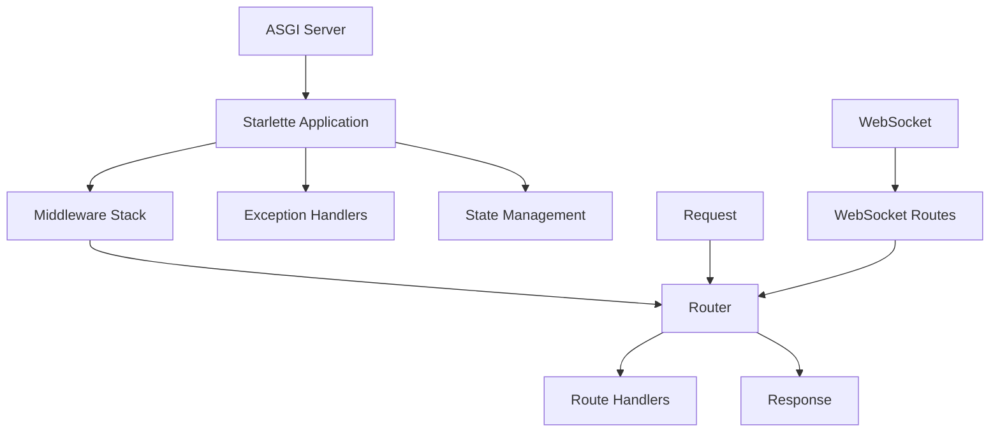

# Starlette 架构概览与设计理念

## 概述

Starlette 是一个现代化的异步 Web 框架，专为高性能 Web 应用和 API 服务而设计。作为 ASGI（Asynchronous Server Gateway Interface）生态系统的重要组成部分，Starlette 为 FastAPI 等流行框架提供了坚实的基础架构。

## 核心设计理念

### 1. 异步优先 (Async First)

Starlette 从底层设计就完全拥抱异步编程模型：

```python
# 原生支持异步请求处理
async def homepage(request):
    return JSONResponse({'message': 'Hello, async world!'})

# 自动适配同步函数到异步执行
def sync_handler(request):
    # 自动在线程池中执行
    return PlainTextResponse('Sync function executed asynchronously')
```

**设计优势**：
- 高并发处理能力
- 非阻塞 I/O 操作
- 资源利用率最优化

### 2. 极简主义架构 (Minimalist Architecture)

Starlette 采用"够用就好"的设计哲学：

```python
# 最小化的应用程序结构
from starlette.applications import Starlette
from starlette.routing import Route
from starlette.responses import JSONResponse

async def homepage(request):
    return JSONResponse({'hello': 'world'})

app = Starlette(routes=[
    Route('/', homepage, methods=['GET']),
])
```

**核心特点**：
- 最小化的依赖关系
- 清晰的模块边界
- 易于理解和扩展

### 3. 组件化设计 (Component-Based Design)

框架采用松耦合的组件化架构：

```
Starlette Application
├── Router (路由管理)
├── Middleware Stack (中间件栈)
├── Request/Response (请求响应处理)
├── WebSocket Support (WebSocket 支持)
└── Exception Handlers (异常处理)
```

## 架构层次结构

### 层次关系图



### 核心组件交互

1. **应用程序层 (Application Layer)**
   - 应用程序入口点
   - 全局配置和状态管理
   - ASGI 协议实现

2. **中间件层 (Middleware Layer)**
   - 请求/响应拦截和处理
   - 横切关注点（日志、认证、CORS等）
   - 洋葱模型执行机制

3. **路由层 (Routing Layer)**
   - URL 模式匹配
   - 请求分发
   - 参数提取和转换

4. **处理器层 (Handler Layer)**
   - 业务逻辑处理
   - 请求/响应转换
   - 错误处理

## 核心架构组件

### 1. Starlette Application

**职责**：
- ASGI 应用程序入口点
- 中间件栈构建和管理
- 全局异常处理
- 应用程序状态管理

**关键特性**：
```python
class Starlette:
    def __init__(
        self,
        debug: bool = False,
        routes: Sequence[BaseRoute] | None = None,
        middleware: Sequence[Middleware] | None = None,
        exception_handlers: Mapping[Any, ExceptionHandler] | None = None,
        on_startup: Sequence[Callable] | None = None,
        on_shutdown: Sequence[Callable] | None = None,
        lifespan: Lifespan | None = None,
    )
```

### 2. Router System

**核心特征**：
- 支持多种路由类型（HTTP、WebSocket、Mount、Host）
- 高效的路径匹配算法
- URL 参数类型转换
- 反向 URL 生成

**路由层次结构**：
```
BaseRoute (抽象基类)
├── Route (HTTP 路由)
├── WebSocketRoute (WebSocket 路由)
├── Mount (子应用挂载)
└── Host (基于主机的路由)
```

### 3. Middleware System

**设计模式**：洋葱模型（Onion Model）

```
ServerErrorMiddleware (最外层)
    └── UserMiddleware1
        └── UserMiddleware2
            └── ExceptionMiddleware (最内层)
                └── Router/Application
```

**执行流程**：
1. 请求：外层 → 内层
2. 响应：内层 → 外层

### 4. Request/Response Processing

**Request 特性**：
- 流式数据处理
- 延迟属性加载
- 自动内容类型检测
- 客户端连接状态管理

**Response 特性**：
- 多种响应类型支持
- 流式响应
- 背景任务支持
- 标准 HTTP 状态码

### 5. WebSocket Support

**状态管理**：
```python
class WebSocketState(enum.Enum):
    CONNECTING = 0
    CONNECTED = 1
    DISCONNECTED = 2
```

**消息处理**：
- 文本/二进制消息支持
- 连接状态跟踪
- 自动断线重连

## 异步编程模型

### 1. ASGI 协议实现

Starlette 完全遵循 ASGI 3.0 规范：

```python
async def __call__(self, scope: Scope, receive: Receive, send: Send) -> None:
    scope["app"] = self
    if self.middleware_stack is None:
        self.middleware_stack = self.build_middleware_stack()
    await self.middleware_stack(scope, receive, send)
```

### 2. 异步/同步函数适配

```python
def request_response(func):
    f = func if is_async_callable(func) else functools.partial(run_in_threadpool, func)
    
    async def app(scope, receive, send):
        request = Request(scope, receive, send)
        response = await f(request)
        await response(scope, receive, send)
    
    return app
```

## 性能优化策略

### 1. 延迟加载 (Lazy Loading)

```python
@property
def url(self) -> URL:
    if not hasattr(self, "_url"):
        self._url = URL(scope=self.scope)
    return self._url
```

### 2. 流式处理 (Streaming)

```python
async def stream(self) -> AsyncGenerator[bytes, None]:
    while not self._stream_consumed:
        message = await self._receive()
        # 流式处理消息
        yield message.get("body", b"")
```

### 3. 缓存机制

- 中间件栈缓存
- 正则表达式预编译缓存
- 属性缓存

### 4. 内存优化

- 使用生成器减少内存占用
- 及时释放资源
- 避免不必要的对象创建

## 错误处理机制

### 1. 分层错误处理

```
Application Level → Middleware Level → Route Level → Handler Level
```

### 2. 异常处理链

```python
def _lookup_exception_handler(exc_handlers, exc):
    for cls in type(exc).__mro__:  # 方法解析顺序
        if cls in exc_handlers:
            return exc_handlers[cls]
    return None
```

### 3. 调试支持

- 详细的错误追踪
- 开发模式下的丰富错误页面
- 生产模式下的安全错误响应

## 扩展性设计

### 1. 中间件扩展

```python
class CustomMiddleware(BaseHTTPMiddleware):
    async def dispatch(self, request, call_next):
        # 前处理
        response = await call_next(request)
        # 后处理
        return response
```

### 2. 路由扩展

```python
class CustomRoute(BaseRoute):
    def matches(self, scope):
        # 自定义匹配逻辑
        pass
    
    async def handle(self, scope, receive, send):
        # 自定义处理逻辑
        pass
```

### 3. 响应扩展

```python
class CustomResponse(Response):
    def render(self, content):
        # 自定义渲染逻辑
        return processed_content
```

## 架构优势总结

### 1. 高性能

- **异步 I/O**: 非阻塞操作，高并发处理
- **轻量级**: 最小化开销，快速响应
- **优化策略**: 缓存、延迟加载、流式处理

### 2. 高可靠性

- **类型安全**: 完整的类型注解
- **错误处理**: 多层次异常处理机制
- **测试友好**: 内置测试客户端

### 3. 高扩展性

- **中间件系统**: 灵活的扩展点
- **组件化设计**: 松耦合架构
- **插件机制**: 易于集成第三方库

### 4. 现代化

- **ASGI 兼容**: 支持现代 Web 标准
- **WebSocket**: 实时通信支持
- **HTTP/2**: Server Push 等高级特性

### 5. 开发友好

- **简洁 API**: 易学易用
- **清晰文档**: 完整的文档体系
- **活跃社区**: 持续维护和更新

## 适用场景

### 最佳适用场景

1. **高性能 API 服务**
   - 微服务架构
   - RESTful API
   - GraphQL 服务

2. **实时应用**
   - WebSocket 应用
   - 实时通信
   - 推送服务

3. **异步 Web 应用**
   - 高并发 Web 应用
   - I/O 密集型应用
   - 数据处理管道

### 技术选择考量

**选择 Starlette 的理由**：
- 需要高性能异步处理
- 要求框架轻量级和灵活性
- 需要与 ASGI 生态系统集成
- 追求现代化的开发体验

**技术对比**：
- **vs Django**: 更轻量，异步优先，ASGI 原生支持
- **vs Flask**: 现代化设计，内置异步支持，更好的性能
- **vs FastAPI**: 底层基础，更大的控制权，更少的约定

## 结论

Starlette 通过其精心设计的异步架构、组件化设计和极简主义理念，为现代 Web 应用开发提供了强大而灵活的基础。它不仅是一个高性能的 Web 框架，更是理解现代异步 Web 开发的重要学习资源。

无论是构建高性能 API 服务、实时 Web 应用，还是作为其他框架的基础（如 FastAPI），Starlette 都展现了其卓越的架构设计和实用价值。