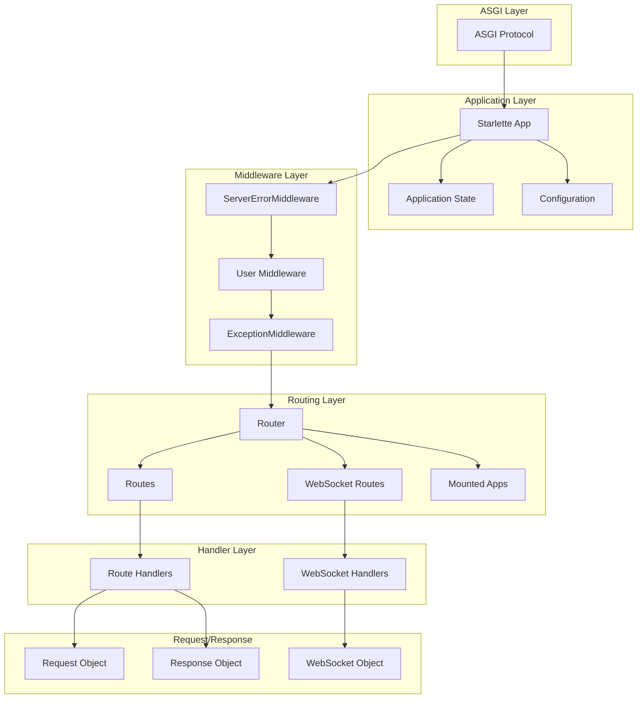

# Starlette 架构详细分析

## 引言

Starlette 是一个基于 ASGI 的现代异步 Web 框架，其架构设计体现了现代 Web 开发的最佳实践。本文将深入分析 Starlette 的架构设计，包括其核心组件、设计模式、以及各组件之间的交互机制。

## 整体架构视图

### 架构分层

Starlette 采用经典的分层架构模式，从底层到上层依次为：

```
┌─────────────────────────────────────┐
│          Application Layer          │  ← 应用程序层
├─────────────────────────────────────┤
│          Middleware Stack           │  ← 中间件层
├─────────────────────────────────────┤
│           Routing Layer             │  ← 路由层
├─────────────────────────────────────┤
│          Handler Layer              │  ← 处理器层
├─────────────────────────────────────┤
│           ASGI Layer                │  ← ASGI 协议层
└─────────────────────────────────────┘
```

### 核心组件关系图



## ASGI 协议实现

### ASGI 应用接口

Starlette 实现了标准的 ASGI 应用接口：

```python
async def __call__(self, scope: Scope, receive: Receive, send: Send) -> None:
    """
    ASGI 应用程序入口点
    
    Args:
        scope: 包含请求信息的字典
        receive: 接收消息的异步可调用对象
        send: 发送消息的异步可调用对象
    """
    # 将应用实例注入到 scope 中，供后续组件使用
    scope["app"] = self
    
    # 构建中间件栈（延迟构建，仅在首次调用时）
    if self.middleware_stack is None:
        self.middleware_stack = self.build_middleware_stack()
    
    # 将请求传递给中间件栈处理
    await self.middleware_stack(scope, receive, send)
```

### Scope 数据结构

ASGI scope 是一个字典，包含请求的所有元数据：

```python
# HTTP 请求的 scope 示例
{
    "type": "http",
    "asgi": {"version": "3.0"},
    "http_version": "1.1",
    "method": "GET",
    "scheme": "http",
    "path": "/api/users",
    "query_string": b"page=1&limit=10",
    "headers": [
        [b"host", b"localhost:8000"],
        [b"user-agent", b"curl/7.68.0"],
        [b"accept", b"*/*"],
    ],
    "server": ("127.0.0.1", 8000),
    "client": ("127.0.0.1", 45678),
    # Starlette 注入的应用实例
    "app": <Starlette app instance>,
}
```

### 消息传递机制

ASGI 使用异步消息传递进行通信：

```python
# 接收消息示例
message = await receive()
# HTTP 请求体消息
{
    "type": "http.request",
    "body": b'{"name": "John", "age": 30}',
    "more_body": False
}

# 发送响应示例
await send({
    "type": "http.response.start",
    "status": 200,
    "headers": [
        [b"content-type", b"application/json"],
        [b"content-length", b"25"],
    ],
})

await send({
    "type": "http.response.body",
    "body": b'{"message": "success"}',
})
```

## 应用程序生命周期

### 初始化阶段

```python
class Starlette:
    def __init__(self, debug=False, routes=None, middleware=None, 
                 exception_handlers=None, on_startup=None, on_shutdown=None,
                 lifespan=None):
        # 配置验证：lifespan 与 startup/shutdown 互斥
        assert lifespan is None or (on_startup is None and on_shutdown is None)
        
        # 初始化核心属性
        self.debug = debug
        self.state = State()  # 应用程序状态对象
        
        # 创建路由器实例
        self.router = Router(
            routes=routes,
            on_startup=on_startup,
            on_shutdown=on_shutdown,
            lifespan=lifespan
        )
        
        # 异常处理器映射
        self.exception_handlers = {} if exception_handlers is None else dict(exception_handlers)
        
        # 用户中间件列表
        self.user_middleware = [] if middleware is None else list(middleware)
        
        # 中间件栈（延迟构建）
        self.middleware_stack: ASGIApp | None = None
```

### 生命周期管理

Starlette 支持两种生命周期管理方式：

#### 1. 现代化的 Lifespan 模式

```python
from contextlib import asynccontextmanager

@asynccontextmanager
async def lifespan(app):
    # 启动阶段
    print("Application starting up...")
    database = Database("sqlite:///example.db")
    await database.connect()
    app.state.database = database
    
    yield  # 应用程序运行期间
    
    # 关闭阶段
    print("Application shutting down...")
    await database.disconnect()

app = Starlette(lifespan=lifespan)
```

#### 2. 传统的 Startup/Shutdown 钩子

```python
async def startup():
    print("Application starting up...")

async def shutdown():
    print("Application shutting down...")

app = Starlette(
    on_startup=[startup],
    on_shutdown=[shutdown]
)
```

### 状态管理

```python
class State:
    """
    应用程序状态对象，用于存储全局状态
    """
    def __init__(self) -> None:
        super().__setattr__("_state", {})

    def __setattr__(self, name: str, value: Any) -> None:
        self._state[name] = value

    def __getattr__(self, name: str) -> Any:
        try:
            return self._state[name]
        except KeyError:
            raise AttributeError(f"'{self.__class__.__name__}' object has no attribute '{name}'")
```

## 中间件栈架构

### 中间件栈构建

```python
def build_middleware_stack(self) -> ASGIApp:
    """
    构建中间件栈，采用洋葱模型
    """
    debug = self.debug
    error_handler = None
    exception_handlers = {}
    
    # 分离 500 错误处理器和其他异常处理器
    for key, value in self.exception_handlers.items():
        if key in (500, Exception):
            error_handler = value
        else:
            exception_handlers[key] = value
    
    # 中间件栈定义（注意顺序）
    middleware = (
        # 最外层：服务器错误中间件
        [Middleware(ServerErrorMiddleware, handler=error_handler, debug=debug)]
        # 中间层：用户自定义中间件
        + self.user_middleware
        # 最内层：异常处理中间件
        + [Middleware(ExceptionMiddleware, handlers=exception_handlers, debug=debug)]
    )
    
    # 从内到外包装应用程序
    app = self.router
    for cls, args, kwargs in reversed(middleware):
        app = cls(app, *args, **kwargs)
    
    return app
```

### 洋葱模型执行流程

```
请求流 →  ServerErrorMiddleware  → UserMiddleware → ExceptionMiddleware → Router
              ↓                      ↓               ↓                 ↓
响应流 ←  ServerErrorMiddleware  ← UserMiddleware ← ExceptionMiddleware ← Router
```

### 中间件基类

```python
class BaseHTTPMiddleware:
    """
    HTTP 中间件基类
    """
    def __init__(self, app: ASGIApp, dispatch: DispatchFunction | None = None):
        self.app = app
        self.dispatch_func = self.dispatch if dispatch is None else dispatch

    async def __call__(self, scope: Scope, receive: Receive, send: Send) -> None:
        if scope["type"] != "http":
            await self.app(scope, receive, send)
            return

        # 创建请求对象
        request = Request(scope, receive)
        
        # 创建响应发送器
        response = await self.dispatch_func(request, self.call_next)
        await response(scope, receive, send)

    async def dispatch(self, request: Request, call_next: RequestResponseEndpoint) -> Response:
        """
        子类需要实现的调度方法
        """
        raise NotImplementedError()

    async def call_next(self, request: Request) -> Response:
        """
        调用下一个中间件或应用程序
        """
        # 实现细节...
```

## 路由系统架构

### 路由类层次结构

```python
from abc import ABC, abstractmethod

class BaseRoute(ABC):
    """
    路由基类，定义路由的基本接口
    """
    @abstractmethod
    def matches(self, scope: Scope) -> tuple[Match, Scope]:
        """检查路由是否匹配当前请求"""
        raise NotImplementedError()

    @abstractmethod
    def url_path_for(self, name: str, /, **path_params: Any) -> URLPath:
        """生成反向URL"""
        raise NotImplementedError()

    @abstractmethod
    async def handle(self, scope: Scope, receive: Receive, send: Send) -> None:
        """处理匹配的请求"""
        raise NotImplementedError()

    async def __call__(self, scope: Scope, receive: Receive, send: Send) -> None:
        """ASGI 调用接口"""
        match, child_scope = self.matches(scope)
        if match == Match.FULL:
            scope.update(child_scope)
            await self.handle(scope, receive, send)
```

### 路由匹配算法

```python
class Router:
    async def route(self, scope: Scope, receive: Receive, send: Send) -> None:
        """
        路由匹配和分发逻辑
        """
        partial = None
        
        # 遍历所有路由进行匹配
        for route in self.routes:
            match, child_scope = route.matches(scope)
            
            if match == Match.FULL:
                # 完全匹配，更新 scope 并处理请求
                scope.update(child_scope)
                await route.handle(scope, receive, send)
                return
            elif match == Match.PARTIAL and partial is None:
                # 部分匹配（如路径匹配但方法不匹配）
                partial = route

        # 处理部分匹配的情况（通常返回 405 Method Not Allowed）
        if partial is not None:
            await partial.handle(scope, receive, send)
            return

        # 处理重定向斜杠逻辑
        if scope["type"] == "http" and self.redirect_slashes:
            redirect_scope = {**scope}
            if scope["path"] != "/" and scope["path"].endswith("/"):
                redirect_scope["path"] = scope["path"][:-1]
            else:
                redirect_scope["path"] = scope["path"] + "/"
            
            for route in self.routes:
                match, child_scope = route.matches(redirect_scope)
                if match != Match.NONE:
                    redirect_url = URL(scope=redirect_scope)
                    response = RedirectResponse(url=str(redirect_url))
                    await response(scope, receive, send)
                    return

        # 没有匹配的路由，返回 404
        await self.default(scope, receive, send)

    async def default(self, scope: Scope, receive: Receive, send: Send) -> None:
        """
        默认处理器，返回 404 错误
        """
        if scope["type"] == "websocket":
            websocket_close = WebSocketClose()
            await websocket_close(scope, receive, send)
        else:
            response = PlainTextResponse("Not Found", status_code=404)
            await response(scope, receive, send)
```

### URL 参数处理

```python
import re
from typing import Pattern

PARAM_REGEX = re.compile(r"{([a-zA-Z_][a-zA-Z0-9_]*)(:[a-zA-Z_][a-zA-Z0-9_]*)?}")

def compile_path(path: str) -> tuple[Pattern[str], str, dict[str, Convertor]]:
    """
    编译路径模式，提取参数和转换器
    
    例如："/users/{user_id:int}/posts/{post_id}"
    编译为：
    - regex: "/users/(?P<user_id>[0-9]+)/posts/(?P<post_id>[^/]+)"
    - format: "/users/{user_id}/posts/{post_id}"
    - convertors: {"user_id": IntegerConvertor(), "post_id": StringConvertor()}
    """
    regex_parts = []
    format_parts = []
    param_convertors = {}
    
    last_index = 0
    for match in PARAM_REGEX.finditer(path):
        # 添加匹配前的字面量部分
        literal_part = path[last_index:match.start()]
        regex_parts.append(re.escape(literal_part))
        format_parts.append(literal_part)
        
        # 处理参数部分
        param_name = match.group(1)
        convertor_type = match.group(2)
        if convertor_type is None:
            convertor_type = "str"
        else:
            convertor_type = convertor_type[1:]  # 移除前导冒号
        
        # 获取对应的转换器
        convertor = CONVERTOR_TYPES[convertor_type]
        param_convertors[param_name] = convertor
        
        # 构建正则表达式组
        regex_parts.append(f"(?P<{param_name}>{convertor.regex})")
        format_parts.append(f"{{{param_name}}}")
        
        last_index = match.end()
    
    # 添加剩余的字面量部分
    if last_index < len(path):
        literal_part = path[last_index:]
        regex_parts.append(re.escape(literal_part))
        format_parts.append(literal_part)
    
    regex_pattern = "".join(regex_parts) + "$"
    path_format = "".join(format_parts)
    
    return re.compile(regex_pattern), path_format, param_convertors
```

## 请求处理流程

### 请求对象构建

```python
class Request(HTTPConnection):
    def __init__(self, scope: Scope, receive: Receive | None = None, send: Send | None = None):
        super().__init__(scope)
        self._receive = receive if receive is not None else unattached_receive
        self._send = send if send is not None else unattached_send
        
        # 延迟加载的属性
        self._stream_consumed = False
        self._is_disconnected = False
```

### 流式数据处理

```python
async def stream(self) -> AsyncGenerator[bytes, None]:
    """
    流式读取请求体
    """
    if hasattr(self, "_body"):
        # 如果已经缓存了完整的请求体，直接返回
        yield self._body
        yield b""
        return
    
    # 流式读取
    while not self._stream_consumed:
        message = await self._receive()
        
        if message["type"] == "http.request":
            body = message.get("body", b"")
            if not message.get("more_body", False):
                self._stream_consumed = True
            if body:
                yield body
        elif message["type"] == "http.disconnect":
            self._is_disconnected = True
            raise ClientDisconnect()
```

### 表单数据解析

```python
async def form(self, *, max_files: int | float = 1000, 
               max_fields: int | float = 1000, 
               max_part_size: int = 1024 * 1024) -> FormData:
    """
    解析表单数据（multipart/form-data 或 application/x-www-form-urlencoded）
    """
    if hasattr(self, "_form"):
        return self._form

    content_type_header = self.headers.get("Content-Type")
    content_type, options = parse_options_header(content_type_header)
    
    if content_type == b"multipart/form-data":
        # 解析 multipart 表单
        multipart_parser = MultiPartParser(
            self.headers, 
            self.stream(),
            max_files=max_files,
            max_fields=max_fields,
            max_part_size=max_part_size,
        )
        self._form = await multipart_parser.parse()
        
    elif content_type == b"application/x-www-form-urlencoded":
        # 解析 URL 编码表单
        form_parser = FormParser(self.headers, self.stream())
        self._form = await form_parser.parse()
        
    else:
        # 不支持的内容类型，返回空表单
        self._form = FormData()
    
    return self._form
```

## 响应处理机制

### 响应类设计

```python
class Response:
    """
    基础响应类，实现 ASGI 应用接口
    """
    def __init__(
        self,
        content: Any = None,
        status_code: int = 200,
        headers: Mapping[str, str] | None = None,
        media_type: str | None = None,
        background: BackgroundTask | None = None,
    ) -> None:
        self.body = self.render(content)
        self.status_code = status_code
        self.background = background
        
        # 构建响应头
        if media_type is not None:
            self.media_type = media_type
        if headers is None:
            raw_headers = []
            populate_content_length = True
            populate_content_type = True
        else:
            raw_headers = [(k.lower().encode("latin-1"), v.encode("latin-1")) 
                          for k, v in headers.items()]
            keys = [h[0] for h in raw_headers]
            populate_content_length = b"content-length" not in keys
            populate_content_type = b"content-type" not in keys
        
        # 自动添加 content-type 和 content-length 头
        if populate_content_type and hasattr(self, "media_type"):
            content_type = self.media_type
            if content_type.startswith("text/"):
                content_type += f"; charset={self.charset}"
            raw_headers.append((b"content-type", content_type.encode("latin-1")))
        
        if populate_content_length and not self.status_code < 200 and self.status_code not in (204, 304):
            content_length = str(len(self.body))
            raw_headers.append((b"content-length", content_length.encode("latin-1")))
        
        self.raw_headers = raw_headers

    def render(self, content: Any) -> bytes | memoryview:
        """
        子类可以重写此方法来自定义内容渲染
        """
        if content is None:
            return b""
        if isinstance(content, (bytes, memoryview)):
            return content
        return content.encode(self.charset)

    async def __call__(self, scope: Scope, receive: Receive, send: Send) -> None:
        """
        ASGI 应用接口实现
        """
        # 发送响应头
        await send({
            "type": "http.response.start",
            "status": self.status_code,
            "headers": self.raw_headers,
        })
        
        # 发送响应体
        await send({
            "type": "http.response.body",
            "body": self.body,
        })
        
        # 执行背景任务
        if self.background is not None:
            await self.background()
```

### 流式响应

```python
class StreamingResponse(Response):
    """
    流式响应，用于大文件传输或实时数据流
    """
    def __init__(
        self,
        content: ContentStream,
        status_code: int = 200,
        headers: Mapping[str, str] | None = None,
        media_type: str | None = None,
        background: BackgroundTask | None = None,
    ) -> None:
        if isinstance(content, AsyncGenerator):
            self.body_iterator = content
        else:
            self.body_iterator = iterate_in_threadpool(content)
        
        self.status_code = status_code
        self.media_type = self.media_type if media_type is None else media_type
        self.background = background
        self.init_headers(headers)

    async def __call__(self, scope: Scope, receive: Receive, send: Send) -> None:
        # 发送响应头
        await send({
            "type": "http.response.start",
            "status": self.status_code,
            "headers": self.raw_headers,
        })
        
        # 流式发送响应体
        async for chunk in self.body_iterator:
            if not isinstance(chunk, (bytes, memoryview)):
                chunk = chunk.encode(self.charset)
            await send({
                "type": "http.response.body",
                "body": chunk,
                "more_body": True,
            })
        
        # 发送结束标志
        await send({
            "type": "http.response.body",
            "body": b"",
            "more_body": False,
        })
        
        # 执行背景任务
        if self.background is not None:
            await self.background()
```

## 异常处理架构

### 异常处理器查找

```python
def _lookup_exception_handler(
    exc_handlers: ExceptionHandlers, 
    exc: Exception
) -> ExceptionHandler | None:
    """
    根据异常类型查找对应的处理器
    使用方法解析顺序（MRO）进行匹配
    """
    for cls in type(exc).__mro__:
        if cls in exc_handlers:
            return exc_handlers[cls]
    return None
```

### 异常包装机制

```python
def wrap_app_handling_exceptions(app: ASGIApp, conn: Request | WebSocket) -> ASGIApp:
    """
    包装应用程序以处理异常
    """
    exception_handlers = {}
    status_handlers = {}
    
    # 从 scope 中获取异常处理器
    if "starlette.exception_handlers" in conn.scope:
        exception_handlers, status_handlers = conn.scope["starlette.exception_handlers"]

    async def wrapped_app(scope: Scope, receive: Receive, send: Send) -> None:
        response_started = False

        async def sender(message: Message) -> None:
            nonlocal response_started
            if message["type"] == "http.response.start":
                response_started = True
            await send(message)

        try:
            await app(scope, receive, sender)
        except Exception as exc:
            handler = None
            
            if isinstance(exc, HTTPException):
                # HTTP 异常，查找状态码处理器
                handler = status_handlers.get(exc.status_code)
            
            if handler is None:
                # 查找异常类型处理器
                handler = _lookup_exception_handler(exception_handlers, exc)
            
            if handler is None:
                # 没有找到处理器，重新抛出异常
                raise exc
            
            if response_started:
                # 响应已经开始，无法修改，重新抛出异常
                raise exc
            
            # 调用异常处理器
            if isinstance(conn, Request):
                response = await handler(conn, exc)
            else:  # WebSocket
                response = await handler(conn, exc)
            
            if response is not None:
                await response(scope, receive, sender)

    return wrapped_app
```

## WebSocket 支持架构

### WebSocket 状态机

```python
class WebSocketState(enum.Enum):
    CONNECTING = 0
    CONNECTED = 1
    DISCONNECTED = 2

class WebSocket(HTTPConnection):
    def __init__(self, scope: Scope, receive: Receive, send: Send):
        super().__init__(scope)
        self._receive = receive
        self._send = send
        self.client_state = WebSocketState.CONNECTING
        self.application_state = WebSocketState.CONNECTING
```

### 连接管理

```python
async def accept(self, subprotocol: str | None = None, headers: Sequence[tuple[str, str]] | None = None) -> None:
    """
    接受 WebSocket 连接
    """
    if self.client_state == WebSocketState.CONNECTING:
        # 只有在 CONNECTING 状态才能接受连接
        await self._send({
            "type": "websocket.accept",
            "subprotocol": subprotocol,
            "headers": headers or [],
        })
    else:
        raise RuntimeError("WebSocket is not in CONNECTING state")
    
    self.application_state = WebSocketState.CONNECTED

async def close(self, code: int = 1000, reason: str | None = None) -> None:
    """
    关闭 WebSocket 连接
    """
    if self.application_state == WebSocketState.CONNECTED:
        await self._send({
            "type": "websocket.close",
            "code": code,
            "reason": reason or "",
        })
    
    self.application_state = WebSocketState.DISCONNECTED
```

## 性能优化设计

### 延迟加载机制

```python
class HTTPConnection:
    @property
    def url(self) -> URL:
        """URL 对象的延迟加载"""
        if not hasattr(self, "_url"):
            self._url = URL(scope=self.scope)
        return self._url

    @property
    def headers(self) -> Headers:
        """Headers 对象的延迟加载"""
        if not hasattr(self, "_headers"):
            self._headers = Headers(scope=self.scope)
        return self._headers

    @property
    def query_params(self) -> QueryParams:
        """查询参数的延迟加载"""
        if not hasattr(self, "_query_params"):
            self._query_params = QueryParams(self.scope["query_string"])
        return self._query_params
```

### 缓存策略

```python
class Starlette:
    def __init__(self, ...):
        # 中间件栈延迟构建并缓存
        self.middleware_stack: ASGIApp | None = None
    
    async def __call__(self, scope: Scope, receive: Receive, send: Send) -> None:
        scope["app"] = self
        
        # 仅在首次调用时构建中间件栈
        if self.middleware_stack is None:
            self.middleware_stack = self.build_middleware_stack()
        
        await self.middleware_stack(scope, receive, send)
```

### 线程池集成

```python
from anyio import to_thread

async def run_in_threadpool(func: Callable[P, T], *args: P.args, **kwargs: P.kwargs) -> T:
    """
    在线程池中运行同步函数
    """
    if kwargs:
        # 使用 functools.partial 处理关键字参数
        func = functools.partial(func, **kwargs)
        kwargs = {}
    
    return await to_thread.run_sync(func, *args, **kwargs)
```

## 总结

Starlette 的架构设计体现了现代 Web 框架的最佳实践：

1. **分层架构**：清晰的职责分离和模块化设计
2. **异步优先**：从底层开始的异步设计，最大化性能
3. **ASGI 兼容**：完整的 ASGI 协议实现，与现代服务器无缝集成
4. **洋葱模型**：中间件系统的经典实现模式
5. **延迟加载**：按需构建对象，优化内存使用
6. **流式处理**：支持大数据量的流式处理
7. **类型安全**：完整的类型注解，提高代码质量

这些设计使得 Starlette 既保持了高性能，又提供了良好的开发体验，为构建现代 Web 应用提供了坚实的基础。